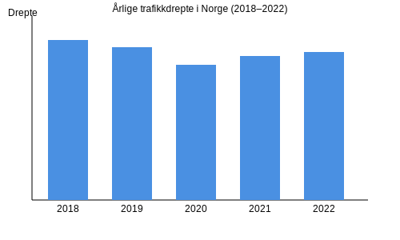

  

    
  

  

    <h3>Table of Contents</h3>
    
  

  
\n}}
}}
}}
**Statistikk og ulykker** i norsk trafikk gir deg innsikt i hva som påvirker sikkerheten på veiene. Ved å studere tall og trender kan vi identifisere **risikofaktorer** og iverksette effektive **forebyggende tiltak**.

*For mer om **møteulykker** og forebygging, se [Møteulykker og forebygging](/blogs/teori/moteulykker-og-forebygging "Møteulykker og forebygging - Forebygging av frontkollisjoner i trafikken").*
*For prinsipper innen **risikovurdering**, se [Risikovurdering i praksis](/blogs/teori/risikovurdering-i-praksis "Risikovurdering i praksis - Praktisk risikovurdering i trafikken").*

        
        
        # Copy image to static folder
        $sourceImage = Join-Path -Path $file.Directory.FullName -ChildPath "$imgName.$ext"
        $destDir = "static/images/blog/$blogFolder"
        if (-not (Test-Path $destDir)) {
            New-Item -ItemType Directory -Path $destDir -Force | Out-Null
        }
        if (Test-Path $sourceImage) {
            Copy-Item -Path $sourceImage -Destination $destDir -Force
        }
        
        # Return new markdown image tag
        ""
    

## Nøkkelstatistikk

| Ã…r   | Antall alvorlige ulykker | Drepte | Hardt skadde |
|------|---------------------------|--------|--------------|
| 2018 | 1 272                     | 109    | 352          |
| 2019 | 1 305                     | 104    | 364          |
| 2020 | 1 223                     | 92     | 317          |
| 2021 | 1 198                     | 98     | 310          |
| 2022 | 1 250                     | 101    | 329          |

## Ulykkestyper

Typiske ulykkestyper i norsk trafikk inkluderer:

* **Frontkollisjoner**
* **Utforkjøringsulykker**
* **Fotgjengerulykker**
* **Viltpåkjørsler**
* **Singelulykker**

## Ã…rsaker til ulykker

Flere faktorer kan bidra til trafikkulykker:

* **Hastighet** over tilpasset fart
* **Distraksjoner**, for eksempel bruk av mobiltelefon
* **DÃ¥rlig veigrep** ved feil dekk eller ved glatt underlag
* **Dårlig sikt** i mørke eller dårlig vær
* **Menneskelig feil** og manglende risikovurdering

## Trender over tid

Utviklingen i antall drepte viser en positiv nedgang, selv om svingninger forekommer.

## Forebyggende tiltak

For å redusere ulykkesrisikoen anbefales det:

* Regelmessig vedlikehold av dekk og bremser. Se [Dekk og vedlikehold](/blogs/teori/dekk-og-vedlikehold "Dekk og vedlikehold - Tips for sikre dekk").
* God sikt med riktig bruk av lys. Les mer i [Bruk av lys og signaler](/blogs/teori/bruk-av-lys-og-signaler "Bruk av lys og signaler - Loven og god praksis").
* Aktiv risikoplanlegging. Se [Risikovurdering i praksis](/blogs/teori/risikovurdering-i-praksis "Risikovurdering i praksis - Praktisk risikovurdering i trafikken").
* Vær oppmerksom på møtende trafikk i svinger og på smale veier.
* Hold god avstand til andre kjøretøy. For teknikker om avstand, se [Fart og avstand](/blogs/teori/fart-og-avstand "Fart og avstand - Komplett guide til hastighet og bremseavstand").

Ved å kombinere statistisk innsikt med bevisste kjørevaner kan vi sammen jobbe for tryggere veier i Norge.\n  
\n
