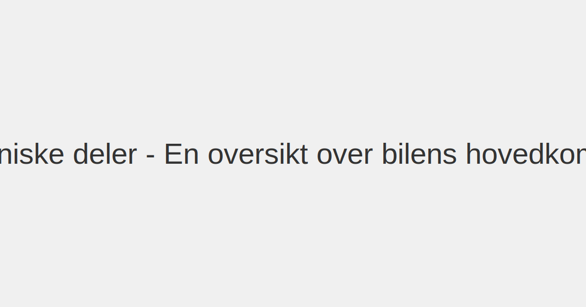
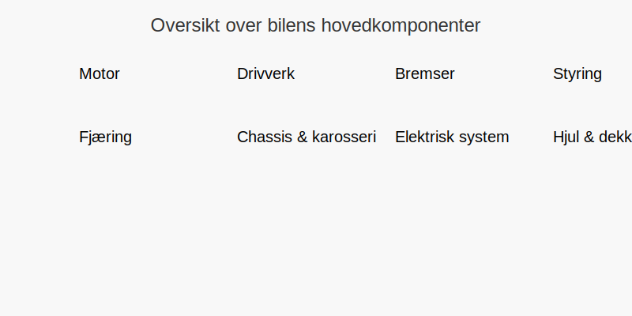
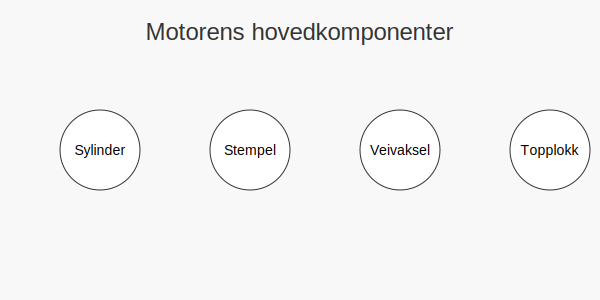

Bilens **tekniske deler** danner grunnlaget for bilens funksjon og **sikkerhet**. Som fører er det viktig å ha grunnleggende kunnskap om **motor**, **drivverk**, **bremser** og andre komponenter for å forstå hvordan bilen oppfører seg under ulike forhold.
For en generell introduksjon til teorien, se [Introduksjon til teori for førerkort](/blogs/teori/introduksjon-til-teori-for-forerkort "Introduksjon til teori for førerkort").

## Oversikt over bilens tekniske deler
| Del                      | Funksjon                                                                 |
|--------------------------|--------------------------------------------------------------------------|
| **Motor**                | Omdanner drivstoff eller elektrisk energi til bevegelse                   |
| **Drivverk**             | Overfører kraft fra motor til hjulene via girkasse, clutch og differensial|
| **Bremser**              | Reduserer hastighet og stopper bilen ved hjelp av friksjon. Se [Bremsesystemet (bremsekretser, bremsevæske m.m)](/blogs/teori/bremsesystemet "Bremsesystemet (bremsekretser, bremsevæske m.m)") for mer informasjon. |
| **Styring**              | [Styresystem](/blogs/teori/styresystem "Styresystem (servostyring, retningsstabilitet, dødgang, forstilling, lufttrykk, ESP m.m.)") gir føreren kontroll over bilens retning |
| **Fjæring**              | Demper støt fra veiunderlaget for komfort og veigrep                      |
| **Chassis og karosseri** | Gir struktur, beskytter passasjerer og bærer alle komponenter             |
| **Elektrisk system**     | Forsyner lys, instrumenter og elektroniske styresystemer. Se [Lys og lystyper](/blogs/teori/lys-og-lystyper "Lys og lystyper - Oversikt over bilens lystemer") for oversikt over lystyper. |
| **Hjul og dekk**         | Gir kontakt med veibanen og påvirker veigrep, komfort og styrke           |
Se også [Kjøretøyets sikkerhetsutstyr](/blogs/teori/kjoretoyets-sikkerhetsutstyr "Kjøretøyets sikkerhetsutstyr - Oversikt over aktivt og passivt sikkerhetsutstyr") for en detaljert gjennomgang av bilens **sikkerhetsutstyr**.

### Hvordan bruke denne guiden
Dette er en **omfattende guide** til bilens tekniske komponenter. Hver seksjon gir deg en grundig forståelse av funksjon, oppbygning og betydning for **kjøreopplevelse** og **sikkerhet**.
## Motor og drivverk
*For mer informasjon om motorindikatorer og feilsøking, se [Motor og motorindikatorer](/blogs/teori/motor-og-motorindikatorer "Motor og motorindikatorer - Olje, batteri, dynamo, kjølevæske, oljetrykk og motorfeil").*
### Motor - typer og virkemåte
Moderne biler kan utstyres med flere motoralternativer:
| Type motor     | Drivstoff/energi      | Fordeler                                       | Ulemper                         |
|---------------|-----------------------|------------------------------------------------|--------------------------------|
| Bensinmotor   | Bensin                | Høy effekt, god tilgjengelighet                | Større utslipp og drivstoffkostnader |
| Dieselmotor   | Diesel                | Høyt dreiemoment ved lavt turtall, bedre økonomi| Større partikkelutslipp          |
| Elmotor       | Elektrisitet (batteri)| Null lokal utslipp, umiddelbart dreiemoment    | Begrenset rekkevidde, ladetid     |
| Hybridmotor   | Bensin + elektrisk    | Lavere forbruk, fleksibilitet                   | Mer kompleks, høyere vekt        |
Motoren jobber etter en **firetakts-syklus**:
1. **Innsug**: Luft eller luft/drivstoff-blanding suges inn i sylinderen.
2. **Kompresjon**: Blandet luft/drivstoff komprimeres av stemplet.
3. **Forbrenning**: Tennepluggen antenner blandingen (bensin/diesel) eller elektrisk kraft overføres.
4. **Utslippslag**: Eksosgasser presses ut av sylinderen.

### Drivverk - girkasser og differensial
Drivverket består av flere viktige deler som overfører kraften fra motor:
* **Girkasse** (manuell, automatisk, CVT, dobbeltkløtsj)
* **Kopling/torque converter** frikobler motor og girkasse ved girskifte.
* **Drivaksel** og **differensial** fordeler moment til hjulene.
| Girkasstype  | Beskrivelse                                                    | Fordel                      |
|-------------|----------------------------------------------------------------|-----------------------------|
| Manuell      | Føreren velger gir via clutch og girspake. [Les mer om manuell vs. automatgir](/blogs/teori/manuell-vs-automatgir "Manuell vs. automatgir (clutch m.m.)") | Robust, gir kontroll        |
| Automatisk   | Skifter gir automatisk med momentomformer. [Les mer om manuell vs. automatgir](/blogs/teori/manuell-vs-automatgir "Manuell vs. automatgir (clutch m.m.)") | Komfort, enklere bykjøring  |
| CVT          | Trinnløs giroverføring via rem eller kjede                       | Jevn akselerasjon og økonomi|
| Dobbeltkløtsj| To koblinger for raske girskift                                   | Raskere skifte, sportslig   |
For mer om effektiv kjøring, se [Miljøvennlig kjøring](/blogs/teori/miljovennlig-kjoring "Miljøvennlig kjøring - Teknikker for bærekraftig kjøring").
## Bremsesystemer
For en detaljert gjennomgang av bremsesystemet, se [Bremsesystemet (bremsekretser, bremsevæske m.m)](/blogs/teori/bremsesystemet "Bremsesystemet (bremsekretser, bremsevæske m.m)").
Et moderne bremsesystem kombinerer **hydraulikk** og **elektronikk** for pålitelig stoppkraft:
| Komponent     | Funksjon                                                        |
|---------------|-----------------------------------------------------------------|
| Bremseklosser | Skaper friksjon mot bremseskiven                                 |
| Bremseskiver  | Overfører friksjon til hjul                                     |
| Bremsevæske   | Overfører trykk i hydraulisk system                              |
| ABS           | Forhindrer hjullåsing ved kraftige oppbremsinger                |
| ESP/ESC       | Elektronisk stabilitetskontroll for bedre kjørestabilitet       |
* **Vedlikehold:** Kontroller klossers tykkelse, bremseskivenes tilstand og bremsevæskenivå.*
## Styring og fjæring
### Styringssystem
Styringen omformer rattbevegelser til hjulrotasjon:
* **Tannstang og styresnekke** er vanlig mekanisk løsning.
* **Servostyring** (hydraulisk eller elektronisk) reduserer førerkraft.
| Type styring    | Karakteristikk                |
|----------------|------------------------------|
| Mekanisk       | Enkel, men krevende ved parkering |
| Hydraulisk     | God følelse, noe vedlikehold    |
| Elektronisk    | Variabel følelse og energieffektiv|
### Fjæringssystem
Fjæringskomponentene sikrer veigrep og komfort:
* **Støtdempere** og **fjærer** demper støt fra ujevn vei.
* **McPherson** og **multi-link** er vanlige foran- og bakoppheng.
| Type fjæring | Fordel                                                     |
|--------------|------------------------------------------------------------|
| McPherson    | Enkel og kostnadseffektiv                                 |
| Multi-link   | Bedre komfort og kjøreegenskaper på ujevnt underlag        |
| Blattfjær    | Robust, brukt på varebiler og enkelte SUV-er               |
## Chassis og karosseri
Chassis og karosseri danner bilens skjelett og sikkerhetsbur:
* **Bærende karosseri** beskytter ved sammenstøt (kollisjonsgitter).
* **Krumme soner** foran og bak absorberer kollisjonsenergi.
| Materiale    | Egenskap                                   |
|-------------|---------------------------------------------|
| Stål         | Sterkt, rimelig, tungt                     |
| Aluminium   | Lett, korrosjonsbestandig, dyrere          |
| Kompositt   | Lett og sterkt, brukt i sportsbiler         |
## Elektrisk system
Moderne biler har omfattende elektronikk:
* **Batteri** lagrer energi til start og elektronikk.
* **Generator (dynamo)** lader batteriet under kjøring.
* **Startmotor** igangsetter motoren.
* **ECU** styrer motor, bremser, sikkerhetssystemer etc.
* **CAN-bus** kobler sammen ulike styreenheter.
| Enhet        | Funksjon                                         |
|-------------|---------------------------------------------------|
| ECU          | Motor- og systemstyring                           |
| Sensorer     | Måler temperatur, trykk, turtall, etc.            |
| Aktuatorer   | Utfører kommandoer (eks. innsprøytning, ventiler) |
For en grundig gjennomgang av **målere og varsellamper**, se [Målere og varsellamper](/blogs/teori/malere-og-varsellamper "Målere og varsellamper - Forstå bilens instrumentpanel").
## Hjul og dekk
Dekk og felger overfører kraft til veien og påvirker sikkerhet:
* **Mønsterdybde** og **gummiblanding** avgjør veigrep (se [Regler for dekk og kjetting](/blogs/teori/regler-for-dekk-og-kjetting "Regler for dekk og kjetting - Krav til mønsterdybde, piggdekk og kjetting")).
* **Dekktrykk** påvirker forbruk, slitasje og styrerespons (se [Regler for dekk og kjetting](/blogs/teori/regler-for-dekk-og-kjetting "Regler for dekk og kjetting - Krav til mønsterdybde, piggdekk og kjetting")).
| Dekkvariant      | Bruksområde                   |
|------------------|-------------------------------|
| Sommerdekk       | Varmt føre, optimalt grep     |
| Vinterdekk       | Kaldt føre, is og snø         |
| Piggdekk         | Ekstra grep på is             |
| Helårsdekk       | Kombinert, kompromiss         |
## Fremtidens drivlinjer
Bilindustrien beveger seg mot elektrisk og hybrid:
* **HEV (Hybrid Electric Vehicle)** kombinerer forbrenningsmotor og elmotor.
* **PHEV (Plug-in Hybrid)** kan lades fra stikkontakt.
* **BEV (Battery Electric Vehicle)** ren elektrisk drift uten forbrenningsmotor.
| Forkortelse | Beskrivelse                                        |
|------------|----------------------------------------------------|
| HEV         | Hybrid, lades ikke eksternt                         |
| PHEV        | Plug-in hybrid, kan lades eksternt                  |
| BEV         | Batteribil, null lokal utslipp                      |
## Videre lesning og vedlikehold
For en overordnet innføring i krav til **forskriftsmessig og forsvarlig stand**, se [Forskriftsmessig og forsvarlig stand](/blogs/teori/forskriftsmessig-og-forsvarlig-stand "Forskriftsmessig og forsvarlig stand - Overordnet guide til lovpålagt stand").
For detaljer om **forskriftsmessig stand**, se [Bilens tekniske deler (Forskriftsmessig stand)](/blogs/teori/bilens-tekniske-deler-forskriftsmessig-stand "Bilens tekniske deler (Forskriftsmessig stand)").
For detaljert informasjon om **vedlikehold**, se [Vedlikehold av bilen](/blogs/teori/vedlikehold-av-bilen "Vedlikehold av bilen - Guide til regelmessig service og inspeksjon").
***