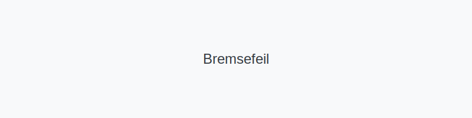

**Bremsefeil** er et kritisk emne innen førerkortteori for bil i Norge. Feil i **bremsesystemet** kan føre til redusert bremseevne, ukontrollerte bremsehendelser eller totale bremseutfall. Det er derfor viktig å kjenne til vanlige symptomer, årsaker og forebyggende tiltak.
*For en teknisk oversikt over bremsesystemet, se [Bremsesystemet](/blogs/teori/bremsesystemet "Bremsesystemet - Hydrauliske kretser, bremsevæske og komponenter").*

## Hva er en bremsefeil?
> En **bremsefeil** oppstår når én eller flere komponenter i bremsesystemet ikke fungerer som de skal. Dette kan variere fra mindre avvik, som luft i systemet, til alvorlige feil, som komplett trykktap.
## Vanlige typer bremsefeil
| Type feil                  | Symptom                                            | Umiddelbar handling                                |
|----------------------------|----------------------------------------------------|-----------------------------------------------------|
| **Lekasje av bremsevæske** | Lavt væskenivå, myk bremsepedal                    | Stans sikkert, kontroller nivå og lekkasjer         |
| **Luft i bremsesystemet**  | Svampete pedal, redusert bremsefølelse             | Luft ut systemet hos verksted                       |
| **Slitte bremseklosser**   | Hyling, lengre bremselengde                        | Bytt klosser og sjekk skiver                        |
| **Kokepunktfeil**          | Tap av bremseeffekt ved høy belastning (varmt)     | Skift bremsevæske med riktig DOT-klasse             |
| **ABS-sensorfeil**         | Varsellampe **ABS**, redusert styrekontroll ved bremsing | Sjekk sensorer, ledninger og rens hjulmagnet |
## Årsaker og forebygging
Følgende tiltak bidrar til å redusere risikoen for bremsefeil:
* **Regelmessig kontroll av bremsevæskenivå** – se [Bilens tekniske deler](/blogs/teori/bilens-tekniske-deler "Bilens tekniske deler - Oversikt over bilens hovedkomponenter").
* **Utskifting av bremsevæske** hver 1.–2. år avhengig av kjøreforhold.
* **Visuell inspeksjon av slitedeler** som bremseklosser og skiver.
* **Følg produsentens vedlikeholdsprogram** og bruk anbefalt DOT-klasse.
## Hva gjør du ved bremsefeil under kjøring?
1. **Hold roen** og reduser hastighet gradvis.
2. **Bruk motorbrems** (veksle ned gir) for å redusere farten.
3. **Aktiver nødblink** for å advare andre trafikanter.
4. **Stopp på trygg plass** og kontroller bremsene.
## Videre lesning
* [Fotbrems og parkeringsbrems](/blogs/teori/fotbrems-og-parkeringsbrems "Fotbrems og parkeringsbrems - Servicebrems og parkeringsbrems")
* [Reaksjonstid og bremselengde](/blogs/teori/reaksjonstid-og-bremselengde "Reaksjonstid og bremselengde - Stoppeavstand og reaksjonstid").
* [Malere og varsellamper](/blogs/teori/malere-og-varsellamper "Malere og varsellamper - Forklaring av varseltegn").
* [Sikkerhetssjekk teknisk bil](/blogs/teori/sikkerhetssjekk-teknisk-bil "Sikkerhetssjekk teknisk bil - Rutinemessig sjekk før kjøring").
* [Fordeling av bremsekraft og skjevtrekk](/blogs/teori/fordeling-av-bremsekraft-og-skjevtrekk "Fordeling av bremsekraft og skjevtrekk - Unngå skjevtrekk ved bremsing").