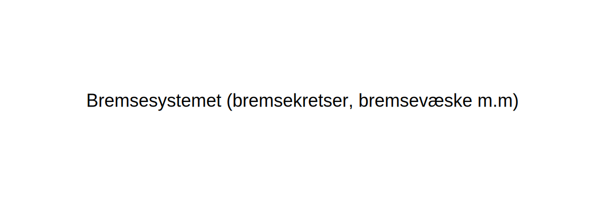

For et trygt kjøretøy må **bremsesystemet** fungere optimalt under alle forhold. I denne artikkelen går vi i dybden på **hydrauliske kretser**, **bremsevæske**, **komponenter** og **vedlikehold** av bremsesystemet.

## Oversikt over bremsesystemet
Bremsesystemet i moderne biler kombinerer _hydraulikk_ og _elektronikk_ for å sikre jevn og pålitelig stoppkraft. Systemet er delt inn i separate kretser, bruker spesialisert væske og flere mekaniske komponenter for å overføre kraft fra førerens fot til hjulene.
## Bremsekretser
Bildet under viser hovedkrets og hjelpeskrets koblet til bremsevæskeresevoaret:

| Krets         | Funksjon                                                     |
|---------------|--------------------------------------------------------------|
| **Hovedkrets**   | Overfører trykk til to hjul (vanligvis foran)                |
| **Hjelpeskrets** | Overfører trykk til de to andre hjul (vanligvis bak)         |
| **Resevoar**     | Lager bremsevæske og kompenserer for slitasje               |
## Bremsevæske
Bremsevæske er avgjørende for å overføre hydraulisk trykk uten komprimering. Riktig type væske og vedlikehold av kvaliteten er essensielt for sikkerheten.

| Type       | Kokepunkt (tørt/vått) | Egenskaper                  |
|------------|-----------------------|-----------------------------|
| **DOT 3**  | 205?°C / 140?°C        | Vanlig på eldre kjøretøy    |
| **DOT 4**  | 230?°C / 155?°C        | Høyere kokepunkt, standard  |
| **DOT 5.1**| 260?°C / 180?°C        | For krevende bruk og racing |
## Hovedkomponenter
De viktigste mekaniske delene i et bremsesystem er:
* **Bremseklosser** – skaper friksjon mot skiven eller trommelen
* **Bremseskiver/tromler** – mottar friksjonen og bremser hjulrotasjonen
* **Bremserør/slanger** – leder bremsevæske til hjulene
* [**ABS-sensorer**](/blogs/teori/abs-antiblokkeringssystem "ABS (Antiblokkeringssystem)") – overvåker hjulhastighet og forhindrer låsing
## Vedlikehold og kontroll
Regelmessig inspeksjon av bremsesystemet forebygger farlige situasjoner:
* **Kontroll av bremsevæskenivå** hver 12. måned eller ved service
* **Utskifting av bremsevæske** minst hvert 2. år (DOT 4) eller i henhold til produsent
* **Sjekk av bremseklosser** for minstykkelse (min. 2–3?mm)
* **Inspeksjon av bremseskiver/tromler** for deformasjon og slitasje
## Feilsøking vanlige problemer
* **Myk bremsepedal** – kan indikere luft i systemet eller lavt væskenivå
* **Skrikende lyder** – slitte klosser eller fremmedlegemer
* **Vibrasjon i ratt eller pedal** – deformerte skiver
* **Varsellampe for bremsesystem** – følg alltid opp feilkode eller varsel
## Viktige begreper for teoriprøven
* **Hydraulisk krets** – system der trykk overføres i væske
* **Kokepunkt** – avgjør risiko for dampblokkering ved høy belastning
* [**ABS** (Antiblokkeringssystem)](/blogs/teori/abs-antiblokkeringssystem "ABS (Antiblokkeringssystem)") – bevarer styrekontroll ved bremsing
## Videre lesning
* [Bilens tekniske deler](/blogs/teori/bilens-tekniske-deler "Bilens tekniske deler - En oversikt over bilens hovedkomponenter")
* [Reaksjonstid og bremselengde](/blogs/teori/reaksjonstid-og-bremselengde "Reaksjonstid og bremselengde - Stoppeavstand og reaksjonstid")
* [Vedlikehold av bilen](/blogs/teori/vedlikehold-av-bilen "Vedlikehold av bilen - Guide til regelmessig service og inspeksjon")
* [Fordeling av bremsekraft og skjevtrekk](/blogs/teori/fordeling-av-bremsekraft-og-skjevtrekk "Fordeling av bremsekraft og skjevtrekk")
* [Fotbrems og parkeringsbrems](/blogs/teori/fotbrems-og-parkeringsbrems "Fotbrems og parkeringsbrems - Servicebrems og parkeringsbrems")
* [Bremsefeil](/blogs/teori/bremsefeil "Bremsefeil - Vanlige feil i bremsesystemet")
***