
Effektiv **bruk av lys og signaler** sikrer at du kommuniserer tydelig med andre trafikanter og forbedrer sikt under variabelt lysforhold. Riktig lysbruk er ikke bare lovpålagt, men også avgjørende for trafikksikkerheten og din egen synlighet på veien.

*For en detaljert oversikt over bilens lystyper, se [Lys og lystyper](/blogs/teori/lys-og-lystyper "Lys og lystyper - Oversikt over bilens lystemer").*
*For en kort oversikt over forskjellen mellom **trafikksignaler** og **trafikkskilt**, se [Signal vs tegn i trafikken](/blogs/teori/signal-vs-tegn-i-trafikken "Signal vs tegn i trafikken - Når brukes hva?").*
For en grunnleggende oversikt over bilens tekniske komponenter, se [Bilens tekniske deler](/blogs/teori/bilens-tekniske-deler "Bilens tekniske deler - En oversikt over bilens hovedkomponenter").
## Grunnleggende om kjøretøyets lyssystem
Moderne kjøretøy har et omfattende lyssystem som må forstås og brukes riktig. **Lyssystemet** består av belysning for å se og for å bli sett, samt signalsystemer for kommunikasjon med andre trafikanter.
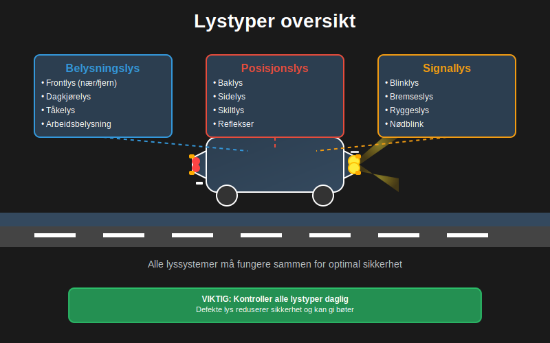
### Hovedkategorier av lys
**Belysningslys** hjelper deg å se veien og omgivelsene:
* Frontlykter (nærlys og fjernlys)
* Dagkjørelys
* Tåkelys foran og bak
* Arbeidsbelysning og innvendig belysning
**Posisjonslys** gjør kjøretøyet synlig for andre:
* Baklys
* Sidelys
* Registreringsskiltlys
* Reflekser
**Signallys** kommuniserer dine intensjoner:
* Blinklys (retningslys)
* Bremseslys
* Ryggeslys
* Nødblink
## Detaljert oversikt over lys og signaler
| Lys/type                   | Beskrivelse                                          | Når du skal bruke det                                  | Lovkrav                                  |
|----------------------------|------------------------------------------------------|-------------------------------------------------------|------------------------------------------|
| **Frontlykter (nærlys)**   | Belyser veien foran kjøretøyet uten å blende        | Kjøring i mørke eller ved dårlig sikt                | Påbudt fra solnedgang til soloppgang     |
| **Frontlykter (fjernlys)** | Kraftig belysning for lang rekkevidde               | På mørke veier uten møtende trafikk                  | Kun når det ikke blender andre           |
| **Baklys**                 | Gjør kjøretøyet synlig bakfra                       | Automatisk når frontlys er på                        | Påbudt sammen med frontlys               |
| **Brakelys**               | Varsler om nedbremsing ved å lyse sterkere bak      | Ved nedbremsing                                       | Automatisk ved bruk av bremser           |
| **Dagkjørelys**            | Svakt lys som forbedrer synlighet på dagtid         | Alltid på dagtid (automatisk på nye biler)           | Påbudt på nye kjøretøy                   |
| **Tåkelys foran**          | Bredt, lavt lysbilde som skjærer gjennom tåke       | Ved tåke, kraftig regn eller snø (sikt < 50m)        | Kun ved dårlig sikt                      |
| **Tåkelys bak**            | Sterkt rødt lys som penetrerer tåke                 | Ved tåke med sikt under 50 meter                     | Kun ved svært dårlig sikt                |
| **Blinklys**               | Gule blinkende lys foran og bak                     | Før sving, [filskifte](/blogs/teori/forbikjoring-og-feltskifte "Forbikjøring og feltskifte - Komplett guide til sikker forbikjøring og feltskifte") og ved inn-/utkjøring | Påbudt ved retningsendring               |
| **Nødblink (varselblink)** | Samtidig blink av alle retningslys                  | Ved nødstopp, havarist kjøretøy eller farevarsling   | Ved stopp på kjørebane                   |
| **Ryggeslys**              | Hvite lys som lyser når du rygger                   | Automatisk ved innkobling av revers                  | Automatisk funksjon                      |
## Krav i lov og forskrift
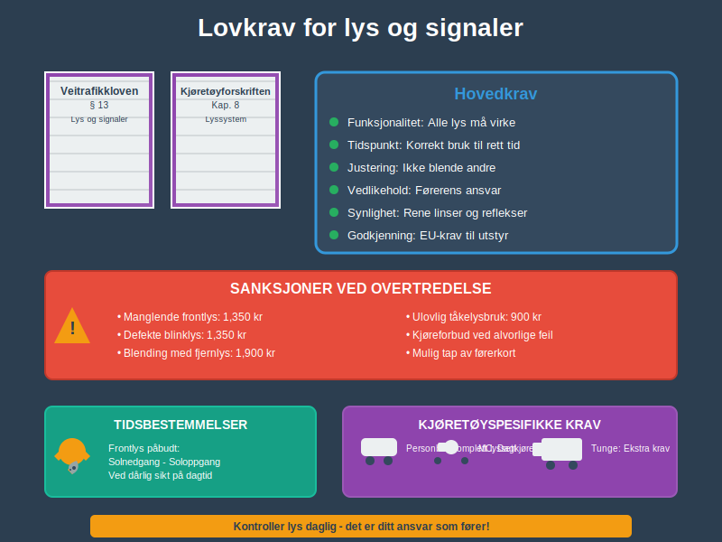
### Trafikkreglenes krav til lysbruk
I følge [Lover og forskrifter](/blogs/teori/lover-og-forskrifter "Lover og forskrifter - Trafikkregler og krav") skal alle lys og signaler være i orden og brukes korrekt. **Veitrafikkloven** og **Kjøretøyforskriften** stiller klare krav til:
* **Funksjonalitet**: Alle lys må virke og ha riktig lysstyrke
* **Tidspunkt for bruk**: Når ulike lystyper skal være på
* **Riktig justering**: Lys må være justert for ikke å blende
* **Vedlikehold**: Føreren er ansvarlig for at lys fungerer
### Sanksjoner ved feil lysbruk
| Overtredelse                    | Sanksjon                          | Pris (2024)     |
|---------------------------------|-----------------------------------|----------------|
| Manglende frontlys i mørket     | Forenklet forelegg               | 1,350 kr       |
| Defekte blinklys                | Forenklet forelegg               | 1,350 kr       |
| Ulovlig bruk av tåkelys         | Forenklet forelegg               | 900 kr         |
| Blending med fjernlys           | Forenklet forelegg + evt. mildere| 1,900 kr       |
| Alvorlige mangler ved EU-kontroll| Kjøreforbud til reparasjon       | Varierer       |
### Spesielle krav for ulike kjøretøytyper
**Personbiler** må ha komplett lyssett inkludert:
* Minimum to frontlykter
* To baklys og to bremseslys
* Retningslys foran og bak
* Registreringsskiltlys
**Motorcykler** har særlige krav om:
* Påbudt dagkjørelys eller frontlys
* Minimum ett baklys og bremseslys
* Refleks bak
For spesifikke teknikker og utfordringer ved nattkjøring, se [Kjøring i mørket](/blogs/teori/kjoring-i-morket "Kjøring i mørket - Komplett guide til trygg nattkjøring").
## Lysbruk i ulike kjøresituasjoner

### Kjøring på motorvei
Ved [motorveikjøring](/blogs/teori/motorveikjoring "Motorveikjøring - Sikker kjøring på motorvei og motortrafikkvei") er **synlighet** ekstra viktig på grunn av høye hastigheter:
* **Dagkjørelys** eller nærlys alltid på
* **Tåkelys** kun ved sikt under 50 meter
* **Blinklys** i god tid før [filskifte](/blogs/teori/forbikjoring-og-feltskifte "Forbikjøring og feltskifte")
* **Nødblink** ved nødstopp på motorvei
### Kjøring i tettbebygd strøk
Ved [bykjøring](/blogs/teori/bykjoring "Bykjøring - Mestring av kompleks bytrafikk") må du være ekstra oppmerksom på:
* **Dagkjørelys** forbedrer synlighet mellom bygninger
* **Blinklys** tidlig for å varsle [fotgjengere og syklister](/blogs/teori/trafikantgrupper-og-hensyn "Trafikantgrupper og hensyn")
* **Fjernlys** kun på mørke strekninger uten gatebelysning
* **Parkeringslys** ved parkering langs veien
### Landeveiskjøring
Ved [landeveiskjøring](/blogs/teori/landeveiskjoring "Landeveiskjøring - Guide til sikker kjøring på norske landeveier") kan du utnytte lysene optimalt:
* **Fjernlys** på mørke strekninger uten møtende trafikk
* **Nærlys** ved møting minimum 150 meter før møte
* **Blinklys** ved [forbikjøring](/blogs/teori/forbikjoring-og-feltskifte "Forbikjøring og feltskifte") og inn på veien
* **Tåkelys** ved dårlige værforhold
## Signalisering og kommunikasjon
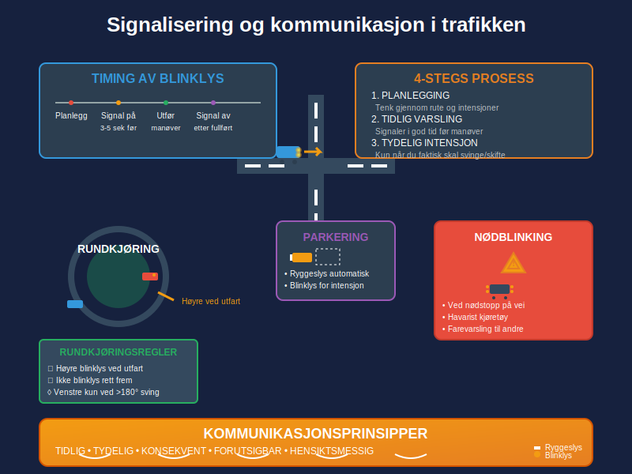
### Blinklysbruk i praksis
**Timing av blinklys** er kritisk for [kommunikasjon med andre trafikanter](/blogs/teori/kommunikasjon-med-andre-trafikanter "Kommunikasjon med andre trafikanter"):
1. **Planlegging**: Tenk gjennom din rute og forbered signalisering
2. **Tidlig varsling**: Slå på blinklys 3-5 sekunder før manøver i byen, lenger på motorvei
3. **Tydelig intensjon**: Bruk blinklys kun når du faktisk skal svinge eller skifte felt
4. **Slå av**: Husk å slå av blinklys etter fullført manøver
### Spesielle signaleringssituasjoner
**Ved rundkjøringer**:
* Høyre blinklys ved utfart fra rundkjøring
* Ingen blinklys ved rett frem gjennom rundkjøring
* Venstre blinklys kun ved mer enn 180° sving
For full guide til vikeplikt, tegn og signal i rundkjøringer, se [Vikeplikt og rundkjøringer](/blogs/teori/vikeplikt-og-rundkjoringer "Rundkjøringer: Vikeplikt, tegn og signal, rundkjøring med ett vs. to felt, høyre vs. venstre vs. rett frem").
**Ved rygging og [parkering](/blogs/teori/rygging-og-parkering "Rygging og parkering"):**
* Ryggeslys lyser automatisk
* Bruk blinklys for å varsle intensjon
* Nødblink hvis du blokkerer trafikk midlertidig
## Lysbruk under vanskelige forhold
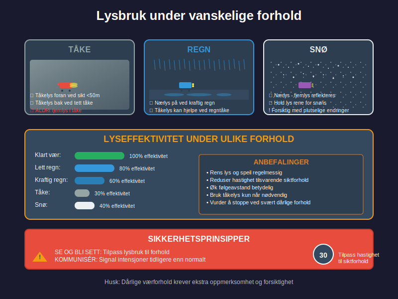
### Tåke og kraftig regn
Ved [kjøring under vanskelige forhold](/blogs/teori/kjoring-under-vanskelige-forhold "Kjøring under vanskelige forhold") er riktig lysbruk livsviktig:
**Tåkekjøring**:
* **Tåkelys foran** kun ved sikt under 50 meter
* **Tåkelys bak** kun ved svært tett tåke
* **Aldri fjernlys** - reflekteres tilbake og forverrer sikt
* **Reduser hastighet** tilpasset siktforhold
**Regn og sludd**:
* **Nærlys** på selv på dagtid ved kraftig regn
* **Tåkelys** kan forbedre sikt gjennom regntåke
* **Økt følgeavstand** for bedre [reaksjonstid](/blogs/teori/reaksjonstid-og-bremselengde "Reaksjonstid og bremselengde")
### Snø og vinterkjøring
**Snøfall**:
* **Nærlys** - fjernlys reflekteres i snøfnugg
* **Tåkelys** kan hjelpe ved tett snøfall
* **Ekstra fokus** på å holde lys rene for snø
**Glatte veier**:
* **Forsiktig bruk av blinklys** - plutselige endringer kan utløse skrens
* **Jevn fart** for å unngå hyppig bremsing
* **Økt varslingstid** ved [filskifte](/blogs/teori/forbikjoring-og-feltskifte "Forbikjøring og feltskifte")
## Tekniske aspekter og vedlikehold
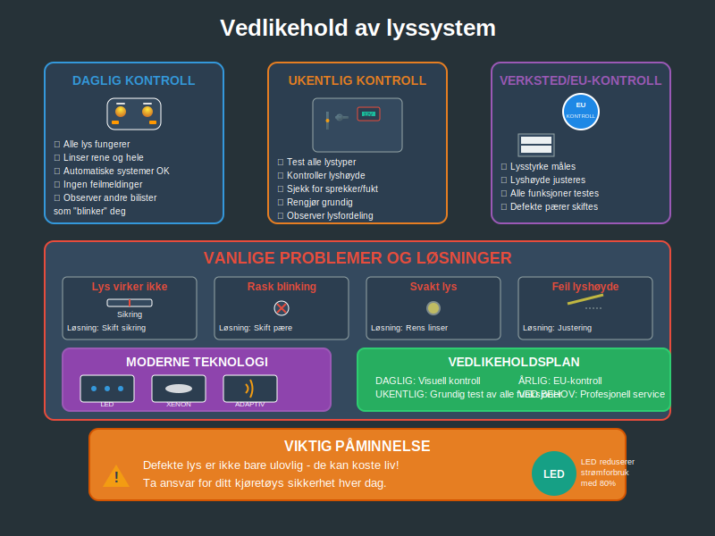
### Lysteknologi i moderne biler
**LED-lys** er stadig mer vanlig:
* Lavere strømforbruk
* Lengre levetid
* Bedre lysytelse
* Raskere på/av-respons
**Xenon/HID-lys**:
* Meget kraftig belysning
* Krever automatisk lyshøydejustering
* Lysvaskeranlegg påkrevd
**Adaptive lyssystemer**:
* Følger rattutslagene i svinger
* Automatisk dimming ved møtende trafikk
* Hastighetsavhengig lysfordeling
### Vedlikehold og kontroll
Regelmessig kontroll av lyssystemet er påkrevd ved [vedlikehold av bilen](/blogs/teori/vedlikehold-av-bilen "Vedlikehold av bilen"):
**Daglig kontroll**:
* Sjekk at alle lys fungerer ved oppstart
* Kontroller at lys ikke er dekket av snø/skitt
* Observer om andre bilister "blinker" deg - kan tyde på feil
**Ukentlig kontroll**:
* Test alle lystyper inkludert nødblink
* Kontroller lyshøyde - bør ikke blende møtende
* For mer om blendingsfare ved tung last i bil eller tilhenger, se [Tung last - konsekvenser](/blogs/teori/tung-last-konsekvenser "Tung last - konsekvenser for kjøreegenskaper, bremselengde og blendingsfare").
* Sjekk linser for sprekker eller fuktighet
**Ved EU-kontroll**:
* Lysstyrke måles og justeres
* Alle funksjoner testes
* Defekte pærer må skiftes
### Vanlige tekniske problemer
| Problem                        | Mulig årsak                    | Løsning                              |
|--------------------------------|--------------------------------|--------------------------------------|
| Lysene virker ikke             | Sikring gått                   | Skift sikring                        |
| Blinklys blinker for raskt     | Defekt pære                    | Skift pære                           |
| Lys blinker eller flimrer      | Dårlig kontakt                 | Rengjør kontakter/skift lyskaster     |
| Fjernlys virker ikke           | Defekt spak eller relé         | Få reparert hos verksted             |
| Tåkelys slår seg av            | Overoppheting                  | La kjøle ned, sjekk ventilasjon      |
| Ujevn lysfordeling             | Feil justering                 | Få justert hos verksted              |
## Beste praksis for lysbruk og signalering
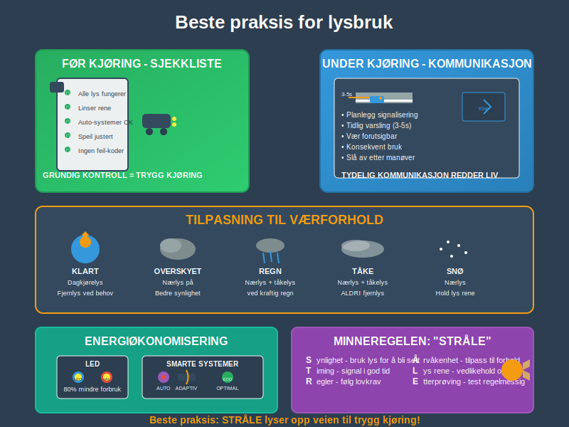
### Før kjøring - sjekkliste
**Daglig kontroll** bør inkludere:
* ? Gjør lys- og signalkontroll til en del av før-starte-sjekken
* ? Test alle lystyper - frontlys, baklys, blinklys, nødblink
* ? Kontroller at linser er rene og hele
* ? Sjekk at automatiske systemer fungerer (dagkjørelys, ryggeslys)
* ? Juster speil for optimal oversikt over egen signalisering
### Under kjøring - kommunikasjon
**Effektiv signalisering**:
* Planlegg alltid blinklysbruk i god tid før sving eller [filskifte](/blogs/teori/forbikjoring-og-feltskifte "Forbikjøring og feltskifte - Komplett guide til sikker forbikjøring og feltskifte") som del av effektiv [kommunikasjon med andre trafikanter](/blogs/teori/kommunikasjon-med-andre-trafikanter "Kommunikasjon med andre trafikanter")
* Slå på frontlys automatisk hvor dagslys ikke gir tilstrekkelig sikt
* Unngå overflødig bruk av fjernlys når det kan blende andre trafikanter
* Bruk nødblink ved uventede stopp eller ved hindringer i kjørebanen
* **Vær forutsigbar** - konsekvent signalisering skaper trygghet
### Tilpasning til værforhold
**Optimalisering basert på forhold**:
1. **Klart vær**: Dagkjørelys på dagtid, fjernlys ved behov
2. **Lett regn/overskyet**: Nærlys på for bedre synlighet
3. **Kraftig regn**: Nærlys + evt. tåkelys foran
4. **Tåke**: Nærlys + tåkelys (aldri fjernlys)
5. **Snøfall**: Nærlys, hold lys rene
### Energiøkonomisering
**Smart lysbruk** for [miljøvennlig kjøring](/blogs/teori/miljovennlig-kjoring "Miljøvennlig kjøring"):
* LED-oppgraderinger reduserer strømforbruk
* Automatiske systemer optimaliserer bruk
* Unngå unødvendig bruk av kraftige lys
* Service lyssystem regelmessig for optimal effektivitet
## Vanlige feil og konsekvenser
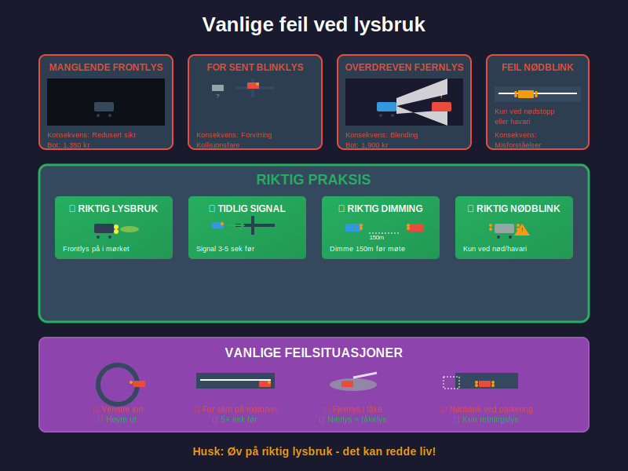
### Kritiske feil ved lysbruk
| Feiltype                      | Beskrivelse                                | Konsekvens                             | Forebygging                            |
|-------------------------------|--------------------------------------------|----------------------------------------|----------------------------------------|
| **Manglende frontlys**        | Glemmer å slå på frontlys ved mørketid     | Redusert sikt; risiko for ulykker      | Automatiske systemer; daglig sjekk     |
| **Feilaktig blinklysbruk**    | Blinker for sent eller ikke i det hele tatt | Forvirring; kollisjonsfare             | Planlegg manøvre; øv på timing         |
| **Overdreven fjernlys**       | Bruker fjernlys uten hensyn til møtende    | Blending; trafikantsikkerhet svekket   | Lær avstand/timing for dimming         |
| **Feil bruk av nødblink**     | Bruker nødblink ved [filskifte](/blogs/teori/forbikjoring-og-feltskifte "Forbikjøring og feltskifte") eller i kø   | Gir feil signal til andre, misforståelser | Lær riktig bruksområde                 |
| **Skitten optikk**            | Lys blokkert av skitt, snø eller is        | Kraftig redusert lyseffekt             | Regelmessig rengjøring                 |
| **Feil tåkelysbruk**          | Bruker tåkelys ved normale forhold         | Blending; unødvendig slitasje          | Lær når tåkelys skal brukes            |
| **Defekte lys**               | Kjører med ødelagte pærer/lys              | Redusert synlighet; brudd på loven     | Regelmessig funksjonstest              |
| **Feil lysjustering**         | Lys justert for høyt eller for lavt        | Blending eller for kort rekkevidde     | Profesjonell justering ved behov       |
### Spesifikke situasjoner og fallgruver
**Rundkjøringer**:
* ? **Feil**: Blinklys venstre inn i rundkjøring
* ? **Riktig**: Kun høyre blinklys ved utfart
**Motorvei**:
* ? **Feil**: For sent blinklys ved [filskifte](/blogs/teori/forbikjoring-og-feltskifte "Forbikjøring og feltskifte")
* ? **Riktig**: Blinklys i 3-5 sekunder før manøver
**Tåke**:
* ? **Feil**: Fjernlys i tåke
* ? **Riktig**: Nærlys + tåkelys ved behov
**Møtende trafikk**:
* ? **Feil**: Venter til siste sekund med å dimme
* ? **Riktig**: Dimme 150-200 meter før møte
### Konsekvenser ved ulykker
**Juridiske følger** av feil lysbruk ved [møteulykker](/blogs/teori/moteulykker-og-forebygging "Møteulykker og forebygging"):
* **Medvirkning til ulykke**: Feil lysbruk kan medføre straffeansvar
* **Forsikringsutbetaling**: Kan reduseres ved egen skyld
* **Tap av førerrett**: Ved grove eller gjentatte overtredelser
* **Erstatningsansvar**: Ansvar for skader på personer og materiell
## Moderne teknologi og fremtiden
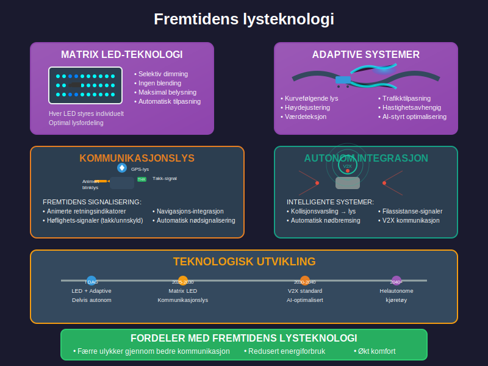
### Intelligente lyssystemer
**Adaptive frontlys** tilpasser seg automatisk:
* **Kurvefølgende lys**: Lyser inn i svinger
* **Høydejustering**: Kompenserer for last og veiujevnheter
* **Værdeteksjon**: Justerer intensitet basert på forhold
* **Trafikktilpasning**: Dimmer automatisk ved møtende kjøretøy
**Matrix LED-teknologi**:
* Selektiv dimming av lysfeltet
* Optimal belysning uten å blende
* Dynamisk tilpasning til trafikksituasjon
### Kommunikasjonslys
**Utvidet signalisering**:
* **Animerte blinklys**: Tydeliggjør retning
* **Kommunikasjonslys**: Takk/unnskyld-signaler
* **Notifikasjonslys**: Integrasjon med navigasjon
### Forbindelse til autonome systemer
**Integrerte sikkerhetssystemer**:
* Lys knyttet til [kollisjonsvarsling](/blogs/teori/kjoretoyets-sikkerhetsutstyr "Kjøretøyets sikkerhetsutstyr")
* Automatisk nødbremsing aktiverer nødblink
* Filassistanse kommuniserer via lys
* Adaptiv cruisekontroll styrer lysbruk
## Internasjonale forskjeller
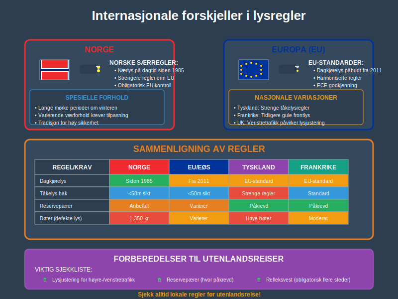
### Europa vs Norge
**Dagkjørelys**:
* **EU**: Påbudt på alle nye biler fra 2011
* **Norge**: Tradisjon for nærlys på dagtid siden 1985
* **Praktisk**: De fleste europeiske biler har dagkjørelys
**Tåkelys**:
* **Tyskland**: Tåkelys bak kun ved sikt under 50m
* **Frankrike**: Gule frontlys var tidligere vanlig
* **UK**: Venstre trafikk påvirker lysinnstilling
### Ved utenlandsreiser
**Forberedelser** for [lange kjøreturer](/blogs/teori/forberedelser-for-en-lang-kjoretur "Forberedelser for en lang kjøretur") til utlandet:
1. **Lysjustering**: Høyretrafikk vs venstretrafikk
2. **Reservepærer**: Påkrevd i mange land
3. **Refleksvest**: Obligatorisk i flere land
4. **Spesialregler**: Undersøk lokale krav
## Økonomi og miljøaspekter
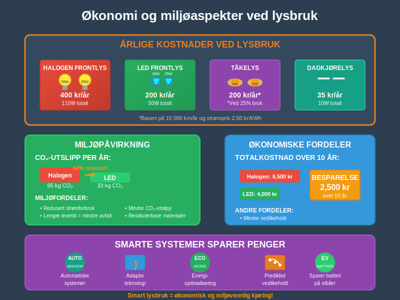
### Kostnader ved lysbruk
**Strømforbruk** påvirker [økonomien](/blogs/teori/okonomi-og-bilhold "Økonomi og bilhold - Kostnader og tips for økonomisk bilhold"):
| Lystype           | Effekt (W) | Årlig kostnad* | LED-alternativ |
|-------------------|------------|----------------|---------------|
| Halogen frontlys  | 55W × 2    | 400 kr         | 200 kr        |
| Dagkjørelys LED   | 5W × 2     | 35 kr          | -             |
| Tåkelys           | 55W × 2    | 200 kr**       | 100 kr        |
| Baklys            | 5W × 4     | 70 kr          | 30 kr         |
*Basert på 15 000 km/år og strømpris 2,50 kr/kWh  
**Ved 25% brukstid
### Miljøvennlig lysbruk
For [miljøvennlig kjøring](/blogs/teori/miljovennlig-kjoring "Miljøvennlig kjøring - Reduser forbruk og utslipp"):
* **LED-oppgradering** reduserer CO2-utslipp
* **Smart lysbruk** sparer batterikapasitet på elbiler
* **Mindre vedlikehold** med LED-teknologi
* **Materialgjenvinning** av gamle lyspærer
## Praktiske øvelser og tips
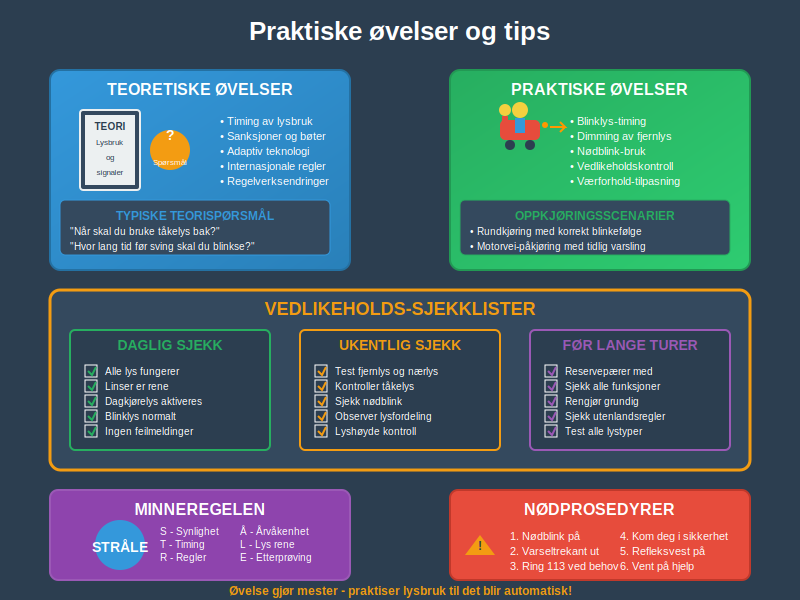
### Øvelser for korrekt lysbruk
**For teoretiske prøve**:
1. **Øv timing**: Når skal ulike lys brukes?
2. **Lær sanksjoner**: Hva koster feil lysbruk?
3. **Forstå teknikk**: Hvordan virker adaptiv belysning?
4. **Kjenn reglene**: Internasjonale forskjeller
**For praktisk prøve og [oppkjøring](/blogs/teori/oppkjoring "Oppkjøring - Forberedelse til praktisk førerprøve"):**
1. **Øv blinklysbruk**: Timing ved ulike manøvre
2. **Tren på dimming**: Når og hvordan dimme fjernlys
3. **Test nødprosedyrer**: Bruk av nødblink
4. **Lær vedlikehold**: Hvordan skifte pærer
### Sjekkliste for lysbruk
**Daglig sjekk**:
- [ ] Alle lys fungerer
- [ ] Linser er rene
- [ ] Dagkjørelys aktiveres automatisk
- [ ] Blinklys fungerer normalt
**Ukentlig sjekk**:
- [ ] Test fjernlys og nærlys
- [ ] Kontroller tåkelys
- [ ] Sjekk nødblink
- [ ] Observer lysfordeling på vegg
**Før lange turer**:
- [ ] Reservepærer med
- [ ] Sjekk alle funksjoner
- [ ] Rengjør grundig
- [ ] Kontroller spesialregler for destinasjon
### Minneregler for lysbruk
**"STRÅLE"-regelen for lysbruk**:
* **S**ynlighet - bruk lys for å bli sett
* **T**iming - signal i god tid
* **R**egler - følg lovkrav
* **Å**rvåkenhet - tilpass til forhold
* **L**ys rene - vedlikehold optikk
* **E**tterprøving - test regelmessig
## Sammenheng med andre temaer
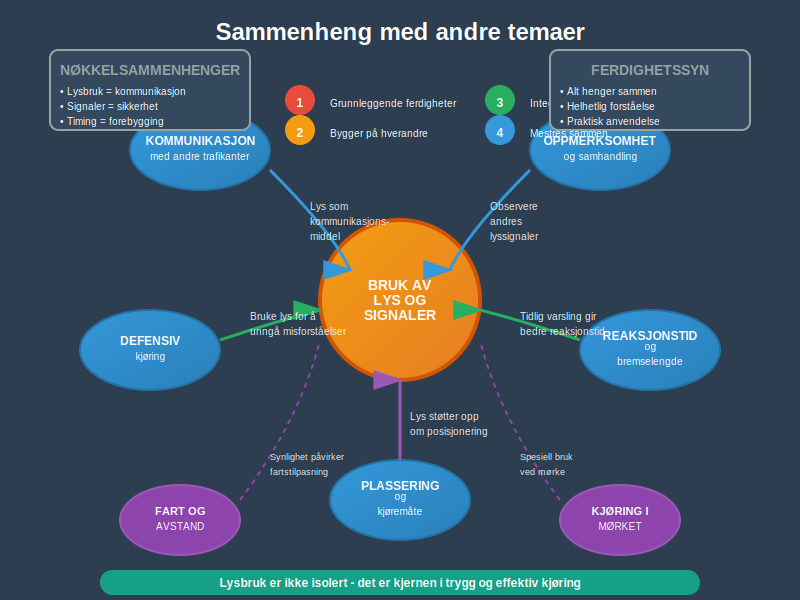
Riktig **bruk av lys og signaler** henger nøye sammen med:
* **[Kommunikasjon med andre trafikanter](/blogs/teori/kommunikasjon-med-andre-trafikanter "Kommunikasjon og samhandling i trafikken")** - lys som kommunikasjonsmiddel
* **[Oppmerksomhet og samhandling](/blogs/teori/oppmerksomhet-og-samhandling "Oppmerksomhet og samhandling")** - observere andres lyssignaler
* **[Defensiv kjøring](/blogs/teori/defensiv-kjoring "Defensiv kjøring - Forebyggende kjøreteknikker")** - bruke lys for å unngå misforståelser
* **[Reaksjonstid og bremselengde](/blogs/teori/reaksjonstid-og-bremselengde "Reaksjonstid og bremselengde")** - tidlig varsling gir andre bedre reaksjonstid
* **[Plassering og kjøremåte](/blogs/teori/plassering-og-kjoremmate "Plassering og kjøremåte")** - lys støtter opp om posisjoneringen din
## Oppsummering
**Bruk av lys og signaler** er en grunnleggende ferdighet som alle førere må mestre. Riktig lysbruk handler ikke bare om å følge loven, men om å:
* **Kommunisere tydelig** med andre trafikanter
* **Forbedre synlighet** under varierende forhold
* **Forebygge ulykker** gjennom tidlig varsling
* **Tilpasse seg** teknologisk utvikling
* **Vedlikeholde** kjøretøyets sikkerhetssystemer
Husk at lys og signaler er ditt viktigste **kommunikasjonsverktøy** i trafikken - bruk det ansvarlig og effektivt.
## Relaterte emner
* [Kommunikasjon med andre trafikanter](/blogs/teori/kommunikasjon-med-andre-trafikanter "Kommunikasjon med andre trafikanter - Tydelige signaler og trygg trafikk")
* [Kjøring i mørket](/blogs/teori/kjoring-i-morket "Kjøring i mørket - Tips for sikker kjøring i mørke forhold")
* [Trafikkskilt og veimerking](/blogs/teori/trafikkskilt-og-veimerking "Trafikkskilt og veimerking - Skilt og merking du må kjenne")
* [Fart og avstand](/blogs/teori/fart-og-avstand "Fart og avstand - Komplett guide til hastighet og bremseavstand")
* [Plassering og kjøremåte](/blogs/teori/plassering-og-kjoremmate "Plassering og kjøremåte - Hvordan velge riktig fil")
* [Kjøretøyets sikkerhetsutstyr](/blogs/teori/kjoretoyets-sikkerhetsutstyr "Kjøretøyets sikkerhetsutstyr - Moderne sikkerhetsteknologi")
* [Vedlikehold av bilen](/blogs/teori/vedlikehold-av-bilen "Vedlikehold av bilen - Hold kjøretøyet i sikker stand")
* [Forbikjøring og feltskifte](/blogs/teori/forbikjoring-og-feltskifte "Forbikjøring og feltskifte - Sikre manøvre i trafikken")
* [Kjøring under vanskelige forhold](/blogs/teori/kjoring-under-vanskelige-forhold "Kjøring under vanskelige forhold - Tilpasning til vær og føre")