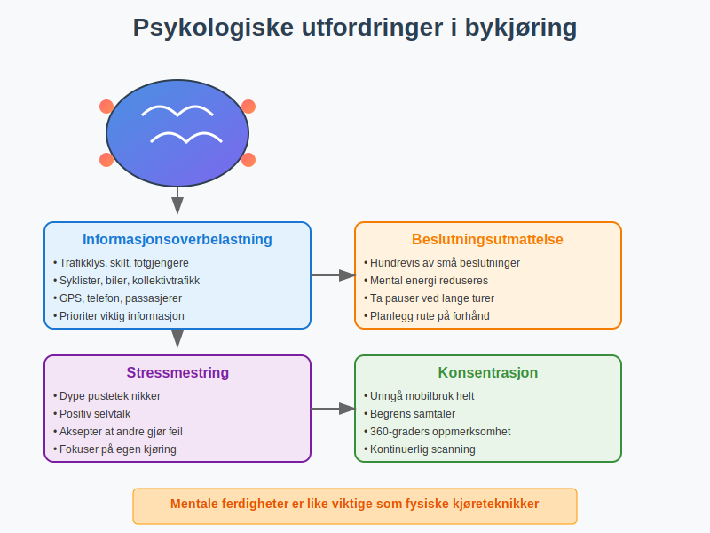
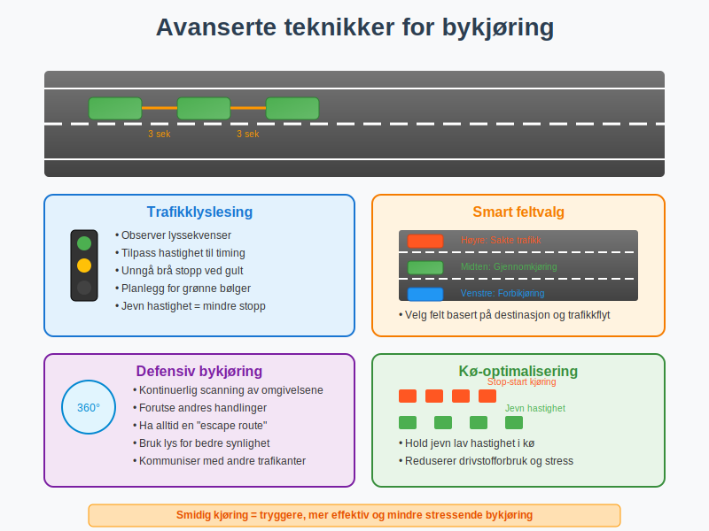
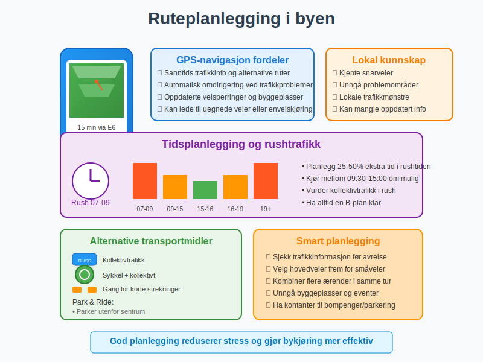
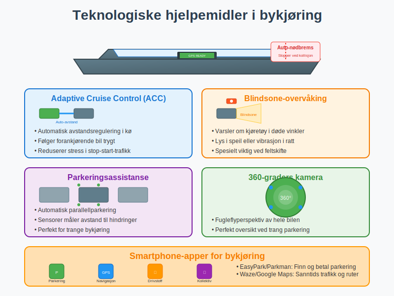
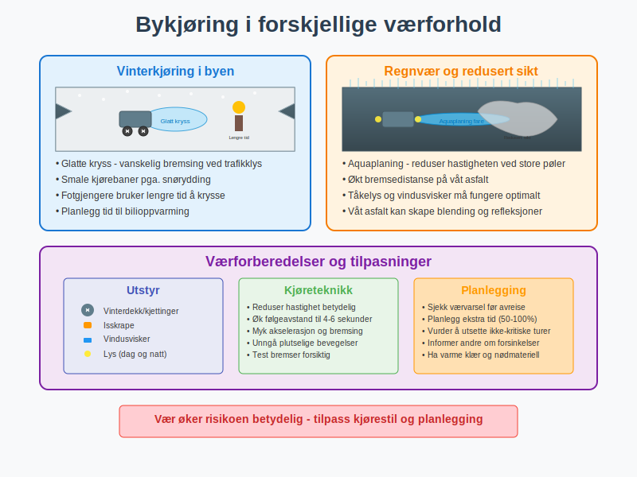
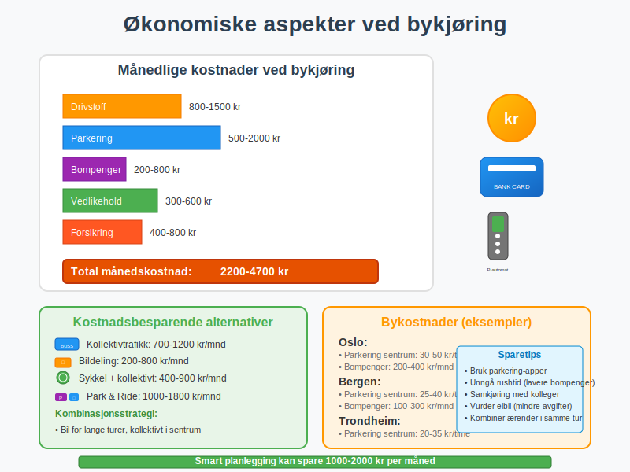
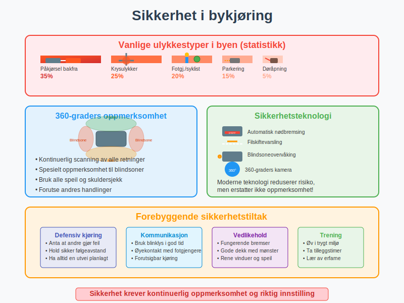
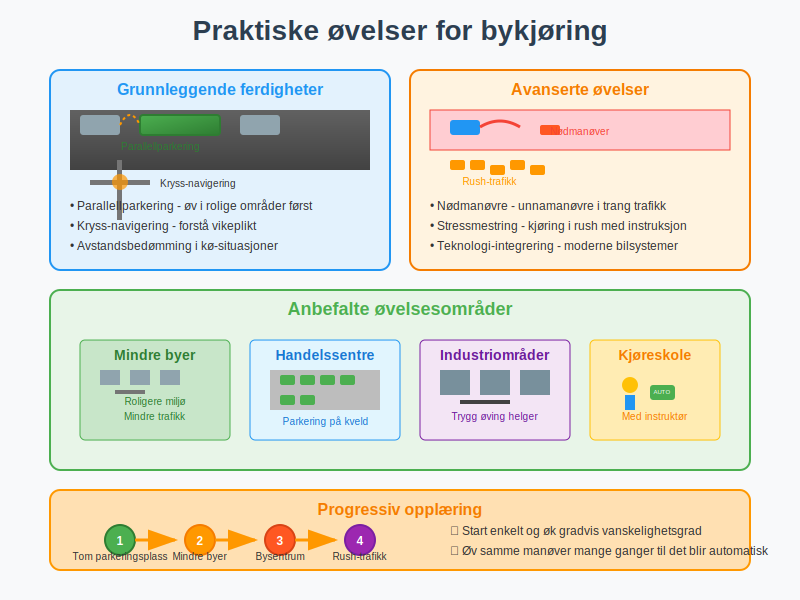

**Bykjøring** handler om trygg og effektiv **kjøring i urbane områder**, hvor mange fotgjengere, syklister, kollektivtrafikk og smale gater krever spesiell oppmerksomhet og tilpasning. I denne omfattende guiden dekker vi alt du trenger å vite for å mestre bykjøring under norske forhold, fra grunnleggende teknikker til avanserte strategier for komplekse trafikksituasjoner.
**Bykjøring** krever kontinuerlig **oppmerksomhet**, **tålmodighet** og **tilpasningsevne** for å håndtere det konstante samspillet mellom biler, kollektivtrafikk, syklister og fotgjengere i urbane miljøer.
*For kjøring på landevei, se [Landeveiskjøring](/blogs/teori/landeveiskjoring "Landeveiskjøring - Guide til sikker kjøring på norske landeveier").*
*For mer om hvordan **menneskelige faktorer** påvirker kjøringen, se [Mennesket i trafikken](/blogs/teori/mennesket-i-trafikken "Mennesket i trafikken - Faktorer som påvirker kjøring").*
*For detaljer om **oppmerksomhet** og **samhandling**, se [Oppmerksomhet og samhandling](/blogs/teori/oppmerksomhet-og-samhandling "Oppmerksomhet og samhandling - Teknikker for trygg trafikkatferd").*
*For omfattende planlegging og forberedelser før langkjøring, se [Forberedelser før en lang kjøretur](/blogs/teori/forberedelser-for-en-lang-kjoretur "Forberedelser før en lang kjøretur - Komplett guide til trygg langkjøring").*
*For forebygging av frontkollisjoner og møteulykker i trafikken, se [Møteulykker og forebygging](/blogs/teori/moteulykker-og-forebygging "Møteulykker og forebygging - Forebygging av frontkollisjoner i trafikken").*
*For regler om **stans og parkering** i byområder, se [Kjøring i byen: Stans og parkering](/blogs/teori/kjoring-i-byen-stans-og-parkering "Stans og parkering i byen - Regler og anbefalinger").*
For en oversikt over gjeldende lover og forskrifter, se [Lover og forskrifter](/blogs/teori/lover-og-forskrifter "Lover og forskrifter - Oversikt over norske trafikklover og forskrifter").

### Illustrasjon av urbant kjøreområde
I illustrasjonen over ser du et typisk **bykryss** med fotgjengerfelt og sykkelfelt. Slike situasjoner er vanlige i bykjøring og krever ekstra **oppmerksomhet** og **hensyn** til myke trafikanter.
## Hva er bykjøring?
**Bykjøring** refererer til kjøring i tett bebygde områder med høy trafikktetthet og komplekse trafikksituasjoner. Her må
du kontinuerlig vurdere alle trafikanter og tilpasse kjøremåten etter varierende veiforhold.
## Sentrale utfordringer i bytrafikk
I byområder møter du en rekke utfordringer som krever høy oppmerksomhet:
* **Fotgjengere og barn** som kan dukke opp uventet
* **Syklister** i sykkelfelt og på fortau
* **Kollektivfelt og bussprioritering**
* **Tette kryss og trafikklys**
* **Parkerte biler** som kan åpne dører eller kjøre ut
* **Vikepliktskilt og rundkjøringer**
* **Vanskelige værforhold** (regn, snø, is, tåke) som påvirker veigrep og sikt; for mer informasjon se [Kjøring under vanskelige forhold](/blogs/teori/kjoring-under-vanskelige-forhold "Kjøring under vanskelige forhold - Comprehensive guide to challenging driving conditions").
For regelverk og tegn i kryss, se også [Vikeplikt og rundkjøringer](/blogs/teori/vikeplikt-og-rundkjoringer "Vikeplikt og rundkjøringer - Komplett guide til vikeplikt og rundkjøringer").
## Trafikkregler og skilt i by
| Skiltetype               | Betydning                                           |
|---------------------------|-----------------------------------------------------|
| **Hovedveg/vikeplikt**    | Viser hvem som har forkjørsrett i kryss             |
| **Vikepliktskilt**        | Må gi vikeplikt for angitt trafikk eller vei        |
| **Fartsgrenseskilt**      | Maksimal hastighet under ideelle forhold            |
| **Trafikklys**            | Styrer kryssing, stopp og kjøring                   |
| **Sykkelfelt**            | Adskilt kjørebane for syklister                    |
Les mer om [Trafikkskilt og veimerking](/blogs/teori/trafikkskilt-og-veimerking "Komplett guide til trafikkskilt og veimerking").
## Hastighetstilpasning i by
I byområder gjelder som regel **50 km/t**, men du må ofte tilpasse hastigheten enda lavere:
| Område               | Fartsgrense | Kommentar                         |
|----------------------|-------------|-----------------------------------|
| **Tettbygde områder**| 50 km/t     | Kan være 30 km/t i boligstrøk     |
| **Gågater/bomiljø**  | 5–15 km/t   | Fotgjengere har forkjørsrett      |
| **Skoleveg**         | 30 km/t     | Myke trafikanter er særlig utsatte |
For generell teori om fart og avstand, se [Fart og avstand](/blogs/teori/fart-og-avstand "Fart og avstand - Komplett guide til hastighet og bremseavstand").
## Parkering og stans i by
Parkering i by krever nøye vurdering av parkeringssoner og skilting:
* **Betalingssoner** - parker via app eller automater
* **P-timer** - maks parkeringstid angitt med skilt
* **Bo- og Arbeidstillatelse** - forbeholdt beboere/firma
* **Handicapparkering** - kun med gyldig tillatelse
Parkering i tette byområder krever spesiell oppmerksomhet til både teknikk og regelverk. For detaljert veiledning om alle typer parkering, se vår omfattende guide til [rygging og parkering](/blogs/teori/rygging-og-parkering "Rygging og parkering - Komplett guide til trygg manøvrering i urbane miljøer"). For mer avanserte teknikker og stressmestring ved parkering i trange byrom, se [parkering for viderekomne](/blogs/teori/parkering-for-viderekomne "Parkering for viderekomne - Avanserte teknikker og stressmestring").
## Samhandling med kollektive trafikanter
I bykjøring må du prioritere busser og trikker som har sin egen trase eller holdeplass:
* **Kollektivfelt** - kun for buss, trikk, eventuelt taxi og motorsykkel
* **På- og avstigning** - passasjerer skal alltid prioriteres
* **Trikkeskinnene** - unngå kjøring for nært når trikken nærmer seg
* For detaljer om trikkens signallys og regler, se [Sporvogn i trafikken](/blogs/teori/sporvogn-i-trafikken "Sporvogn i trafikken – Lys og regler").
For detaljer om kollektivfelt, se [Plassering og kjøremåte](/blogs/teori/plassering-og-kjoremmate "Plassering og kjøremåte - Komplett guide til plassering og kjøremåte").
## Fotgjengere og syklister
Myke trafikanter krever ekstra hensyn. *Kommunikasjon* og *forutsigbarhet* er nøkkelen. For en oversikt over alle trafikantgrupper og hvilke hensyn som kreves, se [Trafikantgrupper og hensyn](/blogs/teori/trafikantgrupper-og-hensyn "Trafikantgrupper og hensyn - Oversikt over trafikantgrupper og hensyn i trafikken").
* Vær alltid klar for stopp ved fotgjengerfelt
* Hold trygg avstand ved [forbikjøring av syklister](/blogs/teori/forbikjoring-og-feltskifte "Forbikjøring og feltskifte - Komplett guide til sikker forbikjøring og feltskifte")
* Sjekk dødsone før døråpning ved parkering
Les mer om menneskelige faktorer i trafikken i [Mennesket i trafikken](/blogs/teori/mennesket-i-trafikken "Mennesket i trafikken - Faktorer som påvirker kjøring").
## Vanskelige situasjoner og tips
### Travle rushtrafikkområder
* Planlegg ruten på forhånd og unngå rushtid om mulig
* Vær forberedt på plutselige feltendringer og hindringer
### Trange gater og enveiskjøring
* Ta hensyn til møtende trafikk i smale gater
* Bruk speil og ryggekamera ved behov
### Nødetater og prioritet
* Gi plass for utrykningskjøretøy ved behov – trekk til side og stopp
* Følg signaler fra utrykningskjøretøy – hastighet og retning
* Unngå [filskifte](/blogs/teori/forbikjoring-og-feltskifte "Forbikjøring og feltskifte - Komplett guide til sikker forbikjøring og feltskifte") i nærheten av ambulanse og brannbiler
### Miljøsoner og lavutslippssoner
* Sjekk skilt som angir miljøsoner ved innkjøring til byområde
* Elektriske og hybridbiler kan ha spesielle tillatelser
* Respekter regler for dieselforbud og sonebegrensninger
### Øko-kjøring i by
* Bruk jevn akselerasjon og jevn fart for å redusere drivstofforbruk
* Slå av motoren ved lengre stopp (f.eks. stans ved togstopp)
* Utnytt motorbremsing og unngå unødvendig tomgang
* For flere tips om miljøvennlig kjøring, se [Miljøvennlig kjøring](/blogs/teori/miljovennlig-kjoring "Miljøvennlig kjøring - Teknikker for bærekraftig kjøring").
* For mer om kjøring og miljø, se [Kjøring og miljø](/blogs/teori/kjoring-og-miljo "Kjøring og miljø - Miljøhensyn og kjøreteknikker").
**God erfaring i bykjøring krever øvelse, tålmodighet og kontinuerlig oppmerksomhet.**
## Psykologi og mentale aspekter i bykjøring

**Bykjøring** stiller høye krav til mental kapasitet og **stressmestring**. De komplekse og uforutsigbare situasjonene krever kontinuerlig **konsentrasjon** og rask **beslutningsevne**.
### Stressmestring og konsentrasjon
* **Informasjonsoverbelastning** - filtrer viktig fra uviktig informasjon
* **Tidstryks-stress** - planlegg tid og unngå aggressive manøvre
* **Multitasking** - fokuser på kjøring, unngå mobilbruk og andre distraksjoner
* **Beslutningsutmattelse** - ta pauser ved lange kjøreturer i byen
For mer om psykologiske utfordringer, se [Psykologiske feller i trafikken](/blogs/teori/psykologiske-feller-i-trafikken "Psykologiske feller i trafikken - Hvordan unngå mentale feller").
### Aggresjon og tålmodighet
| Situasjon | Vanlig reaksjon | Anbefalt tilnærming |
|-----------|-----------------|-------------------|
| **Kø i rushtid** | Frustrasjon, utålmodighet | Planlegg ekstra tid, bruk ventetiden konstruktivt |
| **Andre sjåfører** | Irritasjon over feil | Vis forståelse, alle gjør feil |
| **Sykkel-/fotgjengere** | Utålmodighet ved lav fart | Respekter deres rett til veibruk |
| **Parkering** | Stress ved leting | Bruk app for å finne ledig plass |
## Avanserte kjøreteknikker for byen

### Smidig kjøring og flytoptimalisering
**Smidig bykjøring** handler om å lese trafikken og tilpasse kjørestilen for optimal flyt:
* **Trafikklyslesing** - observer mønster og timing for grønne bølger
* **Kø-optimalisering** - hold jevn hastighet fremfor stopp-start-kjøring
* **Feltvalg** - velg kjørefelt basert på destinasjon og trafikkflyt. For detaljert veiledning om [feltskifte](/blogs/teori/forbikjoring-og-feltskifte "Forbikjøring og feltskifte - Komplett guide til sikker forbikjøring og feltskifte"), se vår omfattende guide
* **Avstandshold** - oppretthold sikker følgeavstand også i kø
### Defensiv kjøring i urbane miljøer
I bykjøring er **defensiv kjøring** ekstra viktig på grunn av høy trafikktetthet:
* **Forutse andres handlinger** - observer kroppsspråk og kjøremønster
* **Escape routes** - ha alltid en utvei planlagt
* **Synlighet** - bruk lys også på dagtid for bedre synlighet
* **Kommunikasjon** - bruk blinklys, øyekontakt og håndtegn, spesielt ved [feltskifte og forbikjøring](/blogs/teori/forbikjoring-og-feltskifte "Forbikjøring og feltskifte - Komplett guide til sikker forbikjøring og feltskifte")
For mer om defensiv kjøring, se [Defensiv kjøring](/blogs/teori/defensiv-kjoring "Defensiv kjøring - Teknikker for å unngå ulykker").
## Navigasjon og ruteplanlegging

### Smart ruteplanlegging
Effektiv **ruteplanlegging** reduserer stress og kjøretid i byen:
| Verktøy | Fordeler | Ulemper |
|---------|----------|---------|
| **GPS-navigasjon** | Sanntids trafikk-info, alternative ruter | Kan lede til uegnede veier |
| **Lokal kunnskap** | Kjente snarveier, unngå problemområder | Kan mangle oppdatert info |
| **Kollektivtrafikk-apper** | Viser busser/trikker på ruten | Krever planlegging på forhånd |
### Tidsplanlegging og rushtrafikk
* **Unngå rushtid** - kjør 09:30-15:00 eller etter 19:00 om mulig
* **Buffer-tid** - regn med 25-50% ekstra tid i rushtiden
* **Alternative transportmidler** - vurder kollektivtrafikk, sykkel eller gange
* **Fleksibel planlegging** - ha B-plan ved trafikkproblemer
## Teknologi og hjelpemidler

### Moderne bilteknologi
**Avanserte førerassistentsystemer** gjør bykjøring tryggere og mer komfortabelt:
* **Adaptive cruise control** - automatisk avstandsregulering i kø
* **Blindsone-overvåking** - varsler om kjøretøy i døde vinkler  
* **Automatisk nødbremsing** - stopper bilen ved kollisjonsfarer
* **Parkeringsassistanse** - hjelper med parallellparkering
* **360-graders kamera** - full oversikt rundt bilen
### Smartphone-apper for bykjøring
| App-kategori | Eksempler | Fordeler |
|--------------|-----------|----------|
| **Parkering** | EasyPark, Parkman | Finn og betal parkering |
| **Navigasjon** | Google Maps, Waze | Sanntids trafikk og ruter |
| **Kollektivtrafikk** | Ruter, AtB | Kombinere bil og kollektivt |
| **Drivstoff** | Circle K, Shell | Finn billigste bensinstasjoner |
Les mer om bilteknologi i [Bilens tekniske deler](/blogs/teori/bilens-tekniske-deler "Bilens tekniske deler - Oversikt over tekniske systemer").
## Spesielle områder og soner

### Gågater og shared space
**Shared space**-konseptet fjerner tradisjonelle skiller mellom kjørebane og fortau:
* **Maksimal hastighet** - vanligvis 5-15 km/t
* **Fotgjengeres forkjørsrett** - de har alltid prioritet
* **Øyekontakt** - kommuniser direkte med fotgjengere
* **Tålmodighet** - vær forberedt på mange stopp
### Boligsoner og 30-soner
I **boligsoner** gjelder spesielle regler:
* **30 km/t fartsgrense** - strengt håndhevet
* **Barn i fokus** - de kan opptre uforutsigbart
* **Fartshumper** - tilpass hastigheten
* **Parkeringsreguleringer** - ofte strengere regler
### Sentrumsområder og handelsgater
**Sentrumsområder** har unike utfordringer:
* **Høy fotgjengertrafikk** - besøkende kjenner ikke området
* **Vareleveranser** - lastebiler og leveranser på dagtid
* **Taxi-trafikk** - plutselige stopp for av-/påstigning
* **Turisttrafikk** - uforutsigbar atferd fra ortsukyndige
## Værforhold og sesongtilpasning

### Vinterkjøring i byen
**Vinterkjøring** i byen krever spesiell oppmerksomhet:
* **Glatte kryss** - bremsing kan være vanskelig ved trafikklys
* **Snørydding** - smale kjørebaner og høye snøvoller
* **Fotgjengere** - bruker lengre tid på å krysse gater
* **Oppvarming** - planlegg tid til bilioppvarming
For detaljert informasjon om vinterkjøring, se [Kjøring under vanskelige forhold](/blogs/teori/kjoring-under-vanskelige-forhold "Kjøring under vanskelige forhold - Comprehensive guide to challenging driving conditions").
### Regn og redusert sikt
**Regnvær** skaper flere utfordringer i byen:
* **Aquaplaning** - reduser hastigheten ved store vannansamlinger  
* **Bremsedistanse** - økt på våt asfalt
* **Sikt** - tåkelys og vindusvisker må fungere optimalt
* **Refleksjoner** - våt asfalt kan skape blending
## Økonomiske aspekter ved bykjøring

### Kostnader ved bykjøring
**Bykjøring** kan være kostbar sammenlignet med andre transportformer:
| Kostnadselement | Månedlig kostnad | Kommentarer |
|-----------------|------------------|-------------|
| **Drivstoff** | 800-1500 kr | Avhenger av kjørelengde og bil |
| **Parkering** | 500-2000 kr | Varierer sterkt mellom byer |
| **Bompenger** | 200-800 kr | Oslo, Bergen, Trondheim |
| **Vedlikehold** | 300-600 kr | Ekstra slitasje i stop-start-trafikk |
### Alternativer og kombinasjonsmuligheter
* **Kollektivtrafikk** - månedskort ofte billigere enn bil
* **Bil-deling** - nabobil, bilkollektiv for sporadisk bruk
* **Sykling** - kombinere sykkel med kollektivt/bil
* **Park & Ride** - parker utenfor sentrum, ta kollektivt inn
For mer om økonomi og bilhold, se [Økonomi og bilhold](/blogs/teori/okonomi-og-bilhold "Økonomi og bilhold - Kostnader og tips for økonomisk bilhold").
## Miljøhensyn og bærekraftig bykjøring

### Utslippsreduksjon i byen
**Miljøvennlig bykjøring** blir stadig viktigere:
* **Eco-driving** - jevn hastighet og forutsigbar kjøring
* **Motor av i kø** - slå av motoren ved stopp over 30 sekunder
* **Kjør mindre** - kombiner ærender, bruk alternativer
* **Elektrisk kjøring** - vurder elbil for daglig bykjøring
### Miljøsoner og reguleringer
Mange norske byer innfører **miljøsoner**:
* **Lavutslippssoner** - kun elbiler og EURO 6-biler
* **Avgifter** - høyere avgifter for forurensende biler
* **Dieselforbud** - enkelte soner forbyr eldre dieselbiler
* **Elektrisk prioritering** - egne felt og gratis parkering
For utdypende informasjon om miljøvennlig kjøring, se [Miljøvennlig kjøring](/blogs/teori/miljovennlig-kjoring "Miljøvennlig kjøring - Teknikker for bærekraftig kjøring").
## Sikkerhet og ulykkesforebygging

### Vanlige ulykkestyper i byen
**Statistikk** viser at følgende ulykker er mest vanlige i urbane områder:
| Ulykkestype | Prosentandel | Hovedårsaker |
|-------------|--------------|--------------|
| **Påkjørsel bakfra** | 35% | For kort følgeavstand, brå bremsing |
| **Krysulykker** | 25% | Vikepliktsfeil, rødt lys |
| **Fotgjenger/syklist** | 20% | Mangelfull observasjon |
| **Parkering/rygging** | 15% | Dårlig sikt, hastige manøvre |
| **Døråpning** | 5% | Manglende speilkontroll |
### Forebyggende tiltak
**Aktive sikkerhetstiltak** reduserer ulykkesrisikoen betydelig:
* **360-graders oppmerksomhet** - kontinuerlig observasjon
* **Defensiv kjøring** - anta at andre kan gjøre feil
* **Teknologi-bruk** - utnytt bilens sikkerhetssystemer
* **Regelmessig vedlikehold** - fungerende bremser og dekk (se [Regler for dekk og kjetting](/blogs/teori/regler-for-dekk-og-kjetting "Regler for dekk og kjetting - Krav til mønsterdybde, piggdekk og kjetting"))
* **Erfaring og øvelse** - ta kjøretimer i byen
For mer om ulykkesforebygging, se [Moteulykker og forebygging](/blogs/teori/moteulykker-og-forebygging "Moteulykker og forebygging - Hvordan forebygge trafikkulykker").
## Praktiske øvelser og ferdighetstrening

### Grunnleggende ferdigheter
**Praktisk ferdighetstrening** bør fokusere på:
* **Parallellparkering** - øv i rolige områder først
* **Kryss-navigering** - forstå vikeplikt og trafikklys-timing
* **Avstandsbedømming** - lær å [vurdere andres fart og avstand](/blogs/teori/fart-og-avstand "Fart og avstand - Komplett guide til hastighet og bremseavstand") i kø-situasjoner
* **Speilbruk** - kontinuerlig overvåking av omgivelsene
### Avanserte øvelser
For erfarne sjåfører anbefales **avansert trening**:
* **Nødmanøvre** - unnamanøvre i trang trafikk
* **Stressmestring** - kjøring i rush-trafikk med instruksjon
* **Værforhold** - trening under forskjellige værforhold
* **Teknologi-integrering** - effektiv bruk av moderne bilsystemer
### Øvelsesområder
**Anbefalte områder** for å øve bykjøring:
* **Mindre byer** - start i roligere miljøer
* **Handelssentre** - øv parkering på kveldstid
* **Industriområder** - trygg øving på helger
* **Kjøreskole-områder** - strukturert læring med instruktør
For mer om oppkjøring og ferdighetstrening, se [Oppkjøring](/blogs/teori/oppkjoring "Oppkjøring - Guide til praktisk og teoretisk oppkjøring").
## Fremtidige utviklingstrekk

### Autonome kjøretøy og smart transport
**Teknologisk utvikling** vil endre bykjøring fundamentalt:
* **Semi-autonome systemer** - automatisk kø-kjøring og parkering
* **V2X-kommunikasjon** - biler som kommuniserer med infrastruktur
* **Smart trafikklys** - optimalisering basert på trafikkflyt
* **Integrerte transportløsninger** - sømløs overgang mellom transportmidler
### Infrastruktur og byplanlegging
**Fremtidens byer** vil prioritere:
* **Bilfrie soner** - utvidede gågater og sykkelområder
* **Elektrisk infrastruktur** - ladestasjoner integrert i bybildet
* **Smart parkering** - automatiserte parkeringssystemer
* **Multimodal transport** - lette overganger mellom transportformer
***
Les mer om [Forbikjøring og feltskifte](/blogs/teori/forbikjoring-og-feltskifte "Forbikjøring og feltskifte - Komplett guide til sikker forbikjøring og feltskifte").
**Bykjøring** er en kontinuerlig læringsprosess som krever **øvelse**, **tålmodighet** og **tilpasningsevne**. Med riktig kunnskap, teknikk og innstilling kan du mestre selv de mest utfordrende urbane kjøresituasjonene.
For en komplett forståelse av teori og teknikk i byen, følg våre guider og still spørsmål til kjørelæreren din.