
**Defensiv kjøring** er en kjøreteknikk som fokuserer på å minimere risiko gjennom proaktiv adferd, kontinuerlig situasjonsbevissthet og vedvarende sikkerhetsmarginer. Denne kjørestilen er grunnleggende for trygg ferdsel og er et sentralt element i norsk føreropplæring.
*Defensiv kjøring krever både mental forberedelse og praktiske ferdigheter. Lær mer om [oppmerksomhet og samhandling](/blogs/teori/oppmerksomhet-og-samhandling "Oppmerksomhet og samhandling - Fokus og samarbeid i trafikken") for å forstå de mentale aspektene.*
*For omfattende forberedelser før langkjøring, se [Forberedelser før en lang kjøretur](/blogs/teori/forberedelser-for-en-lang-kjoretur "Forberedelser før en lang kjøretur - Komplett guide til trygg langkjøring").*
For en oversikt over gjeldende lover og forskrifter, se [Lover og forskrifter](/blogs/teori/lover-og-forskrifter "Lover og forskrifter - Oversikt over norske trafikklover og forskrifter").
*For forebygging av frontkollisjoner og møteulykker, se [Møteulykker og forebygging](/blogs/teori/moteulykker-og-forebygging "Møteulykker og forebygging - Forebygging av frontkollisjoner i trafikken").*
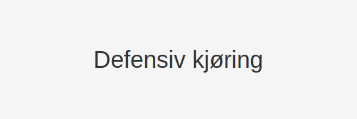
## Grunnleggende filosofi bak defensiv kjøring
Defensiv kjøring bygger på prinsippet om at **du ikke kan kontrollere andre trafikanters handlinger**, men du kan forberede deg på dem og tilpasse din egen kjøring deretter. Denne tilnærmingen anerkjenner at feil og uventede situasjoner vil oppstå, og fokuserer på å skape sikkerhetsmarginer som gir deg tid og rom til å reagere.
Den defensive sjåføren opererer med følgende grunnholdning:
- Alle andre trafikanter kan gjøre feil når som helst
- Tekniske feil på kjøretøy kan oppstå uten forvarsel  
- Vei- og værforhold endrer seg kontinuerlig
- **Egen oppmerksomhet** kan svik?? i kritiske øyeblikk
For å forstå hvordan oppmerksomhet påvirker kjøring, se [psykologiske faller i trafikken](/blogs/teori/psykologiske-feller-i-trafikken "Psykologiske feller i trafikken - Unngå mentale feller bak rattet").
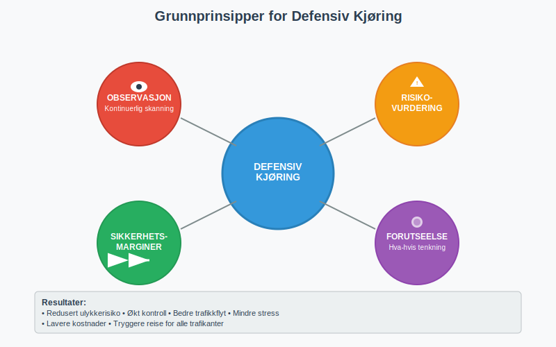
## Situasjonsbevissthet og observasjonsteknikker
### Systematisk skannings?mønster
Effektiv defensiv kjøring krever et **strukturert observasjonsmønster** som sikrer at du fanger opp endringer i trafikkbildet tidlig nok til å reagere:
| Observasjonsområde | Skannfrekvens | Hva å se etter |
|-------------------|---------------|----------------|
| **Fjern sikt** (200-500m) | Kontinuerlig | Trafikkork, veiarbeid, værskifte, kurvatur |
| **Nær sikt** (50-200m) | Hver 2-3 sek | Kjøretøy som bremser, fotgjengere, sykler |
| **Umiddelbar sikt** (0-50m) | Kontinuerlig | Brå bevegelser, hindringer, veiskilt |
| **Sidespeil** | Hver 8-12 sek | Kjøretøy i blindsoner, forbikjøring |
| **Ryggspeil** | Hver 8-15 sek | Følgende trafikk, aggressiv adferd |
| **Instrumenter** | Hver 15-20 sek | Hastighet, drivstoff, varsellamper |
*Lær mer om korrekt [bruk av lys og signaler](/blogs/teori/bruk-av-lys-og-signaler "Bruk av lys og signaler - Guide til korrekt lysbruk") for å forbedre synlighet og kommunikasjon.*
### Identifisering av risikofaktorer
Den defensive sjåføren må kontinuerlig **evaluere risikopotensial** i trafikkbildet:
*For en mer detaljert guide til systematisk risikovurdering, se [Risikovurdering i praksis](/blogs/teori/risikovurdering-i-praksis "Risikovurdering i praksis - Praktisk risikovurdering i trafikken").*
**Høy risiko-situasjoner:**
- Kryss og avkjørsler med begrenset sikt
- Skoler og lekeplasser i rushtid
- Kjøretøy med uforutsigbar adferd (saktekjørende, svingete)
- Fotgjengere med mobiltelefon eller hodetelefoner
- Dårlige vær- og siktforhold
**Moderat risiko-situasjoner:**
- Tett trafikk med jevn flyt
- Motorveikjøring under normale forhold
- Kjente veistrekninger på dagtid
For grundig forståelse av ulike trafikantgrupper og deres atferdsmønstre, se [trafikantgrupper og hensyn](/blogs/teori/trafikantgrupper-og-hensyn "Trafikantgrupper og hensyn - Komplett guide til hensyn for alle trafikanter").
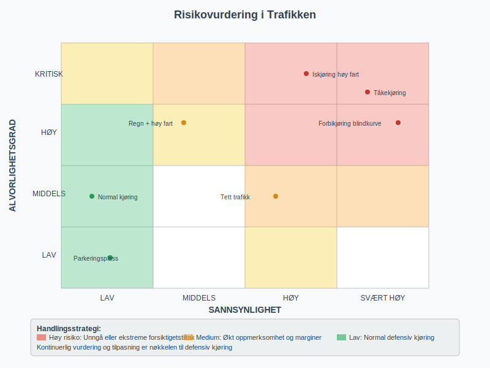
## Sikkerhetsmarginer og avstandsregler
### Dynamisk følgeavstand
Defensiv kjøring krever **fleksible sikkerhetsmarginer** som tilpasses kontinuerlig etter forholdene. Den tradisjonelle "3-sekunder regelen" er kun et utgangspunkt:
**Grunnleggende avstandsregler:**
- **Normal tørrdekkskjøring:** 3 sekunders følgeavstand
- **Lett regn eller vind:** 4-5 sekunders følgeavstand  
- **Kraftig regn eller snø:** 6-8 sekunders følgeavstand
- **Is eller ekstremt vanskelige forhold:** 10+ sekunders følgeavstand
**Økt avstand nødvendig ved:**
- Kjøring bak lastebiler (begrenset sikt fremover)
- Motorveikjøring over 90 km/t
- Tretthet eller redusert konsentrasjon
- Kjøring med [tilhenger](/blogs/teori/kjoring-med-tilhenger "Kjøring med tilhenger - Guide til sikker tilhengerkjøring")
For detaljert forståelse av bremseavstand og reaksjonstid, se [reaksjonstid og bremselengde](/blogs/teori/reaksjonstid-og-bremselengde "Reaksjonstid og bremselengde - Fundamentale konsepter for sikker kjøring").
### Sideveis sikkerhetsmarginer
Defensiv kjøring innebærer også å **optimalisere posisjon** på kjørebanen for maksimal sikkerhet:
- **Ved forbikjøring av syklister:** Minimum 1,5 meter sideveis avstand
- **Ved møte med store kjøretøy:** Flytt deg lengst mulig til høyre
  - Se [Store kjøretøy i trafikken (Gi plass)](/blogs/teori/store-kjoretoy-gi-plass "Store kjøretøy i trafikken (Gi plass) - Gi plass til store kjøretøy") for mer om å gi plass til store kjøretøy
- **I tunneler:** Øk sideveis avstand til vegger og andre kjøretøy
- **Ved veiarbeid:** Følg skilting og reduser hastighet tidlig
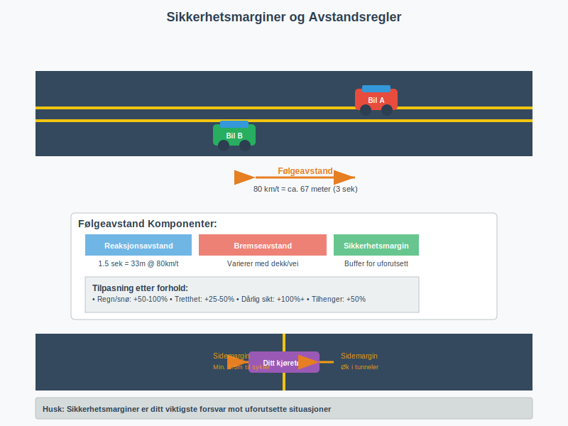
## Hastighetstilpasning og trafikkflyt
### Proaktiv hastighetskontroll
Den defensive sjåføren **tilpasser hastighet proaktivt** basert på situasjonsanalyse, ikke bare fartsgrenser:
**Hastig?hetsreduksjon ved:**
- Tett trafikk (reduserer dominoeffekt ved bremsing)
- Dårlig sikt (regn, tåke, mørke)
- Ukjente veistrekninger
- Høy fotgjengeraktivitet
- Tekniske problemer på kjøretøyet
**Akselerasjon kun når:**
- Trafikksituasjonen tillater det trygt
- Sikt og veiforhold er optimale  
- Du har tilstrekkelig flyktrom
- Andre trafikanter ikke påvirkes negativt
For omfattende informasjon om hastighet og avstand se [fart og avstand](/blogs/teori/fart-og-avstand "Fart og avstand - Komplett guide til hastighet og bremseavstand").
### Trafikkflyt og samarbeid
Defensiv kjøring handler ikke bare om egen sikkerhet, men om å **bidra til smidig trafikkflyt**:
- Oppretthold jevn hastighet uten unødvendige variasjoner
- Signal intensjoner tidlig og tydelig
- Gi rom for andre trafikanter å utføre manøvrer trygt
- Unngå aggressiv kjøring som skaper spenning
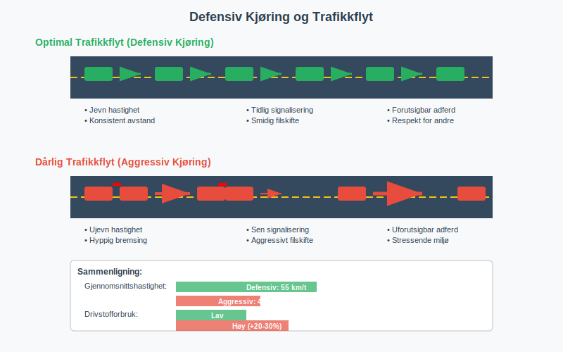
## Forutseelse og risikoantisipering
### Mentale modeller for trafikksituasjoner
Erfarne defensive sjåfører utvikler **mentale modeller** som hjelper dem å forutse potensielle konflikter:
**Typiske høyrisikoscenarios:**
1. **"Høyresving-konflikten":** Bil som skal høyresvinge kan overse syklister
2. **"Parkeringssituasjonen":** Kjøretøy som bakker ut fra p-plass
3. **"Lyskryss-dilemmaet":** Trafikanter som øker fart for å rekke gult lys
4. **"Skole-sonen":** Barn som løper ut mellom parkerte biler
5. **"Motorvei-sammenslåing":** Kjøretøy som ikke tilpasser hastighet ved påkjøring
### Kontinuerlig scenarioplanlegging
Den defensive sjåføren stiller seg kontinuerlig spørsmål som:
- "Hva hvis den fotgjengeren løper ut?"
- "Hvor skal jeg kjøre hvis lastebilen foran bremser brått?"
- "Har jeg fluktrom hvis jeg må unngå hindring?"
Dette kalles **"hva-hvis" tenkning** og er grunnleggende for defensiv kjøring.
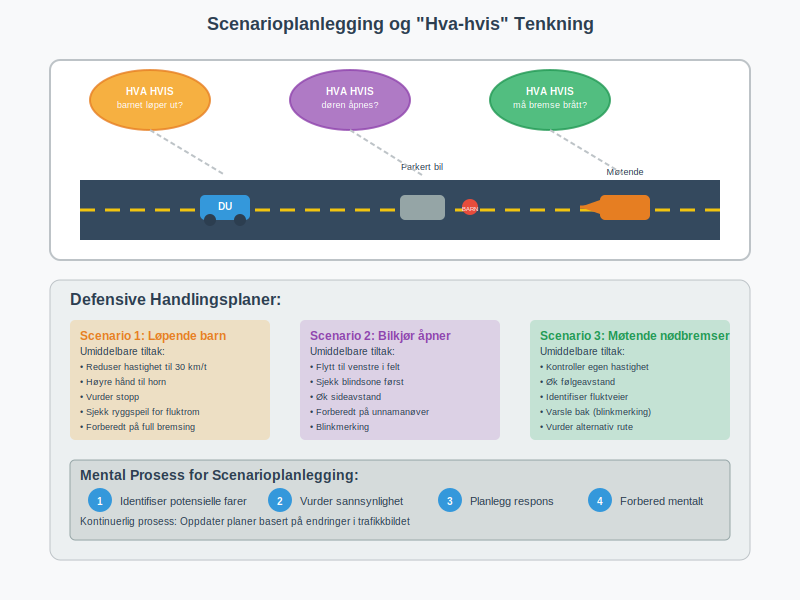
## Kommunikasjon og synlighet
### Aktiv kommunikasjon med andre trafikanter
Defensiv kjøring krever **proaktiv kommunikasjon** for å redusere misforståelser:
**Effektive kommunikasjonsverktøy:**
- **Blinklys:** Signal intensjoner minst 3 sekunder før manøver
- **Bremsely:** Kort og tydelig signalisering ved hastighetreduksjon
- **Øyekontakt:** Med fotgjengere og syklister når mulig
- **Posisjonering:** Bruk kjørebaneposisjon for å signalisere intensjoner
- **Hornbruk:** Kun ved umiddelbar fare, ikke av frustrasjon
For detaljert informasjon om trafikkommunikasjon, se [kommunikasjon med andre trafikanter](/blogs/teori/kommunikasjon-med-andre-trafikanter "Kommunikasjon med andre trafikanter - Tydelige signaler og trygg trafikk").
### Synlighet og konspikuitet
**Være synlig handler om mer enn bare lys:**
- Bruk **nærlys også på dagtid** for økt synlighet
- Velg lysreflekterende klær ved kjøring på motorsykkel
- Posisjon deg slik at du ikke forsvinner i andre kjøretøys blindsoner
- Bruk [riktig lys](/blogs/teori/bruk-av-lys-og-signaler "Bruk av lys og signaler - Guide til korrekt lysbruk") for forholdene
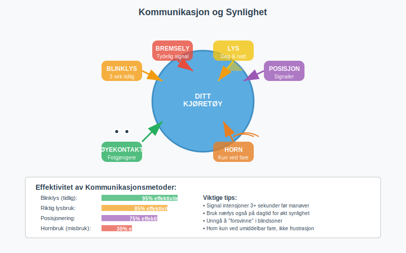
## Spesielle forhold og situasjoner
### Defensiv kjøring i ulike miljøer
**Bykjøring krever spesiell oppmerksomhet:**
- Hyppige retningsendringer og komplekse trafikkmønstre
- Høy fotgjenger- og syklistaktivitet
- Begrensede fluktmuligheter
- Se [bykjøring](/blogs/teori/bykjoring "Bykjøring - Comprehensive guide to urban driving in Norway") for spesifikke teknikker
**Landeveiskjøring har andre utfordringer:**
- Høyere hastigheter og longer reaksjonsavstander
- Møtende trafikk med høy relativ hastighet
- Dyreliv og uforutsigbare hindringer
- Se [landeveiskjøring](/blogs/teori/landeveiskjoring "Landeveiskjøring - Guide til sikker kjøring på norske landeveier") for detaljer
**Motorveikjøring:**
- Høy hastighet krever økt følgeavstand
- Komplekse flettemanøvrer
- Se [motorveikjøring](/blogs/teori/motorveikjoring "Motorveikjøring - Guide til kjøring på motorvei") for spesifikke retningslinjer
### Vanskelige værforhold
Defensiv kjøring blir spesielt kritisk under **utfordrende forhold**:
| Forhold | Spesielle tiltak |
|---------|------------------|
| **Regn** | Øk følgeavstand, reduser hastighet, sjekk dekkgrep |
| **Snø** | Enda større marginer, myk akselerasjon/bremsing |
| **Is** | Ekstrem forsiktighet, vurder alternativ transport |
| **Tåke** | Drastisk hastighetreduksjon, bruk tåkelys |
| **Vind** | Grip rattet fastere, vær forberedt på vindkast |
For komplett informasjon se [kjøring under vanskelige forhold](/blogs/teori/kjoring-under-vanskelige-forhold "Kjøring under vanskelige forhold - Comprehensive guide to challenging driving conditions").
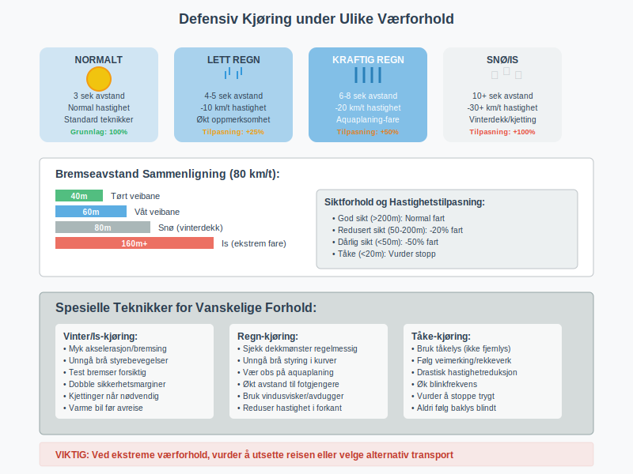
## Teknologi og defensiv kjøring
### Moderne sikkerhetssystemer som støtte
Dagens kjøretøy har avanserte **sikkerhetssystemer** som kan støtte defensiv kjøring, men aldri erstatte den:
**Aktive sikkerhetssystemer:**
- **ABS (Anti-lock Braking System):** Forhindrer hjullåsing under bremsing
- **ESC (Electronic Stability Control):** Forhindrer skrens
- **Lane Departure Warning:** Varsler ved utilsiktet filskifte
- **Collision Warning:** Varsler ved kollisjonsfare
- **Adaptive Cruise Control:** Automatisk avstandskontroll
**Viktige begrensninger:**
- Systemer kan feile eller ha "blinde flekker"
- Kan skape falsk sikkerhetsfølelse
- Fungerer dårligst under ekstreme forhold
- Krever forståelse av funksjon og begrensninger
Se [kjøretøyets sikkerhetsutstyr](/blogs/teori/kjoretoyets-sikkerhetsutstyr "Kjøretøyets sikkerhetsutstyr - Komplett guide til aktivt og passivt sikkerhetsutstyr") for detaljert informasjon.
### Distraksjoner og teknologi
Moderne teknologi kan også **underminere defensiv kjøring:**
- Mobiltelefoner og infotainmentsystemer
- GPS-navigasjon som trekker oppmerksomhet fra veien
- Overavhengighet av automatiske systemer
**Defensiv bruk av teknologi:**
- Sett opp GPS før avreise
- Bruk hands-free systemer, men begrens samtaler i kompleks trafikk
- La passasjerer håndtere tekniske innstillinger
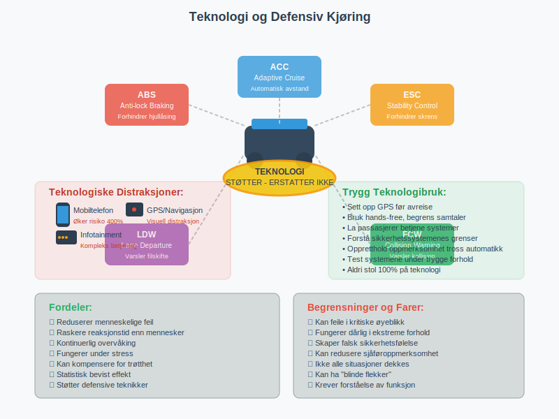
## Psykologiske aspekter
### Stress og emosjonell kontroll
Defensiv kjøring krever **emosjonell modenhet** og stresskontroll:
**Stressreduserende teknikker:**
- Planlegg ruter og avreisetid for å unngå tidspress
- Bruk pusteøvelser ved frustrasjon
- Ta pauser på lange turer
- Aksepter at du ikke kan kontrollere andre trafikanter
**Faresignaler på emosjonell utmattelse:**
- Økt irritabilitet over andre trafikanters handlinger
- Tendens til aggressiv kjøring eller "undervisning" av andre
- Redusert tålmodighet i trafikk
- Økt risikovillighet
### Overselv?tillit og kompetanseutvikling
**Dunning-Kruger effekten** kan være spesielt farlig i trafikken:
- Nybegynnere kan overvurdere egne ferdigheter
- Erfarne sjåfører kan bli overmodige og slappe av på oppmerksomheten
- Kontinuerlig læring og selvrefleksjon er nødvendig
**Strategier for kontinuerlig forbedring:**
- Regelmessig vurdering av egne kjøreferdigheter
- Oppdatering på nye trafikkregler og teknologi
- Kjøretrening under utfordrende forhold
- Lær av nesten-ulykker uten å skyve skylden på andre
For dypere forståelse se [psykologiske feller i trafikken](/blogs/teori/psykologiske-feller-i-trafikken "Psykologiske feller i trafikken - Unngå mentale feller bak rattet").
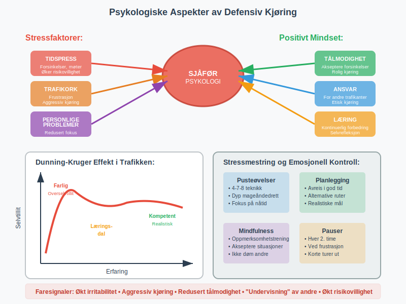
## Praktiske øvelser og ferdighetstrening
### Øvelser for å forbedre observasjon
**Systematisk skanningsøvelse:**
1. Kjør på en trygg veistrekning
2. Verbal kommenter alt du observerer i 5-minutters perioder
3. Noter hvilke områder du glemmer å sjekke
4. Gjenta til skanningen blir automatisk
**Reaksjonstidstrening:**
- Øv på å identifisere potensielle farer tidlig
- Tren på å planlegge fluktrum kontinuerlig
- Simulator bromsing ved ulike hastigheter (på lukket område)
### Avanserte defensive teknikker
**"Escape route planning":**
- Identifiser alltid minst to mulige fluktveier
- Planlegg reaksjon på vanlige scenarioer
- Øv mentalt på nødevasjon
**"Commentary driving":**
- Kommenter høyt hva du ser og planlegger
- Hjelper med å opprettholde fokus
- Avdekker blinde flekker i oppmerksomheten
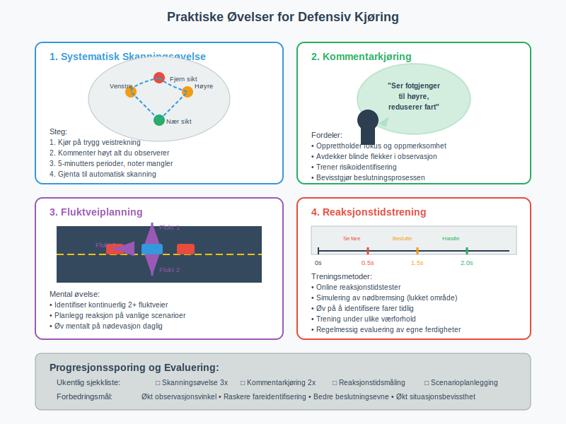
## Defensiv kjøring på spesielle veityper
### Rundkjøringer og kryss
**Defensive strategier i rundkjøringer:**
- Reduser hastighet betydelig før innkjøring
- Sjekk alle retninger, ikke bare til venstre
- Vær spesielt oppmerksom på syklister og fotgjengere
- Signal tydelig dine intensjoner
For detaljert informasjon se [vikeplikt og rundkjøringer](/blogs/teori/vikeplikt-og-rundkjoringer "Vikeplikt og rundkjøringer - Komplett guide til høyreregelen og rundkjøringer").
### Parkering og rygging
Defensiv tilnærming til [parkering](/blogs/teori/rygging-og-parkering "Rygging og parkering - Komplett guide til sikker parkering og rygging"):
- Sjekk området grundig før manøvrering  
- Bruk alle tilgjengelige hjelpemidler (speil, kamera, sensorer)
- Beveg deg sakte og vær forberedt på å stoppe
- Vær ekstra oppmerksom på fotgjengere, spesielt barn
### Særskilte hensyn til sårbare trafikanter
**Barn og unge:**
- Er uforutsigbare og kan handle impulsivt
- Har begrenset forståelse av farer
- Kan være skjult av parkerte biler
- Krever ekstra tid og rom
For omfattende informasjon se [trafikantgrupper og hensyn](/blogs/teori/trafikantgrupper-og-hensyn "Trafikantgrupper og hensyn - Komplett guide til hensyn for alle trafikanter").
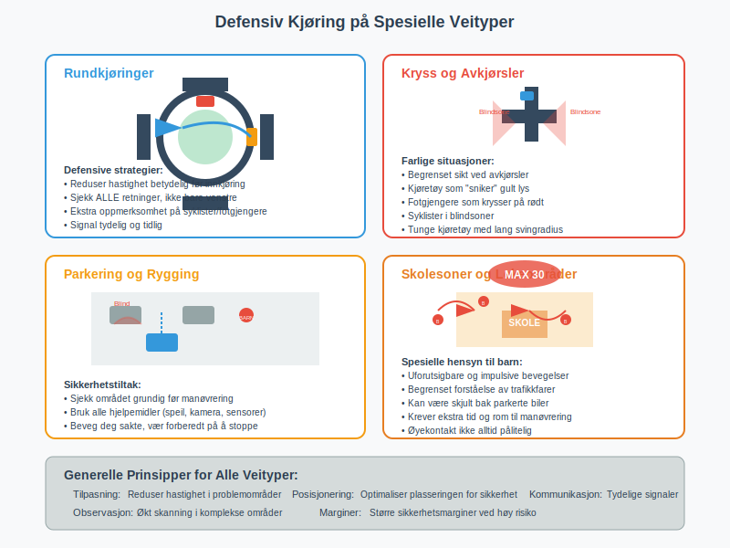
## Økonomiske og praktiske fordeler
### Reduserte kostnader
Defensiv kjøring gir **målbare økonomiske fordeler:**
- Mindre slitasje på dekk og bremser
- Lavere drivstofforbruk gjennom jevn kjøring
- Færre trafikksanktioner
- Lavere forsikringspremier ved skadefri kjøring
- Økt kjøretøy-levetid
### Tidsbesparelse paradokset
Selv om defensiv kjøring kan virke mindre effektivt, gir det ofte **tidsbesparelse** over tid:
- Færre forsinkelser grunnet ulykker
- Mindre stress reduserer tretthet
- Smidigere trafikkflyt for alle
- Unngår stopp for politikontroller
**Kalkulerte marginer:**
- 5-10% økning i reisetid kan gi 50-80% reduksjon i risiko
- Marginal ekstra tid vs. potensielt livsvarig konsekvens av ulykke
### Samfunnsmessige fordeler
**Kollektiv nytte av defensiv kjøring:**
- Reduserte helsekostnader fra trafikkulykker
- Mindre miljøpåvirkning gjennom effektiv kjøring
- Bedre trafikkflyt reduserer køer og utslipp
- Økt trygghetsfølelse for sårbare trafikanter
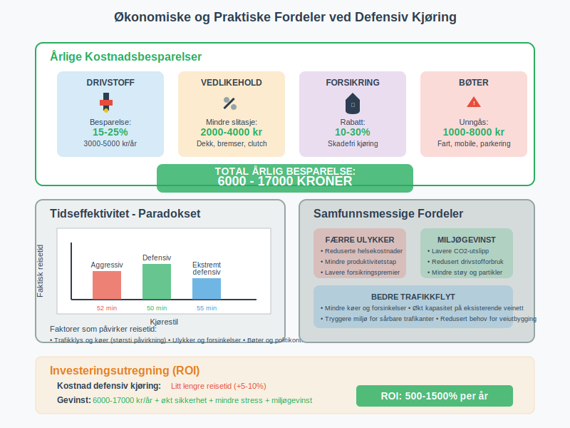
## Vanlige misforståelser og myter
### "Defensive sjåfører er trege sjåfører"
**Realiteten:**
- Defensiv kjøring handler om **timing og flyt**, ikke lav hastighet
- Optimaliserer hastighet for situasjonen, ikke maksimerer den
- Kan ofte opprettholde høyere gjennomsnittshastighet gjennom færre stopp
### "Moderne biler er så sikre at defensiv kjøring er mindre viktig"
**Faktisk situasjon:**
- Sikkerhetsutstyr reduserer skadeomfang, ikke unfallsannsynlighet  
- Fysikkens lover gjelder fortsatt for bremseavstand og energi
- Teknologi kan feile i kritiske øyeblikk
- Mange ulykker involverer eldre kjøretøy uten moderne sikkerhet
### "Defensiv kjøring hindrer trafikkflyt"
**Motsatsen er sant:**
- Jevn og forutsigbar kjøring forbedrer flyt
- Reduserer dominoeffekter fra brå manøvrer
- Færre ulykker betyr færre trafikkork
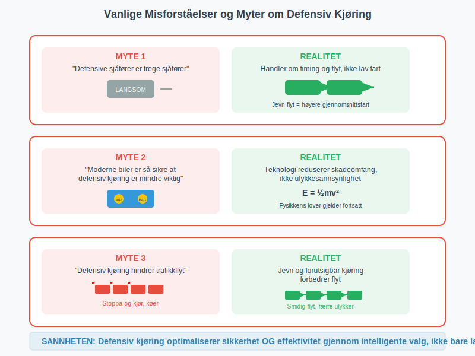
## Konklusjon og viktige takeaways
Defensiv kjøring er **ikke en enkelt teknikk**, men en helhetlig tilnærming til trygg ferdsel som kombinerer:
**Tekniske ferdigheter:**
- Systematisk observasjon og situasjonsbevissthet
- Optimalisering av sikkerhetsmarginer  
- Proaktiv hastighetstilpasning
- Effektiv kommunikasjon med andre trafikanter
**Mentale egenskaper:**
- Kontinuerlig risikovurdering og scenarioplanlegging
- Emosjonell kontroll og stressmestring
- Ydmykhet overfor egne begrensninger
- Respekt for andre trafikanters sikkerhet
**Praktisk implementering:**
- Regelmessig trening og ferdighetsmaintenance
- Tilpasning til teknologisk utvikling
- Kontinuerlig læring fra egne og andres erfaringer
Den defensive sjåføren forstår at **sikkerhet er et kontinuerlig valg**, ikke en engangsbeslutning. Hver kjøretur krever aktiv innsats for å opprettholde sikkerhetsmarginer og situasjonsbevissthet.
## Relaterte emner og videre læring
**Grunnleggende ferdigheter:**
* [Reaksjonstid og bremselengde](/blogs/teori/reaksjonstid-og-bremselengde "Reaksjonstid og bremselengde - Fundamentale konsepter for sikker kjøring")
* [Fart og avstand](/blogs/teori/fart-og-avstand "Fart og avstand - Komplett guide til hastighet og bremseavstand")
* [Plassering og kjøremåte](/blogs/teori/plassering-og-kjoremmate "Plassering og kjøremåte - Guide til riktig kjøreteknikk")
**Avanserte teknikker:**
* [Håndtering av nødsituasjoner](/blogs/teori/handtering-av-nodsituasjoner "Håndtering av nødsituasjoner - Guide til håndtering av nødsituasjoner i trafikken")
* [Kjøring under vanskelige forhold](/blogs/teori/kjoring-under-vanskelige-forhold "Kjøring under vanskelige forhold - Comprehensive guide to challenging driving conditions")
* [Møteulykker og forebygging](/blogs/teori/moteulykker-og-forebygging "Møteulykker og forebygging - Forebygging av frontkollisjoner i trafikken")
**Spesialiserte situasjoner:**
* [Bykjøring](/blogs/teori/bykjoring "Bykjøring - Comprehensive guide to urban driving in Norway")
* [Landeveiskjøring](/blogs/teori/landeveiskjoring "Landeveiskjøring - Guide til sikker kjøring på norske landeveier")  
* [Motorveikjøring](/blogs/teori/motorveikjoring "Motorveikjøring - Guide til kjøring på motorvei")
* [Kjøring med tilhenger](/blogs/teori/kjoring-med-tilhenger "Kjøring med tilhenger - Guide til sikker tilhengerkjøring")
**Mental og sosial forståelse:**
* [Psykologiske feller i trafikken](/blogs/teori/psykologiske-feller-i-trafikken "Psykologiske feller i trafikken - Unngå mentale feller bak rattet")
* [Trafikantgrupper og hensyn](/blogs/teori/trafikantgrupper-og-hensyn "Trafikantgrupper og hensyn - Komplett guide til hensyn for alle trafikanter")
* [Kommunikasjon med andre trafikanter](/blogs/teori/kommunikasjon-med-andre-trafikanter "Kommunikasjon med andre trafikanter - Tydelige signaler og trygg trafikk")