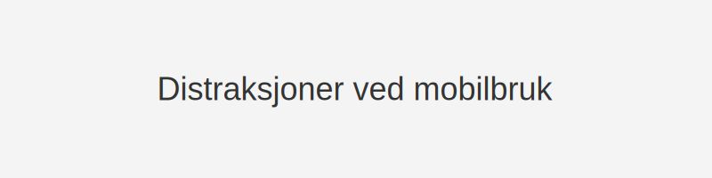

**Distraksjoner** ved **mobilbruk** er en av de mest alvorlige årsakene til ulykker i trafikken. Å bruke mobiltelefonen innebærer flere former for distraksjon – *visuell*, *kognitiv*, *manuell* og *auditiv* – som til sammen kan ha fatal effekt når du er bak rattet.
For en grundig gjennomgang av [Oppmerksomhet og samhandling](/blogs/teori/oppmerksomhet-og-samhandling "Oppmerksomhet og samhandling - Fokus og samarbeid i trafikken") og hvordan distraksjoner påvirker fokus, se artikkelen vår om oppmerksomhet.

## Typer distraksjoner ved mobilbruk
| Distraksjonstype   | Beskrivelse                                        | Eksempel               |
|--------------------|----------------------------------------------------|------------------------|
| **Visuell**        | Fjerner blikket fra veien                          | Se på skjermen         |
| **Kognitiv**       | Tankene er opptatt av samtalen eller meldingene     | Tenk på samtaleinnhold |
| **Manuell**        | Hender fjernet fra rattet                          | Skrive eller swipe     |
| **Auditorisk**     | Fokus på lydsignal fra telefonen                   | Høre ringetone eller varsling |
## Lover og regler
*I Norge er det forbudt å bruke håndholdt mobiltelefon under kjøring.* Dette er regulert i [Vegtrafikkloven](/blogs/teori/lover-og-forskrifter "Lover og forskrifter - Oversikt over norske trafikklover og forskrifter") § 19 og forskrift om kjørende motorvogn § 2-7.
| Regel                          | Straff                         |
|--------------------------------|--------------------------------|
| Håndholdt bruk av mobiltelefon | Bot fra 1700 NOK               |
| Brudd på påbudt sikkerhetsutstyr| Kan føre til gebyr i tillegg   |
## Konsekvenser av mobil-distraksjon
>Distraksjon fra mobil kan øke **reaksjonstiden** med opptil 35 % og mangedoble risikoen for ulykker.
## Tips for å unngå mobil-distraksjon
* **Aktiver flymodus** før kjøring for å unngå varsler.
* **Bruk handsfree** eller monter telefonen sikkert om nødvendig.
* **Planlegg** ruter og stopp før du bruker telefon.
* **Sett telefonen utenfor rekkevidde** under kjøring.
## Oppsummering
**Distraksjoner ved mobilbruk** utgjør en betydelig risiko i trafikken, men kan unngås med enkle tiltak. Ved å begrense mobilbruk til stoppested og benytte handsfree systemer, kan du opprettholde fokus og redusere farlige situasjoner.