
**Fart og avstand** er de mest fundamentale prinsippene innen trafikksikkerhet og utgjør grunnpilaren for all sikker kjøring. Forståelse av de komplekse sammenhengene mellom hastighet, bremseavstand, reaksjonstid, følgeavstand og sikkerhetsmarginer er ikke bare avgjørende for å bestå teoriprøven, men kan redde liv i kritiske situasjoner. Denne omfattende guiden gir deg dyp innsikt i alle aspekter ved fart og avstand, med praktiske eksempler, detaljerte beregninger og handlingsrettede råd som gjør deg til en tryggere og mer kompetent sjåfør.
*For en helhetlig guide til samhandling i trafikken, se [Samhandling i trafikken](/blogs/teori/samhandling-i-trafikken "Samhandling i trafikken - Tegn, signal, fart og plassering").*
*Disse prinsippene er spesielt viktige ved [Landeveiskjøring](/blogs/teori/landeveiskjoring "Landeveiskjøring - Guide til sikker kjøring på norske landeveier"), hvor høyere hastigheter krever større marginer.*
*For kjøring på motorvei, se [Motorveikjøring](/blogs/teori/motorveikjoring "Motorveikjøring - Guide til kjøring på norsk motorvei").*
*For mer om hvordan **menneskelige faktorer** påvirker kjøring, se [Mennesket i trafikken](/blogs/teori/mennesket-i-trafikken "Mennesket i trafikken - Faktorer som påvirker kjøring").*
*For tips om å redusere drivstofforbruk og utslipp ved valg av hastighet og kjørestil, se [Miljøvennlig kjøring](/blogs/teori/miljovennlig-kjoring "Miljøvennlig kjøring - Teknikker for bærekraftig kjøring").*
* For en praktisk tilnærming til risiko-minimering i trafikken, se [Defensiv kjøring](/blogs/teori/defensiv-kjoring "Defensiv kjøring - Prinsipper og teknikker for trygg kjøring").
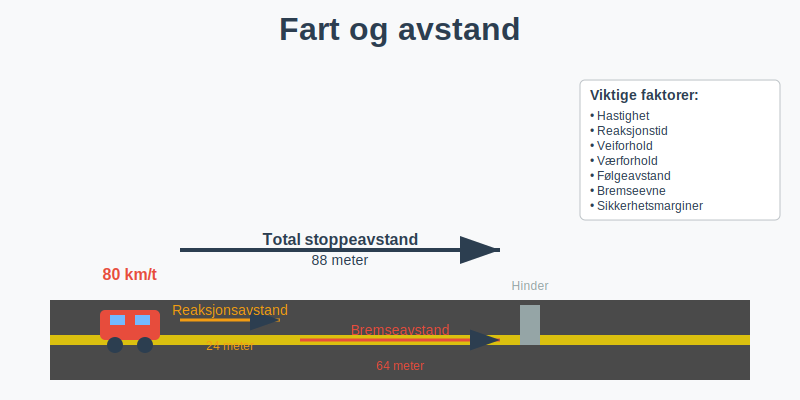
*For en mer inngående gjennomgang av **reaksjonstid** og **bremselengde**, se [Reaksjonstid og bremselengde](/blogs/teori/reaksjonstid-og-bremselengde "Reaksjonstid og bremselengde - Dypdykk i reaksjonstid og bremselengde").*
## Fysikken bak fart og avstand
For å forstå betydningen av **fart og avstand** fullt ut, må vi først forstå de fysiske lovene som styrer hvordan kjøretøy oppfører seg. **Kinetisk energi** - energien et objekt har på grunn av sin bevegelse - øker kvadratisk med hastigheten. Dette betyr at når hastigheten dobles, blir den kinetiske energien fire ganger større.
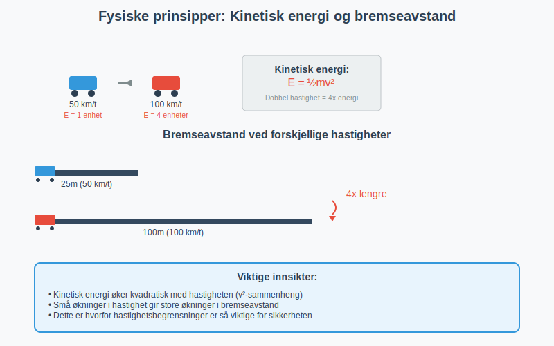
### Energi og bevegelse
**Kinetisk energi** beregnes som: E = ½mv², hvor:
* **E** = kinetisk energi (joule)
* **m** = masse (kg) 
* **v** = hastighet (m/s)
Dette forklarer hvorfor små økninger i hastighet har så dramatiske konsekvenser for **bremselengden**. En bil som kjører i 100 km/t har fire ganger mer energi å kvitte seg med enn samme bil i 50 km/t. 
*For å forstå hvordan denne energioverføringen påvirker de mest alvorlige ulykkestypene, se [Møteulykker og forebygging](/blogs/teori/moteulykker-og-forebygging "Møteulykker og forebygging - Fysikk, årsaker og forebygging av frontkollisjoner").*
### Friksjon og veigrepet
**Friksjon** mellom dekk og vei er det som stopper bilen. Friksjonskoeffisienten varierer betydelig:
| Veiforhold | Friksjonskoeffisient | Praktisk betydning |
|------------|---------------------|-------------------|
| **Tørr asfalt** | 0,7-0,9 | Beste bremsing |
| **Våt asfalt** | 0,4-0,7 | 30-50% lengre bremsevei |
| **Snø** | 0,2-0,4 | 2-3 ganger lengre bremsevei |
| **Is** | 0,1-0,2 | 5-8 ganger lengre bremsevei |

*For en mer inngående gjennomgang av **veigrep**, fart, friksjon, vannplaning og styring, se [Veigrep](/blogs/teori/veigrep "Veigrep - bremselengde, bevegelsesenergi, friksjon, gripeevne, fart, vannplaning og styring").*
## Reaksjonstid og stoppeavstand
**Reaksjonstid** er den kritiske perioden fra du oppdager en fare til du iverksetter en handling (som bremsing). Denne tiden består av flere komponenter som til sammen utgjør den totale reaksjonstiden. For en våken, opplagt sjåfør under ideelle forhold er normal reaksjonstid **1-1,5 sekunder**, men denne kan variere dramatisk avhengig av en rekke faktorer.
### Komponentene i reaksjonstid
Reaksjonstiden kan deles inn i fire hovedfaser:
1. **Deteksjonstid** (0,1-0,3 sek) - Tiden det tar å oppdage faren
2. **Identifikasjonstid** (0,1-0,5 sek) - Tiden det tar å forstå hva som skjer
3. **Beslutningsid** (0,1-0,5 sek) - Tiden det tar å beslutte hvordan man skal handle
4. **Responsstid** (0,1-0,3 sek) - Tiden det tar å fysisk utføre handlingen
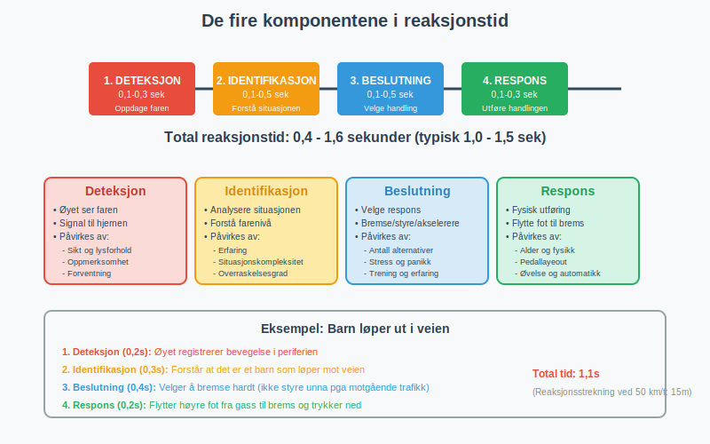
### Normal reaksjonstid under ulike forhold
| Situasjon | Reaksjonstid | Forklaring |
|-----------|--------------|-------------|
| **Ideelle forhold** | 0,8-1,2 sek | Våken, opplagt, forventer fare |
| **Normale forhold** | 1,0-1,5 sek | Vanlig kjøring, liten overraskelse |
| **Komplekse situasjoner** | 1,5-2,5 sek | Uventede hendelser, flere valg |
| **Overraskelse** | 2,0-3,0 sek | Plutselig, uventet fare |
### Reaksjonsavstand
**Reaksjonsavstanden** er den distansen bilen kjører i løpet av reaksjonstiden. Denne kan beregnes med følgende formel:
**Reaksjonsavstand = (Hastighet ÷ 10) × 3**
| Hastighet | Reaksjonsavstand | Eksempel |
|-----------|------------------|----------|
| **30 km/t** | 9 meter | Halvparten av en fotballbane |
| **50 km/t** | 15 meter | Omtrent 3 biler på rekke |
| **80 km/t** | 24 meter | 6 biler på rekke |
| **110 km/t** | 33 meter | 8 biler på rekke |

### Faktorer som påvirker reaksjonstid
Reaksjonstiden kan **forlenges betydelig** av flere faktorer:
* **Alkohol og narkotika** - kan doble eller tredoble reaksjonstiden
* **Tretthet** - øker reaksjonstiden drastisk
* **Medikamenter** - mange legemidler påvirker oppmerksomheten  
* **Mobiltelefon** - selv handsfree øker reaksjonstiden
* **Alder** - eldre sjåfører har generelt lengre reaksjonstid
* **Sykdom** - feber, forkjølelse påvirker konsentrasjonen
* **Psykologiske faktorer** - [selvovervurdering av egne ferdigheter](/blogs/teori/psykologiske-feller-i-trafikken "Psykologiske feller i trafikken - Hvordan selvovervurdering påvirker hastighetsvurdering") kan føre til at du undervurderer hvor lang tid du trenger for å reagere
For en grundig forståelse av hvordan disse faktorene påvirker kjøringen, les mer om [mennesket i trafikken](/blogs/teori/mennesket-i-trafikken "Mennesket i trafikken - Faktorer som påvirker kjøring").
## Bremseavstand
**Bremseavstanden** er distansen bilen trenger for å stoppe helt etter at bremsingen er påbegynt. Denne avhenger av flere faktorer og øker **kvadratisk** med hastigheten.
### Beregning av bremseavstand
På **tørr asfalt** kan bremseavstand beregnes omtrentlig:
**Bremseavstand = (Hastighet ÷ 10)²**
| Hastighet | Bremseavstand (tørr asfalt) | Bremseavstand (våt asfalt) |
|-----------|---------------------------|---------------------------|
| **30 km/t** | 9 meter | 18 meter |
| **50 km/t** | 25 meter | 50 meter |
| **80 km/t** | 64 meter | 128 meter |
| **110 km/t** | 121 meter | 242 meter |

### Avanserte bremseprinsipper
**Effektiv bremsing** handler om mer enn bare å trykke på bremsepedalen. Moderne teknikker og forståelse av bilens fysikk kan drastisk redusere bremsestrekningen:
#### Progressiv bremsing
* **Start moderat** - unngå hjullåsing i begynnelsen
* **Øk kraften gradvis** - maksimal kraft når bilen har bremset ned
* **Optimal fordeling** - bruk både motor- og fotbrems
#### Nødbremsing uten ABS
Hvis bilen ikke har ABS-system:
1. **Trykk hardt** på bremsepedalen
2. **Slipp hvis hjulene låser** seg (bilen sklir)
3. **Trykk igjen** straks hjulene ruller
4. **Repeter** til bilen stopper
#### Nødbremsing med ABS
Med ABS-system:
1. **Trykk og hold** bremsepedalen så hardt du kan
2. **Ikke slipp** selv om pedalen vibrerer
3. **Styr unna** hindringer hvis mulig
4. **La systemet** gjöre jobben
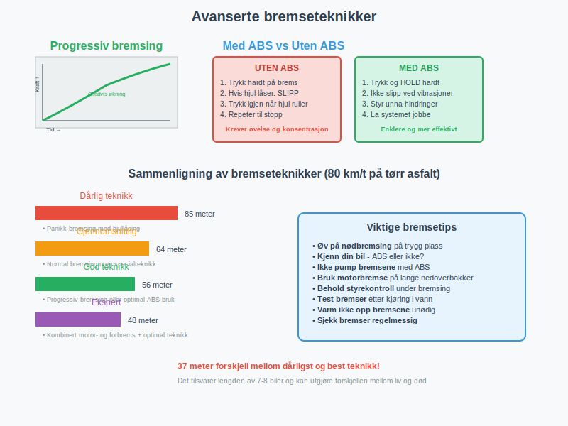
### Faktorer som påvirker bremseavstand
Bremseavstanden påvirkes av langt flere faktorer enn bare hastighet:
#### Kjøretøyfaktorer
* **Dekkforhold** - slitt dekk øker bremseavstanden med 20-40%
* **Bremser** - varme bremser (etter lang nedoverbakke) bremser dårligere
* **Vekt** - tyngre kjøretøy trenger lengre bremsevei
* **Fjæring** - slitt fjæring reduserer vektoverføring ved bremsing
#### Ytre faktorer
* **Stigningsgrad** - nedoverbakke øker, oppover reduserer bremseavstand
* **Veibeleg** - asfalt, betong, grus gir forskjellig friksjon
* **Temperatur** - kald vei kan være glattere enn varm
* **Vind** - medvind øker, motvind reduserer bremseavstand
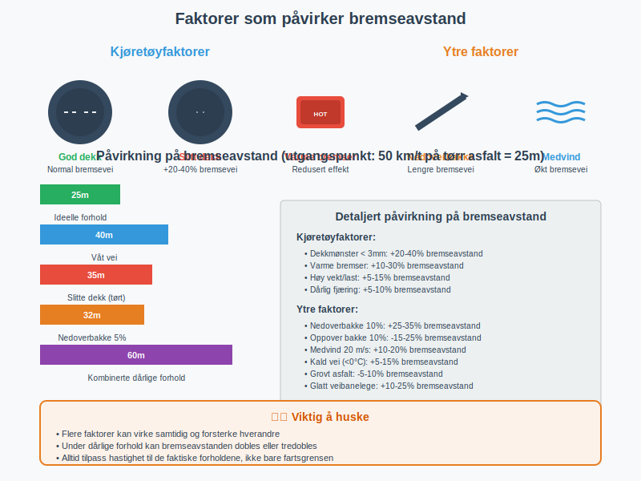
### Stoppeavstand
**Stoppeavstanden** er summen av reaksjonsavstand og bremseavstand:
**Stoppeavstand = Reaksjonsavstand + Bremseavstand**
| Hastighet | Reaksjonsavstand | Bremseavstand | **Total stoppeavstand** |
|-----------|------------------|---------------|------------------------|
| **50 km/t** | 15 m | 25 m | **40 meter** |
| **80 km/t** | 24 m | 64 m | **88 meter** |
| **110 km/t** | 33 m | 121 m | **154 meter** |

## Vurdere andres fart og avstand
Å **vurdere andres fart og avstand** i trafikken er en kritisk ferdighet for å opprettholde sikkerhetsmarginer og unngå farlige situasjoner. *Fartblindhet* oppstår når øynene og hjernen har begrenset evne til å bedømme hastighet over lange avstander eller i komplekse trafikkbilder.

### Hva er fartblindhet?
**Fartblindhet**, også kalt hastighetsblindhet, er en psykologisk effekt hvor **hastighetstilpasning** gjør det vanskelig å bedømme andres hastighet riktig. Når avstanden er stor og hastigheten høy, reduseres hjernens evne til å oppfatte endringer i bevegelse.
| Situasjon                  | Utfordring                            |
|----------------------------|---------------------------------------|
| Møte med tungtransport     | Vanskelig å bedømme økning i hastighet|
| Forbikjøring på landevei   | Kan føre til feilberegning av avstand |
| Kjøre i tett trafikk       | Redusert sikt øker fartblindhet       |
For mer om menneskelige faktorer og psykologiske feller som påvirker vurderingen av fart og avstand, se [Psykologiske feller i trafikken](/blogs/teori/psykologiske-feller-i-trafikken "Psykologiske feller i trafikken - Hvordan psykologiske mekanismer påvirker kjøring").
## Hastighet og fartsgrenser
Norge har et **systematisk og vitenskapelig basert** fartsgrensesystem som er nøye tilpasset veistandard, trafikksituasjon og ulykkesrisiko. Det er avgjørende å forstå at fartsgrensen representerer **maksimal tillatt hastighet under ideelle forhold** - ikke den hastigheten du alltid skal kjøre. Norske fartsgrenser er basert på omfattende forskning om sammenhenger mellom hastighet, ulykkesrisiko og skadeomfang, og har sitt juridiske grunnlag i [Lover og forskrifter](/blogs/teori/lover-og-forskrifter "Lover og forskrifter - Juridisk grunnlag for fartsgrenser og trafikkregulering").
### Historikk og utvikling av norske fartsgrenser
Norges fartsgrensesystem har utviklet seg betydelig siden de første **hastighetsbegrensningene** ble innført:
* **1912** - Første fartsgrense: 15 km/t i byer
* **1960-tallet** - Systematiske fartsgrenser på alle veinettet
* **1990-tallet** - Differensierte grenser basert på veistandard
* **2000-tallet** - Focus på **Vision Zero** og trafikksikkerhet
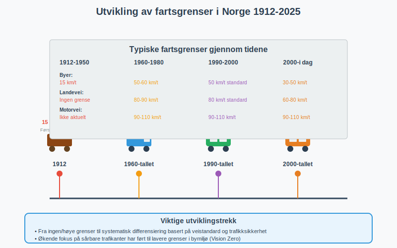
### Vitenskapelig grunnlag for fartsgrenser
Norske fartsgrenser baserer seg på **internasjonalt anerkjent forskning**:
* **85-persentil regel** - hastighet som 85% av trafikantene holder naturlig
* **Nullvisjonen** - ingen skal drepes eller skades alvorlig
* **Biomekanniske grenser** - menneskets tåleevne ved kollisjon
* **Infrastrukturkrav** - veistandard og sikringstiltak
For detaljert informasjon om hastighetsgrenseskilt og andre forbudsskilt, se [Trafikkskilt og veimerking](/blogs/teori/trafikkskilt-og-veimerking "Trafikkskilt og veimerking - Komplett guide til trafikkskilt og veimerking").
### Norske fartsgrenser
| Område | Standard fartsgrense | Spesielle forhold |
|---------|---------------------|-------------------|
| **[Tettbebyggd strøk](/blogs/teori/bykjoring "Bykjøring - Comprehensive guide to urban driving in Norway")** | 50 km/t | Kan være 30 km/t i boligområder |
| **Landeveier** | 80 km/t | 60 km/t på smale/svingete veier |
| **Motorveier** | 90-110 km/t | Se [Motorveikjøring](/blogs/teori/motorveikjoring "Motorveikjøring - Guide til kjøring på motorvei") |
| **Gågate/bomiljø** | 5-15 km/t | Fotgjengere har forkjørsrett |
*For en komplett oversikt over **fartsgrenser**, se [Fartsgrenser](/blogs/teori/fartsgrenser "Fartsgrenser – Generelle regler, skilter og soneskilt").*
### Hastighetstilpasning
**Riktig hastighet** er et komplekst fagområde som krever kontinuelig vurdering av multiple faktorer. Fartsgrensen er kun utgangspunktet - **din faktiske kjørehastighet** må tilpasses en rekke variable forhold som endrer seg konstant under kjøring. Dette kalles **dynamisk hastighetstilpasning** og er en av de viktigste ferdighetene for sikker kjøring.
### Prinsippene for hastighetstilpasning
**Hastighetstilpasning** følger fire grunnleggende prinsipper:
1. **Siktprinsippet** - kjør ikke raskere enn at du kan stoppe innenfor den strekningen du kan se
2. **Gripsprinsippet** - tilpass hastighet til veigrepsforhold  
3. **Trafikkprinsippet** - tilpass til trafikktetthet og andre trafikanter
4. **Reaktivitetsprinsippet** - ha alltid margin for uventede hendelser
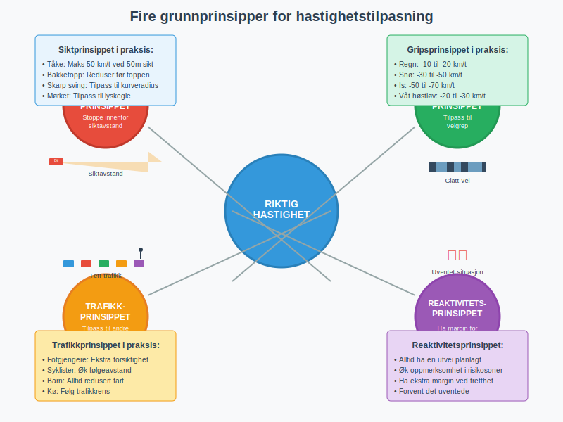
### Faktorer som krever hastighetstilpasning
Du må kontinuerlig tilpasse hastigheten til:
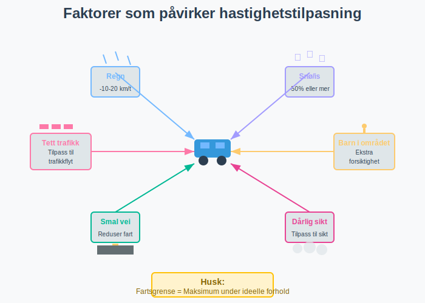
#### Værforhold
* **Regn** - reduser hastighet med 10-20 km/t
* **Snø og is** - kan kreve 50% reduksjon
* **Tåke** - hastighet tilpasset siktavstand
* **Vind** - spesielt for høye kjøretøy
#### Trafikkforhold
* **Tett trafikk** - følg trafikkrens
* **Mye fotgjengere** - ekstra forsiktighet
* **Komplekse kryss** - reduser hastighet for å kunne vurdere vikeplikt (se [Vikeplikt og rundkjøringer](/blogs/teori/vikeplikt-og-rundkjoringer "Vikeplikt og rundkjøringer - Komplett guide til høyreregelen og rundkjøringer"))
* **Syklister** - reduser hastighet ved forbikjøring
* **Barn i området** - alltid redusert hastighet
**Hastighetstilpasning til sårbare trafikanter** er en grunnleggende del av sikker kjøring. For detaljert forståelse av ulike trafikantgrupper og hvordan du skal vise hensyn til dem, se [Trafikantgrupper og hensyn](/blogs/teori/trafikantgrupper-og-hensyn "Trafikantgrupper og hensyn - Komplett guide til hensyn for alle trafikanter").
#### Veiforhold
* **Smale veier** - lavere hastighet
* **Dårlig veibanekvalitet** - tilpass til huller og skader
* **Svinger og bakketopper** - reduser hastighet
* **Arbeid på vei** - følg skiltede hastigheter
## Sikkerhetsmarginer og følgeavstand
**Riktig følgeavstand** er en av de viktigste sikkerhetsfaktorene i trafikken. Avstanden må være tilpasset hastighet, værforhold og trafikksituasjon.
### 3-sekunders regelen
Den mest praktiske metoden for å vurdere følgeavstand er **3-sekunders regelen**:
1. **Velg et fast punkt** som bilen foran passerer
2. **Tell "21, 22, 23"** eller "en tusen, to tusen, tre tusen"
3. **Hvis du passerer samme punkt** før tellingen er ferdig, er avstanden for kort
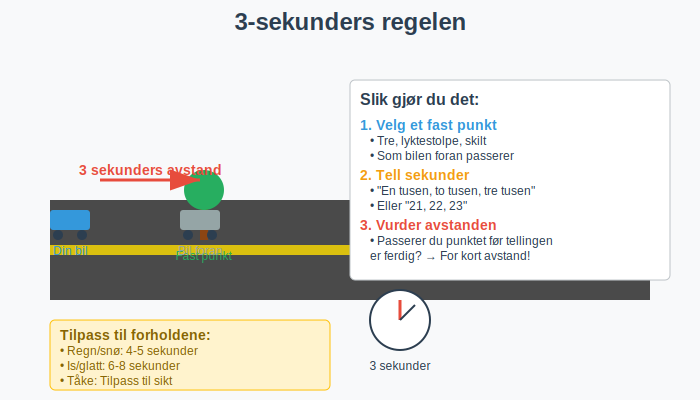
### Avanserte teknikker for følgeavstand
**Profesjonell følgeavstandsteknikk** går langt utover den enkle 3-sekunders regelen. Erfarne sjåfører bruker flere metoder for å optimalisere sikkerheten:
#### Progressiv avstands-evaluering
* **Primær sone** (0-3 sek) - kritisk faresone
* **Sekundær sone** (3-6 sek) - standard sikkerhetssone  
* **Tertiær sone** (6-12 sek) - planleggingssone for endringer
#### Dynamisk avstandsjustering
Følgeavstanden må justeres kontinuerlig basert på:
* **Hastighetsendringer** hos køretøyet foran
* **Trafikkendringer** i omkringliggende kjørefelt
* **Værforandringer** som påvirker sikt og friksjon
* **Egen oppmerksomhetstilstand** og reaksjonsevne
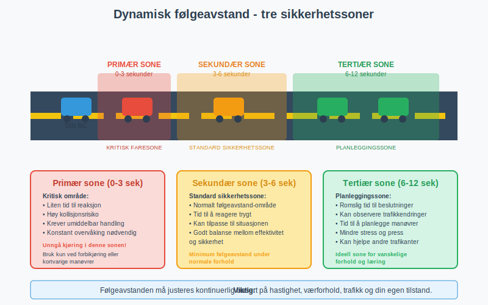
#### Multi-kjøretøy sikkerhetsvurdering
I stedet for kun å fokusere på bilen direkte foran, bør du overvåke:
* **2-3 biler fremover** - for tidlig advarsel om endringer
* **Sidekjørefeltene** - for potensielle inntrengere
* **Bakfra** - for kjøretøy som kommer for tett på
* **Fotgjengere og syklister** - som kan påvirke trafikken
### Følgeavstand i spesielle situasjoner
#### Køkjøring
* **Øk til 4-5 sekunder** selv ved lav hastighet
* **Vent med å akselerere** til du ser kjøretøyet foran bevege seg
* **Behold avstanden** selv om andre kjører inn mellom
#### Følger store kjøretøy
* **6-8 sekunders avstand** for bedre sikt
* **Ikke kjør i blindsonen** til siden eller bak
* **Vær ekstra forsiktig** ved svinger og kryss
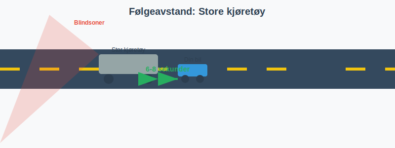
### Tilpasset følgeavstand
Under normale forhold skal følgeavstanden være **minst 3 sekunder**, men den må økes ved:
| Situasjon | Anbefalt følgeavstand | Forklaring |
|-----------|---------------------|-------------|
| **Normale forhold** | 3 sekunder | Standard sikkerhetsmargin |
| **Regn/våte veier** | 4-5 sekunder | Lengre bremseavstand |
| **Snø og is** | 6-8 sekunder | Betydelig lengre bremseavstand |
| **Tåke** | Tilpasset sikt | Ikke kjør raskere enn siktavstand |
| **Tung trafikk** | 4-5 sekunder | Mindre margin for feil |
| **Bak lastebil** | 4-6 sekunder | Dårligere sikt fremover |
### Marginprinsippet
**Marginprinsippet** handler om å alltid ha en **reserveløsning** hvis noe uventet skjer:
* **Siktmarginer** - se langt nok frem til å reagere
* **Plasseringsmarginer** - ha fluktmuligheter til siden
* **Tidsmargin** - ikke ha det travelt
* **Fartsmarginer** - kjør litt under fartsgrensen når forholdene krever det
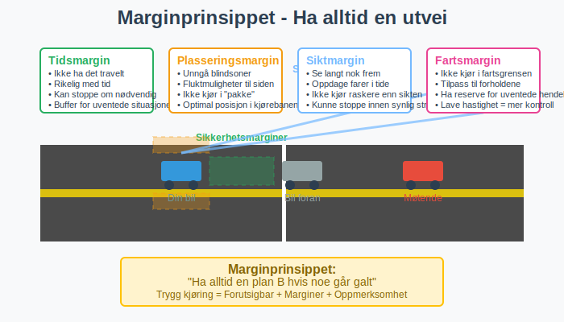
### Psykologiske aspekter ved marginprinsippet
**Mentale marginer** er like viktige som fysiske marginer. Ditt sinnssetting og mentale tilstand påvirker direkte hvor godt du klarer å opprettholde sikre marginer:
#### Stress og marginreduksjon
* **Tidspress** fører til kortere følgeavstander  
* **Aggresjon** reduserer sikkerhetsmarginene
* **Overselvsikkerhet** får deg til å undervurdere risiko
* **Tretthet** reduserer din evne til å vurdere marginer
#### Marginer som stress-buffer
Ved å ha **gode marginer** skaper du også mental ro:
* **Mindre stress** når noe uventet skjer
* **Bedre beslutningsevne** under press
* **Økt selvtillit** i krevende situasjoner
* **Redusert risiko** for aggresive reaksjoner

## Kjøretekniske prinsipper
### Forventet kjøremåte
**Forutsigbar kjøring** er trygg kjøring. Andre trafikanter skal kunne:
* **Forstå dine intensjoner** - bruk blinklys i tide
* **Beregne din hastighet** - ikke variere unødvendig
* **Stole på at du følger reglene** - overrask ikke andre
### Unngå kritiske situasjoner
Mange ulykker kan unngås ved å **identifisere risiko** i tide:
* **Spotter farlige situasjoner** tidlig
* **Reduserer hastighet** før problemet oppstår
* **Øker oppmerksomhet** i risikosoner
* **Har alltid en utvei** planlagt
Ved å identifisere risiko tidlig og ha en utvei planlagt, praktiserer du [defensiv kjøring](/blogs/teori/defensiv-kjoring "Defensiv kjøring - Proaktive sikkerhetsteknikker") som reduserer ulykksrisiko betydelig.
* **Ved ulykker:** Sørg for rask og korrekt førstehjelp; se [Førstehjelp og opptreden ved ulykker](/blogs/teori/forstehjelp-og-opptreden-ved-ulykker "Førstehjelp og opptreden ved ulykker - Din guide til nødhjelp ved trafikkulykker").
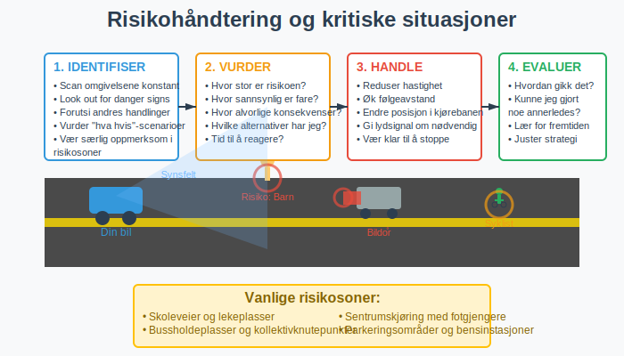
## Spesielle situasjoner
### Kjøring i mørket
**Fart og avstand** er spesielt kritisk om natten når sikt er redusert. For mer detaljerte råd om trygg nattkjøring, se [Kjøring i mørket](/blogs/teori/kjoring-i-morket "Kjøring i mørket - komplett guide til sikker nattkjøring").
### Forbikjøring
**Sikker forbikjøring** krever grundig vurdering av avstander og hastigheter:
#### Før forbikjøring:
* **Kontroller fri strekning** - minst 300-500 meter på vanlig vei
* **Vurder hastighetsforskjell** - store forskjeller krever lengre strekning
* **Sjekk for andre forbikjørende** - ikke forbikjør hvis andre holder på
#### Under forbikjøring:
* **Øk hastigheten** besluttsomt for å minimere tiden i motsatt kjørefelt
* **Hold sikker avstand** til kjøretøyet du forbikjører
* **Ikke kjør tilbake** før du ser hele kjøretøyet i speilet
For en omfattende guide til forbikjøring og feltskifte, inkludert detaljert teknikk og sikkerhetsprinsipper, se vår artikkel om [forbikjøring og feltskifte](/blogs/teori/forbikjoring-og-feltskifte "Forbikjøring og feltskifte - Komplett guide til sikker forbikjøring og feltskifte").
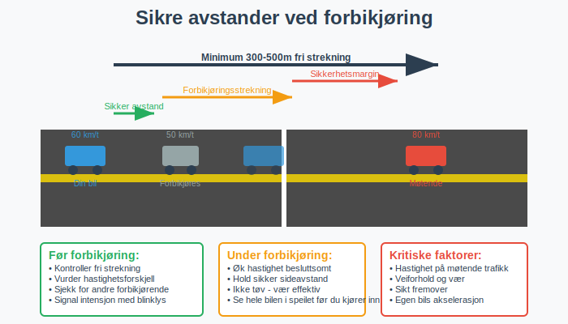
### Motorvei og hurtigkjøring
På **motorveier** gjelder spesielle prinsipper:
* **Påkjøring** - tilpass hastighet til hovedveien i akselerasjonsfeltet
* **Kjøring** - hold jevn hastighet og riktig kjørefelt
* **Avkjøring** - brems ned i retardasjonsfeltet
For mer om kjøring på motorvei og detaljerte prinsipper, se [Motorveikjøring](/blogs/teori/motorveikjoring "Motorveikjøring - Guide til kjøring på motorvei").
### Vanskelige værforhold
#### Våte veier:
* **Aquaplaning-fare** ved hastigheter over 70-80 km/t
* **Lengre bremseavstand** - kan dobles
* **Redusert grep** i svinger
#### Vinterføre:
* **Glatte veier** - kan øke bremseavstanden 5-10 ganger
* **Snø og is** - myk kjøreteknikk er avgjørende
* **Sikt** - snøfokk kan redusere sikten dramatisk
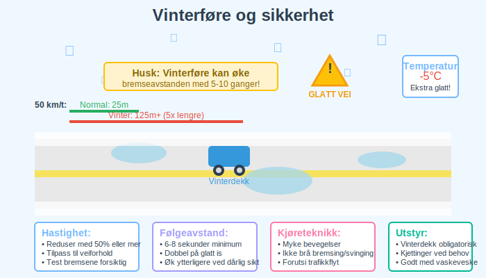
For flere råd om kjøring under krevende forhold, inkludert tilpasning av fart og avstand, se [Kjøring under vanskelige forhold](/blogs/teori/kjoring-under-vanskelige-forhold "Kjøring under vanskelige forhold - Comprehensive guide to challenging driving conditions").
Ved kjøring med tilhenger må følgeavstand økes ytterligere på grunn av økt bremselengde og redusert manøvrerbarhet. Se [Kjøring med tilhenger](/blogs/teori/kjoring-med-tilhenger "Kjøring med tilhenger - Guide til sikker tilhengerkjøring") for spesielle regler og teknikker.
For mer om konsekvenser av tung last i bil eller tilhenger, se [Tung last - konsekvenser](/blogs/teori/tung-last-konsekvenser "Tung last - konsekvenser for kjøreegenskaper, bremselengde og blendingsfare").
## Teknologi og sikkerhetssystemer
Moderne biler har mange **teknologiske hjelpemidler** som påvirker fart og avstand:
### Aktive sikkerhetssystemer
Moderne [sikkerhetsutstyr](/blogs/teori/kjoretoyets-sikkerhetsutstyr "Kjøretøyets sikkerhetsutstyr - Komplett guide til aktivt og passivt sikkerhetsutstyr") påvirker fart og avstand betydelig:
* **ABS** (antiskrens) - forhindrer hjullåsing ved bremsing
* **ESP** (elektronisk stabilitetsprogram) - forhindrer ufrivillig spinn
* **ACC** (adaptiv fartsholder) - tilpasser automatisk følgeavstand
* **Kollisjonsvarsling** - varsler ved kritisk kort avstand
* **Automatisk nødbremsing** - kan stoppe bilen automatisk
### Begrensninger ved teknologi
Det er viktig å forstå at teknologi har **begrensninger**:
* **Kan ikke erstatte** god kjøreteknikk
* **Fungerer ikke optimalt** under alle forhold
* **Krever forståelse** av hvordan systemene virker
* **Kan gi falsk trygghet** hvis man stoler for mye på dem
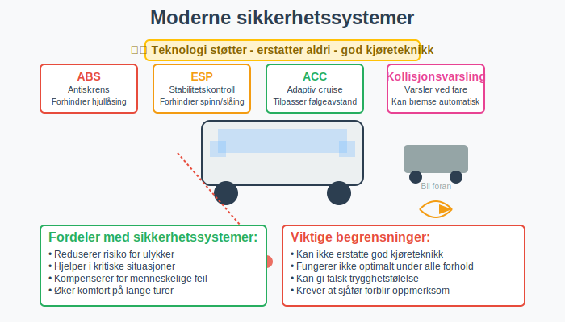
## Praktiske øvelser og ferdighetstrening
### Systematisk avstandstrening
**Praktisk trening** er avgjørende for å utvikle intuitive ferdigheter innen fart og avstand. Her er en progressiv treningsplan:
#### Fase 1: Grunnleggende avstandsvurdering
1. **Statisk måling** - måle avstander når bilen står stille  
   * Bruk båndmål for å verifisere estimater
   * Lær å kjenne bilens lengde som referanse (ca. 4-5 meter)
   * Øv på å estimere 25, 50, 100 meter avstander
2. **3-sekunders regeltrening** - øv daglig i trafikken
   * Tell høyt de første ukene for å lære rytmen
   * Bruk forskjellige telleteknikker
   * Kontroller med klokke/stoppeklokke
3. **Referansepunkt-trening** - lær å bruke faste punkter
   * Veiskilt, stolper, bygninger som målestokk
   * Øv på forskjellige hastigheter
   * Test under ulike værforhold
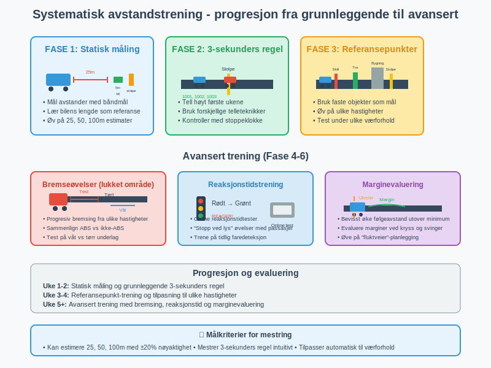
#### Fase 2: Dynamisk hastighetskontroll
1. **Sikker bremseøvelser** - på trygg plass/øvelsesplass
   * Progresiv bremsing fra forskjellige hastigheter
   * Sammenlign ABS vs ikke-ABS oppførsel  
   * Test bremseavstand på våt vs tørr underlag
   * *Kun under instruksjon eller på lukket område*
2. **Reaksjonstidstrening**
   * Online reaksjonstidtester
   * "Stopp når lyset endrer seg" øvelser med passenger
   * Trene på å oppdage faresignaler tidlig
3. **Marginevaluering**
   * Bevisst øke følgeavstand utover minimum
   * Evaluere marginer ved kryss og svinger
   * Øve på "escape route" planlegging
### Øvelser for spesielle situasjoner
#### Værforholdsimulering
* **Regnværsøvelser** - kjør bevisst i regn for å føle forskjellen
* **Vintertrening** - øv på snø/is under kontrollerte forhold
* **Tåkenavigasjon** - tren på redusert sikt med ekstra forsiktighet
#### Trafikkscenario-trening
* **Køsituasjoner** - øv på optimal følgeavstand i kø
* **Motorveitrening** - høyhastighets-marginer og feltskifte
* **Bytrafikk** - komplekse situasjoner med mange trafikanter
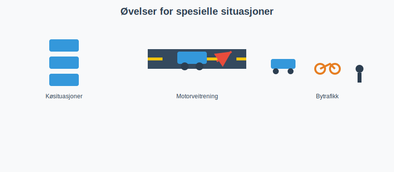
### Vanlige feil å unngå
* **For kort følgeavstand** - den vanligste feilen nye sjåfører gjør
* **Ikke tilpasse hastighet** til forhold
* **Overvurdere bilens** og egne evner
* **Glemme marginprinsippet** - alltid ha en utvei
### Forberedelse til teoriprøven
For å mestre **spørsmål om fart og avstand** på teoriprøven:
* **Lær formler** for reaksjons- og bremseavstand
* **Forstå sammenhengen** mellom hastighet og stoppeavstand
* **Husk påvirkningsfaktorer** som øker avstander
* **Øv på praktiske situasjoner** - når skal hastigheten reduseres?
## Sammendrag
**Fart og avstand** handler om å forstå de fysiske lovene som styrer bil-kjøring og bruke denne kunnskapen til å kjøre trygt. De viktigste punktene å huske:
* **Stoppeavstand** øker dramatisk med hastigheten
* **Reaksjonstid** påvirkes av mange faktorer
* **Følgeavstand** må tilpasses forhold og hastighet
* **Hastighetstilpasning** er mer enn å følge fartsgrensen
* **Marginprinsippet** gir trygghet i kritiske situasjoner
Disse prinsippene er grunnleggende for [defensiv kjøring](/blogs/teori/defensiv-kjoring "Defensiv kjøring - Prinsipper og teknikker"), som kombinerer alle disse elementene i en helhetlig sikkerhetstilnærming.
Ved å mestre disse prinsippene blir du ikke bare en tryggere sjåfør, men også godt forberedt til både teoriprøve og praktisk kjøring. Husk at **erfaring kommer med øvelse** - fortsett å bevisst tenke på fart og avstand hver gang du kjører.
For mer informasjon om relaterte temaer, se våre artikler om [plassering og kjøremåte](/blogs/teori/plassering-og-kjoremmate "Plassering og kjøremåte - Guide til riktig kjøreteknikk") og [miljøvennlig kjøring](/blogs/teori/miljovennlig-kjoring "Miljøvennlig kjøring - Teknikker for bærekraftig kjøring").
For mer informasjon om forbikjøring og feltskifte, se [Forbikjøring og feltskifte](/blogs/teori/forbikjoring-og-feltskifte "Forbikjøring og feltskifte - Komplett guide til sikker forbikjøring og feltskifte").