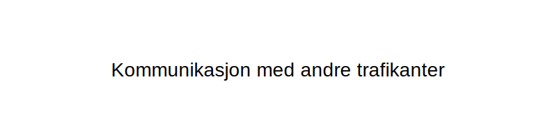
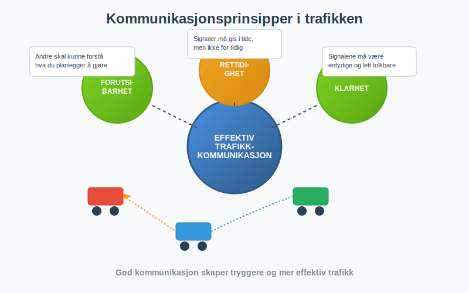
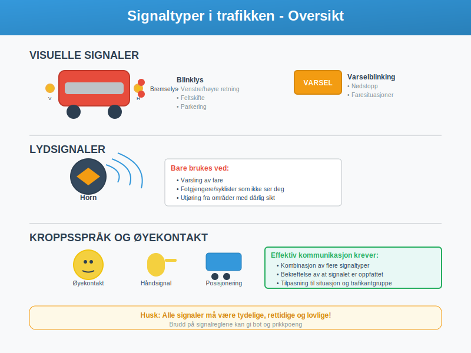
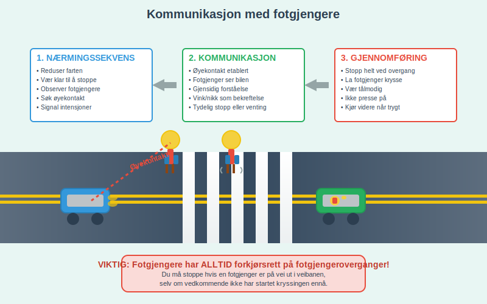
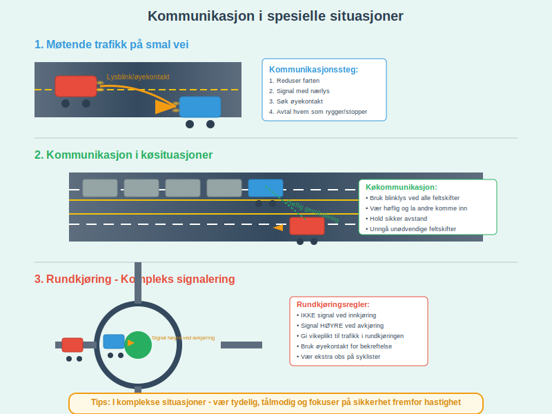
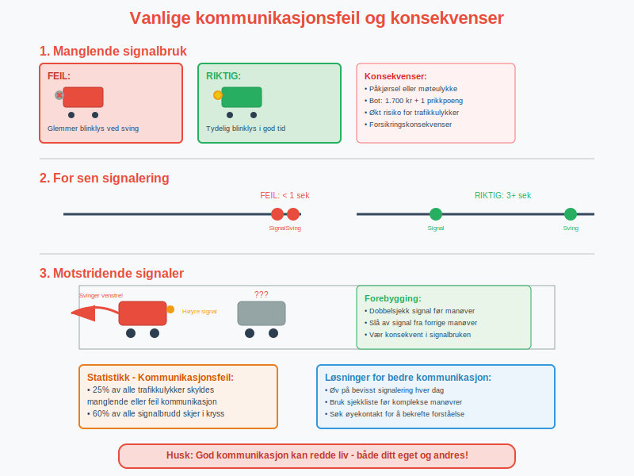
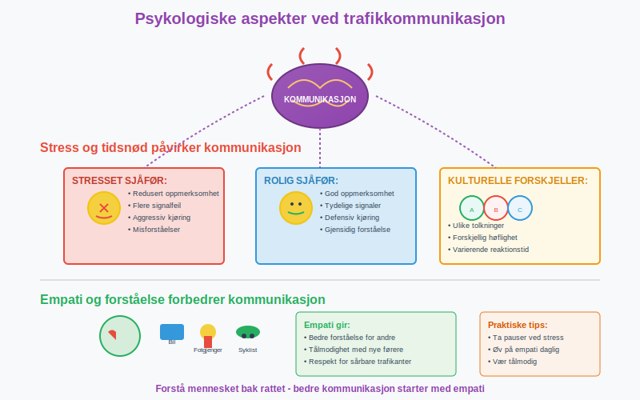
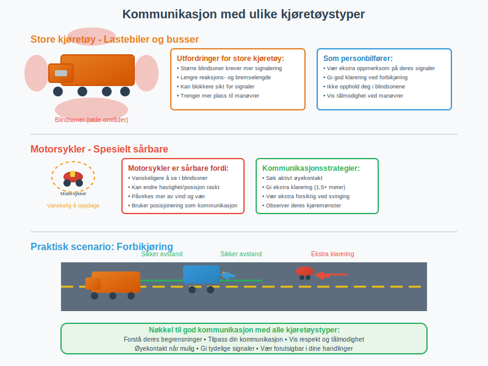

Effektiv **kommunikasjon** med andre trafikanter er fundamentet for trygg kjøring og smidig trafikkflyt. Som bilfører må du mestre både å sende klare signaler og tolke andres intensjoner korrekt.
I denne omfattende artikkelen lærer du alt om **trafikkommunikasjon**, fra grunnleggende signaler til avanserte kommunikasjonsstrategier i komplekse trafikksituasjoner.
*For en helhetlig guide til samhandling i trafikken, se [Samhandling i trafikken](/blogs/teori/samhandling-i-trafikken "Samhandling i trafikken - Tegn, signal, fart og plassering").*
For å forstå de menneskelige faktorene som påvirker kommunikasjon og samhandling, se også [Mennesket i trafikken](/blogs/teori/mennesket-i-trafikken "Mennesket i trafikken - Faktorer som påvirker kjøring").
*For informasjon om forskjellen mellom **trafikksignaler** og **trafikkskilt**, se [Signal vs tegn i trafikken](/blogs/teori/signal-vs-tegn-i-trafikken "Signal vs tegn i trafikken - Når brukes hva?").*

## Grunnprinsippene for trafikkommunikasjon
**Kommunikasjon i trafikken** handler om å gi og motta informasjon om intensjoner, posisjoner og bevegelser. Ifølge [Lover og forskrifter](/blogs/teori/lover-og-forskrifter "Lover og forskrifter - Trafikkregler og krav") er det lovpålagt å signalisere før manøvrer som påvirker andre trafikanter.
### De tre hovedprinsippene:
* **Forutsigbarhet** - Andre skal kunne forstå hva du planlegger å gjøre
* **Rettidighet** - Signaler må gis i tide, men ikke for tidlig
* **Klarhet** - Signalene må være entydige og lett tolkbare

## Kommunikasjonskanaler og signaltyper
### Visuelle signaler
| Signaltype | Beskrivelse | Bruksområde | Lovkrav |
|------------|-------------|-------------|----------|
| **Blinklys** | Lysbaserte retningsindikatorer | [Svinging](/blogs/teori/forbikjoring-og-feltskifte "Forbikjøring og feltskifte"), feltskifte, [parkering](/blogs/teori/rygging-og-parkering "Rygging og parkering") | Påbudt |
| **Varselblinking** | Alle fire blinklys samtidig | Nødstopp, faresituasjoner | Påbudt ved stopp på [motorvei](/blogs/teori/motorveikjoring "Motorveikjøring") |
| **Bremselys** | Røde lys som lyser ved bremsing | Varsle nedbremsing | Automatisk |
| **Ryggelys** | Hvite lys som lyser ved rygging | Varsle [rygging](/blogs/teori/rygging-og-parkering "Rygging og parkering") | Automatisk |
| **Kjørelys/nærlys** | Frontsignaler for synlighet | [Mørkekjøring](/blogs/teori/kjoring-i-morket "Kjøring i mørket"), [dårlige forhold](/blogs/teori/kjoring-under-vanskelige-forhold "Kjøring under vanskelige forhold") | Påbudt |
For utdypende informasjon om korrekt **bruk av lys og signaler**, se [Bruk av lys og signaler](/blogs/teori/bruk-av-lys-og-signaler "Bruk av lys og signaler - Komplett guide til lysbruk og signalisering").
### Lydbaserte signaler
**Hornsignaler** skal bare brukes for å varsle fare eller i nødvendige situasjoner:
* Varsling av fotgjengere eller syklister som ikke har oppdaget deg
* Faresituasjoner hvor andre signaler ikke er tilstrekkelige
* Ved utjøring fra områder med dårlig sikt
*Merk: Unngå horn i boligområder og på kveldstid med mindre det er nødvendig for sikkerhet.*

## Kommunikasjon med ulike trafikantgrupper
### Kommunikasjon med andre bilførere
**Ved feltskifte:**
1. Sjekk speil og blindsone
2. Signal med blinklys minimum 3 sekunder før manøver
3. Bekreft at andre har sett signalet gjennom deres reaksjon
4. Utfør manøveren rolig og kontrollert
**I rundkjøringer:**
- Signal høyre ved avkjøring fra rundkjøringen
- Ikke signal ved innkjøring eller fortsatt kjøring
- Les mer i [Vikeplikt og rundkjøringer](/blogs/teori/vikeplikt-og-rundkjoringer "Vikeplikt og rundkjøringer")
### Kommunikasjon med syklister
**Syklister** er spesielt sårbare trafikanter som krever ekstra oppmerksomhet:
* **Øyekontakt** er avgjørende - sørg for at syklisten har sett deg
* **Gi god klarering** - minimum 1,5 meter sideavstand ved forbikjøring
* **Signaler tidlig** - syklister trenger mer tid til å reagere enn biler
* **Vær tålmodig** - vent til det er trygt å passere
Les mer om hensyn til ulike trafikantgrupper i [Trafikantgrupper og hensyn](/blogs/teori/trafikantgrupper-og-hensyn "Trafikantgrupper og hensyn").
### Kommunikasjon med fotgjengere
**Fotgjengere** har alltid forkjørsrett på fotgjengeroverganger:
* **Reduser farten** når du nærmer deg fotgjengeroverganger
* **Øyekontakt** bekrefter gjensidig oppmerksomhet
* **Stopp helt** hvis fotgjenger er på vei ut i veibanen
* **Vink eller nikk** kan brukes for å signalisere at de kan krysse

## Avanserte kommunikasjonsstrategier
### Kommunikasjon gjennom kjøremønster
**Posisjonering i kjørefeltet** kommuniserer intensjoner:
* **Venstre i feltet** - forbereder venstresving eller vil forhindre forbikjøring
* **Høyre i feltet** - forbereder høyresving eller gir plass for forbikjøring
* **Senter av feltet** - fortsetter rett frem
**Fartstilpasning** som kommunikasjon:
* **Redusert fart** - signaliserer usikkerhet eller forberedelse til manøver
* **Jevn fart** - forutsigbar kjøring som andre kan tilpasse seg til
* **Akselerasjon** - kan signalisere intensjon om forbikjøring
Les mer om riktig [Plassering og kjøremåte](/blogs/teori/plassering-og-kjoremmate "Plassering og kjøremåte").
### Kommunikasjon i spesielle situasjoner
**Ved møtende trafikk på smale veier:**
1. Reduser farten og signal med nærlys
2. Søk øyekontakt med motkommende
3. Vurder hvem som skal stoppe/rygge basert på forholdene
4. Bruk eventuelt håndsignal for å dirigere trafikken
**I køsituasjoner:**
* Hold sikker avstand til forankjørende
* Unngå unødvendige feltskifter
* Vær høflig og la andre komme inn i køen
* Bruk blinklys ved alle feltskifter, selv i lav fart

## Teknologi og moderne kommunikasjon
### Elektroniske kjøreassistentsystemer
Moderne biler har flere systemer som kommuniserer med andre trafikanter:
| System | Funksjon | Kommunikasjonseffekt |
|--------|----------|---------------------|
| **Adaptiv cruise control** | Automatisk avstandsregulering | Jevnere trafikkflyt |
| **Blindsonevarsling** | Varsler om kjøretøy i blindsonen | Tryggere feltskifter |
| **Automatisk nødbremsing** | Stopper bilen ved fare | Reduserer påkjørsler bakfra |
| **Parkeringsassistent** | Hjelper med parkering | Mindre stress ved [parkering](/blogs/teori/rygging-og-parkering "Rygging og parkering") |
### Fremtidens kommunikasjonsteknologi
**V2V-kommunikasjon** (Vehicle-to-Vehicle) og **V2I-kommunikasjon** (Vehicle-to-Infrastructure) vil revolusjonere trafikkommunikasjon:
* Biler kan kommunisere direkte med hverandre
* Trafikklys og skilt kan sende informasjon til kjøretøyet
* Bedre koordinering av trafikkflyt
* Tidligere varsling av farer og hendelser
## Vanlige kommunikasjonsfeil og konsekvenser
### Kritiske feil som ofte fører til ulykker:
| Feiltype | Eksempel | Konsekvens | Forebygging |
|----------|----------|------------|-------------|
| **Manglende signalbruk** | Glemmer blinklys ved sving | Påkjørsel eller møteulykke | Rutine og bevissthet |
| **For sen signalering** | Blinker rett før sving | Andre får ikke tid til å reagere | Signal 3+ sekunder før |
| **Motstridende signaler** | Blinker høyre men svinger venstre | Forvirring og feilbedømmelse | Dobbelsjekk før signalering |
| **Feilaktig signaltolkning** | Tror blinklys gjelder en selv | Kollisjoner i kryss | Bekreft med øyekontakt |
| **Unødvendig horning** | Bruker horn i frustrasjon | Økt aggresjon og stress | Bruk kun horn ved fare |

### Særlig risikable situasjoner:
* **Rundkjøringer** - kompleks signalering og mange aktører
* **Fotgjengeroverganger** - forskjellige hastigheter og reaksjonstider
* **Motorveiavkjøringer** - høy fart og kort tid til beslutninger
* **Køer og langsom trafikk** - utålmodighet og risikable manøvrer
## Vær- og lysforhold påvirker kommunikasjon
### Utfordringer ved dårlige forhold:
**Regn og tåke** ([Kjøring under vanskelige forhold](/blogs/teori/kjoring-under-vanskelige-forhold "Kjøring under vanskelige forhold")):
* Redusert sikt gjør signaler mindre synlige
* Øk bruk av lys og signaler
* Øk avstand til andre trafikanter
* Vær ekstra tydelig med signalering
**Snø og is:**
* Forhindrede signallykter må renses
* Lengre bremselengde påvirker kommunikasjonstiming
* Ekstrem forsiktighet ved alle manøvrer
**Mørke** ([Kjøring i mørket](/blogs/teori/kjoring-i-morket "Kjøring i mørket")):
* Lysignaler blir mer kritiske
* Vanskeligere å se øyekontakt og kroppsspråk
* Refleksklær på fotgjengere og syklister
## Psykologiske aspekter ved trafikkommunikasjon
### Stressrespons og kommunikasjon
**Stress og tidsnød** påvirker kommunikasjonsevnen negativt:
* Redusert oppmerksomhet på signaler fra andre
* Flere feil i egen signalgiving
* Økt risiko for aggressiv kjøring
* Misforståelser og konflikter
Les mer i [Psykologiske feller i trafikken](/blogs/teori/psykologiske-feller-i-trafikken "Psykologiske feller i trafikken").
### Kulturelle forskjeller
**Ulike kjørekulturer** kan skape misforståelser:
* Hva som regnes som høflig varierer
* Signalbruk kan tolkes forskjellig
* Forventninger til reaktionstid
* Viktigheten av øyekontakt
### Empati og forståelse
**God trafikkommunikasjon** krever:
* Forståelse for andre trafikantgrupper sine behov
* Tålmodighet med mindre erfarne førere
* Respekt for sårbare trafikanter
* Evne til å se situasjonen fra andres perspektiv

## Lovverk og ansvar
### Juridisk ansvar ved kommunikasjon
Ifølge **vegtrafikkloven** har du ansvar for:
* Å signalisere før alle manøvrer som påvirker andre
* Å forsikre deg om at signaler er oppfattet
* Å ikke gi villedende eller forvirrende signaler
* Å være ekstra aktsom overfor [sårbare trafikanter](/blogs/teori/trafikantgrupper-og-hensyn "Trafikantgrupper og hensyn")
### Sanksjoner ved brudd:
| Brudd | Bot | Prikkpoeng | Tilleggsmerknad |
|-------|-----|------------|-----------------|
| Manglende bruk av blinklys | 1.700 kr | 1 | Ved svinging/feltskifte |
| Unødvendig horning | 1.700 kr | 0 | Særlig i boligområder |
| Villedende signaler | 3.400 kr | 2 | Hvis det skaper farlige situasjoner |
## Praktiske øvelser for bedre kommunikasjon
### Daglige øvelser:
1. **Bevisst signalering** - tenk høyt når du signaliserer
2. **Øyekontakt-trening** - søk aktivt øyekontakt med andre trafikanter
3. **Speilkontroll** - sjekk at andre har oppfattet dine signaler
4. **Signaltolkning** - analyser andre trafikantenes intensjoner
*For en grundig oversikt over trafikantene og deres egenskaper, se [Trafikantene](/blogs/teori/trafikantene "Trafikantene – Oversikt over trafikanttyper og fri vei").*
### Sjekkliste før komplekse manøvrer:
* [ ] Er signallysene rene og fungerende?
* [ ] Har jeg sjekket blindsoner?
* [ ] Er signalet gitt i tide?
* [ ] Har andre trafikanter oppfattet signalet?
* [ ] Er det trygt å gjennomføre manøveren?
## Kommunikasjon ved spesielle kjøretøystyper
### Kommunikasjon med store kjøretøy
**Lastebiler og busser** har spesielle utfordringer:
* Større blindsoner krever mer signalering
* Lengre reaksjons- og bremselengde
* Kan blokkere sikt for signaler
* Trenger mer plass til manøvrer
**Som personbilfører** skal du:
* Være ekstra oppmerksom på deres signaler
* Gi god klarering ved forbikjøring
* Ikke oppholde deg i blindsonene deres
* Vise tålmodighet ved manøvrer som krever tid
* For tips om å gi plass til store kjøretøy, se [Store kjøretøy i trafikken (Gi plass)](/blogs/teori/store-kjoretoy-gi-plass "Store kjøretøy i trafikken (Gi plass) - Gi plass til store kjøretøy").
### Kommunikasjon med motorsykler
**Motorsyklister** er spesielt sårbare:
* Vanskeligere å se, særlig i blindsoner
* Kan endre hastighet og posisjon raskt
* Påvirkes mer av vind og værforhold
* Bruker ofte positioning som kommunikasjon

## Digitale hjelpemidler og apper
### Moderne kommunikasjonsverktøy:
**Navigasjonsapper** kan forbedre kommunikasjon ved:
* Gi tidlig varsel om manøvrer
* Redusere usikkerhet om rute
* Hjelpe med optimal kjøremønster
* Dele informasjon om trafikkforhold
**Dashcam og bakkeovervåkning:**
* Hjelper med dokumentasjon av kommunikasjon
* Kan avsløre egne kommunikasjonsfeil
* Øker bevissthet om egen kjørestil
## Maintenance og kontroll av kommunikasjonsutstyr
### Regelmessig kontroll:
**Lyskontroll** (månedlig):
* Alle blinklys virker
* Bremselys fungerer
* Kjørelys/nærlys er rene
* Ingen sprekker i lysene
**Hornet** (ved service):
* Klar og kraftig lyd
* Reagerer umiddelbart ved trykk
* Ikke for skarp eller irriterende
### Vintervedlikehold:
* Rengjør signallys for snø og is
* Kontroller at rim ikke blokkerer lys
* Sjekk at batteriet tåler kulde (påvirker lysstyrke)
* Ha reservepærer tilgjengelig
Les mer om generelt vedlikehold i [Vedlikehold av bilen](/blogs/teori/vedlikehold-av-bilen "Vedlikehold av bilen").
## Kommunikasjon og miljøvennlig kjøring
**Effektiv kommunikasjon** støtter også [miljøvennlig kjøring](/blogs/teori/miljovennlig-kjoring "Miljøvennlig kjøring"):
* Jevnere trafikkflyt reduserer drivstofforbruk
* Færre unødvendige stopp og starter
* Bedre koordinering i køer
* Mindre stress reduserer aggressiv akselerasjon
### Kommunikasjon for øko-kjøring:
* Signal tidlig for å la andre planlegge
* Koordiner med andre for jevn hastighet
* Bruk motor-bremsing som signal til bakførende
* Del kjørefelt effektivt for optimal flyt
## Sammendrag og viktige prinsipper
**Effektiv trafikkommunikasjon** baserer seg på:
### De fem grunnpilarene:
1. **Forutsigbarhet** - andre skal kunne forstå dine intensjoner
2. **Rettidighet** - signal på riktig tidspunkt
3. **Klarhet** - entydige og tydelige signaler
4. **Respekt** - hensyn til alle trafikantgrupper
5. **Kontinuerlig læring** - tilpass kommunikasjonen til erfaring
### Huskeliste for god kommunikasjon:
* **Se** - observer andre trafikanter kontinuerlig
* **Signal** - gi tydelige og retttidige signaler
* **Sikre** - bekreft at signaler er oppfattet
* **Samhandle** - vis hensyn og respekt
* **Støtte** - bidra til positiv trafikkkultur
God **kommunikasjon med andre trafikanter** er ikke bare et lovkrav, men fundamentet for trygg og effektiv trafikk. Gjennom bevisst praksis og kontinuerlig forbedring kan alle bidra til sikrere veier for alle.
## Relaterte emner
* [Bruk av lys og signaler](/blogs/teori/bruk-av-lys-og-signaler "Bruk av lys og signaler - Praktisk guide til lysbruk og signalering")
* [Oppmerksomhet og samhandling](/blogs/teori/oppmerksomhet-og-samhandling "Oppmerksomhet og samhandling - Fokus og samarbeid i trafikken")
* [Trafikantgrupper og hensyn](/blogs/teori/trafikantgrupper-og-hensyn "Trafikantgrupper og hensyn - Oversikt over trafikantgrupper og viktige hensyn")
* [Defensiv kjøring](/blogs/teori/defensiv-kjoring "Defensiv kjøring - Prinsipper og teknikker for trygg kjøring")
* [Rygging og parkering](/blogs/teori/rygging-og-parkering "Rygging og parkering - Komplett guide til kommunikasjon ved manøvrering")
* [Forbikjøring og feltskifte](/blogs/teori/forbikjoring-og-feltskifte "Forbikjøring og feltskifte - Teknikker og regler for trygg forbikjøring")
* [Psykologiske feller i trafikken](/blogs/teori/psykologiske-feller-i-trafikken "Psykologiske feller i trafikken - Unngå mentale feller og forbedre kjøringen")