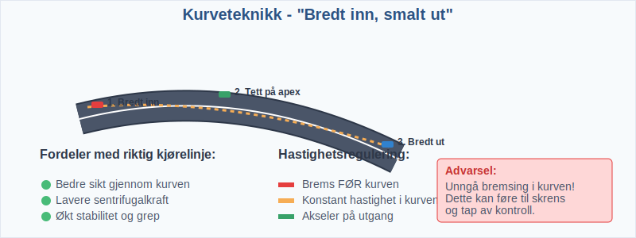
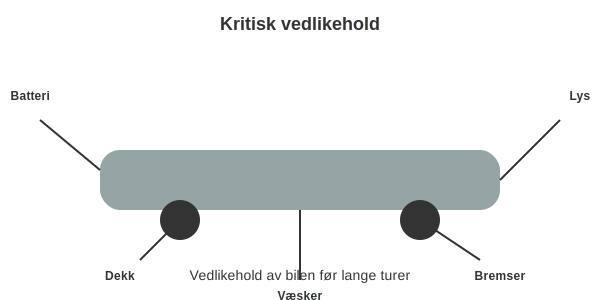

**Landeveiskjøring** er en av de mest krevende og komplekse formene for **kjøring på norske veier**. Dette omfatter kjøring på alle typer veier utenfor byer og tettsteder, fra smale kommunale veier til moderne stamveier. I denne omfattende guiden får du dyptgående kunnskap om alle aspekter ved **sikker landeveiskjøring**.
*For optimalisering av drivstofforbruk og miljøvennlig kjøring på landevei, se [Miljøvennlig kjøring](/blogs/teori/miljovennlig-kjoring "Miljøvennlig kjøring - Teknikker for bærekraftig kjøring").*
*For mer om kjøring og miljø, se [Kjøring og miljø](/blogs/teori/kjoring-og-miljo "Kjøring og miljø - Miljøhensyn og kjøreteknikker").*
*For omfattende forberedelser før langdistansekjøring, se [Forberedelser før en lang kjøretur](/blogs/teori/forberedelser-for-en-lang-kjoretur "Forberedelser før en lang kjøretur - Slik forbereder du deg før en lang tur").*
*For kjøring på motorvei, se [Motorveikjøring](/blogs/teori/motorveikjoring "Motorveikjøring - Guide til kjøring på norsk motorvei").*
*For forebygging av frontkollisjoner og møteulykker på landeveier, se [Møteulykker og forebygging](/blogs/teori/moteulykker-og-forebygging "Møteulykker og forebygging - Forebygging av frontkollisjoner i trafikken").*
For en oversikt over gjeldende lover og forskrifter, se [Lover og forskrifter](/blogs/teori/lover-og-forskrifter "Lover og forskrifter - Oversikt over norske trafikklover og forskrifter").
## Kjøring i utlandet

Når du skal kjøre bil **utenfor Norge**, må du være oppmerksom på **regler**, **skilting** og **forsikring** som kan variere mellom land. Følgende punkter er spesielt viktige:
* **Førerkort og lovverk**: Ditt norske førerkort er gyldig i EU/EØS samt flere andre land.
* **Forsikring**: Sjekk at trafikkforsikringen dekker utlandsbruk hos ditt forsikringsselskap.
* **Trafikkregler**: Fartsgrenser, skilt og vikepliktsregler kan avvike fra norske regler. Se [Trafikkregler og veimerking](/blogs/teori/trafikkskilt-og-veimerking "Trafikkregler og veimerking - Internasjonale forskjeller og oversikt").
* **Utstyrskrav**: Refleksvest, varseltrekant, [førstehjelpsutstyr](/blogs/teori/forstehjelp-og-opptreden-ved-ulykker "Førstehjelp og opptreden ved ulykker - Din guide til nødhjelp ved trafikkulykker") og eventuelle krav til vinterdekk/kjettinger.
## Planoverganger på landevei

Planoverganger i landeveistrøk innebærer en ekstra **risiko**. Kort oppsummert:
| Situasjon                 | Handling                               | Regelverk                |
|---------------------------|----------------------------------------|--------------------------|
| Røde lys/slukket bom      | *Stans* foran eller rett etter bom     | Vikeplikt mot tog         |
| Åpne bommer, fri sikt     | Kjør forsiktig over, senk hastighet    | Vikeplikt mot tog         |
| Manglende varsling        | Kjør ekstra forsiktig, bruk observasjon| Ingen elektrisk varsling |
For mer detaljert veiledning om planoverganger, se [Landeveiskjøring](/blogs/teori/landeveiskjoring "Landeveiskjøring - Planovergang, tunnel, motorvei og mer").
## Kjøring i tunnel

Kjøring i tunnel krever spesiell oppmerksomhet på **lys**, **sikt** og **sikkerhetsutstyr**:
* **Lysbruk**: Skift fra fjernlys til nærlys ved tunnelportal.
* **Sikt**: Redusert sikt og tilpasning av hastighet.
* **Ventilasjon**: Unngå motorstans i tunnel.
* **Nødutganger**: Kjenn plassering av nødtelefoner og gangveier.
Se også [Bruk av lys og signaler](/blogs/teori/bruk-av-lys-og-signaler "Bruk av lys og signaler - Nærlys, fjernlys og tåkelys").
## Mørkekjøring

Mørkekjøring på landevei krever både **utstyr** og **teknikk** for å redusere risiko:
* **Fjernlys**: Bruk så mye som mulig, men senk ved møte.
* **Hastighetstilpasning**: Kjør saktere enn vanlig dagslys.
* **Reflekser og markeringer**: Følg veioppmerking nøye.
* **Trøtthet**: Ta hyppige pauser, mørkekjøring er mer slitsomt.
For en full guide til nattkjøring, se [Kjøring i mørket](/blogs/teori/kjoring-i-morket "Kjøring i mørket - Komplett guide til trygg nattkjøring").
## Forkjørsvei

Å kjøre på forkjørsveier på landevei gir **prioritet** men krever fortsatt **oppmerksomhet**:
* **Forkjørsveiskilt**: Gult omvendt triangel skilt.
* **Innkjøring til forkjørsvei**: Gi vikeplikt ved innkjøring, ingen skilting ved avkjøring.
* **Kryssing**: Vær oppmerksom på sideveier uten vikepliktskilt.
Les mer om regler for forkjørsvei i [Vikeplikt og rundkjøringer](/blogs/teori/vikeplikt-og-rundkjoringer "Vikeplikt og rundkjøringer - Forkjørsregler på landet").
## Motorvei

Selv om motorvei ikke er en tradisjonell landevei, er deler av stamveinettet oppgradert til motorvei:
* **Adskilte kjøreretninger** og ingen kryss på samme plan.
* **Høyere fartsgrenser** (100–110 km/t) og strenge krav til kjøretøy.
* **Kun motorvogner** tillatt.
For detaljer, se [Motorveikjøring](/blogs/teori/motorveikjoring "Motorveikjøring - Guide til sikker kjøring på norsk motorvei") og [Motorvei vs motortrafikkvei](/blogs/teori/motorvei-vs-motortrafikkvei "Motorvei vs motortrafikkvei - Forskjeller, fartsgrenser og skilt").
## Hva er landeveiskjøring?

**Landeveiskjøring** omfatter all kjøring på veier som ligger utenfor byer, tettsteder og motorveier. Dette inkluderer:
* **Kommunale veier** - Smale, lokale veier med lav standard
* **Fylkesveier** - Regionale forbindelsesveier med varierende standard
* **Riksveier** - Nasjonale hovedveier med høyere standard
* **Stamveier** - Moderne landeveier med høy standard og få kryss
Landeveiskjøring krever spesielt fokus på **hastighetstilpasning**, **avstandsholdning**, **sikt**, **forbikjøringsteknikk** og **risikovurdering**. Kjøreforholdene varierer enormt - fra smale grusveier til moderne stamveier med **midtdeler** og **kollisjonsputer**.
For grunnleggende kjøreteknikk og posisjonering, se [Plassering og kjøremåte](/blogs/teori/plassering-og-kjoremmate "Plassering og kjøremåte - Komplett guide til plassering og kjøremåte").
## Veistandard og fartsgrenser

### Klassifisering av landeveier
Norske landeveier klassifiseres etter **standard**, **trafikkmengde** og **funksjon**:
| Veitype | Fartsgrense | Standard | Særtrekk |
|---------|-------------|----------|----------|
| **Kommunal vei** | 50-80 km/t | Varierende | Lokal tilknytning, ofte smal |
| **Fylkesvei** | 60-80 km/t | Middels | Regional forbindelse |
| **Riksvei** | 80 km/t | Høy | Nasjonal hovedvei |
| **Stamvei** | 90 km/t | Meget høy | Få kryss, høy standard |
| **Motortrafikkvei** | 90 km/t | Motorveistandard | Adskilt, kryss på få steder |
| **Motorvei** | 100-110 km/t | Høyest | Se [Motorveikjøring](/blogs/teori/motorveikjoring "Motorveikjøring - Guide til kjøring på motorvei") |
### Fartsgrenseregulering
**Fartsgrenser** på landevei kan variere basert på:
* **Veigeometri** - Svinger, stigning, sikt
* **Trafikksikkerhet** - Ulykkeshistorikk, risikofaktorer
* **Omgivelser** - Bebyggelse, skoler, dyretråkk
* **Sesongvariasjon** - Vinterdrift, værforhold
Husk at fartsgrensen er **maksimalhastighet** under optimale forhold. Du skal alltid tilpasse hastigheten etter **sikt**, **veiforhold** og **trafikksituasjon**.
## Hastighetstilpasning og sikt

### Grunnprinsipper for hastighetstilpasning
Riktig **hastighetstilpasning** er det viktigste sikkerhetstiltaket på landevei:
* **Siktregel**: Du må kunne stoppe innenfor **oversiktlig strekning**
* **Veiforhold**: Tilpass hastighet til **dekke**, **veistandard** og **kurvatur**
* **Værforhold**: Reduser hastighet ved **regn**, **snø**, **is** og **tåke**
* **Trafikksituasjon**: Hensyn til **tungtrafikk**, **syklister** og **fotgjengere**
### Siktforhold og sikkerhet
God **sikt** er avgjørende for sikker landeveiskjøring:
| Siktforhold | Anbefalt hastighet | Tiltak |
|-------------|-------------------|--------|
| **Fri sikt** | Fartsgrense | Optimal kjørehastighet |
| **Begrenset sikt** | 60-70 km/t | Økt årvåkenhet |
| **Dårlig sikt** | 40-50 km/t | Bruk av tåkelys |
| **Meget dårlig sikt** | Under 30 km/t | Vurder stopp |
### Bremseavstand og reaksjonstid
**Stoppsikt** avhenger av flere faktorer:
* **Reaksjonstid**: Normalt 1-2 sekunder
* **Bremseavstand**: Øker eksponentielt med hastigheten
* **Veigrep**: Tørr asfalt vs. våt/glatt vei
* **Kjøretøyets tilstand**: Dekk, bremser, vekt
Se [Fart og avstand](/blogs/teori/fart-og-avstand "Fart og avstand - Komplett guide til hastighet og bremseavstand") for detaljerte beregninger og tabeller.
### Kurveteknikk og sikt

I **kurver** må du alltid:
* **Senke hastigheten før kurven** - ikke brems i kurven
* **Velge riktig kjørelinje** for optimal sikt
* **Følge prinsippet**: *Bredt inn, smalt ut*
* **Opprettholde konstant hastighet** gjennom kurven
## Plassering og kjørelinje

### Grunnprinsipper for plassering
Optimal **plassering** på landevei følger disse hovedprinsippene:
* **Høyreplassering**: Hold deg til høyre side av ditt kjørefelt
* **Sikkerhetsmargin**: God avstand til **veikant**, **grøft** og **møtende trafikk**
* **Forutsigbarhet**: Unngå plutselige plasseringsendringer
* **Siktoptimalisering**: Velg plassering som gir best mulig sikt
### Situasjonsbasert plassering
| Situasjon | Plassering | Begrunnelse |
|-----------|------------|-------------|
| **Normal kjøring** | Senterretta i høyre kjørefelt | Optimal sikkerhet |
| **Møtende trafikk** | Lengst til høyre | Maksimal sikkerhetsmargin |
| **Forbikjøring** | Venstre kjørefelt/felt | Regelrett forbikjøring |
| **Før kurver** | Bredt (til høyre) | Bedre sikt inn i kurven |
| **I kurver** | Midten av kurven | Optimal kjørelinje |
| **Ved syklister** | Lengst til venstre | Sikkerhetsavstand |
### Kjørelinje i kurver
**Optimal kjørelinje** gir både sikkerhet og komfort:
1. **Inngang**: Plasser deg bredt (mot ytre kant)
2. **Toppunkt**: Stram inn mot indre kant av kurven
3. **Utgang**: Utvid igjen mot ytre kant
Denne teknikken gir:
* **Bedre sikt** gjennom kurven
* **Lavere sentrifugalkraft**
* **Økt stabilitet** og grep
Les mer i [Plassering og kjøremåte](/blogs/teori/plassering-og-kjoremmate "Plassering og kjøremåte - Komplett guide til plassering og kjøremåte").
## Forbikjøring på landevei

### Grunnleggende forbikjøringsprinsipp
**Forbikjøring** på landevei er en av de mest risikofylte manøvrene som kan resultere i alvorlige frontkollisjoner. Følg alltid **SPEIL-princippet**:
*For å forstå farene ved feilaktig forbikjøring og hvordan du unngår frontkollisjoner, se [Møteulykker og forebygging](/blogs/teori/moteulykker-og-forebygging "Møteulykker og forebygging - Forbikjøring og risiko for frontkollisjoner").*
* **S**e etter motgående trafikk
* **P**lanlegg manøveren nøye
* **E**stimer hastighet og avstand
* **I**verksett forbikjøringen raskt og bestemt
* **L**a deg ikke påvirke av press bakfra
### Forbikjøringsanalyse
Før hver forbikjøring må du vurdere:
| Faktor | Vurdering | Handling |
|--------|-----------|----------|
| **Sikt** | Minimum 600-800m | Utsett ved dårlig sikt |
| **Motgående trafikk** | Hastighet og avstand | Avvent ved tvil |
| **Eget kjøretøy** | Akselerationsevne | Tilpasse strategi |
| **Forbikjørte kjøretøy** | Type og hastighet | Kalkulere tid |
| **Veiforhold** | Grep og friksjon | Tilpasse manøver |
### Forbikjøringsteknikk steg-for-steg
1. **Posisjonering**: Følg i trygg avstand bak
2. **Observasjon**: Kontinuerlig siktanalyse
3. **Signalgivning**: Blink venstre i god tid
4. **Utrykning**: Rask men kontrollert ut i venstre felt
5. **Akselerasjon**: Kraftig akselerasjon forbi
6. **Tilbaketrekning**: Signaler høyre og trekk inn
### Forbikjøringsforbud
**Aldri** forbikjør ved:
* **Uoversiktlige kurver** eller **bakketopper**
* **Dårlig vær** - regn, snø, tåke
* **Sperrelinje** eller **forbudsskilt**
* **Kryss**, **overganger** og **bussholdeplasser**
* **Køsituasjoner** eller **tungtrafikk**
Se vår detaljerte guide til [Forbikjøring og feltskifte](/blogs/teori/forbikjoring-og-feltskifte "Forbikjøring og feltskifte - Komplett guide til forbikjøringsteknikk") for omfattende forbikjøringsteknikk.
## Møtende trafikk og møtesituasjoner

### Møtefeller og møteplasser
På smale landeveier er **møtefeller** kritiske for trafikksikkerheten:
* **Naturlige møtefeller**: Bredere veiseksjoner
* **Anlagte møtefeller**: Spesialbyggede plasser
* **Midlertidige møtefeller**: Ved vegarbeid
### Møtereglement og høyreregel
**Grunnregelen** for møter er:
1. **Høyreregel**: Kjøretøy fra høyre har forkjørsrett (les mer i [Vikeplikt og rundkjøringer](/blogs/teori/vikeplikt-og-rundkjoringer "Vikeplikt og rundkjøringer - Komplett guide til høyreregelen og rundkjøringer"))
2. **Størrelse**: Tyngre/større kjøretøy har ofte praktisk forkjørsrett
3. **Posisjon**: Den som er nærmest møtefelle rygger/stopper
4. **Sikkerhet**: Alltid prioriter sikkerhet fremfor regelverk
### Møteteknikk
| Situasjon | Handling | Hastighet |
|-----------|----------|-----------|
| **Bred vei** | Hold høyre, fortsett | Normal hastighet |
| **Smal vei** | Reduser fart, følg med | 30-40 km/t |
| **Meget smal** | Stopp ved møtefelle | Stopp/sakte frem |
| **Uoversiktlig** | Tut, reduser drastisk | Under 20 km/t |
### Spesielle møtesituasjoner
**Tungtrafikk**: Lastebiler og busser trenger mer plass
* Gi ekstra rom og tid
* Vær forberedt på luftforstyrrelser
* Følg eventuelle signaler fra sjåføren
**Landbrukskjøretøy**: Traktorer og redskaper
* Ofte lavere hastighet og større bredde
* Vær tålmodig og respektfull
* Unngå stressende forbikjøring
## Værforhold og føreforhold

### Regn og våte veiforhold
**Regnkjøring** krever spesiell oppmerksomhet:
* **Aquaplaning**: Risiko ved hastigheter over 60-70 km/t
* **Bremseavstand**: Øker med 40-60% på våt asfalt
* **Sikt**: Redusert grunnet regn på frontrute
* **Sideforskyvning**: Vann i veispor kan påvirke styring
**Tiltak ved regn**:
* Reduser hastighet med 10-20 km/t
* Øk **følgeavstand** til 4-5 sekunder
* Bruk **regnsensor** og **vindusvisker**
* Test bremser forsiktig etter oppstart
### Vinterforhold på landevei

**Vinterlandeveier** byr på særlige utfordringer:
| Føreforhold | Hastighetsreduksjon | Spesielle tiltak |
|-------------|-------------------|------------------|
| **Nysnø** | 20-30 km/t | Økt følgeavstand, forsiktig |
| **Pakket snø** | 30-40 km/t | Vinterdekk/piggdekk påkrevd |
| **Is/glattføre** | 40-50 km/t | Kjettinger ved behov |
| **Sludd** | 15-25 km/t | Meget forsiktig kjøring |
**Vinterkjøringtips**:
* **Vinterdekk** er påkrevd 1. november - 1. april
* **Kjettinger** på minst to drivhjul ved glatte forhold
* **Forsiktig akselerasjon** og bremsing
* Unngå **plutselige bevegelser**
### Tåke og redusert sikt
**Tåkekjøring** er en av de farligste situasjonene:
* **Sikt under 50m**: Hastighet under 30 km/t
* **Tåkelys**: Påkrevd ved sikt under 50 meter
* **Følgeavstand**: Minimum 5-10 sekunder
* **Stopp**: Vurder å stoppe ved svært dårlig sikt
Se [Kjøring under vanskelige forhold](/blogs/teori/kjoring-under-vanskelige-forhold "Kjøring under vanskelige forhold - Comprehensive guide to challenging driving conditions") for omfattende værguide.
## Dyreliv og naturlige farer

### Norsk dyreliv på veiene
Norske landeveier krysser naturlige **dyretråkk** og habitater:
| Dyreart | Aktivitetstid | Risikosesong | Adferd |
|---------|---------------|--------------|--------|
| **Elg** | Skumring/natt | Aug-okt, mai-juni | Langsom, uforutsigbar |
| **Hjort** | Morgen/kveld | Sep-nov | Rask, hopper plutselig |
| **Rådyr** | Døgnet rundt | Mai-aug | Skremmende, kan snu |
| **Bjørn** | Natt/tidlig morgen | Apr-okt | Unngår trafikk |
| **Gaupe** | Natt | Hele året | Sjelden på veier |
| **Rev** | Natt | Hele året | Hurtig over veien |
### Dyrevarslende skilt og tiltak
**Dyreskilt** indikerer høy risiko for dyrekryssing:
* Skilt med **elgsymbol**: Høy elgrisiko
* Skilt med **generisk dyresymbol**: Ulike dyrearter
* **Sesongtillegg**: Angir spesielle risikoperioder
### Forebygging av dyreulykker
**Kjøreteknikk i dyreområder**:
1. **Reduser hastighet** til 60-70 km/t i risikoområder
2. **Økt årvåkenhet** især morgen og kveld
3. **Bruk fjernlys** når det er tillatt
4. **Følg dyreskilt** og lokale anbefalinger
5. **Vær forberedt på å stoppe**
### Håndtering av dyremøter
Hvis du ser dyr på eller ved veien:
* **Reduser hastighet** umiddelbart
* **Blink med lys** for å varsle dyret (ikke tut)
* **Stopp** om nødvendig - dyr er uforutsigbare
* **Vent** til dyret har forlatt området
* **Vær forberedt på flere dyr** - de ferdes ofte i flokk
### Andre naturlige farer

**Steinras og jordskred**:
* Følg varselskilt for rasfarlige områder
* Særlig fare ved **snøsmelting** og **kraftig regn**
* Stopp ikke i rasutsatte områder
**Flom og overvann**:
* Kjør aldri gjennom dype vannpytter
* **30 cm vann** kan få bilen til å flyte
* Søk alternative ruter ved flom
**Vind og storm**:
* **Sidevind** kan påvirke kjørestabiliteten
* Vær særlig forsiktig med **hengere** og **høye kjøretøy**
* Reduser hastighet ved kraftig vind
## Veimerking og trafikkskilt

### Veioppmerking på landevei
**Veioppmerking** er din viktigste guide på landevei:
| Oppmerking | Betydning | Regelverkseffekt |
|------------|-----------|------------------|
| **Hvit midtstrek** | Skille mellom kjørefelt | Kan krysses |
| **Gul midtstrek** | Midlertidig skille | Kan krysses |
| **Dobbel sperrelinje** | Forbud mot kryssing | Absolutt forbud |
| **Enkelt sperrelinje** | Delvis forbud | Forbud fra din side |
| **Kantlinje** | Veibanekant | Ikke kjør utenfor |
| **Pilmarkeringer** | Kjøreretning | Obligatorisk |
### Spesielle landeveiskilt

**Informasjonsskilt**:
* **Avstandsmarkeringer**: Kilometer til større byer
* **Veikategoriskilt**: Angir veitype (Rv, Fv)
* **Stedsnavn**: Lokale stedsnavn og retninger
**Varselsskilt**:
* **Kurver**: Varsler om skarpe kurver
* **Bakker**: Angir stigningsgrad
* **Smale broer**: Varsler om møteproblemer
* **Dyretråkk**: Spesifikke dyrearter
**Reguleringsskilt**:
* **Forbikjøringsforbud**: Lokale forbud
* **Fartsgrensereduksjon**: Midlertidige endringer
* **Vektbegrensning**: For tunge kjøretøy
### Digitale trafikkskilt
**Variable skilt** gir sanntidsinformasjon:
* **Værforhold**: Glatt vei, regn, vind
* **Trafikksituasjon**: Kø, ulykker, vegarbeid
* **Hastighetsanbefalinger**: Tilpasset forhold
Se [Trafikkskilt og veimerking](/blogs/teori/trafikkskilt-og-veimerking "Trafikkskilt og veimerking - Skilt og oppmerking") for komplett oversikt.
## Avansert kurvehåndtering

### Kurvegeometri og fysikk
**Kurvekjøring** påvirkes av flere fysiske krefter:
* **Sentrifugalkraft**: Presser kjøretøyet utover
* **Friksjon**: Holder hjulene på veien
* **Vektfordeling**: Påvirker grep og stabilitet
* **Geometri**: Radius, banklegging, sikt
### Kurvetypes og teknikk
| Kurvetype | Teknikk | Risikofaktorer |
|-----------|---------|----------------|
| **Åpen kurve** | Normal kjørelinje | Få utfordringer |
| **Blind kurve** | Ekstrem forsiktighet | Møtende trafikk |
| **S-kurver** | Planlegg hele sekvensen | Kompleks kjørelinje |
| **Hårnålskurver** | Meget lav hastighet | Sikt og stabilitet |
| **Bankede kurver** | Utnytt hellingen | Høyere hastighet mulig |
### Trefase-kurveteknikk
**Professionell kurveteknikk** følger tre faser:
1. **Innbremsing** (før kurven):
   * Reduser hastighet til optimal kurvehastighet
   * Fullføre alle oppbremsninger
   * Velg kjørelinje
2. **Kurvegjennomføring**:
   * Konstant hastighet eller lett akselerasjon
   * Følg valgt kjørelinje
   * Fokus på utgang
3. **Utakselerasjon**:
   * Gradvis akselerasjon ved kurveuttgang
   * Rett opp forhjulene først
   * Øk hastighet progressivt
### Sikkerhetsteknikk i kurver
**Sikkerhetsprinsipp**:
* Alltid kunne **stoppe innenfor sikt**
* Kjør **saktere enn maksimal kurvehastighet**
* Ha **reserve** for uventede situasjoner
* **Test kurven** ved første gjennomkjøring
For grunnleggende svingeteknikk, se [Plassering og kjøremåte](/blogs/teori/plassering-og-kjoremmate "Plassering og kjøremåte - Komplett guide til plassering og kjøremåte").
## Teknologi og moderne hjelpemidler

### Moderne sikkerhetssystemer
**Kjørestøttesystemer** som er spesielt nyttige på landevei:
| System | Funksjon | Nytte på landevei |
|--------|----------|-------------------|
| **ABS** | Hindrer hjullåsing | Bedre styrekontroll ved bremsing |
| **ESP** | Stabilitetskontroll | Forhindrer skrens i kurver |
| **ACC** | Adaptiv cruise control | Holder avstand i kø |
| **LKA** | Kjørefeltassistent | Hindrer utilsiktet kjørefeltskifte |
| **FCW** | Kollisjonsvarsling | Varsler om forsommelser |
| **AEB** | Automatisk nødbrems | Reduserer kollisjonsskader |
### Navigasjon og ruteoplanlegging
**GPS-navigasjon** hjelper med:
* **Ruteoptimalisering**: Unngå køer og vegarbeid
* **Hastighetsinformasjon**: Oppdaterte fartsgrenser
* **Trafikkinfo**: Sanntids trafikksituasjon
* **Vær warnings**: Integrerte værvarsler
### Kjøretøyvedlikehold for landevei

**Kritiske vedlikeholdspunkter**:
* **Dekk**: Riktig lufttrykk og mønsterdybde
* **Bremser**: Regelmessig kontroll og service
* **Batterier**: Ekstra viktig i kaldt vær
* **Væsker**: Vindusvisker, kjølevæske, olje
* **Lys**: Alle lys må fungere optimalt
Se [Vedlikehold av bil](/blogs/teori/vedlikehold-av-bilen "Vedlikehold av bil - Komplett guide til bilvedlikehold") for detaljert vedlikeholdsplan.
## Økonomisk kjøring på landevei
### Drivstofføkonomi
**Økonodriv** på landevei:
* **Konstant hastighet**: Unngå unødvendig akselerasjon
* **Forutsende kjøring**: Tilpass til trafikk og terreng
* **Optimal hastighet**: 80-90 km/t for de fleste biler
* **Vedlikehold**: Riktig lufttrykk og service
### Miljøvennlig landeveiskjøring
**Reduserte utslipp** gjennom:
* **Ruteplanlegging**: Velg mest effektive ruter
* **Samkjøring**: Del reiser når mulig
* **Elektriske alternativer**: Vurder elbil for faste ruter
* **Vedlikehold**: Godt vedlikeholdte biler forurenser mindre
Se [Miljøvennlig kjøring](/blogs/teori/miljovennlig-kjoring "Miljøvennlig kjøring - Teknikker for bærekraftig kjøring") for miljøoptimalisering.
## Psykologi og langtidskjøring

### Tretthet og årvåkenhet
**Tretthetshåndtering** på lange strekk:
* **Regelmessige pauser**: Hver 2. time eller 200 km
* **Aktive pauser**: Korte spadserurer og strukking
* **Hydrering**: Drikk vann regelmessig
* **Unngå store måltider**: Før lange kjøringer
### Kjørerstress og aggresjon
**Stresshåndtering**:
* **Tid til rådighet**: Legg inn buffer i reisetiden
* **Akseptere trafikk**: Vær tålmodig med andre
* **Fokus på sikkerhet**: Ikke hastighetskonkurranse
* **Pauseteknikk**: Pusterutiner ved stress
### Konsentrasjon og oppmerksomhet
**Oppmerksomhetstrening**:
* **360-graders bevissthet**: Kontinuerlig observasjon
* **Forutsende kjøring**: Tenk 10-15 sekunder frem
* **Prioritering**: Fokuser på det viktigste
* **Unngå distraksjoner**: Telefon, musikk, passasjerer
Se [Mennesket i trafikken](/blogs/teori/mennesket-i-trafikken "Mennesket i trafikken - Psykologi og adferd i trafikk") for dypere psykologisk forståelse.
## Spesielle landeveisituasjoner
### Vegarbeid og midlertidige endringer

**Håndtering av vegarbeid**:
* **Følg skiltingen** - midlertidige fartsgrenser
* **Økt følgeavstand** - ustabile kjøreforhold
* **Tålmodighet** - venteting og dirigering
* **Respekt for arbejdere** - de risikerer livene sine
### Kø og stillestående trafikk
**Køkjøring** på landevei:
* **Reduserte hastighet tidlig** - unngå hard bremsing
* **Jevn køkjøring** - ikke gassing/bremsing
* **Sikkerhetsavstand** - minimum 3 meter til forankjørende
* **Vær tålmodig** - aggressiv kjøring hjelper ikke
### Nødssituasjoner og uhell
**Ved trafikkuhell**:
1. **Sikre ulykkesstedet** - varseltriangler og hazardlys
2. **Ring nødnummerene** - 112/113 ved behov
3. **Yte førstehjelp** - hvis du har kompetanse
4. **Ikke flytte kjøretøy** - vent på politiet
Se [Førstehjelp og opptreden ved ulykker](/blogs/teori/forstehjelp-og-opptreden-ved-ulykker "Førstehjelp og opptreden ved ulykker - Guide til ulykkeshåndtering") for detaljert ulykkeshåndtering.
## Historisk utvikling og fremtid
### Fra hestetrukk til moderne landeveier
**Landeveishistorie**:
* **1700-tallet**: Smale hestetråkk og kjerreveier
* **1800-tallet**: Chausseer og steinlagte veier
* **1900-tallet**: Asfalterte veier og biler
* **2000-tallet**: Moderne stamveier og sikkerhetsteknologi
### Fremtidens landeveier
**Kommende utviklinger**:
* **Autonome kjøretøy**: Selvkjørende teknologi
* **Smart infrastruktur**: Kommuniserende veier og biler
* **Miljøteknologi**: Elektriske og hydrogenveier
* **AI-assistenter**: Intelligente kjørestøttesystemer
_**Landeveiskjøring** i Norge krever kontinuerlig læring og tilpasning. Respekt for naturen, andre trafikanter og kjøretøyets begrensninger er grunnlaget for sikker og effektiv kjøring på våre mangfoldige landeveier._