
**Lover og forskrifter** gir deg en omfattende oversikt over alle **lover**, **forskrifter** og **regelverk** som styrer veitrafikken i Norge. Som bilfører må du kjenne til disse reglene for å kjøre lovlig og trygt.
*For en innføring i trafikksystemet som helhet, se [Trafikksystemet](/blogs/teori/trafikksystemet "Trafikksystemet - Innføring i det norske trafikksystemet").*
*For en introduksjon til teori for førerkort klasse B, se [Introduksjon til teori for førerkort](/blogs/teori/introduksjon-til-teori-for-forerkort "Introduksjon til teori for førerkort") som gir deg en helhetlig oversikt over pensum og oppbygging av artikkelserien.*
*For en visuell gjennomgang av hierarkiet i trafikkregelverket, se [Myndighetspyramiden](/blogs/teori/myndighetspyramiden "Myndighetspyramiden - Hierarki i veitrafikkregelverket").*
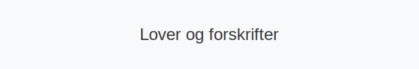
## Oversikt over det norske trafikklovverket
Norsk veitrafikk reguleres av et **hierarkisk lovverk** hvor lover gir overordnede rammer, mens forskrifter utdyper de praktiske detaljene. Tabellen under gir deg en komplett oversikt:
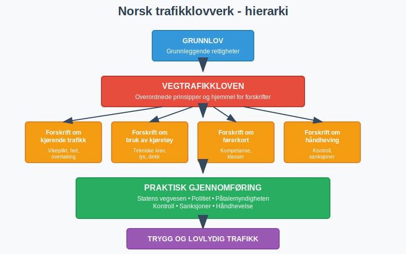
| Lov/Forskrift | Hva den regulerer | Hvem den gjelder |
|---------------|-------------------|------------------|
| **Vegtrafikkloven** | Grunnleggende prinsipper for trafikk, definisjoner, ansvar | Alle trafikanter |
| **Forskrift om kjørende trafikk** | Vikeplikt, fartsgrenser, kjøremønster, overtaking | Kjørende trafikanter |
| **Forskrift om bruk av kjøretøy** | Tekniske krav, lys, dekk, last, sikkerhetsutstyr | Kjøretøyeiere og -førere |
| **Forskrift om førerkort** | Kompetansekrav, klasser, gyldighet, helsekrav | Førerkortinnehavere |
| **Forskrift om håndheving** | Kontroll, reaksjoner, sanksjoner, administrative tiltak | Myndigheter og lovbrytere |
| **Forskrift om trafikkopplæring** | Krav til opplæring og trafikkundervisning | Trafikkskoleelever og -lærere |
_For detaljer om sanksjoner som bøter, inndragning, pant og prikker, se [Sanksjoner, bot, inndraging, pant og prikker m.m.](/blogs/teori/sanksjoner-bot-inndraging-pant-prikker "Sanksjoner, bot, inndraging, pant og prikker m.m.")._
*For regler om ansvar ved tauing av bil, se [Ansvar ved tauing av bil](/blogs/teori/ansvar-ved-tauing-av-bil "Ansvar ved tauing av bil - Regler og ansvar ved tauing av bil").*
For detaljer om vilkåret pliktmessig avhold (obligatorisk avhold fra alkohol), se [Pliktmessig avhold](/blogs/teori/pliktmessig-avhold "Pliktmessig avhold").
**Spesielle kjøretøy og prioriteringsregler:** For detaljer om regler for spesielle kjøretøy som utrykningskjøretøy, landbruksmaskiner, tunge kjøretøy og saktegående kjøretøy, se [Trafikkregler for spesielle kjøretøy](/blogs/teori/trafikkregler-for-spesielle-kjoretoy "Trafikkregler for spesielle kjøretøy - Prioritet, fart og sikkerhet").
## Vegtrafikkloven - Grunnloven for trafikken
**Vegtrafikkloven** (lov om vegtrafikk) er det **juridiske fundamentet** for all veitrafikk i Norge. Loven ble først vedtatt i 1965 og har gjennomgått flere store revisjoner for å tilpasse seg moderne trafikk.
*For en dypere gjennomgang av grunnregelen for trafikken (Vegtrafikklovens § 3), se [Grunnregelen for trafikk](/blogs/teori/grunnregelen-for-trafikk "Grunnregelen for trafikk - Vegtrafikklovens paragraf 3").*
### Hovedprinsipper i vegtrafikkloven
Loven bygger på fire grunnleggende prinsipper:
* **Aktsomhetsprinsippet**: Alle trafikanter skal opptre aktsomt og hensynsfullt
* **Forutsigbarhetsprinsippet**: Trafikkadferd skal være forutsigbar for andre
* **Samhandlingsprinsippet**: Trafikanter skal samhandle og kommunisere
* **Ansvarlighets­prinsippet**: Hver trafikant har ansvar for egen og andres sikkerhet
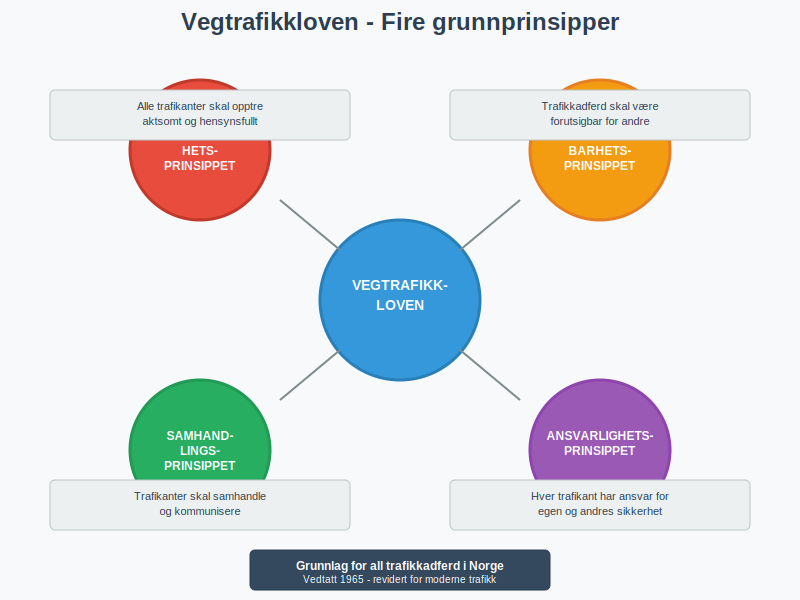
### Viktige definisjoner i loven
Vegtrafikkloven definerer sentrale begreper som:
| Begrep | Definisjon | Praktisk betydning |
|--------|------------|-------------------|
| **Kjøretøy** | Innretning som er bestemt til å kjøre på vei | Omfatter biler, motorsykler, mopeder, sykler |
| **Motorvognfører** | Person som fører motorvogn | Må ha gyldig førerkort |
| **Trafikkulykke** | Skade på person eller eiendom i trafikken | Utløser plikt til å stoppe og hjelpe |
| **Offentlig vei** | Vei som er åpen for allmenn ferdsel | De fleste trafikkregler gjelder |
| **Privat vei** | Vei på privat grunn | Noen trafikkregler gjelder også her |
*For detaljer om lovpålagte **plikter ved trafikkuhell**, se [Plikter ved trafikkuhell](/blogs/teori/plikter-ved-trafikkuhell "Plikter ved trafikkuhell - lovpålagte plikter ved trafikkuhell").*
### § 21: Skikkethet til å kjøre
Vegtrafikkloven § 21 stiller krav til førerens **skikkethet**, inkludert alkohol, stress, sykdom og søvn. For en omfattende gjennomgang av krav til førerens skikkethet, se [Skikkethet til å kjøre (alkohol, stress, sykdom, søvn m.m) - Vegtrafikkloven § 21](/blogs/teori/skikkethet-til-a-kjore "Skikkethet til å kjøre (alkohol, stress, sykdom, søvn m.m) - Vegtrafikkloven § 21").
For mer om [Trafikantgrupper og hensyn](/blogs/teori/trafikantgrupper-og-hensyn "Trafikantgrupper og hensyn - guide til samhandling i trafikken"), se egen artikkel.
## Forskrift om kjørende trafikk
Denne forskriften utdyper **praktiske kjøreregler** fra vegtrafikkloven og er den mest relevante for daglig kjøring.
### Vikeplikt og fortkjørsrett
Forskriften fastsetter detaljerte regler for [Vikeplikt og rundkjøringer](/blogs/teori/vikeplikt-og-rundkjoringer "Vikeplikt og rundkjøringer - master høyreregelen og rundkjøringsregler"):
* **Høyreregelen**: Kjøretøy fra høyre har vikeplikt
* **Hovedveiregler**: Kjøring på hovedvei har fortkjørsrett
* **Rundkjøringsregler**: Kjøretøy i rundkjøringen har vikeplikt
* **Fotgjengerregler**: Fotgjengere har alltid vikeplikt på fotgjengerovergang
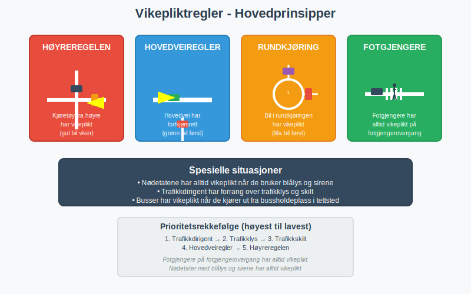
### Fartsgrenser og hastighetsregulering
Forskriften etablerer **nasjonale fartsgrenser** og gir kommunene hjemmel til lokale tilpasninger:
| Veitype | Generell fartsgrense | Kan økes til | Kan senkes til |
|---------|---------------------|--------------|----------------|
| **Motorvei** | 110 km/t | 110 km/t | 70 km/t |
| **Motortrafikkvei** | 90 km/t | 90 km/t | 60 km/t |
| **Landevei** | 80 km/t | 90 km/t | 50 km/t |
| **Tettsted** | 50 km/t | 60 km/t | 30 km/t |
| **Boligområde** | 30 km/t | 50 km/t | 20 km/t |
Les mer om praktisk fartshåndtering i [Fart og avstand](/blogs/teori/fart-og-avstand "Fart og avstand - lær safe følgeavstand og bremsehåndtering").
### Overtaking og feltskifte
Detaljerte regler for [Forbikjøring og feltskifte](/blogs/teori/forbikjoring-og-feltskifte "Forbikjøring og feltskifte - trygg overtaking på alle veitype") inkluderer:
* **Forbud mot overtaking** i kurver, på toppen av bakker, i kryss
* **Sikkerhetsavstand** før, under og etter overtaking
* **Blinklysbruk** ved feltskifte og overtaking
* **Særregler** for overtaking av syklister og gående
## Forskrift om bruk av kjøretøy (kjøretøyforskriften)
Denne forskriften regulerer **tekniske krav** til kjøretøy og er avgjørende for trafikksikkerhet.
### Lys og signaler
Omfattende regler for [Bruk av lys og signaler](/blogs/teori/bruk-av-lys-og-signaler "Bruk av lys og signaler - master riktig lysbruk døgnet rundt"):
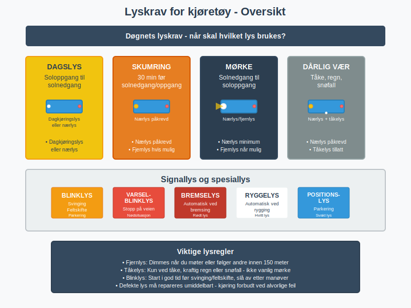
* **Nærlys**: Påkrevd fra solnedgang til soloppgang
* **Fjernlys**: Kun når det ikke blender andre trafikanter  
* **Tåkelys**: Kun ved tåke, snøfall eller kraftig regn
* **Blinklys**: Ved svinging, feltskifte og parkering
* **Varselblinklys**: Ved stopp på kjørebanen
### Dekk og vinterkjøring
Strenge krav til [Regler for dekk og kjetting](/blogs/teori/regler-for-dekk-og-kjetting "Regler for dekk og kjetting - alt om vinterdekk og kjettingbruk"):
| Periode | Krav | Mønsterdybde | Unntak |
|---------|------|--------------|--------|
| **1. nov - 31. mars** | Vinterdekk eller piggdekk | Min. 3 mm | Sommerdekk med kjetting |
| **1. april - 31. okt** | Sommerdekk tillatt | Min. 1,6 mm | Vinterdekk tillatt |
| **Hele året** | Piggdekk med begrensninger | Min. 3 mm | Forbud i enkelte kommuner |
### Sikkerhetsutstyr og kontroll
Påkrevd utstyr som reguleres i [Kjøretøyets sikkerhetsutstyr](/blogs/teori/kjoretoyets-sikkerhetsutstyr "Kjøretøyets sikkerhetsutstyr - komplett oversikt over påkrevd utstyr"):
* **Vernetrekant**: Må medføres i alle biler
* **Førstehjelpsmateriell**: Påkrevd i taxi og buss
* **Sikkerhetsvest**: Anbefalt ved stopp på veikanten
* **Bilbelte**: Påkrevd for alle passasjerer
* **Barnesete**: Obligatorisk for barn under 135 cm
## Forskrift om førerkort
Regulerer alle aspekter ved **førerkompetanse** og førerkortordningen.
### Førerkortklasser og rettigheter
Komplett oversikt over [Førerkortklasser (oversikt)](/blogs/teori/forerkortklasser-oversikt "Oversikt over førerkortklassene i Norge"):
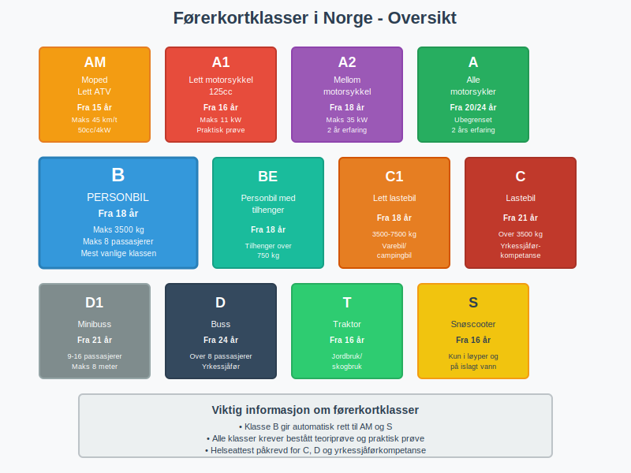
| Klasse | Kjøretøy | Aldersgrense | Spesielle krav |
|--------|----------|--------------|----------------|
| **AM** | Moped og lett ATV | 15 år | Ikke krav om helseundersøkelse |
| **A1** | Lett motorsykkel (125cc) | 16 år | Praktisk prøve påkrevd |
| **A** | Alle motorsykler | 20/24 år | Trinnvis oppbygging mulig |
| **B** | Personbil | 18 år | Mest vanlige klassen |
| **BE** | [Personbil med tilhenger](/blogs/teori/kjoring-med-tilhenger "Kjøring med tilhenger - Guide til trygg hengerkjøring i Norge") | 18 år | Tilleggsprøve nødvendig |
| **C** | Lastebil | 21 år | Yrkessjåførkompetanse |
*For omfattende guide til **kjøring med tilhenger**, se [Kjøring med tilhenger](/blogs/teori/kjoring-med-tilhenger "Kjøring med tilhenger - Guide til trygg hengerkjøring i Norge").*
### Helsekrav og gyldighet
Forskriften fastsetter **medisinske krav** for forskjellige førerkortklasser:
* **Syn**: Minimum 0,5 på det beste øyet, 0,1 på det andre
* **Hørsel**: Kan kompenseres med høreapparat
* **Bevegelse**: Må kunne betjene kjøretøy trygt
* **Kroniske sykdommer**: Diabetes, epilepsi med restriksjoner
* **Rus**: Absolutt forbud mot kjøring under påvirkning
Les mer om [Førerkort, vognkort og forsikring](/blogs/teori/forerkort-vognkort-og-forsikring "Førerkort, vognkort og forsikring - alt om nødvendige papirer") for praktisk informasjon.
## Forskrift om håndheving av trafikklovgivningen
Regulerer hvordan **myndigheter kontrollerer** og sanksjonerer trafikklovbrudd.
### Kontrolltiltak og hjemler
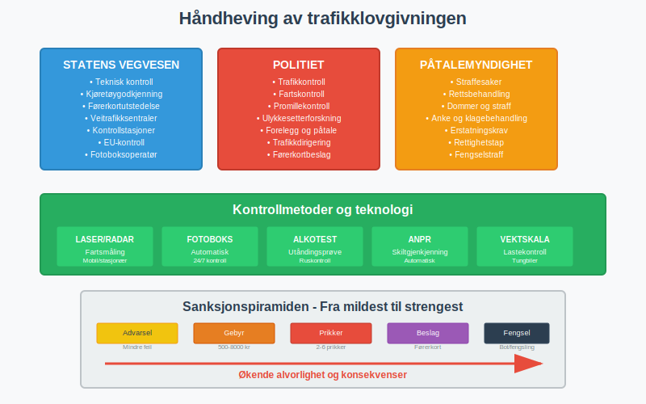
Politiet og Statens vegvesen har følgende kontrollhjemler:
* **Trafikkontroll**: Stoppe kjøretøy for rutinekontroll
* **Alkotest**: Teste for alkohol og andre rusmidler
* **Fartskontroll**: Måle hastighet med laser og fotobokser
* **[EU-kontroll (PKK)](/blogs/teori/eu-kontroll "EU-kontroll (PKK) – Periodisk kjøretøykontroll i Norge")**: Kontrollere kjøretøyets tekniske stand
* **Dokumentkontroll**: Sjekke førerkort, vognkort og forsikring
### Sanksjonssystemet
Norge har et **gradert sanksjonssystem** basert på overtredelsens alvorlighet:
| Sanksjonsnivå | Type overtredelse | Reaksjon | Konsekvens |
|---------------|-------------------|----------|------------|
| **Nivå 1** | Mindre overtredelser | Gebyr 500-2000 kr | Ingen prikker |
| **Nivå 2** | Moderate overtredelser | Gebyr + 2-3 prikker | Kurs ved 8 prikker |
| **Nivå 3** | Alvorlige overtredelser | Gebyr + 4-6 prikker | Førekortbeslag mulig |
| **Nivå 4** | Særlig alvorlige | Førerkortbeslag + bot/fengsel | Ny førerprøve påkrevd |
For mer informasjon om **prikker**, **prøvetid** og **sperrefrist**, se [Sperrefrist (prøvetid, prikker)](/blogs/teori/sperrefrist-provetid-prikker "Sperrefrist, prøvetid og prikker - alt om poengsystemet og de nye reglene").
### Foreleggssystemet og klageadgang
Hvis du får et **forelegg**, har du følgende muligheter:
1. **Vedta forelegget**: Betale gebyret innen fristen (vanligvis 3 uker)
2. **Nekte straffeskyld**: Saken går til rettsbehandling  
3. **Klage på prikkene**: Klage til Statens vegvesen innen 3 uker
4. **Søke om utsettelse**: Ved økonomiske problemer
## Administrative regler og rutiner
### Registerføring og dokumentasjon
Alle kjøretøy og førere må være **registrert** i offisielle registre:
* **Motorvognregisteret**: Alle motorkjøretøy registreres, se [Førerkort, vognkort og forsikring](/blogs/teori/forerkort-vognkort-og-forsikring "Førerkort, vognkort og forsikring - alt om dokumenter, registrering og eierskifte") for praktisk informasjon om registrering av kjøretøy, eierskifte og forsikring.
* **Førerkortsystemet**: Alle førerkort og prikker registreres  
* **Forsikringsregisteret**: Kontroll av gyldig forsikring
* **EU-kontrollen**: Kontroll av utenlandske kjøretøy og førere
### Internasjonale avtaler og EU-regelverk
Norge følger **internasjonale standarder** gjennom EØS-avtalen:
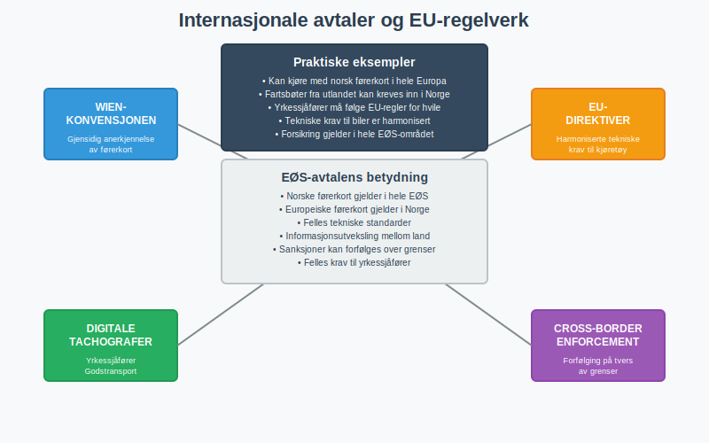
* **Wien-konvensjonen**: Gjensidig anerkjennelse av førerkort
* **EU-direktiver**: Harmoniserte tekniske krav til kjøretøy
* **Digitale tachografer**: For yrkessjåfører i godstransport
* **Cross-border enforcement**: Forfølging av trafikkovertredelser på tvers av grenser
## Særlige bestemmelser
### Yrkessjåfører og næringstransport
[Trafikkregler for spesielle kjøretøy](/blogs/teori/trafikkregler-for-spesielle-kjoretoy "Trafikkregler for spesielle kjøretøy") gjelder for:
* **Yrkessjåfør-kompetanse**: Krav til kurs og sertifisering
* **Hviletidsregler**: Obligatorisk hvile for lastebil- og busssjåfører
* **Tachograf-krav**: Registrering av kjøre- og hviletid
* **ADR-transport**: Spesielle regler for farlig gods
### Kjøring med funksjonshemminger
Forskriftene gir mulighet for **tilrettelegging** for personer med nedsatt funksjonsevne:
* **Tilpasset bil**: Spesielle kontroller og utstyr
* **Medisinsk vurdering**: Grundig helseundersøkelse påkrevd
* **Periodisk kontroll**: Jevnlig helsekontroll 
* **Parkerings­tillatelse**: HC-kort for parkering
### Ungdom og eldre førere
**Spesielle regler** for sårbare førergrupper:
| Aldersgruppe | Særbestemmelser | Bakgrunn |
|--------------|-----------------|----------|
| **16-18 år** | Alkoholforbud, øvelseskjøring | Høy ulykkesrisiko |
| **18-25 år** | Prøvetid med strengere reaksjoner | Uerfarne førere |
| **Over 70 år** | Mulig helsekontroll | Fysiske forandringer |
| **Over 80 år** | Regelmessig helseattest | Økt risiko |
## Utviklingstrender og fremtidige endringer
### Digitalisering av trafikkovervåking
Teknologiske nyvinninger påvirker **lovgivning og håndhevelse**:
* **Automatisk trafikkontroll**: Flere fotobokser og snitthastighetsmåling
* **Elektroniske kjøretøydagbøker**: Digital registrering av kjøring
* **AI-basert analyse**: Automatisk gjenkjenning av regelbrudd
* **Digitale førerkort**: På sikt app-baserte førerkort
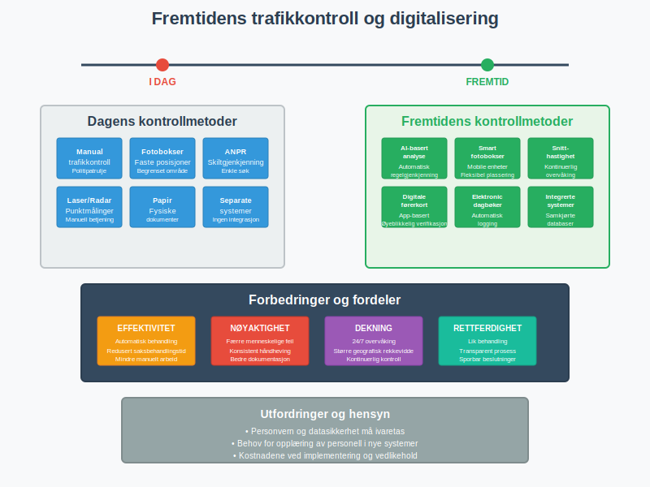
### Miljøregulering og utslippssoner
**Klimapolitikk** påvirker trafikkregelverket:
* **Lavutslippssoner**: Begrensninger for dieselbiler i byer
* **Elbil-fordeler**: Fortsatt gratis parkering og bompassering
* **Synthetiske drivstoff**: Nye krav til drivstoffkvalitet
* **Karbonnøytralitet**: Mål om utslippsfri transport innen 2050
Se mer om [Miljøvennlig kjøring](/blogs/teori/miljovennlig-kjoring "Miljøvennlig kjøring - reduser forbruk og miljøpåvirkning") for praktiske tips.
### Selvkjørende kjøretøy
**Autonom kjøring** vil kreve omfattende regelverksendringer:
* **Ansvarsfordeling**: Hvem har ansvaret ved ulykker?
* **Tekniske standarder**: Krav til sensorer og programvare
* **Etiske dilemmaer**: Hvordan skal bilen velge i nødsituasjoner?
* **Overgangsperiode**: Sameksistens mellom manuelle og autonome kjøretøy
## Praktiske råd for lovlydige trafikanter
### Holde seg oppdatert på regelverket
**Jevnlig oppdatering** av kunnskaper er avgjørende:
* **Statens vegvesen**: Abonner på nyhetsbrev og følg nettsiden vegvesen.no
* **Lovdata**: Les endringer i lover og forskrifter på lovdata.no
* **Trafikkskole**: Delta på oppfriskningskurs jevnlig
* **Fagpressen**: Følg med på endringer i bilmagasiner og nettportaler
### Unngå vanlige regelbrudd
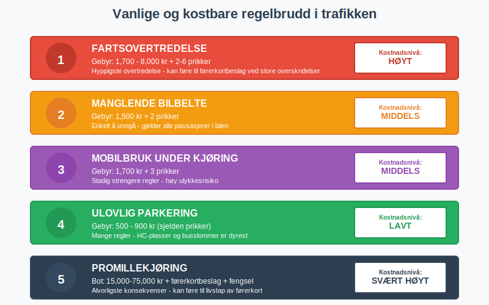
De mest kostbare **feilene** i trafikken:
1. **Fartsovertredelse**: Dyreste og hyppigste overtredelse
2. **Manglende bilbelte**: Enkelt å unngå, men alvorlige konsekvenser  
3. **Mobilbruk**: Stadig strengere regler og kontroll
4. **Parkering**: Mange regler og høye gebyrer
5. **Promillekjøring**: Alvorligste konsekvenser av alle
### Før du kjører - sjekkliste
**Daglig kontroll** for å unngå problemer:
* ? Gyldig førerkort i lomme eller på telefon
* ? Forsikring og vognkort tilgjengelig  
* ? Kjøretøy teknisk i orden (lys, dekk, væske)
* ? Ingen rus eller medikamenter som påvirker kjøreevnen
* ? Bilbelte på alle passasjerer
* ? Tilpasset hastighet til forhold og fartsgrenser
For mer om forberedelser, se [Forberedelser for en lang kjøretur](/blogs/teori/forberedelser-for-en-lang-kjoretur "Forberedelser for en lang kjøretur - planlegg trygt og komfortabelt").
## Juridisk bistand og rettigheter
### Når du trenger juridisk hjelp
I enkelte situationer kan **juridisk bistand** være nødvendig:
* **Alvorlige trafikkutøykker**: Med personskade eller store materielle skader
* **Førerkortsbeslag**: Ved lengre beslag eller permanent tap av førerkort  
* **Straffesak**: Når saken går til retten
* **Forsikringstvist**: Uenighet om erstatning eller skyldspørsmål
### Dine rettigheter ved trafikkontroll
Som trafikant har du **klare rettigheter**:
* **Rett til informasjon**: Vite hvorfor du er stoppet
* **Rett til tolk**: Ved språkproblemer 
* **Rett til klage**: På både gebyr og prikker
* **Rett til forsvarer**: Ved alvorlige straffesaker
* **Rett til å nekte**: Kun ved frivillige undersøkelser
## Ansvar og erstatning
### Objektivt ansvar vs skyldansvar
Norsk rett skiller mellom **to typer ansvar**:
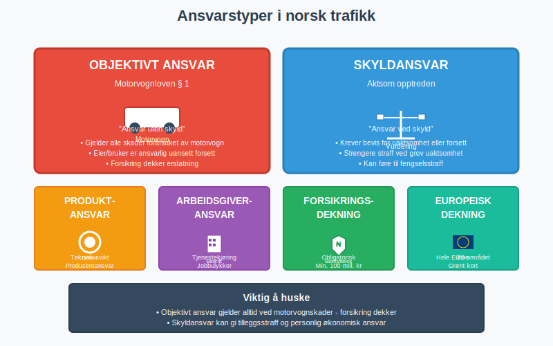
| Ansvarstype | Grunnlag | Når det gjelder | Konsekvens |
|-------------|----------|-----------------|------------|
| **Objektivt ansvar** | Motorvognloven § 1 | Alle motorvognskader | Ansvar uten skyld |
| **Skyldansvar** | Aktsom opptreden | Grov uaktsomhet eller forsett | Strengere straff |
| **Produktansvar** | Teknisk feil | Defekte bilkomponenter | Produsentansvar |
| **Arbeidsgiveransvar** | Tjenestekjøring | Ulykker på jobbreiser | Arbeidsgivers ansvar |
### Forsikring og lovpålagte krav
**Obligatorisk trafikkforsikring** dekker:
* **Personskader**: Ubegrenset erstatning til skadelidte
* **Tingskader**: Minimum 100 millioner kroner
* **Rettshjelp**: Juridisk bistand ved krav
* **Europeisk dekning**: Gyldig i hele EØS-området
Les mer om praktiske forsikringsspørsmål i [Førerkort, vognkort og forsikring](/blogs/teori/forerkort-vognkort-og-forsikring "Førerkort, vognkort og forsikring - alt om nødvendige papirer").
**En solid forståelse av lover og forskrifter er det viktigste grunnlaget for å være en trygg, ansvarlig og lovlydig trafikant. Reglene er der for å beskytte alle trafikanter og skape forutsigbarhet i trafikken.**
***
*For en komplett guide til andre viktige temaer i teoriprøven, se [Introduksjon til teori for førerkort](/blogs/teori/introduksjon-til-teori-for-forerkort "Introduksjon til teori for førerkort").*