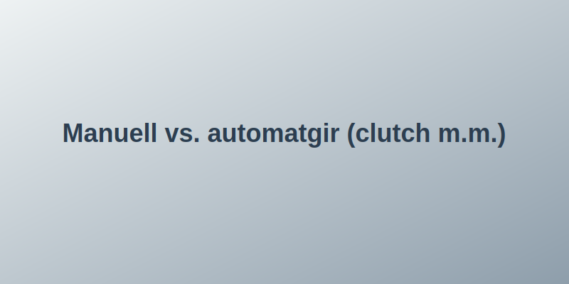
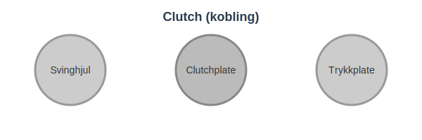
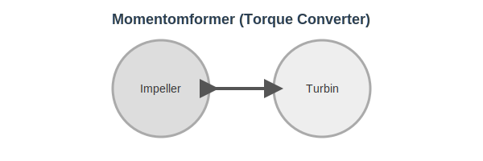

I denne artikkelen går vi i dybden på **manuell girkasse** og **automatgir**, inkludert **clutch**, **momentomformer** og de viktigste forskjellene du bør kjenne til.
 For en helhetlig guide til valg av biltype, se [Valg av bil](/blogs/teori/valg-av-bil "Valg av bil - Fossil, hybrid eller elektrisk | Teorikurs").
 
Artikkelen utfyller avsnittet om girkasser i [Motor og drivverk](/blogs/teori/bilens-tekniske-deler "Bilens tekniske deler: motor og drivverk").
## Introduksjon
Valg av girkasse påvirker både **kjøreopplevelsen**, **drivstofføkonomi** og **kjøresikkerhet**. Her går vi gjennom prinsippene bak de to hovedtypene girkasser, hvordan de fungerer, samt fordeler og ulemper.
## Manuell girkasse
Den **manuelle girkassen** krever at føreren benytter clutchpedalen og girspaken for å skifte gir. Dette gir god kontroll, men stiller større krav til førerens ferdigheter.

### Hvordan clutch fungerer
Clutchen (koblingen) består av tre hovedkomponenter:
* **Svinghjul (flywheel)** festet til motoren
* **Clutchplate (koblingsplate)** med friksjonsbelegg
* **Trykkplate og utløserlager** som presser platen mot svinghjulet
Når pedal trykkes inn, frigjøres clutchplaten fra svinghjulet og motorkraften avbrytes, slik at gir kan skiftes.
## Automatgir
**Automatgir** skifter gir automatisk ved hjelp av en **momentomformer (torque converter)** eller hydrauliske krefter, uten at føreren må betjene clutch.

### Prinsipp for momentomformer
Momentomformeren overfører dreiemoment fra motor til girkasse via en væskestrøm mellom impeller, turbin og stator. Dette gir smidig girskifte og redusert behov for manuell clutch.
## Fordeler og ulemper
| Girtype    | Fordeler                                        | Ulemper                              |
|------------|-------------------------------------------------|--------------------------------------|
| Manuell    | **Bedre kontroll**, lavere vekt, enkel design   | Krever clutchbruk, kan være slitsomt  |
| Automatgir | Komfortabelt, enklere i bykjøring, konsistent girskifte | Ofte høyere vekt og kostnad          |
## Praktiske tips for girskifte
* Ved manuell girkasse: Slip clutch gradvis for å unngå rykk og unødvendig slitasje.
* Ved automatgir: La bilen stoppe helt før du velger R eller D for å redusere belastning på momentomformeren.
* Unngå å holde foten på clutch- eller bremsepedalen unødvendig lenge.
## Oppsummering
Riktig valg og bruk av girkasse er avgjørende for **kjørekomfort**, **sikkerhet** og **økonomi**. Både manuell girkasse og automatgir har sine fordeler; kjennskap til prinsippene bak clutch og momentomformer gir deg bedre forståelse og kontroll.