
**Miljøvennlig kjøring** er en av de viktigste ferdighetene en moderne sjåfør kan mestre, både for miljøets skyld og for egen økonomi. Som sjåfør har du hver dag mulighet til å gjøre en betydelig forskjell gjennom **bærekraftige kjøreteknikker**, **smart planlegging** og **bevisste valg** som kan redusere både drivstofforbruk og skadelige utslipp med opptil **40%**.
For en helhetlig oversikt over valg av biltype, se [Valg av bil](/blogs/teori/valg-av-bil "Valg av bil - Fossil, hybrid eller elektrisk | Teorikurs").
I Norge, hvor **klimabevissthet** står høyt på dagsordenen og hvor mange ønsker å kombinere praktisk mobilitet med **miljøansvar**, er kunnskap om miljøvennlig kjøring ikke bare nyttig for teoridelen av førerkortet - det er en **livslang ferdighet** som gjør deg til en mer ansvarlig trafikant og kan spare deg for tusenvis av kroner årlig.
**Moderne teknologi** som elbiler, hybridbiler og avanserte drivstoffsystemer gjør miljøvennlig kjøring mer relevant enn noensinne. Samtidig viser forskning at **kjøreteknikk** ofte er like viktig som selve kjøretøyet for å oppnå optimal miljøprestasjon.
For en overordnet gjennomgang av førerkortteori, se [Introduksjon til teori for førerkort](/blogs/teori/introduksjon-til-teori-for-forerkort "Introduksjon til teori for førerkort"). For fokus og samhandling i trafikken, se [Oppmerksomhet og samhandling](/blogs/teori/oppmerksomhet-og-samhandling "Oppmerksomhet og samhandling - Fokus og samarbeid i trafikken").
*For spesifikke miljøvennlige teknikker på landevei, se [Landeveiskjøring](/blogs/teori/landeveiskjoring "Landeveiskjøring - Guide til sikker kjøring på norske landeveier"). For mer om sikker plassering som også optimaliserer drivstofforbruk, se [Plassering og kjøremåte](/blogs/teori/plassering-og-kjoremmate "Plassering og kjøremåte - Guide til riktig kjøreteknikk").*
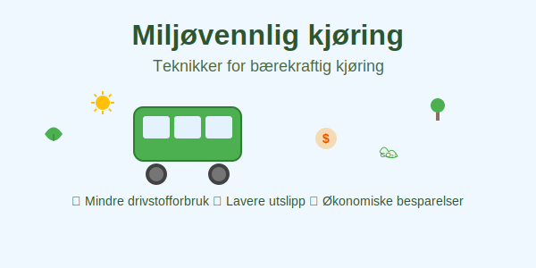
## Hva er miljøvennlig kjøring?
**Miljøvennlig kjøring**, også kalt **økonomisk kjøring** eller **eco-driving**, er en kjørestil som minimerer miljøpåvirkningen ved å optimalisere drivstofforbruket. Dette oppnås gjennom:
* **Jevn hastighet** og unngåelse av unødvendige akselerasjoner
* **Planlegging** av reiser og kjøreruter
* **Optimal bruk** av kjøretøyets teknologi
* [**Regelmessig vedlikehold av bilen**](/blogs/teori/vedlikehold-av-bilen "Vedlikehold av bilen - Guide til regelmessig service og inspeksjon")
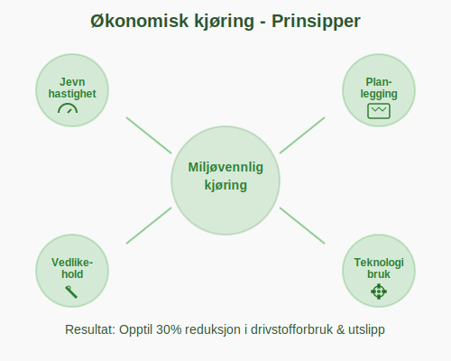
## Kjøreteknikker for mindre miljøpåvirkning
### Optimal hastighet og fartstilpasning
**Hastigheten** har stor innvirkning på drivstofforbruket. For de fleste personbiler er den mest **drivstoffeffektive hastigheten** mellom 50-80 km/t på motorvei.
| Hastighet | Økt drivstofforbruk |
|-----------|-------------------|
| 90 km/t | Referanse (0%) |
| 100 km/t | +15-20% |
| 110 km/t | +25-30% |
| 120 km/t | +35-40% |
**Viktige prinsipper for hastighet:**
* Hold **jevn fart** når det er mulig
* Bruk [fartsholder](/blogs/teori/fart-og-avstand "Fart og avstand - Sikker hastighet og stoppdistanse") på motorveier
* **Reduser hastigheten** gradvis i stedet for å bremse hardt
* Tilpass hastigheten til **trafikksituasjonen** og **veiforholdene**
* Under vanskelige værforhold kan ekstra forsiktighet spare både drivstoff og sikre trygghet; se [Kjøring under vanskelige forhold](/blogs/teori/kjoring-under-vanskelige-forhold "Kjøring under vanskelige forhold - Comprehensive guide to challenging driving conditions")
* For mer om høyhastighetskjøring og effektiv bruk av fartsholder, se [Motorveikjøring](/blogs/teori/motorveikjoring "Motorveikjøring - Guide til kjøring på motorvei")
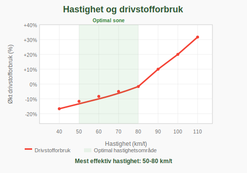
### Jevn akselerasjon og bremsing
**Aggressiv kjøring** med hyppige akselerasjoner og harde bremsinger kan øke drivstofforbruket med opptil **40%**.
**Teknikker for jevn kjøring:**
* **Gradvis akselerasjon** fra stillestående
* **Forutse** trafikksituasjoner og redusere farten i god tid
* Bruk **motorbremsing** i stedet for bremsepedalen når mulig
* Hold **god avstand** til kjøretøyet foran for å unngå unødvendig bremsing
* Optimer [plassering og kjøremåte](/blogs/teori/plassering-og-kjoremmate "Plassering og kjøremåte - Guide til riktig kjøreteknikk") for jevn trafikkflyt
### Girbruk og motorens arbeidsområde
For biler med **manuell girkasse** er riktig girbruk viktig for miljøvennlig kjøring:
* Skift til **høyere gir** tidlig (rundt 2000-2500 omdreininger)
* Hold motoren i det **mest effektive** arbeidsområdet
* Unngå å kjøre i for **lavt gir** ved høye hastigheter
* Bruk **høyeste mulige gir** som gir tilstrekkelig kraft
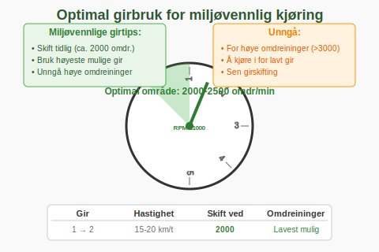
## Planlegging og reiseteknikker
### Reiseplanlegging
**God planlegging** kan redusere miljøpåvirkningen betydelig:
* **Kombiner ærender** i en tur i stedet for flere separate turer
* Velg **effektive ruter** med mindre trafikk
* Unngå **rushtid** når det er mulig; for tips om [bykjøring](/blogs/teori/bykjoring "Bykjøring - Comprehensive guide to urban driving in Norway") i rush
* Bruk **navigasjonssystemer** som viser mest miljøvennlig rute
### Kaldstart og oppvarming
**Kalde motorer** forbruker mer drivstoff og produserer flere utslipp:
* **Ikke varm opp** bilen i stillestående mer enn nødvendig
* Kjør **forsiktig** de første kilometerne til motoren blir varm
* **Moderne biler** trenger sjelden mer enn 30 sekunder oppvarming
* Bruk **motorvarmer** på kalde dager hvis tilgjengelig
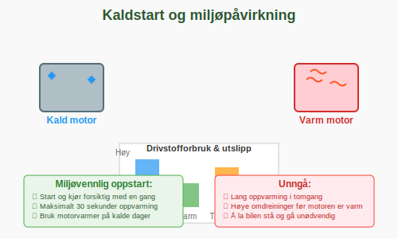
## Kjøretøyets teknologi og utstyr
### Klimaanlegg og elektriske systemer
**Klimaanlegget** kan øke drivstofforbruket med **10-20%** når det brukes:
* Bruk **vinduer** på lave hastigheter (under 50 km/t)
* Bruk **klimaanlegg** på høye hastigheter for bedre aerodynamikk
* Still inn **moderat temperatur** (21-23°C)
* **Slå av** unødvendige elektriske systemer
### Dekktrykk og vedlikehold
**Riktig dekktrykk** er kritisk for miljøvennlig kjøring:
| Dekktrykk | Økt drivstofforbruk |
|-----------|-------------------|
| Anbefalt trykk | 0% (referanse) |
| 0.5 bar for lavt | +2-3% |
| 1.0 bar for lavt | +6-8% |
**Vedlikeholdstips:**
* Sjekk **dekktrykk** månedlig
* Utfør **regelmessig service** etter produsentens anbefalinger
* Skift **luftfilter** når det er skittent
* Bruk **anbefalt motorolje** med riktig viskositet
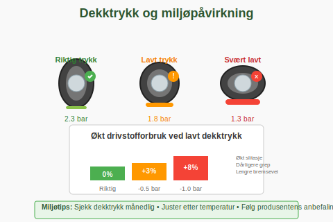
## Bilvalg og alternativer
### Miljøvennlige kjøretøy
Når du skal velge bil, vurder **miljøvennlige alternativer**:
* **Elbiler** for nullutslipp lokalt
* **Hybridbiler** for redusert drivstofforbruk
* **Små, drivstoffeffektive** bensin- eller dieselbiler
* **Gasskjøretøy** som alternativ til tradisjonelle drivstoff
### Alternative transportmidler
**Vurder andre transportalternativer** når det er hensiktsmessig:
* **Kollektivtransport** for daglige reiser
* **Sykling** for korte avstander
* **Gåing** for svært korte turer
* **Samkjøring** med andre
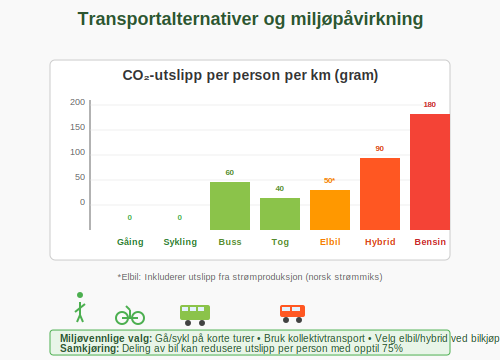
## Miljøpåvirkning og samfunnsansvar
### Lokale og globale effekter
Kjøretøy påvirker miljøet på flere måter:
* **Luftforurensning** i byer og tettbebygde områder
* **Klimagassutslipp** som bidrar til global oppvarming
* **Støy** som påvirker livskvaliteten
* **Ressursbruk** ved produksjon og vedlikehold
### Framtidens mobilitet
Som sjåfør er du del av overgangen til **bærekraftig transport**:
* **Lær** om nye teknologier og kjøreteknikker
* **Vær åpen** for alternative transportløsninger
* **Del kunnskap** om miljøvennlig kjøring med andre
* **Ta bevisste valg** som reduserer miljøpåvirkningen
## Økonomiske fordeler
**Miljøvennlig kjøring** gir også **økonomiske gevinster**:
* **Reduserte drivstoffkostnader** (opptil 20-30% besparelse)
* **Mindre slitasje** på bremser og motor
* **Lavere forsikringspremier** for trygge sjåfører
* **Høyere videresalgsverdi** ved godt vedlikeholdte kjøretøy
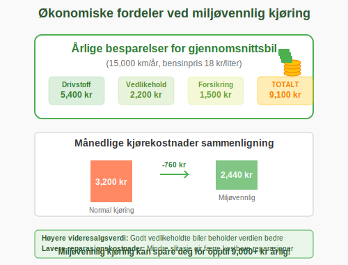
> Utforsk mer om kostnader ved bilhold i artikkelen [Økonomi og bilhold](/blogs/teori/okonomi-og-bilhold "Økonomi og bilhold - Kostnader og tips for økonomisk bilhold").
## Praktiske øvelser og tips
### Daglige rutiner
Implementer disse **enkle rutinene** for mer miljøvennlig kjøring:
* **Sjekk dekktrykk** hver måned
* **Kombiner ærender** når du planlegger turer og velg parkeringsplasser strategisk - lær [effektive parkeringsteknikker](/blogs/teori/parkering-for-viderekomne "Parkering for viderekomne - Miljøvennlige og effektive parkeringsstrategier") for å redusere tid brukt på å finne og manøvrere inn i parkeringsplasser
* **Fjern unødvendig vekt** fra bilen
* **Bruk takboks/takgrind** kun når nødvendig
### Overvåkning av forbruk
**Hold øye med** kjøretøyets miljøprestasjon:
* Bruk bilens **forbruksmåler** for å lære optimal kjørestil
* **Fyll tanken** systematisk for å beregne gjennomsnittlig forbruk
* **Sammenlign** ditt forbruk med produsentens oppgitte verdier
* **Juster kjørestilen** basert på resultater
### Utvikling av ferdigheter
**Kontinuerlig læring** er viktig for [mennesket i trafikken](/blogs/teori/mennesket-i-trafikken "Mennesket i trafikken - Faktorer som påvirker kjøreegenskaper"):
* **Øv** på forskjellige kjøreteknikker under trygge forhold
* **Vurder** miljøvennlig kjørekurs
* **Oppdater** kunnskapen din om nye teknologier
* **Del erfaringer** med andre sjåfører
## Sammendrag
**Miljøvennlig kjøring** er en kombinasjon av riktig kjøreteknikk, god planlegging og bevisste valg som kommer både miljøet og lommeboken til gode. Gjennom å implementere prinsippene for [kjøreteknikk og plassering](/blogs/teori/plassering-og-kjoremmate "Plassering og kjøremåte - Komplett guide til plassering og kjøremåte"), optimal [fartsholdning](/blogs/teori/fart-og-avstand "Fart og avstand - Sikker hastighet og stoppdistanse"), og regelmessig vedlikehold kan du redusere kjøretøyets miljøpåvirkning med opptil **30-40%**.
Som sjåfør har du et **samfunnsansvar** for å kjøre på en måte som tar hensyn til framtidige generasjoner. Ved å mestre miljøvennlige kjøreteknikker bidrar du til **renere luft**, **reduserte klimagassutslipp** og en **mer bærekraftig** transportsektor.
Husk at **små endringer** i kjørestilen kan ha **stor effekt** over tid - både for miljøet og for dine egne utgifter til transport.
## Teknologi og digitale hjelpemidler
### Moderne bilteknologi for miljøvennlig kjøring
**Dagens biler** er utstyrt med avanserte systemer som kan hjelpe deg med miljøvennlig kjøring:
* **Start-stopp teknologi** som automatisk slår av motoren ved stopp
* **Adaptiv cruisekontroll** som holder optimal avstand og hastighet
* **Regenerativ bremsing** i hybrid- og elbiler
* **Eco-modus** som optimaliserer motorens ytelse for lavt forbruk
* **Realtids forbruksmålere** som viser ditt nåværende drivstofforbruk
**Intelligente kjøreassistentsystemer** kan redusere drivstofforbruket med **5-15%** når de brukes riktig.
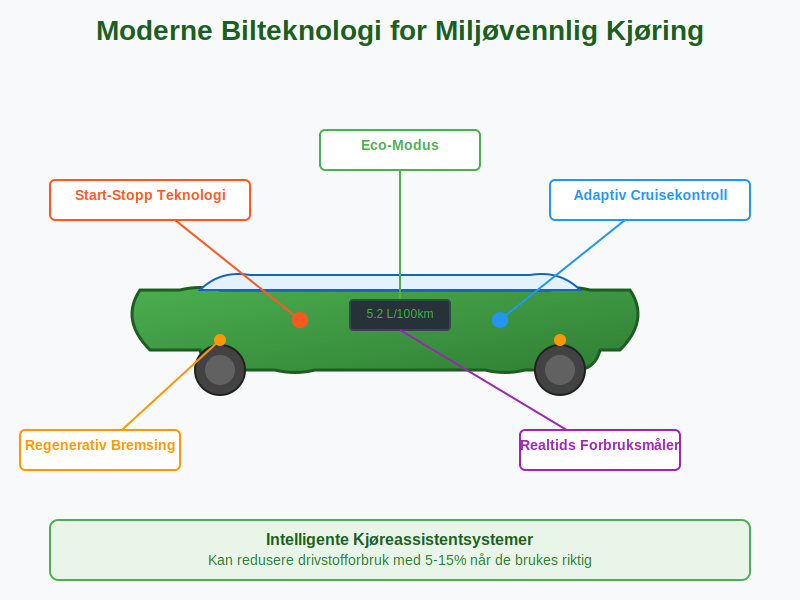
### Apper og digitale verktøy
**Smart-telefon apper** kan være kraftige verktøy for miljøvennlig kjøring:
* **Navigasjonsapper** med "eco-rute" funksjon
* **Drivstofflog-apper** for å spore forbruk over tid
* **Kjørereporter** som analyserer kjørestilen din
* **Trafikkinfo-apper** for å unngå køer og rushtid
| App-type | Potensial besparelse | Eksempel funksjoner |
|----------|-------------------|------------------|
| Navigasjon | 10-20% | Eco-ruter, trafikkinfo, optimalisering |
| Forbrukslogg | 5-15% | Trend-analyse, sammenligning, tips |
| Kjøreanalyse | 15-25% | Akselerasjon, bremsing, eco-scoring |
### Elbiler og hybridteknologi
For elbiler og hybridbiler gjelder **spesielle teknikker**:
**Elbiler:**
* **Forhåndsklimatisering** mens bilen lader for å spare batteri
* **Regenerativ bremsing** - bruk "en-pedal kjøring" når mulig
* **Eco-modus** for maksimal rekkevidde
* **Prekondisjoner** av batteriet på kalde dager
**Hybridbiler:**
* **La bilen** velge mellom motor og elektrisk drift automatisk
* **Gentle akselerasjon** for å holde seg i elektrisk modus lengst mulig
* **Forutse** når du skal stoppe for optimal energi-regenerering
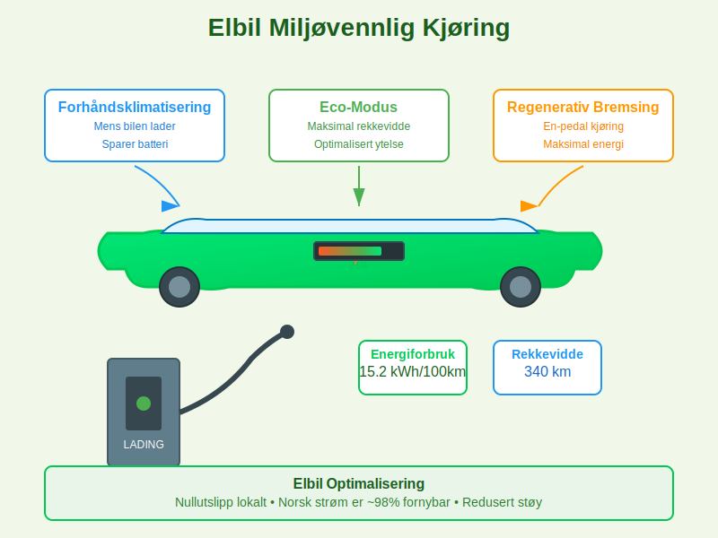
## Sesongbasert miljøvennlig kjøring
### Vinterkjøring og miljø
**Vinterkjøring** byr på spesielle utfordringer for miljøvennlig kjøring:
**Vinterpreparering:**
* **Vinterdekk** reduserer rullemotstand sammenlignet med sommerdekk på vinterføre
* **Motorvarmer** kan redusere kaldstartforbruk med opptil **20%**
* **Kupevarmer** lar deg forhåndsklimatisere uten å starte motoren
**Kjøreteknikker om vinteren:**
* **Gradvis oppvarming** - kjør forsiktig de første 5-10 minuttene
* **Jevn akselerasjon** på glatte veier både for sikkerhet og miljø
* **Høyere dekktrykk** kan kompensere for kuldepåvirkning
* Se også [Kjøring under vanskelige forhold](/blogs/teori/kjoring-under-vanskelige-forhold "Kjøring under vanskelige forhold - Guide til vinterkjøring og utfordrende værforhold") for sikker vinterkjøring
| Temperatur | Økt drivstofforbruk | Tiltak |
|------------|-------------------|--------|
| +10°C | Referanse (0%) | Normal kjøring |
| 0°C | +15-20% | Motorvarmer, gradvis oppvarming |
| -10°C | +25-30% | Ekstende oppvarming, moderate hastigheter |
| -20°C | +35-40% | Kupevarmer, planlegging av lengre turer |
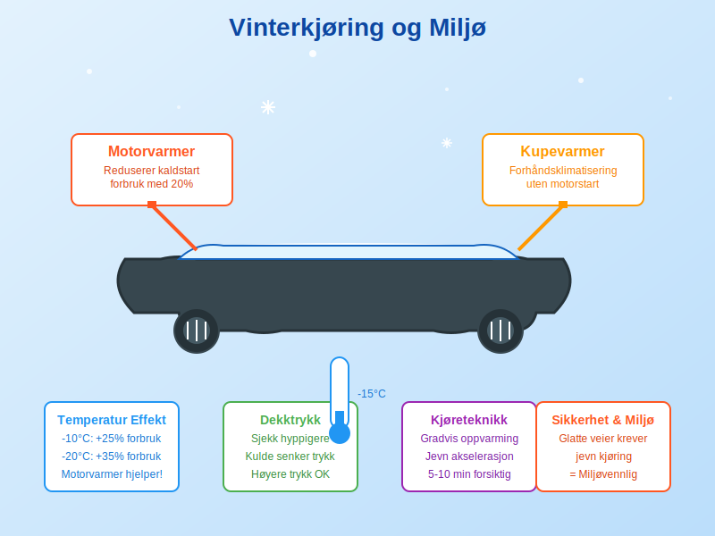
### Sommerkjøring og klimaanlegg
**Sommerkjøring** har sine egne miljøutfordringer:
**Klimaanlegg-strategi:**
* **Under 50 km/t:** Bruk vinduer i stedet for klimaanlegg
* **Over 80 km/t:** Klimaanlegg er mer effektivt enn åpne vinduer
* **Forhåndskjøling** i garasje reduserer behov for kraftig kjøling
**Aerodynamikk om sommeren:**
* **Fjern takboks** og unødvendig last
* **Steng vinduer** på motorveier for bedre luftmotstand
* **Sjekk dekktrykk** hyppigere - varme øker trykket
## Transportplanlegging og mobilitetsstrategi
### Integrert transportplanlegging
**Smart transportplanlegging** kan redusere totale miljøpåvirkning drastisk:
**Daglig planlegging:**
* **Kombiner ærender** i samme geografiske område
* **Planlegg ruter** for å unngå samme vei flere ganger
* **Tid reiser** for å unngå rushtid når mulig
* **Vurder alternativer** som kollektivtransport for visse reiser
**Ukentlig planlegging:**
* **Handle mat** sjeldnere men i større mengder
* **Samarbeid** med naboer om transport til felles mål
* **Remote arbeid** en dag i uken kan spare betydelig drivstoff
* **Fritidsaktiviteter** - velg lokale alternativer når mulig
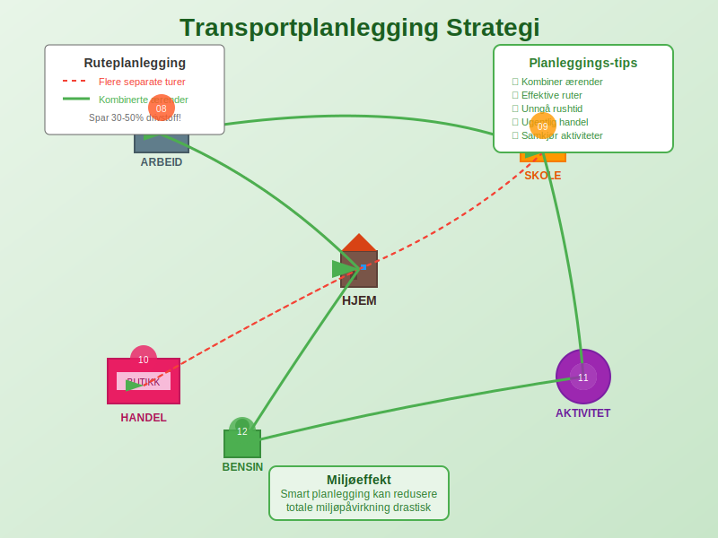
### Samkjøring og deleøkonomi
**Samkjøring** og **bildeling** kan dramatisk redusere miljøpåvirkning per person:
**Samkjøringsfordeler:**
* **Halverer** miljøpåvirkning per person ved to passasjerer
* **Deler kostnader** for drivstoff og bompenger
* **Reduserer trafikk** og behov for parkeringsplasser
* **Sosiale fordeler** gjennom delt reiseopplevelse
**Praktisk samkjøring:**
* **Fastlagte ruter** som til/fra arbeid fungerer best
* **Fleksibilitet** i arbeidssted kan lette organisering
* **Digitale plattformer** for å finne samkjøringspartnere
* **Klare avtaler** om kostnader og ansvar
## Miljøøkonomi og livssyklusperspektiv
### Totaløkonomisk analyse
**Miljøvennlig kjøring** påvirker flere **økonomiske faktorer**:
| Kostnadskategori | Årlig besparelse | Kommentar |
|-----------------|-----------------|-----------|
| Drivstoff | NOK 5,000-15,000 | Avhenger av kjørelengde og teknikk |
| Vedlikehold | NOK 2,000-5,000 | Mindre slitasje på motor og bremser |
| Forsikring | NOK 500-2,000 | Rabatter for sikre sjåfører |
| Verditap | NOK 3,000-8,000 | Godt vedlikeholdte biler holder verdien |
**Total årlig besparelse** kan være **NOK 10,000-30,000** for en gjennomsnittlig sjåfør.
### Miljøregnskap for privatpersoner
**Beregn din egen miljøpåvirkning:**
**CO2-utslipp per km:**
* **Bensinbil:** ~180g CO2/km (gjennomsnitt)
* **Dieselbil:** ~160g CO2/km (gjennomsnitt)
* **Hybridbil:** ~100g CO2/km (gjennomsnitt)
* **Elbil (Norge):** ~20g CO2/km (inkludert strømproduksjon)
**Årlig miljøpåvirkning** for 15,000 km kjøring:
* **Bensinbil:** 2.7 tonn CO2
* **Med miljøvennlig kjøring:** 1.8 tonn CO2 (33% reduksjon)
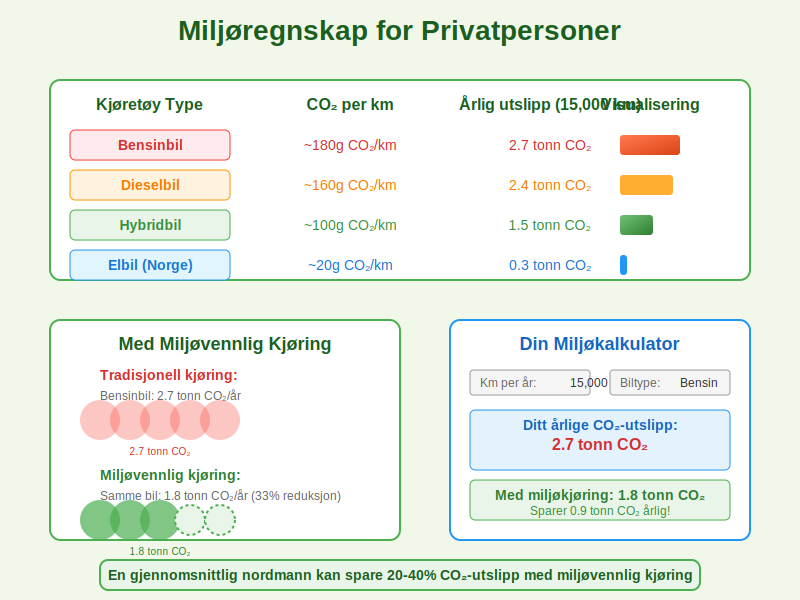
## Fremtidsperspektiver og nye teknologier
### Autonome kjøretøy og miljø
**Selvkjørende biler** vil kunne revolusjonere miljøvennlig kjøring:
* **Optimalisert kjørestil** programmert for lavest mulig forbruk
* **Koordinert trafikk** som reduserer køer og unødvendige stopp
* **Bilddeling** blir enklere med autonome kjøretøy
* **Platooning** - biler som kjører tett i konvoier for mindre vindmotstand
### Hydrogen og alternative drivstoff
**Nye teknologier** på horisonte:
* **Hydrogenbiler** med kun vanndamp som utslipp
* **Biodrivstoff** fra fornybare kilder
* **Syntetiske drivstoff** produsert med fornybar energi
* **Avanserte batteriteknologier** for elbiler med lengre rekkevidde
### Smart infrastruktur
**Fremtidens veier** vil støtte miljøvennlig kjøring:
* **Dynamiske fartsgrenser** som optimaliserer trafikkflyt
* **Trådløs lading** av elbiler under kjøring
* **V2X kommunikasjon** (Vehicle-to-Everything) for koordinert kjøring
* **Smart trafikklys** som tilpasser seg trafikkbelastning
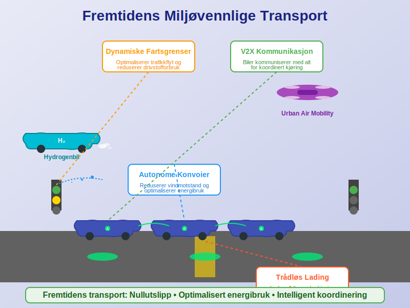
## Utdypende case-studier
### Case 1: Pendling til arbeid
**Scenario:** 40 km daglig pendling, 220 arbeidsdager per år
**Tradisjonell kjøring:**
* Årlig kjørelengde: 8,800 km
* Gjennomsnittlig forbruk: 0.8L/mil
* Årlig drivstofforbruk: 704 liter
* Årlig kostnad: ~NOK 15,000
**Med miljøvennlig kjøring:**
* Redusert forbruk: 0.55L/mil (31% bedre)
* Årlig drivstofforbruk: 484 liter
* Årlig kostnad: ~NOK 10,300
* **Årlig besparelse: NOK 4,700**
### Case 2: Familie med barn
**Scenario:** Familie med mange korte turer - skole, aktiviteter, handel
**Problemer:**
* Mange kaldstarter øker forbruk
* Korte turer hindrer motor i å bli varm
* Ineffektiv ruteplanlegging
**Løsninger:**
* **Kombiner turer** - følg barnet til skole og handle på veien hjem
* **Sykle til nærmeste aktiviteter** (under 3 km)
* **Samkjør** med andre foreldre til mer avsidesliggende aktiviteter
* **Planlegg handleturer** - en stor tur per uke i stedet for flere små
**Resultat:** 25-40% reduksjon i drivstofforbruk og transport-relaterte utslipp.
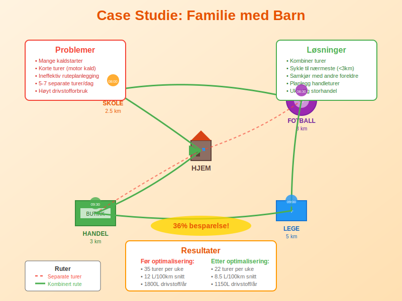
### Case 3: Elbil optimalisering
**Scenario:** Elbil med 400 km rekkevidde, blandet kjøring
**Optimaliseringsstrategier:**
* **Forhåndsklimatisering** mens bilen lader hjemme
* **Regenerativ bremsing** - planlegg bremsing i god tid
* **Eco-modus** på lengre turer for maksimal rekkevidde
* **Ruteplanlegging** med ladestoppesteder
**Miljøfordeler:**
* Ingen lokale utslipp
* Norsk strøm er ~98% fornybar
* Redusert støy i urbane områder
* Mindre mikropartikler fra bremsestøv
## Internasjonalt perspektiv
### Norge sammenlignet med andre land
**Norges unike situasjon:**
* **Høy andel fornybar energi** gjør elbiler spesielt miljøvennlige
* **Høye drivstoffpriser** gir sterk insentiv for miljøvennlig kjøring
* **Krevende klimatiske forhold** krever tilpassede teknikker
* **Omfattende elbil-insentiver** fremmer miljøvennlig bilvalg
**Internasjonale standarder:**
* **EU-direktiver** for CO2-utslipp fra nye biler
* **Internasjonale kjørekurs** i miljøvennlig kjøring
* **Global erfaringsutveksling** om beste praksis
### Globale miljømål og lokal handling
Som norsk sjåfør bidrar du til **internasjonale klimamål**:
* **Parisavtalen** krever drastisk reduksjon i utslipp
* **FNs bærekraftsmål** inkluderer bærekraftig transport
* **EU Green Deal** påvirker norsk transportpolitikk
* **Ditt bidrag** til globale utslippsmål through lokal handling
## Avanserte teknikker for eksperter
### Hypermiling
**Hypermiling** er ekstrem miljøvennlig kjøring for maksimal drivstoffeffektivitet:
**Avanserte teknikker:**
* **Pulse and glide** - alternere mellom lett akselerasjon og frihjuling
* **Drafting** (med sikker avstand) bak større kjøretøy på motorveier
* **Ridge driving** - kjøre i hjulsporene for mindre rullemotstand
* **Engine-off coasting** på trygge nedoverbakker (kun for erfarne)
**Sikkerhetsadvarsler:**
* **Aldri** kompromiss sikkerhet for drivstoffbesparelse
* **Hold minimum sikker hastighet** i all trafikk
* **Vær forutsigbar** for andre trafikanter
* **Følg trafikkreglene** til enhver tid
### Mikrooptimalisering
**Detaljerte optimaliseringer** for dedikerte miljøkjørere:
* **Dekkvelg:** Smale dekk med lav rullemotstand
* **Motorolje:** Synthetisk olje med lav viskositet
* **Luftfilteret:** Høykvalitets luftfilter for bedre luftflow
* **Fyringsoptimalisering:** Regelmessig rensing av drivstoffsystem
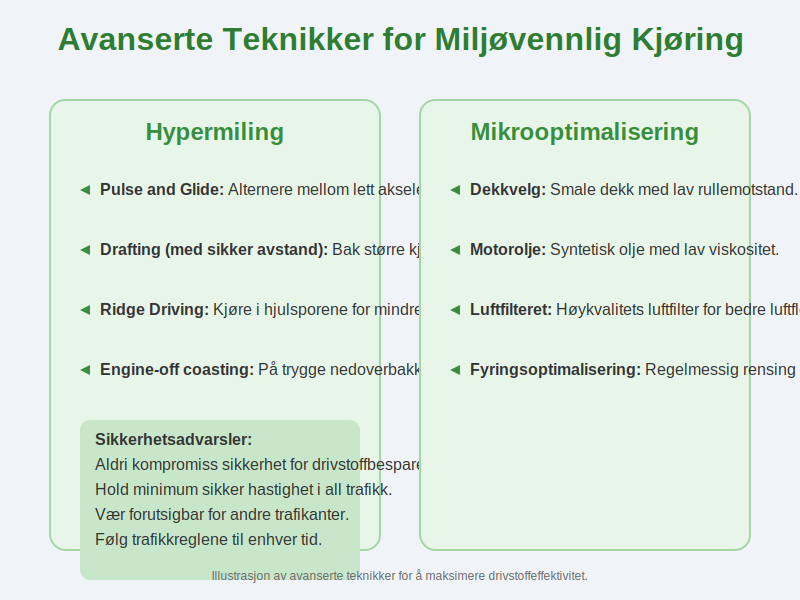
## Testing og måling
### Personlig miljøprestasjonsanalyse
**Etabler baseline og måle forbedringer:**
**Måleperiode:** Minimum 3 måneder for reliable data
**Nøkkeltall å følge:**
* **Drivstofforbruk** per 100 km
* **CO2-utslipp** per tur
* **Kostnad** per kjørte km
* **Antall turer** per uke som kunne vært unngått/kombinert
**Måleverktøy:**
* Bilens egen **tripcomputer** for nøyaktige forbruksdata
* **Smartphone-apper** for automatisk logging
* **Manuelle logger** for full kontroll over data
* **Sammenligningsberegninger** mot produsent-spesifikasjoner
**Benchmarks for success:**
* **20-30% reduksjon** i drivstofforbruk er realistisk
* **15-25% reduksjon** i totale transportkostnader
* **Forbedret kjøremømster** målt gjennom jevnere kjøring
### Familiens miljøregnskap
**For familier som ønsker å optimalisere samlet transportpåvirkning:**
| Måleområde | Baseline | Mål | Resultat |
|------------|----------|-----|----------|
| Drivstofforbruk/måned | 200L | 140L | 30% reduksjon |
| Antall bilturer/uke | 25 | 18 | 28% reduksjon |
| Kollektivtransport-andel | 5% | 20% | 300% økning |
| Gange/sykkel-andel | 10% | 25% | 150% økning |
## Myter og misforståelser
### Vanlige myter om miljøvennlig kjøring
**Myte:** "Miljøvennlig kjøring er farlig fordi du kjører saktere"
**Sannhet:** Miljøvennlig kjøring handler om **jevn hastighet** og **forutsigbarhet**, ikke nødvendigvis lavere hastighet.
**Myte:** "Det sparer så lite at det ikke er verdt innsatsen"
**Sannhet:** **20-40% besparelse** i drivstoffkostnader kan bety NOK 5,000-15,000 årlig for gjennomsnittlige sjåfører.
**Myte:** "Moderne biler gjør alt automatisk"
**Sannhet:** **Sjåførens teknikk** er fortsatt den største faktoren for drivstofforbruk, selv i nye biler.
**Myte:** "Elbiler løser alle miljøproblemer automatisk"
**Sannhet:** Miljøvennlig kjøring **forlenget rekkevidde** og reduserer **total miljøbelastning** selv for elbiler.
### Faktasjekk: Vanlige antagelser
**Antagelse:** "Diesel er alltid mer miljøvennlig enn bensin"
**Realitet:** Avhenger av **kjøremønster** - diesel er bedre for lange turer, bensin kan være bedre for korte bykturer.
**Antagelse:** "SUV-er er alltid dårlige for miljøet"
**Realitet:** **Kjøreteknikk** og **bruksmønster** kan være viktigere enn selve biltypen.
## Lovverk og reguleringer
### Norske miljøregler for kjøretøy
**Relevante reguleringer:**
* **EU-utslippsstandarder** som gjelder i Norge
* **Miljødifferensierte bompengesatser** som belønner miljøvennlige kjøretøy
* **Elbil-fordeler** som gratis parkering og tilgang til kollektivfelt
* **Krav til utslippsmålinger** ved EU-kontroll
### Fremtidige reguleringer
**Kommende endringer:**
* **Forbud mot fossilbiler** fra 2025 (nye personbiler)
* **Strengere utslippskrav** for eksisterende kjøretøy
* **Utvidede miljøsoner** i større byer
* **CO2-avgifter** basert på faktisk forbruk
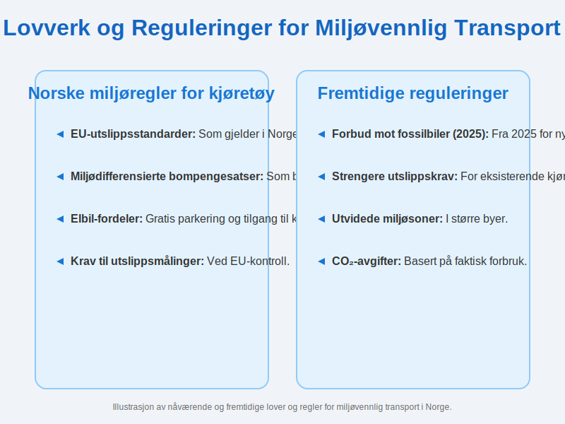
## Ressurser og videreutvikling
### Læremidler og kurs
**Utdanning og kursing:**
* **NAF EcoTraining** - nasjonale kurs i miljøvennlig kjøring
* **Online-ressurser** fra Statens vegvesen
* **Bilprodusentenes** egne kjørekurs og materiell
* **Yrkessjåførkurs** med fokus på drivstoffoptimalisering
### Sertifiseringer og kvalifikasjoner
**Profesjonelle kvalifikasjoner:**
* **Yrkessjåfør-sertifisering** med miljømodul
* **Bedriftskurs** for ansatte med firmabil
* **Instruktørutdanning** for å lære bort miljøvennlig kjøring
* **Internasjonale sertifiseringer** som anerkjennes i Norge
### Community og nettverk
**Fellesskap for miljøbevisste sjåfører:**
* **Online-forum** for erfaringsutveksling
* **Lokale grupper** som organiserer miljøkjøring-arrangementer
* **Social media-grupper** med tips og diskusjoner
* **Konkurranse** i miljøvennlig kjøring for motivasjon
## Sammendrag og nøkkelpunkter
**Miljøvennlig kjøring** er langt mer enn bare å kjøre saktere - det er en **helhetlig tilnærming** til transport som kombinerer smart teknologi, planlegging, kjøreteknikk og bevissthet om miljøpåvirkning.
**De viktigste prinsippene:**
1. **Jevn og forutsigbar kjøring** reduserer drivstofforbruk med 20-30%
2. **Smart reiseplanlegging** kan halvere antall nødvendige bilturer
3. **Riktig bilvedlikehold** sikrer optimal miljøprestasjon
4. **Moderne teknologi** som elbiler og kjøreassistentsystemer multipliserer miljøgevinstene
5. **Kontinuerlig læring** og tilpasning til nye teknologier og teknikker
**Økonomiske gevinster** på NOK 10,000-30,000 årlig gjør miljøvennlig kjøring til en **lønnsom investering** i tillegg til miljøfordelene.
**Miljøpåvirkningen** av dine kjørevalg rekker langt utover din egen økonomi - som ansvarlig sjåfør bidrar du til **renere luft**, **reduserte klimagassutslipp** og en **mer bærekraftig fremtid** for kommende generasjoner.
Ved å mestre prinsippene i denne artikkelen, kombinert med kunnskap fra [Fart og avstand](/blogs/teori/fart-og-avstand "Fart og avstand - Sikker hastighet og stoppdistanse"), [Plassering og kjøremåte](/blogs/teori/plassering-og-kjoremmate "Plassering og kjøremåte - Guide til riktig kjøreteknikk"), og [Vedlikehold av bilen](/blogs/teori/vedlikehold-av-bilen "Vedlikehold av bilen - Guide til regelmessig service og inspeksjon"), kan du bli en **ekspert** i miljøvennlig kjøring som tjener både miljøet, økonomien og samfunnet.
**Start i dag** med små endringer i kjørestilen din, og bygg gradvis opp til et helhetlig system for bærekraftig mobilitet.