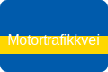

**Motorvei** og **motortrafikkvei** er to veityper i Norge med egne **skilt**, **fartsgrenser** og **trafikkregler**. Denne artikkelen gir en grundig gjennomgang av definisjoner, kjennetegn og praktiske forskjeller, slik at du er godt forberedt til førerprøven.
## Definisjoner

* **Motorvei**: En vei med full adgangskontroll, frakoblede kryss via ramper og høy standard for trygg og effektiv kjøring i høy hastighet.
* **Motortrafikkvei**: En vei med begrenset adgangskontroll, kan ha kryss på samme plan og lavere standard enn motorvei.
## Skilting og fartsgrenser
| Egenskap            | Motorvei                                    | Motortrafikkvei                              |
|---------------------|----------------------------------------------|-----------------------------------------------|
| **Skilt**           | Blått skilt med hvit motorvei-symbol         | Blått skilt med gul stripe                    |
| **Fartsgrense**     | 110 km/t (noen steder 100–110 km/t)          | 90 km/t                                       |
| **Kryssing**        | Fullt frakoblede kryss via ramper            | Kan ha kryss på samme plan                    |
| **Adgang**          | Kun motorvogner                              | Kun motorvogner                               |
| **Formål**          | Høy kapasitet og sikkerhet ved høy hastighet | Raskere fremkommelighet enn vanlig vei        |
* For mer om fartsgrenser på ulike veinivåer, se [Fartsgrenser](/blogs/teori/fartsgrenser "Fartsgrenser - Oversikt over fartsgrenser i Norge").
## Adgang og trafikkregler
Begge veitypene tillater kun [motorvogner](/blogs/teori/motorvogn-definisjon "Motorvogn (definisjon)"). På motorvei er det ingen fotgjengere, syklister eller mopeder, mens motortrafikkvei kan ha restriksjoner skiltet i enkelte områder.
## Viktige kjennetegn
1. **Høyeste standard** vs **lavere standard**
2. **Fartsgrenser**: 110 km/t vs 90 km/t
3. **Kryssnivå**: Ramper vs plan-kryss
## Oppsummering
For å oppsummere er **motorvei** og **motortrafikkvei** to distinkte veityper som krever kjennskap til **skilt**, **fartsgrenser** og **regler**. En klar forståelse av forskjellene er avgjørende for sikker kjøring og for å bestå teoriprøven.
---
For en fullstendig sammenligning av alle aspekter ved disse veitypene, se [Motorvei vs motortrafikkvei](/blogs/teori/motorvei-vs-motortrafikkvei "Motorvei vs motortrafikkvei - Forskjeller, fartsgrenser og skilt").