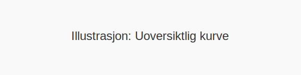

**Parkering på uoversiktlig kurve** er forbudt i henhold til **Trafikkreglene** og er avgjørende for **trafikksikkerhet**. Når du parkerer i en uoversiktlig kurve, kan møtende trafikanter få svært begrenset sikt, noe som øker risikoen for alvorlige ulykker.
## Hva er en uoversiktlig kurve?
En *uoversiktlig kurve* kjennetegnes ved at siktlinjen er sterkt redusert, for eksempel ved:
* Toppen av en bakketopp som ligger rett før en skarp sving
* Vegetasjon, bygg eller andre hindringer som blokkerer sikten
* Smale veier med innsyn slik at møte- og forbikjøringsmuligheter er skjult

## Regelverk og forbud
Parkering i uoversiktlige kurver er regulert av **Trafikkreglene §12**, som tydelig pålegger forbud mot parkering der sikten er begrenset. Dette for å sikre at trafikanter kan se hverandre i tide og unngå kollisjoner.
| Regelverk              | Innhold                                                       |
|------------------------|---------------------------------------------------------------|
| Trafikkreglene §12     | Forbud mot parkering i kurver og på steder med begrenset sikt |
| Forbikjøringsforbud    | Se [Landeveiskjøring](/blogs/teori/landeveiskjoring "Landeveiskjøring - Hastighet, plassering og svingteknikk") for gjeldende regler om forbikjøring i kurver |
| Siktregler             | Se [De 5 se-reglene](/blogs/teori/de-5-se-reglene "De 5 se-reglene") for grunnleggende siktsjekker før manøver |
## Risiko ved feilparkering
Feilparkering i en uoversiktlig kurve kan føre til:
| Risiko                      | Konsekvens                                          |
|-----------------------------|-----------------------------------------------------|
| Redusert sikt               | Uventet møte med kjøretøy, syklister eller fotgjengere |
| Manglende reaksjonstid      | Utilstrekkelig tid til å bremse eller styre unna    |
| Alvorlige kollisjoner       | Store skader på kjøretøy og personskader            |
| Kjøring i blind sone        | Økt risiko for forbikjøringsulykker                 |
## Alternative parkeringsmuligheter
Dersom du trenger å parkere i nærheten av en uoversiktlig kurve, bør du vurdere tryggere alternativer:
| Alternativ plassering           | Fordeler                               |
|---------------------------------|----------------------------------------|
| Rett før kurven med fri sikt    | God sikt både fremover og bakover      |
| Etter kurven, utenfor synsrekkevidde | Unngår hindring av møtebane           |
| [Møteplass](/blogs/teori/parkering-pa-moteplass "Parkering på møteplass - regler og beste praksis for smale veier") | Utvidet veikant som gir plass til møtende trafikk |
| Parkeringslomme eller avkjørsel | Beskyttet område, egen parkeringsplass |
| Parkeringsplass i veiens forlengelse | Oversiktlig veiavsnitt              |
## Praktiske tips for sikker parkering
* Planlegg parkeringen i god tid før du kommer til kurven  
* Bruk blinklys for å signalisere intensjonen din  
* Sjekk at det ikke finnes lokale skilt eller styringer som fraviker generelt forbud  
* Velg alltid en plassering med minst 50 meter fri sikt på begge sider  
* Kombiner sjekk i speil med en rask hodeturn for å bekrefte fri sikt  
*For mer informasjon om generelle parkeringsregler, se [Trafikkregler om parkering](/blogs/teori/trafikkregler-om-parkering "Trafikkregler om parkering - regler, unntak og skilt").*
*For teknikker i trange parkeringssituasjoner, se [Rygging og parkering](/blogs/teori/rygging-og-parkering "Rygging og parkering - Komplett guide til trygg manøvrering ved førerkort").*
*For tips om plassering og kurvehåndtering, se [Landeveiskjøring](/blogs/teori/landeveiskjoring "Landeveiskjøring - Hastighet, plassering og svingteknikk").*