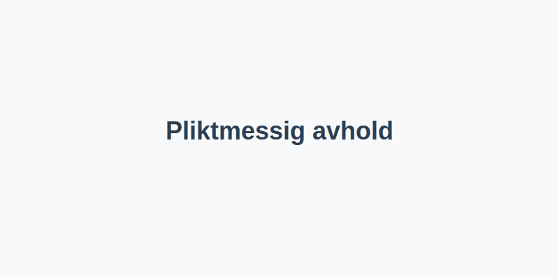

Pliktmessig avhold er et krav om at du _avstår helt fra alkohol_ i en gitt periode før eller under kjøring. Denne artikkelen gir en **omfattende oversikt** over hva pliktmessig avhold betyr, hvem det gjelder, og hvilke sanksjoner og dokumentasjonskrav som følger.

## Hva er pliktmessig avhold?
*Pliktmessig avhold* er et lovpålagt vilkår om total avhold fra alkohol som kan settes:
- Som reaksjon på tidligere alkohol- eller rusmiddelrelaterte overtredelser
- Som en del av medisinsk vurdering av skikkethet til å kjøre
- Ved inndratt førerett som betingelse for å få førerkortet tilbake
## Hvem omfattes av pliktmessig avhold?
| Sjåførgruppe                              | Vilkår                               |
|-------------------------------------------|--------------------------------------|
| Førere med alkoholrelatert førerkortinndragning | Må dokumentere avhold i minst 1 år   |
| Førere med alvorlig rusmiddelproblematikk | Avhold etter vurdering og attestasjon fra lege |
| Personer med helseplager som påvirker kjøring | Individuelt tilpasset avholdskrav     |
## Regelverk og sanksjoner
Pliktmessig avhold fastsettes ofte gjennom vilkår i førerkortet eller rettslig kjennelse. Manglende overhold kan føre til:
- Forlengelse av avholdsperioden eller ytterligere førerkortinndragning
- **Prikker** på førerkortet (se [Sperrefrist (prøvetid, prikker)](/blogs/teori/sperrefrist-provetid-prikker "Sperrefrist, prøvetid og prikker"))
- Tap av skikkethet (se [Skikkethet til å kjøre](/blogs/teori/skikkethet-til-a-kjore "Skikkethet til å kjøre"))
## Dokumentasjon og praktisk gjennomføring
| Dokumentasjon            | Beskrivelse                              |
|--------------------------|------------------------------------------|
| Legeattest               | Bekrefter at du har overholdt avholdskravet |
| Promilletester           | Periodiske tester som dokumenterer 0?‰ promille |
| Kurs og veiledning       | Bevis på gjennomført rusforebyggende kurs  |
## Tips for å overholde kravene
- Planlegg sosialt samvær uten alkohol i avholdsperioden
- Velg alkoholfrie alternativer som *mocktails* eller alkoholfrie øl
- Følg opp medisinske kontroller og avtalte testtidspunkter
- Ha oversikt over vilkårene fastsatt i [Lover og forskrifter](/blogs/teori/lover-og-forskrifter "Lover og forskrifter")
## Relaterte emner
Se også:
- [Alkohol, promillegrense og narkotika](/blogs/teori/alkohol-promillegrense-og-narkotika "Alkohol, promillegrense og narkotika")
- [Sperrefrist (prøvetid, prikker)](/blogs/teori/sperrefrist-provetid-prikker "Sperrefrist, prøvetid og prikker")
- [Skikkethet til å kjøre](/blogs/teori/skikkethet-til-a-kjore "Skikkethet til å kjøre")
- [Lover og forskrifter](/blogs/teori/lover-og-forskrifter "Lover og forskrifter")