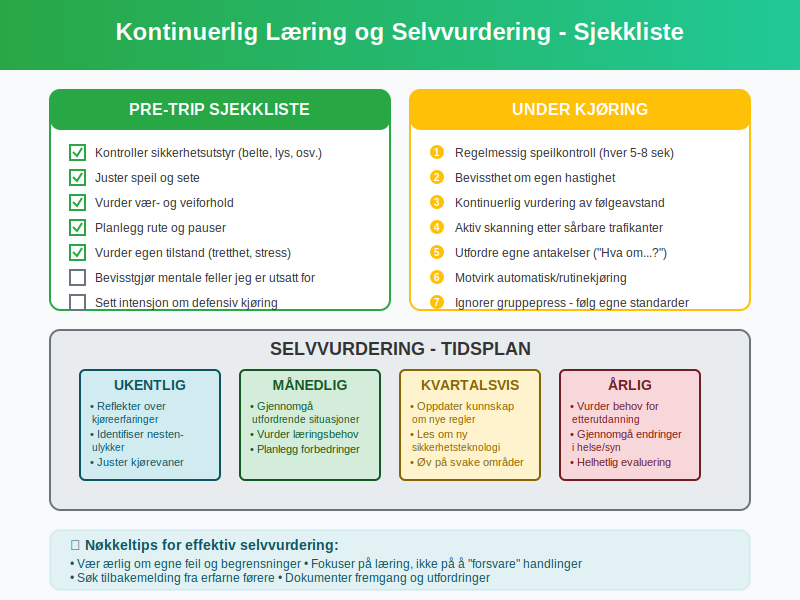

**Psykologiske feller** i trafikken er mentale snarveier og kognitive skjevheter som kan lede til farlige situasjoner og ulykker. Som fører er det essensielt å forstå hvordan hjernen din fungerer under kjøring, og hvilke *automatiske tankeprocesser* som kan påvirke din *dømmekraft* og *beslutningstaking* bak rattet.
Trafikken krever konstant **oppmerksomhet** og riktige beslutninger i løpet av sekunder. Våre mentale snarveier, som normalt hjelper oss å håndtere komplekse situasjoner raskt, kan også føre oss på villspor når det gjelder **trafikksikkerhet**.
For en grundig forståelse av hvordan mennesket fungerer i trafikken, se [Mennesket i trafikken](/blogs/teori/mennesket-i-trafikken "Mennesket i trafikken - Faktorer som påvirker kjøring"). For mer om fokus og kommunikasjon med andre trafikanter, les [Oppmerksomhet og samhandling](/blogs/teori/oppmerksomhet-og-samhandling "Oppmerksomhet og samhandling - Fokus og samarbeid i trafikken").
For mer om konkrete **mobil-distraksjoner**, se også [Distraksjoner ved mobilbruk](/blogs/teori/distraksjoner-mobil "Distraksjoner ved mobilbruk - Risiko, lover og tips").

## Hva er psykologiske feller?
**Psykologiske feller** er systematiske feil i tenkning som oppstår når hjernen bruker mentale snarveier (heuristikker) for å ta raske beslutninger. I trafikken kan disse fallene ha alvorlige konsekvenser fordi kjøring krever:
* Kontinuerlig **risikovurdering**
* Rask **beslutningstaking**
* Nøyaktig **persepsjon** av omgivelsene
* Realistisk vurdering av egne **ferdigheter**
Disse mentale snarveiene utviklet seg for å hjelpe oss å overleve i farlige situasjoner, men i dagens komplekse trafikkmiljø kan de føre til *feilvurderinger* og *ulykker*.

## De viktigste psykologiske fallene i trafikken
### 1. Oppmerksomhetsblindhet (Inattentional Blindness)
**Oppmerksomhetsblindhet** er fenomenet hvor du ikke registrerer objekter eller hendelser som er synlige, men som du ikke forventer å se. Dette er særlig farlig i trafikken.
**Eksempler på oppmerksomhetsblindhet:**
* Ikke se en **syklist** som kommer fra høyre i et kryss
* Overse **fotgjengere** i **gangfelt** når du fokuserer på trafikklys
* Ikke oppdage **motorcykler** i **blindsonen** ved **feltskifte**
* Miste **barn** som leker nær veien av syne
**Hvordan unngå oppmerksomhetsblindhet:**
* Aktiv **skanning** av omgivelsene - ikke bare se rett frem
* Bruk systematisk **speilbruk** som beskrevet i [Plassering og kjøremåte](/blogs/teori/plassering-og-kjoremmate "Plassering og kjøremåte - Riktig posisjonering på veien")
* **Senk farten** i komplekse trafikkområder
* Vær ekstra oppmerksom på **sårbare trafikanter** som beskrevet i [Trafikantgrupper og hensyn](/blogs/teori/trafikantgrupper-og-hensyn "Trafikantgrupper og hensyn - Samspill mellom ulike trafikanter")

### 2. Selvovervurdering (Overconfidence Bias)
**Selvovervurdering** er tendensen til å overvurdere egne ferdigheter og undervurdere risiko. Dette er en av de mest farlige psykologiske fallene for førere.
**Manifestasjoner av selvovervurdering:**
* **Overvurderer** egne kjøreferdigheter sammenlignet med andre
* **Undervurderer** sannsynligheten for å være involvert i ulykker
* Tar unødvendige **risker** fordi "det går alltid bra"
* Ignorerer **værforhold** og **veiforhold** som påvirker kjøringen
**Konsekvenser av selvovervurdering:**
| Område | Risikoadferd | Mulige konsekvenser |
|--------|-------------|---------------------|
| **Hastighet** | Kjører for fort i forhold til forholdene | Tap av kontroll, lengre [bremseavstand](/blogs/teori/fart-og-avstand "Fart og avstand - Hastighet og sikkerhet") |
| **Avstand** | For kort følgeavstand | Påkjøring bakfra, ikke tid til å reagere |
| **Forbikjøring** | Risikable [forbikjøringer](/blogs/teori/forbikjoring-og-feltskifte "Forbikjøring og feltskifte - Sikker forbikjøring") | Frontalkollisjon, påkjøring |
| **Værforhold** | Ikke tilpasse kjøring til [vanskelige forhold](/blogs/teori/kjoring-under-vanskelige-forhold "Kjøring under vanskelige forhold - Regn, snø og is") | Utforkjøring, tap av veigrepet |
### 3. Bekreftelsesbias (Confirmation Bias)
**Bekreftelsesbias** er tendensen til å søke, tolke og huske informasjon som bekrefter eksisterende oppfatninger og antakelser.
**Bekreftelsesbias i trafikken:**
* **Antar** at andre trafikanter vil oppføre seg forutsigbart
* **Ignorerer** advarende signaler som ikke passer med forventningene
* **Forklarer** bort farlige situasjoner som "engangstilfeller"
* **Fokuserer** bare på informasjon som støtter egne kjørevaner
**Praktiske eksempler:**
* Du **antar** at en bil vil stoppe foran **vikepliktskilt**, selv om den ikke bremser
* Du **ignorerer** en bils **blinklys** fordi du ikke forventer at den skal svinge - les mer om [kommunikasjon med andre trafikanter](/blogs/teori/kommunikasjon-med-andre-trafikanter "Kommunikasjon med andre trafikanter")
* Du **undervurderer** farene ved [kjøring i mørket](/blogs/teori/kjoring-i-morket "Kjøring i mørket - Sikker nattekjøring") fordi du har kjørt den ruten mange ganger før
### 4. Normalisering av avvik (Normalization of Deviance)
**Normalisering av avvik** oppstår når du gradvis blir vant til risikofylte situasjoner og begynner å akseptere dem som "normale".
**Hvordan normalisering skjer:**
1. **Første gang** du bryter en regel (f.eks. kjører litt for fort) og ingenting skjer
2. **Gjentagelse** av samme risikoadferd uten konsekvenser
3. **Gradvis økning** av risikonivået
4. **Aksept** av farlig adferd som "normal"
**Typiske eksempler på normalisering:**
* Gradvis **økning av hastighet** på kjente veistrekninger
* **Kortere følgeavstand** på motorveien
* Stadig **trangere** [forbikjøringer](/blogs/teori/forbikjoring-og-feltskifte "Forbikjøring og feltskifte - Sikker forbikjøring")
* **Mindre fokus** på [sikkerhetsutstyr](/blogs/teori/kjoretoyets-sikkerhetsutstyr "Kjøretøyets sikkerhetsutstyr - Viktige sikkerhetssystemer") som bilbelte

### 5. Optimismebias
**Optimismebias** er tendensen til å tro at negative hendelser er mindre sannsynlige for deg enn for andre.
**Optimismebias i trafikken:**
* "**Ulykker** skjer andre, ikke meg"
* "Jeg er en **bedre fører** enn gjennomsnittet"
* "Jeg har **kontroll** over situasjonen"
* "**Risikoadferd** er ikke så farlig når jeg gjør det"
**Konsekvenser av optimismebias:**
* **Redusert bruk** av [sikkerhetsutstyr](/blogs/teori/sikring-av-last-og-passasjerer "Sikring av last og passasjerer - Bilbelte og barnesikkerhet")
* **Mindre oppmerksomhet** på [risikovurdering](/blogs/teori/risikovurdering-i-praksis "Risikovurdering i praksis - Praktisk risikovurdering i trafikken")
* **Økt risikoadferd** fordi konsekvensene oppfattes som usannsynlige
* **Mindre forberedelse** til [vanskelige kjøreforhold](/blogs/teori/kjoring-under-vanskelige-forhold "Kjøring under vanskelige forhold - Regn, snø og is")
### 6. Gruppepress og sosial påvirkning
**Gruppepress** i trafikken kan føre til at du tilpasser kjørestilen din til andres forventninger i stedet for til sikkerhetskrav.
**Former for gruppepress:**
* **Hastighetspress** - kjøre like fort som trafikken rundt deg
* **Aggressiv kjøring** - "matcher" andres aggressive adferd
* **Risikoaksept** - tar større risker når andre er til stede
* **Sosial validering** - bruker andres adferd som rettesnor
**Hvordan motvirke gruppepress:**
* **Behold** egne sikkerhetsstandarder uavhengig av andre
* **Husk** at din sikkerhet er viktigere enn andres meninger
* **Vær rollemodell** for sikker kjøring
* **Forstå** at andre også kan ta feil beslutninger

## Sammenheng mellom psykologiske feller og ulykkestyper
Ulike psykologiske feller bidrar til spesifikke typer trafikkulykker:
### Kryssulykker
**Hovedårsaker:**
* **Oppmerksomhetsblindhet** - ikke ser andre trafikanter
* **Bekreftelsesbias** - antar at andre følger [vikepliktregler](/blogs/teori/vikeplikt-og-rundkjoringer "Vikeplikt og rundkjøringer - Navigering i kryss")
* **Selvovervurdering** - overvurderer egen evne til å vurdere andre bilers hastighet
### Påkjøring bakfra
**Hovedårsaker:**
* **Selvovervurdering** av egen **reaksjonstid**
* **Normalisering** av for kort følgeavstand
* **Distraksjon** og redusert oppmerksomhet
### Utforkjøring
**Hovedårsaker:**
* **Optimismebias** - undervurderer risiko ved høy hastighet
* **Selvovervurdering** av kontroll over kjøretøyet
* **Normalisering** av risikofylt kjøring på kjente veier

## Strategier for å unngå psykologiske feller
Disse strategiene er grunnleggende elementer i [defensiv kjøring](/blogs/teori/defensiv-kjoring "Defensiv kjøring - Forebyggende kjøreteknikker"), som tar høyde for menneskelige begrensninger og feilkilder.
### 1. Utvikle metakognisjon
**Metakognisjon** er å "tenke om tenkningen" - å være bevisst på egne mentale prosesser.
**Praktiske teknikker:**
* **Spør deg selv:** "Hva antar jeg i denne situasjonen?"
* **Utfordre antakelser:** "Kan jeg ta feil?"
* **Vurder alternativer:** "Hva kan gå galt?"
* **Reflekter over kjøring:** Tenk gjennom dagens kjøring etterpå
### 2. Systematisk observasjon
**Strukturer oppmerksomheten** for å unngå blindsoner i persepsjonen:
**SIPDE-metoden:**
* **S**øk (Search) - aktiv skanning av omgivelsene
* **I**dentifiser (Identify) - gjenkjenn potensielle farer
* **P**rediker (Predict) - forutsi hva som kan skje
* **D**ecider (Decide) - ta informerte beslutninger
* **E**xecute (Execute) - gjennomfør handlingen
### 3. Bruk av sjekklister
**Systematisk bruk av sjekklister** kan hjelpe deg å unngå å overse viktige elementer:
**Pre-trip sjekkliste:**
* [ ] Kontroller [sikkerhetsutstyr](/blogs/teori/kjoretoyets-sikkerhetsutstyr "Kjøretøyets sikkerhetsutstyr - Viktige sikkerhetssystemer")
* [ ] Juster speil og sete
* [ ] Vurder vær- og [veiforhold](/blogs/teori/kjoring-under-vanskelige-forhold "Kjøring under vanskelige forhold - Regn, snø og is")
* [ ] Planlegg rute og pauser
* [ ] Vurder egen tilstand (tretthet, stress)
**Under kjøring sjekkliste:**
* [ ] Regelmessig speilkontroll
* [ ] Bevissthet om egen hastighet
* [ ] Vurdering av følgeavstand
* [ ] Oppmerksomhet på [sårbare trafikanter](/blogs/teori/trafikantgrupper-og-hensyn "Trafikantgrupper og hensyn - Samspill mellom ulike trafikanter")
### 4. Kontinuerlig læring og selvvurdering
**Realistisk selvvurdering** er avgjørende for trafikksikkerhet:
**Evalueringsmomenter:**
* **Månedlig:** Gjennomgå kjøreerfaringer og nesten-ulykker
* **Etter utfordrende kjøring:** Analyser hva som gikk bra og hva som kunne vært bedre
* **Ved regelendringer:** Oppdater kunnskaper om [lover og forskrifter](/blogs/teori/lover-og-forskrifter "Lover og forskrifter - Juridiske rammer for kjøring")
* **Årlig:** Vurder behov for [etterutdanning](/blogs/teori/trafikalt-grunnkurs "Trafikalt grunnkurs - Grunnleggende trafikkunnskap")

### 5. Mentale modeller og scenario-tenkning
**Utvikle mentale modeller** for vanlige trafikksituasjoner:
**"Hva-om" tenkning:**
* "Hva om bilen foran bremser plutselig?"
* "Hva om det kommer en syklist fra høyre?"
* "Hva om det blir **glatt** under [kjøring i mørket](/blogs/teori/kjoring-i-morket "Kjøring i mørket - Sikker nattekjøring")?"
* "Hva om jeg får [problemer med kjøretøyet](/blogs/teori/handtering-av-nodsituasjoner "Håndtering av nødsituasjoner - Akutte trafikksituasjoner")?"
**Scenario-planlegging:**
1. **Identifiser** typiske situasjoner du møter
2. **Tenk gjennom** mulige komplikasjoner
3. **Planlegg** responser på forhånd
4. **Øv** mentalt på håndtering av situasjonene
## Teknologi som hjelp mot psykologiske feller
Moderne kjøretøy har **sikkerhetssystemer** som kan kompensere for noen psykologiske feller:
### Oppmerksomhetsstøtte
* **Blindsone-varsling** - kompenserer for oppmerksomhetsblindhet
* **Krysstrafikk-varsling** - hjelper med å oppdage trafikanter i kryss
* **Fotgjenger-deteksjon** - varsler om sårbare trafikanter
### Hastighetskontroll
* **Adaptiv cruisekontroll** - opprettholder sikker følgeavstand
* **Hastighetsvarsling** - motvirker normalisering av for høy fart
* **Intelligente fartsgrensesystemer** - tilpasser hastighet automatisk
### Nødbremssystemer
* **Automatisk nødbremsing** - kompenserer for sent oppdagede farer
* **Kollisjonsvarsling** - gir tidlig advarsel om potensielle sammenstøt
**Viktig:** Teknologi er en **støtte**, ikke en **erstatning** for årvåken og ansvarlig kjøring. Du må fortsatt være en aktiv og oppmerksom fører.

## Spesielle utfordringer for nye førere
**Nye førere** er særlig utsatt for psykologiske feller på grunn av:
* **Begrenset erfaring** med å gjenkjenne farlige situasjoner
* **Overvurdering** av egne ferdigheter etter [oppkjøring](/blogs/teori/oppkjoring "Oppkjøring - Forberedelse til førerprøven")
* **Sosiale press** fra venner og familie
* **Manglende bevissthet** om egne mentale begrensninger
**Anbefalinger for nye førere:**
1. **Start gradvis** med kjøring i enkle forhold
2. **Øv regelmessig** på ulike typer situasjoner
3. **Søk veiledning** fra erfarne førere
4. **Delta på etterutdanning** som [Trafikalt grunnkurs](/blogs/teori/trafikalt-grunnkurs "Trafikalt grunnkurs - Grunnleggende trafikkunnskap")
5. **Vær ydmyk** overfor egne begrensninger
## Miljøfaktorer som forsterker psykologiske feller
Visse miljøfaktorer kan **forsterke** effekten av psykologiske feller:
### Tidspress
* **Øker risikoadferd** som høy hastighet og trange forbikjøringer
* **Reduserer oppmerksomhet** på sikkerhet
* **Fører til shortcuts** i mental prosessering
### Tretthet
* **Svekker dømmekraft** og øker risiko for feilbeslutninger
* **Reduserer oppmerksomhet** og øker blindhet for farer
* **Gjør deg mer følsom** for sosiale påvirkninger
### Stress og emosjonelle tilstander
* **Sinne** kan føre til aggressiv kjøring og risikoadferd
* **Angst** kan føre til overdreven forsiktighet eller "analysis paralysis"
* **Eufori** kan føre til overvurdering av egne ferdigheter
**Strategier for å håndtere miljøfaktorer:**
* **Planlegg tid** for å unngå tidspress under kjøring, inkludert ekstra tid for parkering - se [avanserte parkeringsteknikker](/blogs/teori/parkering-for-viderekomne "Parkering for viderekomne - Stressmestring og avanserte teknikker") for å håndtere trange situasjoner mer effektivt
* **Ta pauser** ved tretthet - se [Forberedelser for en lang kjøretur](/blogs/teori/forberedelser-for-en-lang-kjoretur "Forberedelser for en lang kjøretur - Planlegging av lange turer")
* **Vurder alternativ transport** når du er i sterk emosjonell tilstand
* **Bruk avslapningsteknikker** før kjøring

## Testing av psykologiske feller på førerprøven
Det norske **førerprøvesystemet** tester kunnskap om psykologiske feller gjennom:
### Teoriprøven
**Typiske spørsmål:**
* Situasjoner hvor oppmerksomhetsblindhet kan oppstå
* Eksempler på selvovervurdering og konsekvenser
* Hvordan gruppepress påvirker kjørebeslutninger
* Strategier for å motvirke psykologiske feller
### Praktisk prøve
**Vurderingskriterier:**
* **Systematisk observasjon** og speilbruk
* **Realistisk risikovurdering** av situasjoner
* **Tilpasning av adferd** til værforhold og trafikk
* **Unngåelse av risikoadferd** som tyder på selvovervurdering
**Forberedelse:**
* Les grundig om [risikovurdering i praksis](/blogs/teori/risikovurdering-i-praksis "Risikovurdering i praksis - Praktisk risikovurdering i trafikken")
* Øv på å **verbalisere** dine observasjoner og vurderinger
* **Reflekter** over egne kjørevaner og mulige blindsoner
## Oppsummering og praktiske råd
**Psykologiske feller** er en naturlig del av menneskelig kognisjon, men i trafikken kan de ha alvorlige konsekvenser. Ved å forstå disse fallene og utvikle strategier for å motvirke dem, kan du bli en tryggere fører.
### Hovedpunkter å huske:
1. **Vær bevisst** på at du er utsatt for psykologiske feller
2. **Utfordre** egne antakelser og vurderinger regelmessig
3. **Bruk systematiske metoder** for observasjon og beslutningstaking
4. **Hold deg oppdatert** på egen kompetanse og begrensninger
5. **Tilpass kjøringen** til faktiske forhold, ikke til forventninger
### Daglige tiltak:
* **Start hver kjøretur** med bevisst oppmerksomhet på egne mentale tilstand
* **Bruk systematisk speilkontroll** for å motvirke oppmerksomhetsblindhet
* **Still deg kritiske spørsmål** om egne antagelser underveis
* **Vurder risiko** basert på faktiske forhold, ikke på vane eller gruppepress
* **Reflekter over kjøringen** etterpå for kontinuerlig læring
**Husk:** Målet er ikke å eliminere alle mentale snarveier - de er nødvendige for å fungere i komplekse situasjoner. Målet er å være **bevisst** på når de kan lede deg feil, og ha **strategier** for å korrigere kursen.
Ved å kombinere kunnskap om psykologiske feller med praktisk erfaring og kontinuerlig læring, utvikler du **defensive kjøreferdigheter** som beskrevet i [Defensiv kjøring](/blogs/teori/defensiv-kjoring "Defensiv kjøring - Forebyggende kjøreteknikker"). Dette bidrar til sikrere trafikk for alle.