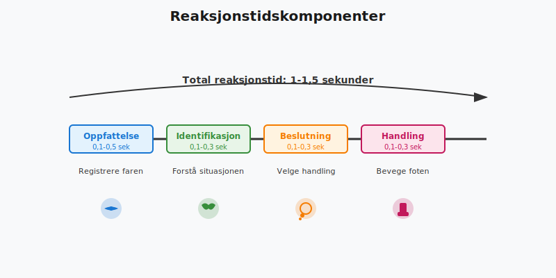

**Reaksjonstid og bremselengde** er fundamentale konsepter innen trafikksikkerhet som avgjør hvor lang tid og avstand det tar å stoppe et kjøretøy i en nødsituasjon. Disse faktorene er kritiske for alle bilførere og utgjør grunnlaget for mange viktige trafikkprinsipper som **følgeavstand**, **hastighetstilpasning** og **risikovurdering**.
*For en helhetlig forståelse av kjøreprosessen fra sanseinntrykk til handling, se [Trafikksituasjon og kjøreprosessen](/blogs/teori/trafikksituasjon-og-kjoreprosessen "Trafikksituasjon og kjøreprosessen - Sansing til handling, reaksjonstid m.m").*
*For mer om hvordan dette påvirker forebygging av frontkollisjoner, se [Møteulykker og forebygging](/blogs/teori/moteulykker-og-forebygging "Møteulykker og forebygging - Forebygging av frontkollisjoner i trafikken").*
*For mer om oppmerksomhetstid og total tid i kjøreprosessen, se [Reaksjonstid, oppmerksomhetstid og total tid](/blogs/teori/reaksjonstid-oppmerksomhetstid-totaltid "Reaksjonstid, oppmerksomhetstid og total tid - Tidskomponenter i kjøreprosessen").*

## Hva er reaksjonstid?
> **Reaksjonstid** er tiden fra du oppdager en fare til du begynner å bremse. For en våken, oppmerksom sjåfør under normale forhold er reaksjonstiden typisk **1–1,5 sekunder**, men kan variere betydelig avhengig av flere faktorer.
### Reaksjonstidskomponenter

Reaksjonstiden består av fire hovedfaser:
1. **Oppfattelsestid** (0,1-0,5 sek) - Tiden det tar å registrere faren
2. **Identifikasjonsstid** (0,1-0,3 sek) - Tiden det tar å forstå hva som skjer
3. **Beslutningstid** (0,1-0,3 sek) - Tiden det tar å bestemme seg for handling
4. **Handlingstid** (0,1-0,3 sek) - Tiden det tar å flytte foten til bremsepedalen
### Beregning av reaksjonsavstand
Reaksjonsavstanden er distansen bilen tilbakelegger i løpet av reaksjonstiden:
**Reaksjonsavstand = (Hastighet ÷ 10) × 3**

| Hastighet  | Reaksjonsavstand | Praktisk sammenligning        |
|------------|------------------|-------------------------------|
| **30 km/t**   | 9 meter          | Omtrent 2 biler i kø          |
| **50 km/t**   | 15 meter         | Halv fotballbane              |
| **70 km/t**   | 21 meter         | Over 5 biler på rekke         |
| **80 km/t**   | 24 meter         | Ca. 6 biler på rekke          |
| **90 km/t**   | 27 meter         | Nesten 7 biler på rekke       |
| **110 km/t**  | 33 meter         | Over 8 biler på rekke         |
### Faktorer som påvirker reaksjonstid

#### Fysiologiske faktorer:
* **Alder** - Eldre førere har ofte lengre reaksjonstid (1,5-2,5 sek)
* **Helse** - Sykdom, medisiner og fysiske begrensninger
* **Alkohol og rusmidler** - Kan øke reaksjonstiden til 2-4 sekunder
* **Tretthet** - Søvnmangel kan doble reaksjonstiden
#### Psykologiske faktorer:
* **Oppmerksomhet** - Distraksjoner øker reaksjonstiden betydelig
* **Erfaring** - Erfarne sjåfører reagerer ofte raskere
* **Forventning** - Uventede situasjoner gir lengre reaksjonstid
* **Stress** - Kan både forkorte og forlenge reaksjonstiden
#### Miljøfaktorer:
* **Sikt** - Dårlig sikt øker oppfattelsestiden
* **Kompleksitet** - Komplekse situasjoner krever lengre beslutningstid
* **Kjøreforholdene** - Vanskelige forhold krever mer oppmerksomhet
For mer om menneskelige faktorer, se [Mennesket i trafikken](/blogs/teori/mennesket-i-trafikken "Mennesket i trafikken - Faktorer som påvirker kjøring").
## Hva er bremselengde?
For mer om bremsesystemets oppbygning, hydrauliske kretser og væske, se [Bremsesystemet (bremsekretser, bremsevæske m.m)](/blogs/teori/bremsesystemet "Bremsesystemet (bremsekretser, bremsevæske m.m)").
> **Bremselengde** er distansen bilen tilbakelegger fra bremsene aktiveres til kjøretøyet kommer til fullstendig stopp. Bremselengden øker **kvadratisk** med hastigheten - dobler du hastigheten, blir bremselengden fire ganger så lang.
### Fysiske prinsipper bak bremsing

Bremselengden bestemmes av flere fysiske faktorer:
* **Kinetisk energi** - Øker med kvadratet av hastigheten (E = ½mv²)
* **Friksjon** - Mellom dekk og veioverflate
* **Vekt** - Tyngre kjøretøy krever mer energi for å stoppe
* **Bremsekraft** - Bilens bremsekapasitet
### Beregning av bremselengde
På **tørr asfalt** med gode dekk kan bremselengden estimeres ved:
**Bremselengde ˜ (Hastighet ÷ 10)²**

| Hastighet  | Tørr asfalt | Våt asfalt | Is/snø | Grus |
|------------|-------------|-------------|---------|------|
| **30 km/t**   | 9 m         | 18 m        | 27 m    | 13 m |
| **50 km/t**   | 25 m        | 50 m        | 75 m    | 36 m |
| **70 km/t**   | 49 m        | 98 m        | 147 m   | 70 m |
| **80 km/t**   | 64 m        | 128 m       | 192 m   | 92 m |
| **90 km/t**   | 81 m        | 162 m       | 243 m   | 116 m|
| **110 km/t**  | 121 m       | 242 m       | 363 m   | 173 m|
### Faktorer som påvirker bremselengde

#### Vei- og værforhold:
* **Tørt asfalt** - Beste bremsegrep (friksjon ˜ 0,8)
* **Våt asfalt** - Halvert bremsegrep (friksjon ˜ 0,4)
* **Is og snø** - Dramatisk redusert grep (friksjon ˜ 0,1-0,3)
* **Grus** - Varierende grep avhengig av kornstørrelse
* **Olje/diesel** - Ekstremt farlig, nærmest ingen friksjon
#### Kjøretøyfaktorer:
* **Dekkstand** - Slitte dekk reduserer bremseevnen betydelig
* **Dekktrykk** - Feil trykk påvirker kontaktflate med veien
* **Bremsesystem** - Slitte bremseklosser/skiver
* **ABS** - Forhindrer låsing, men øker ikke nødvendigvis bremseevnen
* **Vekt og last** - Tyngre kjøretøy krever lengre bremselengde
#### Bremseteknikk:
* **Panikk-bremsing** - Kan føre til hjullåsing uten ABS
* **Progresiv bremsing** - Gradvis økning av bremsekraft
* **Pumpe-bremsing** - På glatt underlag uten ABS
For mer om kjøring under vanskelige forhold, se [Kjøring under vanskelige forhold](/blogs/teori/kjoring-under-vanskelige-forhold "Kjøring under vanskelige forhold").
## Stoppeavstand - Den totale distansen
> **Stoppeavstand** er summen av reaksjonsavstand og bremselengde, og representerer den totale distansen fra du oppdager faren til bilen står stille.
**Stoppeavstand = Reaksjonsavstand + Bremselengde**

### Stoppeavstand ved ulike hastigheter
| Hastighet | Reaksjonsavstand | Bremselengde (tørt) | **Total stoppeavstand** |
|-----------|------------------|---------------------|-------------------------|
| **30 km/t**  | 9 m              | 9 m                 | **18 meter**            |
| **50 km/t**  | 15 m             | 25 m                | **40 meter**            |
| **70 km/t**  | 21 m             | 49 m                | **70 meter**            |
| **80 km/t**  | 24 m             | 64 m                | **88 meter**            |
| **90 km/t**  | 27 m             | 81 m                | **108 meter**           |
| **110 km/t** | 33 m             | 121 m               | **154 meter**           |
### Stoppeavstand på våt vei
På våt asfalt dobles bremselengden, noe som dramatisk øker den totale stoppeavstanden:
| Hastighet | Reaksjonsavstand | Bremselengde (våt) | **Total stoppeavstand** |
|-----------|------------------|---------------------|-------------------------|
| **50 km/t**  | 15 m             | 50 m                | **65 meter**            |
| **80 km/t**  | 24 m             | 128 m               | **152 meter**           |
| **110 km/t** | 33 m             | 242 m               | **275 meter**           |
## Praktiske følger av reaksjonstid og bremselengde
### Følgeavstand

**3-sekunders regelen** er basert på reaksjonstid og bremselengde:
* Ved **50 km/t**: 3 sekunder = 42 meter (tilnærmet lik stoppeavstanden på 40 m)
* Ved **80 km/t**: 3 sekunder = 67 meter (noe mindre enn stoppeavstanden på 88 m)
* Ved **110 km/t**: 3 sekunder = 92 meter (betydelig mindre enn stoppeavstanden på 154 m)
**Konklusjon**: 3-sekunders regelen gir tilstrekkelig sikkerhet ved lavere hastigheter, men på motorvei bør følgeavstanden økes.
For mer om følgeavstand, se [Fart og avstand](/blogs/teori/fart-og-avstand "Fart og avstand - Guide til hastighet og bremseavstand").
### Forbikjøring
Ved forbikjøring må du regne med at **både du og motgående trafikk** kan ha behov for nødbremsing:

* **Innhentingsavstand** - Distanse for å komme opp på siden av kjøretøyet foran
* **Forbikjøringsavstand** - Distanse for å passere helt
* **Sikkerhetsmargin** - Ekstra avstand for uforutsette hendelser
For mer om forbikjøring, se [Forbikjøring og feltskifte](/blogs/teori/forbikjoring-og-feltskifte "Forbikjøring og feltskifte - Teknikker og sikkerhet").
### Hastighetstilpasning

Hastigheten må tilpasses så stoppeavstanden aldri overstiger:
* **Sikten** - Du må kunne stoppe innenfor den avstanden du kan se
* **Veiens beskaffenhet** - Svinger, bakketopper, kryss
* **Trafikksituasjonen** - Tett trafikk krever lavere hastighet
* **Værforholdene** - Regn, snø og is krever betydelig hastighetstilpasning
## Moderne teknologi og bremsesystemer
### ABS (Anti-lock Braking System)

**ABS forhindrer hjullåsing** ved kraftig bremsing:
**Fordeler:**
* Beholder styrekontroll under bremsing
* Forhindrer sklidding og sladding
* Optimaliserer bremsekraft på ulike underlag
**Begrensninger:**
* Reduserer ikke nødvendigvis bremselengden på tørt underlag
* Kan øke bremselengden på løs grus eller snø
* Krever riktig bremseteknikk (fast, kontinuerlig trykk)
### Elektronisk bremsekraftfordeling (EBD)
EBD optimaliserer bremsekraften mellom for- og bakhjul basert på:
* Lastenfordeling
* Veigrep
* Bremsesituasjon
For en mer detaljert gjennomgang av **fordeling av bremsekraft** og **skjevtrekk**, se [Fordeling av bremsekraft og skjevtrekk](/blogs/teori/fordeling-av-bremsekraft-og-skjevtrekk "Fordeling av bremsekraft og skjevtrekk").
### Nødbremseassistent (Emergency Brake Assist)
Moderne systemer kan:
* **Detektere** hindringer med radar/kamera
* **Varsle** føreren om fare
* **Bremse automatisk** hvis føreren ikke reagerer
For mer om sikkerhetsutstyr, se [Kjøretøyets sikkerhetsutstyr](/blogs/teori/kjoretoyets-sikkerhetsutstyr "Kjøretøyets sikkerhetsutstyr").
## Spesielle situasjoner
### Bremsing på motorvei

På motorvei er det spesielle hensyn:
* **Høy hastighet** gir ekstremt lange stoppeavstander
* **Bakenforliggende trafikk** kan ikke stoppe i tide
* **Nødstopp** skal kun gjøres ved akutt fare
* **Gradvis retardasjon** er ofte tryggere enn kraftig bremsing
For mer om motorveikjøring, se [Motorveikjøring](/blogs/teori/motorveikjoring "Motorveikjøring - Teknikker og sikkerhet").
### Bremsing med tilhenger

Tilhenger påvirker bremsegenskaper betydelig:
* **Økt vekt** gir lengre bremselengde
* **Vektfordeling** påvirker stabilitet
* **Tilhengerbremser** må være kalibrert riktig
* **Sladdefare** øker ved kraftig bremsing
For mer om tilhengerkjøring, se [Kjøring med tilhenger](/blogs/teori/kjoring-med-tilhenger "Kjøring med tilhenger").
For mer om konsekvenser av tung last i bil eller tilhenger, se [Tung last - konsekvenser](/blogs/teori/tung-last-konsekvenser "Tung last - konsekvenser for kjøreegenskaper, bremselengde og blendingsfare").
### Nødbremsing

**Riktig nødbremseteknikk:**
1. **Press bremsepedalen kraftig og kontinuerlig** (ikke pump hvis du har ABS)
2. **Hold rattet fast** med begge hender
3. **Forbered deg på kraftig retardasjon**
4. **Se etter fluktvei** hvis bremsing ikke er nok
**Uten ABS:**
* Brems så kraftig som mulig uten hjullåsing
* Hvis hjulene låser seg, slipp opp litt på bremsepedalen
* Pumpe-bremsing kan være nødvendig på glatt underlag
Nødbremsing er ofte første steg i håndtering av kritiske situasjoner. For komplett oversikt over hvordan du håndterer situasjoner der nødbremsing ikke er tilstrekkelig, se [Håndtering av nødsituasjoner](/blogs/teori/handtering-av-nodsituasjoner "Håndtering av nødsituasjoner - Komplett guide til nødhåndtering i trafikken").
## Juridiske aspekter
### Ansvar ved påkjørsel bakfra

**Hovedregel:** Den som kjører på bakfra har alltid ansvar, fordi:
* Du skal **holde tilstrekkelig avstand** til kjøretøyet foran
* Du skal **kunne stoppe** innenfor den avstanden du kan se er fri
* **Bakenforliggende trafikk** er ikke en unnskyldning for utilstrekkelig avstand
**Unntak finnes** ved:
* Ulovlig/plutselig avbremsing fra forankjørende
* Teknisk svikt på forankjørende kjøretøy
* Påkjørsel fra tredje part
### Lovkrav til bremsesystem
Vegtrafikkloven krever at kjøretøy skal ha:
* **Hovedbremsesystem** som kan stoppe kjøretøyet effektivt
* **Parkbremse** som kan holde kjøretøyet i stillstand
* **Periodisk kontroll** av bremsesystemet ved EU-kontroll
For mer om lover og forskrifter, se [Lover og forskrifter](/blogs/teori/lover-og-forskrifter "Lover og forskrifter i trafikken").
## Råd for trygg kjøring
### Planlegging og forebygging

**Før kjøring:**
* Kontroller at bremsene fungerer normalt
* Sjekk dekkstand og dekktrykk
* Vurder vær- og kjøreforhold
**Under kjøring:**
* Tilpass hastigheten til forholdene
* Hold tilstrekkelig følgeavstand
* Vær ekstra forsiktig ved dårlig sikt
* Unngå plutselige manøvrer
For en helhetlig tilnærming til forebyggende kjøring, se [defensiv kjøring](/blogs/teori/defensiv-kjoring "Defensiv kjøring - Prinsipper og teknikker for trygg kjøring").
### Vedlikehold av bremsesystem
**Regelmessig kontroll:**
* Bremsevæskenivå og -kvalitet
* Bremseklosser/bakker
* Bremseskiver/trommer
* Bremserør og -slanger
**Varselsignaler:**
* Skrikende lyder ved bremsing
* Vibrering i bremsepedal eller ratt
* Lang pedalslagvei
* Bil som trekker til siden ved bremsing
For mer om vedlikehold, se [Vedlikehold av bilen](/blogs/teori/vedlikehold-av-bilen "Vedlikehold av bilen").
## Oppsummering
**Reaksjonstid og bremselengde** er grunnleggende konsepter som påvirker alle aspekter av trygg kjøring:
### Viktige punkter å huske:
* **Normal reaksjonstid** er 1-1,5 sekunder, men kan økes av mange faktorer
* **Bremselengden øker kvadratisk** med hastigheten
* **Stoppeavstanden** er summen av reaksjons- og bremselengde
* **Værforhold** påvirker bremselengden dramatisk
* **Følgeavstand** må tilpasses hastighet og forhold
* **Moderne teknologi** hjelper, men kan ikke erstatte god dømmekraft
### For teoriprøven:
* Lær formlene for reaksjons- og bremselengde
* Forstå hvordan ulike faktorer påvirker begge komponentene
* Kunne beregne stoppeavstand ved ulike hastigheter
* Forstå sammenhengen med følgeavstand og hastighetstilpasning
**Å mestre disse konseptene er essensielt for å bli en trygg og kompetent bilfører.**
## Relaterte emner
* [Mennesket i trafikken](/blogs/teori/mennesket-i-trafikken "Mennesket i trafikken - Faktorer som påvirker kjøring")
* [Fart og avstand](/blogs/teori/fart-og-avstand "Fart og avstand - Guide til hastighet og bremseavstand")
* [Kjøring under vanskelige forhold](/blogs/teori/kjoring-under-vanskelige-forhold "Kjøring under vanskelige forhold")
* [Kjøretøyets sikkerhetsutstyr](/blogs/teori/kjoretoyets-sikkerhetsutstyr "Kjøretøyets sikkerhetsutstyr")
* [Forbikjøring og feltskifte](/blogs/teori/forbikjoring-og-feltskifte "Forbikjøring og feltskifte - Teknikker og sikkerhet")
* [Motorveikjøring](/blogs/teori/motorveikjoring "Motorveikjøring - Teknikker og sikkerhet")
* [Kjøring med tilhenger](/blogs/teori/kjoring-med-tilhenger "Kjøring med tilhenger")
* [Defensiv kjøring](/blogs/teori/defensiv-kjoring "Defensiv kjøring - Prinsipper og teknikker")
* [Vedlikehold av bilen](/blogs/teori/vedlikehold-av-bilen "Vedlikehold av bilen")
* [Psykologiske feller i trafikken](/blogs/teori/psykologiske-feller-i-trafikken "Psykologiske feller i trafikken")