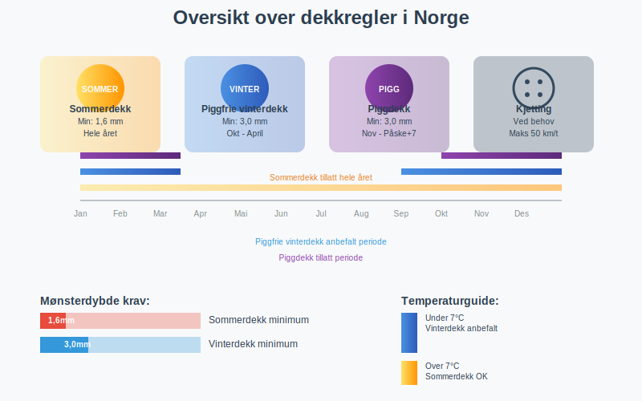
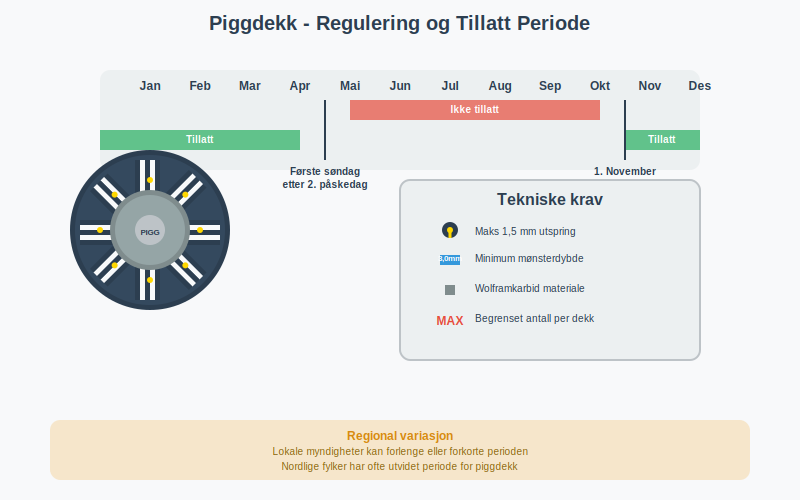
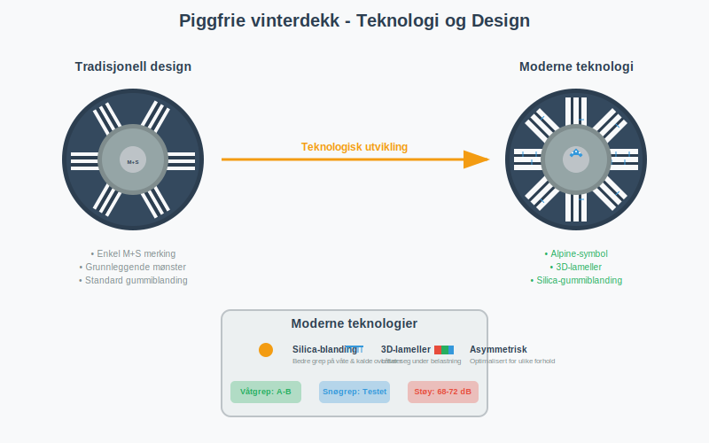
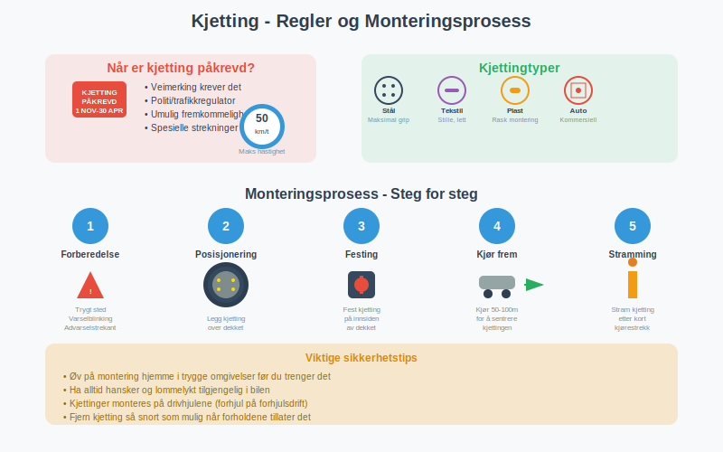
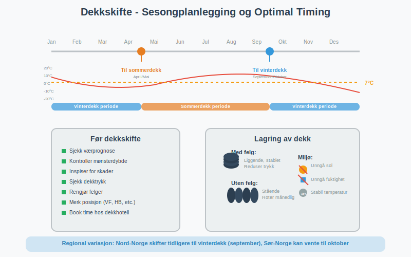
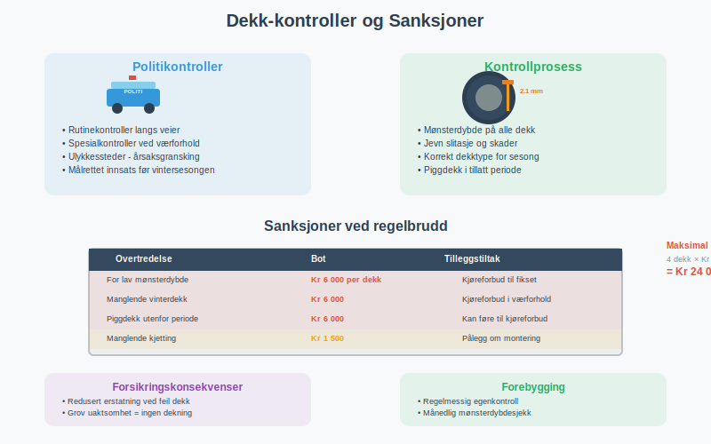

**Regler for dekk og kjetting** er fundamentale for sikker kjøring under norske vær- og veiforhold. Dette regelverket omfatter **mønsterdybdekrav**, **piggdekkregulering**, **kjettingbruk** og **sesongbaserte restriksjoner** som alle bilførere må beherske for å kjøre lovlig og trygt. Forståelse av disse reglene er avgjørende for **trafikksikkerhet** og kan være forskjellen mellom en trygg reise og en farlig situasjon.
## Relaterte artikler
For grunnleggende kjøreferdigheter under utfordrende forhold, se [Kjøring under vanskelige forhold](/blogs/teori/kjoring-under-vanskelige-forhold "Kjøring under vanskelige forhold - Comprehensive guide to challenging driving conditions") og [Kjøring i mørket](/blogs/teori/kjoring-i-morket "Kjøring i mørket - Komplett guide til trygg nattkjøring").
For bilvedlikehold og dekkontroll, se [Vedlikehold av bilen](/blogs/teori/vedlikehold-av-bilen "Vedlikehold av bilen - Guide til planlegging og serviceintervaller") og [Kjøretøyets sikkerhetsutstyr](/blogs/teori/kjoretoyets-sikkerhetsutstyr "Kjøretøyets sikkerhetsutstyr - Moderne sikkerhetsteknologi").
Se også vår [Dekk og vedlikehold](/blogs/teori/dekk-og-vedlikehold "Dekk og vedlikehold - Slitasje, dimensjoner, merking, lufttrykk, mønsterdybde og piggdekk") for en komplett guide til teknisk dekkvedlikehold.
For juridiske aspekter og regelverksforståelse, se [Lover og forskrifter](/blogs/teori/lover-og-forskrifter "Lover og forskrifter - Kurs i trafikkregler og forskrifter") og [Forberedelser for en lang kjøretur](/blogs/teori/forberedelser-for-en-lang-kjoretur "Forberedelser for en lang kjøretur - Komplett guide til planlegging").
## Oversikt over dekkregler i Norge

| Dekktype | Minimum mønsterdybde | Tillatt periode | Spesielle krav | Anbefaling |
|----------|---------------------|-----------------|----------------|------------|
| **Sommerdekk** | 1,6 mm | Hele året | Ingen | Skift til vinterdekk under 7°C |
| **Piggfrie vinterdekk** | 3,0 mm | 1. okt - 30. april | M+S eller Alpine-symbol | Anbefalt for de fleste |
| **Piggdekk** | 3,0 mm | 1. nov - 1. påskedag+7 | Maksimal piggutspring | Regional variasjon tillatt |
| **Helårsdekk** | 1,6 mm (3,0 mm vinter) | Hele året | M+S eller Alpine-symbol | Kompromissløsning |
*Mønsterdybde måles i dekkenes hovedriller på den delen av dekket som er i kontakt med veibanen. For personbiler gjelder kravet alle fire dekk.*
## Lovkrav til mønsterdybde
### Sommerdekk - 1,6 mm minimum
**Sommerdekk** må ha minimum **1,6 mm** mønsterdybde i henhold til [Vegtrafikkloven](https://lovdata.no). Dette kravet gjelder året rundt, men:
* **Praktisk anbefaling**: Skift til vinterdekk når gjennomsnittlig døgntemperatur går under **7°C**
* **Sikkerhetsmarginer**: Mange eksperter anbefaler minimum **3 mm** for optimal sikkerhet på våte veier
* **Slitasjeindikatorer**: Moderne dekk har innebygde indikatorer som viser når 1,6 mm er nådd
### Vinterdekk - 3,0 mm minimum
**Vinterdekk** (både pigg og piggfrie) må ha minimum **3,0 mm** mønsterdybde. Dette høyere kravet skyldes:
* **Snøgrip**: Dypere riller trengs for å presse snø ut av dekkets kontaktflate
* **Isgrip**: Lameller og mønster fungerer bare effektivt med tilstrekkelig dybde
* **Vannbortledning**: Vinterdekk må håndtere slaps og is samtidig

### Målemetoder for mønsterdybde
* **Myntmetoden**: 1-krone (4 mm) og 10-krone (3 mm) kan brukes som måleverktøy
* **Dybdemåler**: Profesjonelle målere gir nøyaktig avlesning
* **Slitasjeindikatorer**: Små forhøyninger i rillene som viser når grensen er nådd
## Piggdekk - Regulering og bruk

### Tillatt periode for piggdekk
**Piggdekk** er tillatt fra **1. november** til **første søndag etter 2. påskedag** (vanligvis slutten av april). Lokale myndigheter kan:
* **Forlenge perioden**: I områder med ekstra vanskelige vinterforhold
* **Forkorte perioden**: I byer med luftforurensning eller miljøhensyn
* **Regional variasjon**: Nordlige fylker har ofte utvidet periode
### Tekniske krav til piggdekk
| Krav | Spesifikasjon | Formål |
|------|---------------|--------|
| **Piggutspring** | Maksimalt 1,5 mm | Unngå veiskader |
| **Antall pigger** | Begrenset per dekk | Balanse mellom grip og slitasje |
| **Piggmateriale** | Vanligvis wolframkarbid | Hardhet og holdbarhet |
| **Mønsterdybde** | Minimum 3,0 mm | Sikre piggenes effektivitet |
### Fordeler og ulemper med piggdekk
**Fordeler:**
* Overlegen **isgrip** på bar is og hard snø
* **Kortere bremseavstand** på is sammenlignet med piggfrie
* **Økt sikkerhet** i bratte områder med isete forhold
**Ulemper:**
* **Økt støy** og **veislitasje**
* **Dårligere grep** på våt asfalt enn piggfrie vinterdekk
* **Miljøbelastning** fra veistøv og partikler
* **Begrensede bruksperioder**
## Piggfrie vinterdekk - Det moderne alternativet

### Teknologi i piggfrie vinterdekk
**Piggfrie vinterdekk** bruker avansert **gummiteknologi** og **mønsterdesign**:
* **Silica-blanding**: Forbedrer grip på våte og kalde overflater
* **Lameller**: Små snitt i gummiblokker som "biter" seg fast i underlaget
* **Asymmetrisk mønster**: Optimalisert for ulike kjøreforhold
* **3D-lameller**: Avanserte snitt som låser seg under belastning
### Alpine-symbol og M+S merking
**Alpine-symbol** (fjell med snøflak):
* Viser at dekket er testet for **snøgrip** etter EU-standard
* **Strengere krav** enn tradisjonell M+S-merking
* Blir **obligatorisk** for vinterdekk fra 2024
**M+S merking** (Mud + Snow):
* Eldre **standard** som fortsatt er godkjent
* Basert på **mønsterdesign** snarere enn faktisk ytelse
* Fases gradvis ut til fordel for Alpine-symbol
## Kjettingregler og bruk

### Når er kjetting påkrevd?
**Kjetting** kan være obligatorisk når:
* **Trafikkregulator** eller **politi** krever det
* **Veimerking** viser "Kjetting påkrevd" under spesifikke forhold
* **Kjøreforhold** gjør normal fremkommelighet umulig
* **Strekninger** med dokumentert behov for ekstra grep
### Kjettingtyper og egenskaper
| Type | Materiale | Egenskaper | Beste bruk |
|------|-----------|------------|------------|
| **Tradisjonelle kjetting** | Stål | Maksimal grep, støy | Ekstreme forhold |
| **Tekstilkjetting** | Kompositt | Stille, lett | Lett snø, nødstilfeller |
| **Plastikkjetting** | Polymer | Rask montering | Korte strekninger |
| **Automatiske kjetting** | Stål/tungsten | Ingen stopp for montering | Kommersielle kjøretøy |
### Montering og bruk av kjetting
**Før montering:**
* Tren på **montering** under kontrollerte forhold
* Sjekk at kjetting passer til **dekkdimensjon**
* Ha **hansker** og **lommelykt** tilgjengelig
**Under montering:**
* Stopp på **trygt sted** med jevnt underlag
* **Slå på** varselblinkens og sett opp **advarselstrekant**
* Monter kjetting på **drivhjulene** (forhjul på forhjulsdrift)
* **Stram** kjetting etter 50-100 meter kjøring
**Kjøring med kjetting:**
* **Maksimal hastighet**: 50 km/t (eller kjettingprodusentens anbefaling)
* **Forsiktig akselerasjon** og bremsing
* **Unngå** skarpe svinger og kjappe manøvrer
* **Fjern kjetting** så snart forholdene tillater det
## Dekkskifte og sesongplanlegging

### Optimale tidspunkt for dekkskifte
**Til vinterdekk:**
* **Temperaturgrense**: Når gjennomsnittlig døgntemperatur er under 7°C
* **Værprognose**: Når frost og snø forventes innen kort tid
* **Geografisk**: Tidligere i høyereliggende og nordlige områder
**Til sommerdekk:**
* **Temperaturgrense**: Når nattfrost ikke lenger forventes
* **Påske-regelen**: Tradisjonelt etter påske (følg værmeldingen)
* **Gradvis overgang**: Vent til stabilt vært vær over 7°C
### Lagring og vedlikehold av dekk
**Lagring av dekk:**
* **Rengjør** dekk før lagring
* **Beskytt** mot sollys og væske
* **Stable** dekk med felg liggende, dekk uten felg stående
* **Merk** posisjonen (høyre for, venstre bak, etc.)
**Kontroller før montering:**
* **Mønsterdybde** og jevn slitasje
* **Sprekker** eller **sideveggsskader**
* **Dekktrykk** og **ventilar**
* **Felgkondisjon** og **bolter**
## Spesielle forhold og unntak
### Varebiler og lett lastebiler
**Varebiler over 3500 kg** har **strengere krav**:
* **Vinterdekk** på minimum **drivhjulene** fra 15. november til 31. mars
* **Kjettingplikt** på utvalgte strekninger
* **M+S-merking** eller Alpine-symbol påkrevd
### Motorsykler og mopeder
**Toshjulinger** har egne regler:
* Ingen **vinterdekk-plikt**, men **anbefalt** i vinterhalvåret
* **Piggdekk** tillatt i samme periode som for biler
* **Kjetting** finnes, men brukes sjelden
### Tilhengere og campingvogner
**Tilhengere** må følge samme **dekkregler** som trekkende kjøretøy:
* **Vinterdekk** med 3,0 mm mønsterdybde i vinterperioden
* **Kjetting** kan være nødvendig på bakhjulene ved tunge tilhengere (se [Kjøring med tilhenger](/blogs/teori/kjoring-med-tilhenger "Kjøring med tilhenger - Guide til trygg hengerkjøring i Norge")).
## Kontroller og sanksjoner

### Politikontroller
**Politiet** kontrollerer dekk ved:
* **Rutinekontroller** langs veier
* **Spesialkontroller** ved værforhold som krever vinterdekk
* **Ulykkessteder** hvor dekk kan være en medvirkende årsak
### Sanksjoner ved regelbrudd
| Overtredelse | Bot | Tilleggstiltak |
|--------------|-----|----------------|
| **For lav mønsterdybde** | Kr 6 000 per dekk | Kjøreforbud til fikset |
| **Manglende vinterdekk** | Kr 6 000 | Kjøreforbud i værforhold |
| **Piggdekk utenfor periode** | Kr 6 000 | Kan føre til kjøreforbud |
| **Manglende kjetting** | Kr 1 500 | Pålegg om montering |
### Forsikringsmessige konsekvenser
**Forsikringsselskaper** kan **redusere erstatning** hvis:
* Dekk ikke oppfyller **lovkrav** ved ulykkestidspunkt
* **Grov uaktsomhet** med dekktilstand eller vinterdekk
* **Kjetting** ikke brukes når dette var påkrevd
## Fremtidens dekkregler
### Nye teknologier
**Utviklingen** går mot:
* **Helårsdekk** med bedre vinter- og sommeregenskaper
* **Sensorer** i dekk som overvåker tilstand kontinuerlig
* **Intelligente kjettingsystemer** som aktiveres automatisk
### Miljøperspektiver
**Miljøfokus** påvirker regelverket:
* **Redusert piggdekkbruk** i byer for å minske partikkelutslipp
* **Støygrenser** for dekk blir strengere
* **Resirkulering** og **gjenvinning** av dekk prioriteres
### EU-harmonisering
**Norge** tilpasser seg gradvis **EU-standarder**:
* **Alpine-symbol** blir obligatorisk
* **Harmoniserte** mønsterdybdekrav på tvers av Europa
* **Felles testing** og sertifisering av vinterdekk
## Praktiske råd og beste praksis
### Dekkvalg for ulike kjøremønstre
**Bykjøring:**
* **Piggfrie vinterdekk** er ofte best pga. mindre støy og bedre våtgrep
* **Kortere stoppeavstand** på våt asfalt enn piggdekk
* **Miljøvennlig** alternativ i byer med miljøzoner
**Landeveiskjøring:**
* **Piggdekk** kan være fordelaktig på isete landeveier
* **Helårsdekk** kan være praktisk for kjøretøy som brukes sjelden
* Vurder **regionale** værforhold og topografi
**Fjellturer:**
* **Alltid** ha **kjetting** tilgjengelig
* **Ekstra** vinterdekk eller **reservedekk** med god mønsterdybde
* **Sjekk** lokale forhold og anbefalinger
### Årlig dekkservice
**Vårservice:**
* Kontroller **mønsterdybde** på alle dekk
* **Balanser** hjul for jevn slitasje
* **Roter** dekk mellom for- og bakhjul
**Høstservice:**
* **Grundig kontroll** før vintersesongen
* **Juster** dekktrykk for kalde temperaturer
* **Sikre** tilgang til kjetting og verktøy
## Oppsummering
**Dekk- og kjettingreglene** er designet for å sikre **maksimal trafikksikkerhet** under norske vinterforhold. Ved å følge disse reglene bidrar du ikke bare til din egen sikkerhet, men også til **tryggere veier** for alle trafikanter.
**Nøkkelpunkter å huske:**
* **1,6 mm** for sommerdekk, **3,0 mm** for vinterdekk
* **Piggdekk** kun i godkjent periode (ca. november-april)
* **Kjetting** når forholdene eller regler krever det
* **Regelmessig kontroll** av dekktilstand og mønsterdybde
For videre lesning om kjøring under utfordrende forhold, se [Kjøring under vanskelige forhold](/blogs/teori/kjoring-under-vanskelige-forhold "Kjøring under vanskelige forhold - Comprehensive guide to challenging driving conditions"). For informasjon om bilvedlikehold generelt, se [Vedlikehold av bilen](/blogs/teori/vedlikehold-av-bilen "Vedlikehold av bilen - Guide til planlegging og serviceintervaller").