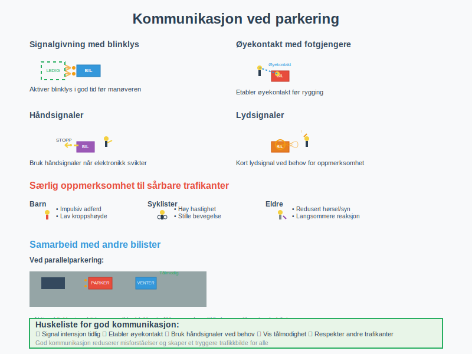

**Rygging og parkering** er grunnleggende og kritiske ferdigheter for alle bilførere i Norge. Disse manøvrene krever **presisjon**, **oppmerksomhet** og god forståelse av kjøretøyets dimensjoner og bevegelser. Korrekt utførelse av rygging og parkering bidrar ikke bare til **trafikksikkerhet**, men også til effektiv bruk av veirom og forhindrer skader på kjøretøy og eiendom.
*For avanserte parkeringsteknikker, se [Parkering for viderekomne](/blogs/teori/parkering-for-viderekomne "Parkering for viderekomne - Avanserte teknikker og situasjoner").*
*For regler om **stans og parkering** i byområder, se [Kjøring i byen: Stans og parkering](/blogs/teori/kjoring-i-byen-stans-og-parkering "Stans og parkering i byen - Regler og anbefalinger").*
*For generelle trafikkregler om parkering, se [Trafikkregler om parkering](/blogs/teori/trafikkregler-om-parkering "Trafikkregler om parkering - regler, unntak og skilt").*
*Kombinert med god plassering på veien, er rygging og parkering essensielt for trygg kjøring. Les mer om [Plassering og kjøremåte](/blogs/teori/plassering-og-kjoremmate "Plassering og kjøremåte - Trygg posisjonering på veien").*
*For generelle visuelle sjekker og blindsoner før manøvrer, se [De 5 se-reglene](/blogs/teori/de-5-se-reglene "De 5 se-reglene").*
*For informasjon om avanserte førerstøttesystemer som filholder og parkeringsassistent, se [Kjøretøyets sikkerhetsutstyr](/blogs/teori/kjoretoyets-sikkerhetsutstyr "Kjøretøyets sikkerhetsutstyr - Moderne førerstøttesystemer (ADAS)").*
## Grunnleggende prinsipper for rygging

**Rygging** er en av de mest krevende manøvrene i bilkjøring og krever spesiell oppmerksomhet til **sikkerhet** og **presisjon**. Når du rygger, er målet å beholde full kontroll og oversikt over hele kjøretøyet og omgivelsene.
### Forberedelse før rygging
* **Speilkontroll**: Juster alle speil (innvendig, venstre og høyre sidespeil) for optimal sikt
* **Seteposisjon**: Sørg for at du sitter komfortabelt og kan se godt i alle retninger
* **Omgivelseskontroll**: Gå rundt bilen hvis nødvendig for å sjekke hindringer
* **Planlegging**: Bestem ruten og manøveren før du starter
### Grunnleggende teknikk
* **Speilbruk**: Sjekk kontinuerlig alle speil under hele manøveren
* **Hodevendinger**: Se aktivt bakover over høyre og venstre skulder for å eliminere blindsoner
* **Hastighet**: Rygge sakte og kontrollert – hold foten lett på bremsepedalen
* **Rattbevegelser**: Bruk små, presise rattbevegelser med hendene i "9 og 3"-posisjon
* **Stopp ved behov**: Ikke nøl med å stoppe og revurdere situasjonen
### Kroppsposisjon under rygging
For **rett rygging** (mest vanlig):
* Vri kroppen mot høyre og se bakover over høyre skulder
* Bruk høyre hånd på rattet for mindre, mer presise justeringer
* Sjekk venstre speil regelmessig for å holde rett kurs
For **rygging til venstre**:
* Se hovedsakelig i venstre speil og over venstre skulder
* Bruk begge hender på rattet for kontrollerte bevegelser
## Teknikker og øvelser

**Systematisk øving** er nøkkelen til å mestre rygging. Start alltid i et trygt, kontrollert miljø som en tom parkeringsplass.
### Grunnleggende øvelser
| Øvelse | Beskrivelse | Nøkkelfokus | Varighet |
|--------|-------------|-------------|----------|
| Rygging i rett linje | Rygg rett bakover 20-30 meter med blikk over høyre skulder | Speil- og hodebruk | 10-15 min|
| Rygging rundt hjørne | Kombiner rattutslag med bevegelse bakover rundt 90° hjørne | Rattkontroll | 15-20 min|
| Rygging mellom kjegler | Rygge i slalom mellom oppstilte hindringer | Presisjonskontroll | 20-25 min|
| Parallelparkering (del 1)| Plasser bilen ved siden av "referansebil" | Avstand til kantstein| 10-15 min|
| Parallelparkering (del 2)| Rygge bakover inn i lomme med korrekt rattutslag | Timing og vinkler | 20-30 min|
### Avanserte øvelser
* **Rygging inn i garasje**: Øv på presisjon i smale rom
* **Rygging med tilhenger**: Spesiell teknikk kreves (se [Kjøring med tilhenger](/blogs/teori/kjoring-med-tilhenger "Kjøring med tilhenger - Sikker transport med tilhenger"))
* **Rygging i bakke**: Kombinasjon av rygging og bakkekjøring
* **Rygging ved hindringer**: Manøvrering rundt parkerte biler og andre hindringer
## Sikker parkering

**Parkering** er mer enn bare å stoppe bilen - det krever forståelse av regelverk, situasjonsforståelse og respekt for andre trafikanter. Når du parkerer, må du alltid vurdere både **juridiske krav** og **praktiske forhold**. For detaljert informasjon om parkeringsskilt og andre forbudsskilt, se [Trafikkskilt og veimerking](/blogs/teori/trafikkskilt-og-veimerking "Trafikkskilt og veimerking - Komplett guide til trafikkskilt og veimerking").
### Parkeringstyper i detalj
| Type | Beskrivelse | Vanlige steder | Vanskelighetsgrad |
|------|-------------|----------------|-------------------|
| **Parallelparkering** | Parker langs veikanten i kjøreretning | Bygater, sentrumsområder | Høy |
| **Lommeparkering** | Parker inn i opphøyd lomme eller innkjøring | Boligområder, mindre veier | Middels |
| **Parkeringsplass** | Bruk markerte felt på parkeringsområder | Kjøpesentre, arbeidsplasser | Lav |
| **Vinkelparkering** | Parker i felt merket med skrå linjer (45°-90°) | Parkeringsanlegg, brede gater | Middels |
| **Bakparkering** | Rygge inn i parkeringsplass | Alle typer parkeringsplasser | Middels-høy |
### Fordeler med ulike parkeringsmetoder
**Frontparkering** (kjøre forlengs inn):
* Enklere å utføre
* Raskere å parkere
* Mindre presisjonskrav
**Bakparkering** (rygge inn):
* Sikrere å kjøre ut fra parkeringsplassen
* Bedre oversikt når du forlater plassen
* Mindre risiko for påkjørsel av fotgjengere
* Anbefales spesielt i travle områder

### Detaljert guide til parallelparkering
**Parallelparkering** regnes som den mest krevende parkeringsteknikken og er ofte en del av den praktiske førerkorprøven. Her er en detaljert, trinn-for-trinn guide:
#### Forberedelse
* Finn en parkeringsplass som er minst 1,5 ganger bilens lengde
* Aktiver blinklys for å signalisere intensjon
* Sjekk at det er trygt å utføre manøveren
#### Trinn-for-trinn utførelse
| Trinn | Beskrivelse | Viktige punkter | Vanlige feil |
|-------|-------------|-----------------|---------------|
| 1 | Still deg parallelt med forankjørende bil, ca. 60-80 cm avstand | Bakhjulene skal være på linje | For stor eller liten avstand |
| 2 | Sett bilen i revers, sving rattet fullt mot kantsteinen | Sjekk speil kontinuerlig | Glemmer å sjekke blindsoner |
| 3 | Rygge til bilen er i ca. 45° vinkel mot kantsteinen | Høyre bakhjørne bør være ca. 30 cm fra kantstein | Feil vinkel, for brå manøver |
| 4 | Rett ut rattet og rygge rett bakover | Bilen skal gli inn i lomma | Retter ikke ut rattet i tide |
| 5 | Sving rattet fullt motsatt vei når bakdelen er fri | Kontroller avstand til bil bak | Svinger for tidlig eller sent |
| 6 | Rett opp og sentrer bilen i lomma | Jevn avstand til begge biler | Dårlig sentrering |
#### Referansepunkter for parallelparkering
* **Start-posisjon**: Ditt høyre speil på linje med den andre bilens høyre speil
* **Første rattutslag**: Når bilens bakhjul passerer den andre bilens bakhjul
* **Retting av ratt**: Når høyre bakhjørne er 30 cm fra kantstein
* **Andre rattutslag**: Når bilens front har passert den andre bilens bak
### Sikkerhetsavstander og regelverk

**Trafikkreglene** setter klare minimumskrav til parkeringsavstander for å sikre trygg ferdsel og tilgjengelighet.
| Situasjon | Minimumsavstand | Begrunnelse | Lovgrunnlag |
|-----------|-----------------|-------------|-------------|
| Fra fortauskant | 30 cm | Unngå skade på dekk/felg, tilgjengelighet | Trafikkreglene §12 |
| Fra annen parkert bil (front/bak) | 1 meter | Mulighet for utkjøring | Trafikkreglene §12 |
| Fra veikryss | 5 meter | Sikkerhet, sikt i kryss | Trafikkreglene §12 |
| Fra fotgjengerfelt | 5 meter | Sikt for fotgjengere | Trafikkreglene §12 |
| Fra bussholdeplass | 20 meter | Kollektivtrafikk prioritet | Trafikkreglene §12 |
| Fra branngater/nødutganger | 5 meter | Nødtjenester tilgang | Lokale forskrifter |
#### Parkeringsforbud
**Det er forbudt å parkere:**
* På eller ved fotgjengerfelt og sykkelfelt
* [Parkering på uoversiktlig kurve](/blogs/teori/parkering-pa-uoversiktlig-kurve "Parkering på uoversiktlig kurve - regler og sikkerhet") – forbudt i kurver og på toppen av bakker hvor sikten er begrenset
* På motorvei og motortrafikkvei
* I kollektivfelt og på bussholdeplasser
* Ved brannhydranter og inne i branngate
* Der parkering hindrer ren- og strøing av vei
For mer detaljert informasjon om parkeringsregler, se [Lover og forskrifter](/blogs/teori/lover-og-forskrifter "Lover og forskrifter - Komplett oversikt over trafikklover").
### Parkering i bakke og på skrå underlag

**Parkering i hellende terreng** krever ekstra sikkerhetsforhold for å forhindre at kjøretøyet ruller ukontrollert. Dette er spesielt viktig i Norge hvor mange veier har betydelig hellingsgrad.
#### Hjulstilling ved parkering i bakke
| Hellingsretning | Hjulretning | Forklaring | Ekstra sikkerhet |
|-----------------|-------------|------------|------------------|
| **Oppover med fortau** | Hjul vendt fra fortauet | Hvis bilen ruller, stopper hjulene mot fortauet | Stå i første gir |
| **Nedover med fortau** | Hjul vendt mot fortauet | Fortauet stopper bilen fra å rulle inn i trafikken | Stå i revers |
| **Oppover uten fortau** | Hjul vendt mot veikanten | Bilen ruller ut av veibanen hvis den beveger seg | Stå i første gir |
| **Nedover uten fortau** | Hjul vendt mot veikanten | Samme som over, men viktigere pga. tyngdekraften | Stå i revers |
#### Sikkerhetsrutine for bakkeparkering
1. **Stopp bilen** på ønsket sted med hjulene rett frem
2. **Trekk håndbrekket** før du slipper fotbreksen
3. **Sett bilen i riktig gir** (første gir oppover, revers nedover)
4. **Drei hjulene** i riktig retning
5. **Slipp fotbreksen forsiktig** for å teste at bilen står stødig
6. **Skru av motoren** og ta ut nøklene
#### Spesielle forhold
**Is og glatte forhold:**
* Bruk ekstra sikkerhetstiltak som hjulstokkere
* Vurder alternativ parkeringsplass på flatere underlag
* Sjekk at håndbrekket fungerer optimalt
**Automatgir:**
* Sett girspaken i "P" (Park) posisjon
* Trekk håndbrekket i tillegg til "P" i bratte bakker
* Vurder å dreie hjulene selv med automatgir
## Regelverk og skilting

**Parkeringsbegrensninger** og **parkeringstillatelser** er regulert gjennom trafikkreglene og kommunale forskrifter. Korrekt forståelse av skilting er avgjørende for å unngå bøter og bidra til god trafikkflyt.
### Vanlige parkeringsskilt
| Skilt | Betydning | Tidsrom | Straff ved brudd |
|-------|-----------|---------|------------------|
| **P** med tidsangivelse | Begrenset parkeringstid | Som angitt på skilt | Parkeringsbot |
| **P** med klokkeslett | Parkeringsforbud i angitt periode | F.eks. 16-08 | Parkeringsbot + flytting |
| **Parkeringsforbud** (rød sirkel) | Absolutt parkeringsforbud | Døgnet rundt | Bot + berging |
| **Stoppforbud** (rød x) | Verken stopp eller parkering | Døgnet rundt | Bot + berging |
| **Betalingsparkering** | Betaling kreves | Angitt på skilt | Parkeringsbot |
| **Reservert parkering** | Kun for angitt formål | Som spesifisert | Bot + mulig berging |
### Kommunale parkeringsordninger
**Beboerparkering:**
* Krever spesiell tillatelse fra kommunen
* Gjelder vanligvis i tettbebygde områder
* Tidsavgrensning varierer mellom kommuner
**Korttidsparkering:**
* Maksimal varighet spesifisert på skilt
* Krever ofte parkeringsskive
* Vanlig i handelsområder
**Betalingsparkering:**
* Betaling via app, automat eller SMS
* Varierende priser avhengig av område og tidspunkt
* Kontroll via parkeringsvakter eller kameraovervåking
For detaljert informasjon om trafikkskilt, se [Trafikkskilt og veimerking](/blogs/teori/trafikkskilt-og-veimerking "Trafikkskilt og veimerking - Komplett guide til norske trafikkskilt").
## Vanlige feil og hvordan unngå dem

Å lære av andres feil er like viktig som å mestre de riktige teknikkene. Her er de mest **vanlige feilene** ved rygging og parkering:
### Kritiske feil ved rygging
| Feil | Konsekvens | Løsning | Forebyggende tiltak |
|------|------------|---------|---------------------|
| **For rask rygging** | Redusert reaksjonstid, tap av kontroll | Bruk alltid lav hastighet | Øv på hastighetskontroll |
| **Dårlig speilbruk** | Økt blindsonerisiko, kollisjoner | Sjekk alle speil kontinuerlig | Juster speil før rygging |
| **Manglende hodekontroll** | Misser fotgjengere og hindringer | Se aktivt over skuldrene | Gjør hodekontroll til vane |
| **Feiltolking av ratteffekt** | Bilen beveger seg feil retning | Husk: rattet virker "omvendt" | Øv i trygt miljø |
### Parkeringsfeil som koster dyrt
| Feil | Økonomisk konsekvens | Sikkerhetsrisiko | Hvordan unngå |
|------|---------------------|------------------|---------------|
| **Feil avstand til kantstein** | Skade på felg/dekk (2000-5000 kr) | Lav | Bruk 30 cm som standard |
| **Parkering i handikapplass** | Bot 970 kr + mulig berging | Tilgjengelighet | Les skilting nøye |
| **Glemmer håndbrekk i bakke** | Potensiell totalskade | Høy | Sjekkliste for bakkeparkering |
| **Blokkerer andre** | Bot + berging (1500-3000 kr) | Trafikkflyt | Sjekk avstand til andre biler |
| **Overskridelse parkeringstid** | Parkeringsbot (200-600 kr) | Lav | Bruk alarm eller app-varsel |
### Praktiske tips for suksess
**Forberedelse:**
* Øv regelmessig i ulike miljøer og situasjoner
* Lær bilens dimensjoner og "følelse"
* Bruk teknologiske hjelpemidler som parkeringsensorer, men ikke som erstatning for grunnleggende ferdigheter
**Utførelse:**
* Ta deg god tid - stress fører til feil
* Stopp og revurder hvis du er usikker
* Be om hjelp fra passasjer som kan guide deg
**Mental forberedelse:**
* Aksepter at parkering kan være utfordrende
* Bygg selvtillit gjennom gradvis øvelse
* Lær av hver feil uten å bli frustrert
## Samhandling med andre trafikanter

**Effektiv kommunikasjon** med andre trafikanter er essensielt for sikker rygging og parkering. God **trafikantsamhandling** reduserer misforståelser og konflikter.
### Signalgivning og kommunikasjon
**Obligatoriske signaler:**
* **Blinklys** for å indikere parkeringsintensjon
* **Ryggingslys** aktiveres automatisk ved rygging
* **Varselblinkingsanlegg** ved nødstopp eller hindring
**Anbefalt kommunikasjon:**
* **Øyekontakt** med fotgjengere og syklister
* **Håndsignaler** når elektroniske signaler ikke fungerer
* **Kort lydsignal** ved behov for oppmerksomhet
### Spesiell oppmerksomhet til sårbare trafikanter
| Trafikantgruppe | Risikofaktorer | Forebyggende tiltak |
|-----------------|----------------|---------------------|
| **Fotgjengere** | Lav synlighet, uforutsigbar bevegelse | Ekstra hodekontroll, lav hastighet |
| [**Barn**](/blogs/teori/rygging-barn "Rygging: Barn - sikkerhet ved rygging med barn i nærheten") | Impulsiv adferd, lav kroppshøyde | Stopp helt ved mistanke om barn i nærheten |
| **Syklister** | Høy hastighet, stille bevegelse | Sjekk sykkelfelt og blindsoner nøye |
| **Eldre** | Redusert hørsel/syn, langsommere reaksjon | Gi ekstra tid og rom |
| **Rullestolbrukere** | Begrenset mobilitet | Ikke blokker ramper og bredere adkomster |
### Samarbeid med andre bilister
**Ved parallelparkering:**
* Aktiver blinklys i god tid før manøveren
* Vær oppmerksom på bilister som vil passere
* Ikke blokér trafikken unødvendig lenge
**I parkeringshus og små områder:**
* Følg "først til mølla"-prinsippet
* Vis tålmodighet med andre som manøvrerer
* Hjelpe andre ved å vise hvor ledige plasser er
### Øvingsmiljøer og progresjon
**Anbefalt progresjonsplan:**
1. **Fase 1**: Tom parkeringsplass uten hindringer (2-3 timer øving)
2. **Fase 2**: Parkeringsplass med få biler og lav trafikk (3-5 timer)
3. **Fase 3**: Moderate parkeringsutfordringer i rolige områder (5-10 timer)
4. **Fase 4**: Bysentrum og utfordrende parkeringsituasjoner (10+ timer)
**Øvingspartnere:**
* Erfaren sjåfør som kan guide og gi tilbakemelding
* Bruk av kjøreinstruktør for spesialisert opplæring
* Venner og familie som kan observere blindsoner
For mer om samhandling i trafikken generelt, se [Kommunikasjon med andre trafikanter](/blogs/teori/kommunikasjon-med-andre-trafikanter "Kommunikasjon med andre trafikanter - Effektiv samhandling i trafikken").
## Teknologiske hjelpemidler

Moderne biler er utstyrt med **teknologiske løsninger** som kan assistere ved parkering, men det er viktig å forstå både mulighetene og begrensningene.
### Parkeringsassistanse-systemer
| System | Funksjon | Fordeler | Begrensninger |
|--------|----------|----------|---------------|
| **Parkeringsensorer** | Ultralydsignaler varsler om hindringer | Oppdager objekter, akustisk varsling | Ser ikke gjennomsiktige/tynne objekter |
| **Ryggekamera** | Visuell fremstilling av området bak bilen | God oversikt, realtidsvisning | Kan være skitne, begrenset synsvinkel |
| **360° kamera** | Fugleperspektiv av hele bilen | Komplett oversikt | Høy kostnad, kompleks tolkning |
| **Automatisk parkering** | Systemet styrer rattet automatisk | Presis manøvrering | Fungerer ikke i alle situasjoner |
| **Park assist** | Hjelper med å finne parkeringsplasser | Tidsbesparing | Avhengig av sensorer og programvare |
### Viktige prinsipper for teknologibruk
**Teknologi som supplement, ikke erstatning:**
* Behold grunnleggende ferdigheter uten teknologisk hjelp
* Forstå systemenes begrensninger
* Ha backup-plan når teknologien svikter
**Ansvar og sikkerhet:**
* Føreren har alltid det endelige ansvaret
* Teknologi reduserer ikke behovet for oppmerksomhet
* Regelmessig kalibrering og vedlikehold kreves
## Spesielle situasjoner
### Parkering om vinteren
**Utfordringer:**
* Snø og is påvirker grep og manøvrering
* Redusert sikt fra snø på kamera og sensorer
* Kaldere temperaturer påvirker bilens respons
**Tilpassninger:**
* Rengjør sensorer og kamera før bruk
* Bruk vinterdekk og kjetting ved behov (se [Regler for dekk og kjetting](/blogs/teori/regler-for-dekk-og-kjetting "Regler for dekk og kjetting - Forskrifter og sikkerhet"))
* Planlegg ekstra tid for manøvrering
### Parkering med elektrisk bil
**Spesielle hensyn:**
* Ladestasjoner krever ofte spesifikk parkering
* Lengre opphold for lading
* Tilgang til ladekabler og kontakter
**Etikk ved lading:**
* Ikke okkuper ladeplasser uten å lade
* Flytt bilen når ladingen er ferdig
* Respekter kø-system ved populære ladestasjoner
## Juridiske konsekvenser og ansvar
### Erstatningsansvar
**Ved skade under parkering:**
* Fører er ansvarlig for skader forårsaket av egen bil
* Forsikring dekker normalt trafikkskader
* Dokumenter skader med bilder og rapporter
**Bevisbyrde:**
* Fører må bevise at ulykken ikke var deres skyld
* Vitner og overvåkingskamera kan være avgjørende
* Politirapport anbefales ved alle skader
### Parkeringsbot og berging
**Bøtenivåer (2024-satser):**
* Standard parkeringsbot: 370-970 kr
* Berging og oppbevaring: 1500-3000 kr
* Handikapplass: 970 kr + mulig berging
**Klageadgang:**
* Bøter kan påklages til utstedende myndighet
* Frist for klage er normalt 3 uker
* Dokumentasjon og bevis må fremlegges
## Sammendrag og nøkkelpunkter
**Kritiske suksessfaktorer:**
1. **Systematisk øving** i trygge omgivelser
2. **Forståelse av kjøretøyets dimensjoner** og egenskaper
3. **Respekt for regelverk** og andre trafikanter
4. **Bruk av alle sanser** - ikke bare syn
5. **Tålmodighet og realistiske forventninger** til egen utvikling
**Huskeliste for hver parkering:**
- [ ] Signaler intensjon med blinklys
- [ ] Sjekk alle speil og blindsoner
- [ ] Planlegg manøveren før start
- [ ] Bruk lav hastighet og små rattutslag
- [ ] Stopp ved usikkerhet
- [ ] Trekk håndbrekk og riktig gir/park-posisjon
- [ ] Sjekk avstander før du forlater bilen
## Videre lesning og ressurser
**Relaterte emner:**
* [Parkering for viderekomne](/blogs/teori/parkering-for-viderekomne "Parkering for viderekomne - Avanserte teknikker og situasjoner")
* [Bykjøring](/blogs/teori/bykjoring "Bykjøring - Navigering i urbane miljøer")
* [Plassering og kjøremåte](/blogs/teori/plassering-og-kjoremmate "Plassering og kjøremåte - Trygg posisjonering på veien")
* [Trafikkskilt og veimerking](/blogs/teori/trafikkskilt-og-veimerking "Trafikkskilt og veimerking - Komplett guide til norske trafikkskilt")
* [Lover og forskrifter](/blogs/teori/lover-og-forskrifter "Lover og forskrifter - Komplett oversikt over trafikklover")
**Praktiske ressurser:**
* Øvingsplasser og kjøreskoler i ditt område
* Kommunale parkeringsreglement
* Digitale parkeringsapper og betalingsløsninger