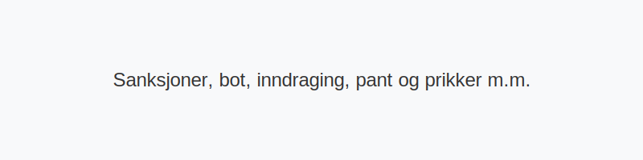

Velkommen til vår guide om **sanksjoner** ved trafikkforseelser i Norge, inkludert **bøter**, **inndraging**, **pant**, **prikker** m.m.

## Oversikt over sanksjoner
Trafikkmyndighetene kan ilegge ulike **sanksjoner** basert på alvorlighetsgrad. Tabellen under gir en kort oversikt:
| Sanksjonstype                   | Hva det innebærer                                                              | Hjemmel/Referanse                                                                                   |
|---------------------------------|-------------------------------------------------------------------------------|-----------------------------------------------------------------------------------------------------|
| **Bot**                         | Økonomisk straff ved overtredelser som fartsovertredelse og feilparkering      | [Vegtrafikkloven](/blogs/teori/lover-og-forskrifter "Lover og forskrifter") og [Forskrift om håndheving](/blogs/teori/lover-og-forskrifter "Forskrift om håndheving") |
| **Inndragning av førerkort**    | Midlertidig eller permanent inndragning ved alvorlige og gjentatte lovbrudd    | [Sperrefrist (prøvetid, prikker)](/blogs/teori/sperrefrist-provetid-prikker "Sperrefrist (prøvetid, prikker)") |
| **Pant i kjøretøy**             | Pantsettelse av kjøretøy for å sikre dekning av bøter eller gebyrer            | [Forskrift om håndheving](/blogs/teori/lover-og-forskrifter "Forskrift om håndheving")             |
| **Prikker (demeritører)**       | Poengsystem ved trafikkforseelser; akkumulering kan føre til sperrefrist       | [Prikkbelastningssystem i Norge](/blogs/teori/prikkbelastningssystem "Prikkbelastningssystem i Norge – alt om prikker og demeritører") |
| **Obligatoriske trafikkurs**    | Pålegg om kurs ved gjentatte prikker for å forbedre kjøreatferd og sikkerhet   | [Trafikalt grunnkurs](/blogs/teori/trafikalt-grunnkurs "Trafikalt grunnkurs") og [Teoriprøven](/blogs/teori/teoriproven "Teoriprøven") |
## Bøter
Bøter ilegges ved mindre alvorlige overtredelser som fartsoverskridelser, manglende sikkerhetsutstyr eller feilparkering. Beløpene fastsettes etter alvorlighetsgrad og risiko.
## Inndragning og pant
Ved alvorlige eller gjentatte overtredelser kan førerkortet eller kjøretøyet inndras midlertidig eller permanent. Pant i kjøretøy kan brukes som sikkerhet for utestående bøter eller gebyrer.
## Prikker og sperrefrist
Prikker, eller demeritører, gis for spesifikke trafikkforseelser og registreres i førerkortregisteret. Se [Prikkbelastningssystem i Norge](/blogs/teori/prikkbelastningssystem "Prikkbelastningssystem i Norge – alt om prikker og demeritører") for en fullstendig oversikt over prikksatser og registrering, eller [Sperrefrist (prøvetid, prikker)](/blogs/teori/sperrefrist-provetid-prikker "Sperrefrist (prøvetid, prikker) - konsekvenser ved akkumulering av prikker").
## Andre administrative reaksjoner
I tillegg til bøter og inndragning kan myndighetene ilegge:
* **Gebyrer:** Administrasjonsgebyr ved for sent godkjenninger eller manglende periodisk kontroll (EU-kontroll).
* **Advarsler:** Skriftlige advarsler ved mindre alvorlige overtredelser.
## Se også
* [Lover og forskrifter](/blogs/teori/lover-og-forskrifter "Lover og forskrifter - Oversikt over norske trafikklover og forskrifter")
* [Sperrefrist (prøvetid, prikker)](/blogs/teori/sperrefrist-provetid-prikker "Sperrefrist (prøvetid, prikker)")
* [Trafikalt grunnkurs](/blogs/teori/trafikalt-grunnkurs "Trafikalt grunnkurs - Obligatorisk kurs for førerkort klasse B")
* [Teoriprøven](/blogs/teori/teoriproven "Teoriprøven - alt du trenger å vite for å bestå teoriprøven")