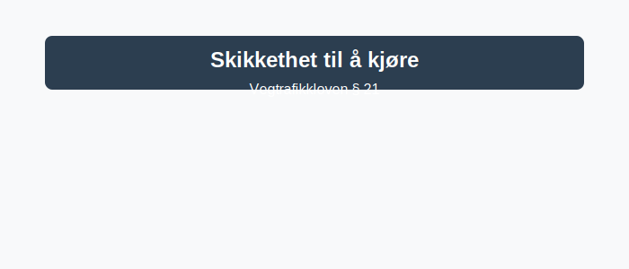

Førerens **skikkethet** til å kjøre er en grunnleggende forutsetning for trafikksikkerhet. Vegtrafikkloven § 21 fastsetter krav til at føreren er i en fysisk og psykisk tilstand som gjør det forsvarlig og trygt å kjøre.
*For en oversikt over Vegtrafikkloven, se [Lover og forskrifter](/blogs/teori/lover-og-forskrifter "Lover og forskrifter - Oversikt over norske trafikklover og forskrifter").*
*For mer om menneskelige faktorer i trafikken, se [Mennesket i trafikken](/blogs/teori/mennesket-i-trafikken "Mennesket i trafikken - Faktorer som påvirker kjøring").*

## Hva er skikkethet?
Med **skikkethet** menes førerens evne til å bedømme trafikksituasjoner og handle på en sikker og ansvarlig måte. Vegtrafikkloven § 21 krever at føreren skal være i en tilstand som ikke svekker kjøreevnen.
## Viktige faktorer
| Faktor                   | Effekt på kjøring                                       | Tiltak                                                   |
|--------------------------|---------------------------------------------------------|----------------------------------------------------------|
| **Alkohol**              | Redusert vurderingsevne, svekket koordinasjon           | Nulltoleranse, planlegg alternativ transport            |
| **Stress**               | Tunnelvisjon, forhastede beslutninger, nedsatt oppmerksomhet | God tidsplan, stressmestringsteknikker                  |
| **Sykdom**               | Feber, smerter og redusert fysisk kapasitet             | Unngå kjøring ved sykdom, vurder egen tilstand           |
| **Tretthet og søvn**     | Mikrosøvn, langsommere reaksjoner, redusert konsentrasjon | Nok hvile, pause under lange turer, bytt sjåfør          |
| **Medisinering**         | Døsighet, svimmelhet, nedsatt konsentrasjon             | Les pakningsvedlegg, unngå kjøring ved bivirkninger      |
| **Kombinasjonseffekter** | Forsterkede farer når flere faktorer inntreffer samtidig | Vurder helhetlig, unngå kjøring ved usikkerhet           |
## Alkohol
Å kjøre etter inntak av **alkohol** er strengt regulert. Selv små mengder kan redusere dømmekraften og øke stoppeavstanden. **Promillegrensen** for bil i Norge er 0,2?‰.
* Les mer i [Alkohol, promillegrense og narkotika](/blogs/teori/alkohol-promillegrense-og-narkotika "Alkohol, promillegrense og narkotika - regler og effekter") for en grundig gjennomgang av promillegrenser, grenseverdier for narkotika og konsekvenser ved ruspåvirket kjøring.
* Les mer om rusmidlers påvirkning under [Mennesket i trafikken](/blogs/teori/mennesket-i-trafikken "Mennesket i trafikken - Faktorer som påvirker kjøring").
* Les mer om pliktmessig avhold som vilkår for kjøring i [Pliktmessig avhold](/blogs/teori/pliktmessig-avhold "Pliktmessig avhold").
## Stress
**Stress** kan føre til at du overser viktige trafikkskilt og farer. Fysiske symptomer som hjertebank og svettetokter kan også påvirke kjørestilsikkerheten.
* Planlegg godt og gi deg selv **ekstra tid** til å rekke frem uten hastverk.
* Øv på pusteteknikker for å redusere kroppslige stressreaksjoner.
## Sykdom
Ved influensa, migrene eller andre **akutte sykdomstilstander** bør du avstå fra kjøring. Redusert fokus og koordinasjon kan gjøre det farlig.
* Vurder å utsette kjøringen eller få noen til å kjøre for deg.
## Tretthet og søvn
**Mangel på søvn** ødelegger oppmerksomheten og kan forårsake mikrosøvn. Et varsel for trøtt kjøring er ofte hyppig gjesping.
* Sørg for minst **7–8 timer** søvn før lange kjøreturer.
* Ta regelmessige pauser på minst 15 minutter hver andre time.
## Medisinering
Noen **reseptbelagte og reseptfrie legemidler** kan gi bivirkninger som døsighet og svimmelhet.
* Alltid les pakningsvedlegget og sjekk om stoffet påvirker kjøreevnen.
## Kombinerte forhold
Når flere faktorer som alkohol, stress og tretthet kombineres, forsterkes effektene og risikoen øker betydelig.
Ved usikkerhet om egen skikkethet bør du velge **alternativ transport** eller utsette kjøringen.
For praktisk tilnærming til vurdering av risiko i trafikken, se [Risikovurdering i praksis](/blogs/teori/risikovurdering-i-praksis "Risikovurdering i praksis - Praktisk risikovurdering i trafikken").
Ved å være bevisst disse faktorene kan du som fører sikre at du alltid er **skikket** til å kjøre, noe som er avgjørende for din og andres sikkerhet.