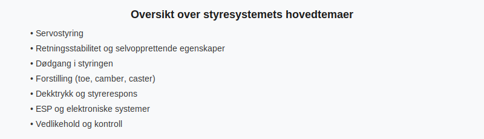

Bilens **styresystem** er avgjørende for sikker **kjørbarhet** og **retning**. Dette systemet omfatter mekaniske, hydrauliske og elektroniske komponenter som hjelper føreren å kontrollere bilen presist.

## Hva er styresystem?
Styresystemet omformer førerens rattbevegelser til hjulenes retning og bidrar til **stabilitet** og **kontroll** under kjøring. For en generell oversikt over bilens tekniske deler, se [Bilens tekniske deler](/blogs/teori/bilens-tekniske-deler "Bilens tekniske deler").
For å forstå hvordan akselavstand påvirker svingradius og kjøretøyets manøvrering, se [Akselavstand og svingeradius](/blogs/teori/akselavstand-og-svingeradius "Akselavstand og svingeradius - Forholdet mellom akselavstand og svingeradius").
## Servostyring
Servostyring reduserer kraften føreren må bruke på rattet:
| Type servostyring | Karakteristikk                                | Fordel                       |
|-------------------|------------------------------------------------|------------------------------|
| Hydraulisk        | Bruker hydraulisk trykk fra motoren            | God følelse, robust          |
| Elektrisk (EPS)   | Elektrisk motor styrer styreinnsats            | Energieffektiv, variabel følelse |
Servostyring forbedrer **manøvrerbarhet** ved lave hastigheter og opprettholder hjulrespons ved høyere fart.
## Retningsstabilitet og selvopprettende egenskaper
En god retningsstabilitet gjør at bilen går rett frem uten kontinuerlig rattjustering. Selvopprettende moment trekker rattet tilbake til nøytral posisjon etter sving:
* **Kastvinkel (caster):** Gir selvopprettende kraft.
* **Gjenvekting:** Kombinasjon av hjulvinkel og understell.
## Dødgang
**Dødgang** er spillet mellom ratt og hjul før hjulene begynner å følge rattets bevegelse. For stor dødgang kan føre til unøyaktig styring og redusert trafikksikkerhet.
## Forstilling (hjuljustering)
Riktig forstilling sikrer jevn dekkkontakt mot veibanen:
| Justering | Effekt                                         |
|-----------|------------------------------------------------|
| Tå-in/tå-ut (toe)   | Forandrer vinkelen mellom hjulene sett ovenfra |
| Caster       | Vinkel på styreaksel sett fra siden             |
| Camber       | Vinkel på hjulakse sett forfra eller bakfra     |
Feil forstilling kan gi **uregelmessig dekkslitasje** og svekket retningsstabilitet.
## Dekktrykk
Dekktrykket påvirker styrerespons og veigrep:
* For lavt trykk gir slapp styring og økt slitasje.
* For høyt trykk gir hardere styrefølelse og redusert kontaktflate.
For anbefalte verdier, se [Regler for dekk og kjetting](/blogs/teori/regler-for-dekk-og-kjetting "Regler for dekk og kjetting").
## ESP og elektroniske styresystemer
**ESP (Elektronisk stabilitetsprogram)** overvåker hjulhastighet, rattvinkel og sidekrefter. Ved behov bremser ESP individuelle hjul for å motvirke understyring eller overstyring.
ESP er en videreutvikling av ABS og traction control. Se [Kjøretøyets sikkerhetsutstyr](/blogs/teori/kjoretoyets-sikkerhetsutstyr "Kjøretøyets sikkerhetsutstyr") for flere elektroniske systemer.
For en helhetlig gjennomgang av både **aktiv og passiv sikkerhet**, inkludert ESP og airbags, se [Aktiv og passiv sikkerhet](/blogs/teori/aktiv-og-passiv-sikkerhet "Aktiv og passiv sikkerhet - ESP, airbag og mer").
## Illustrasjon av styresystemets hovedkomponenter

## Vedlikehold og kontroll av styresystem
Regelmessig kontroll av styresystemet sikrer driftssikkerhet:
* Sjekk **dødgang** ved rattbevegelse.
* Kontroller **væskenivå** i servostyringskretsen (hydraulisk).
* Inspiser **forstilling** og dekktrykk.
* Kontroller at **ESP-lampen** ikke lyser ved start.
## Relevans for teoriprøven
* Forstå prinsippene bak **servostyring** og **retningstall**.
* Kjenne til hvordan **dødgang**, **forstilling** og **dekktrykk** påvirker styrerespons.
* Vite hvordan **ESP** bidrar til trygg kjøring.
## Videre lesning
* [Aktiv og passiv sikkerhet](/blogs/teori/aktiv-og-passiv-sikkerhet "Aktiv og passiv sikkerhet - ESP, airbag og mer") - Grunnleggende om aktiv og passiv sikkerhetssystemer i bil
* [Bilens tekniske deler](/blogs/teori/bilens-tekniske-deler "Bilens tekniske deler")
* [Regler for dekk og kjetting](/blogs/teori/regler-for-dekk-og-kjetting "Regler for dekk og kjetting")
* [Kjøretøyets sikkerhetsutstyr](/blogs/teori/kjoretoyets-sikkerhetsutstyr "Kjøretøyets sikkerhetsutstyr")
* [Bremsesystemet (bremsekretser, bremsevæske m.m)](/blogs/teori/bremsesystemet "Bremsesystemet (bremsekretser, bremsevæske m.m)")