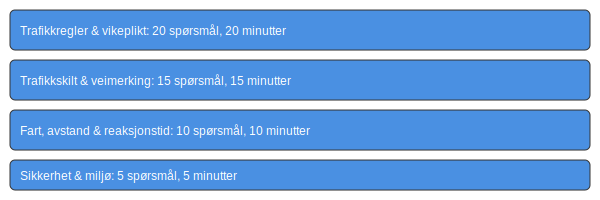

**Teoriprøven** er den avsluttende teoretiske eksamenen du må bestå for å få førerkort klasse B i Norge. Denne omfattende guiden gir deg alt du trenger å vite om **eksamensformat**, **viktige temaer**, **tidsstyring** og nyttige **strategier** for å sikre at du består på første forsøk.
## Eksamensstruktur og format
Følgende tabell viser hovedstruktur for teoriprøven:
| Seksjon                           | Antall spørsmål | Tidsramme   |
|-----------------------------------|-----------------|-------------|
| **Trafikkregler og vikeplikt**    | 20              | 20 minutter |
| **Trafikkskilt og veimerking**    | 15              | 15 minutter |
| **Fart, avstand og reaksjonstid** | 10              | 10 minutter |
| **Sikkerhet og miljø**            | 5               | 5 minutter  |

## Forberedelse og tips
- **Les pensum nøye**: Gjennomgå alle kapitlene i læreboken og bruk [Lover og forskrifter](/blogs/teori/lover-og-forskrifter "Lover og forskrifter - Juridisk rammeverk for trafikk") som referanse.
- **Øv med prøvetester**: Ta minst 5 fullstendige simuleringer for å bli komfortabel med format og tidsbegrensning.
- **Fokuser på vanskelige emner**: Emner som **vikeplikt** (se [Hva er vikeplikt?](/blogs/teori/vikeplikt-og-rundkjoringer "Vikeplikt og rundkjøringer - Kompakt guide til vikeplikt")) og **trafikkskilt** kan kreve ekstra repetisjon.
- **Tidsstyring**: Del tiden likt mellom seksjonene, men unngå å bruke for mye tid på enkelte spørsmål.
- **Eliminer feil**: Hvis du er usikker på et spørsmål, bruk eliminasjonsmetoden og gå videre; du kan alltid gå tilbake hvis tiden tillater det.
## Etter prøven
Når du har bestått **teoriprøven**, kan du registrere resultatet hos Statens vegvesen og fortsette med **øvelseskjøring** eller planlegge **oppkjøring**. Se også:
- [Øvelseskjøring](/blogs/teori/ovelseskjoring "Øvelseskjøring - Krav til ledsager, bil og mer")
- [Oppkjøring](/blogs/teori/oppkjoring "Oppkjøring - Guide til praktisk kjøreprøve for førerkort i bil")
## Ofte stilte spørsmål (FAQ)
| Spørsmål                                  | Svar                                                     |
|-------------------------------------------|----------------------------------------------------------|
| Hvor mange feil kan jeg ha?               | Maksimalt 2 feil pr. seksjon, totalt maks 5 feil.        |
| Kan jeg bruke hjelpemidler?               | Nei, ingen eksterne hjelpemidler er tillatt.             |
| Hva skjer hvis jeg stryker?               | Du må vente minst én uke før ny prøve.                   |
| Hvor lenge er bestått prøve gyldig?        | Bestått teoriprøve er gyldig i 2 år for praktisk prøve.  |