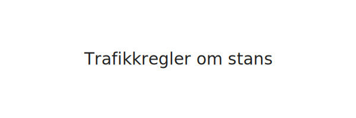

**Trafikkregler om stans** gir en oversikt over **når det er tillatt å stanse**, **når stans er forbudt** og hvilke **skilt** og **regelunntak** du må kjenne til for å kjøre trygt og unngå bøter.

## Hva betyr stans?
Å *stanse* betyr at kjøretøyet står stille, enten kortvarig eller over lengre tid. Skillet mellom *stans* og *parkering* er at parkering vanligvis innebærer et ubetjent og lengre opphold, mens stans ofte er mer kortvarig.
## Skilt for stansforbud

| Skilt            | Betydning                          |
|------------------|------------------------------------|
|  | **Stans forbudt** – det er ikke tillatt å stoppe kjøretøyet her |
## Regler for stans
| Situasjon                                     | Tillatt stans? | Unntak                         |
|-----------------------------------------------|---------------|-------------------------------|
| På gangfelt eller innen 5 m foran/bak         | Nei           |                               |
| I eller innenfor 5 m fra kryss                | Nei           |                               |
| Innenfor 5 m fra kantstein ved bussholdeplass | Nei           |                               |
| På fortau eller gangvei                       | Nei           |                               |
| I tunnel                                      | Nei           |                               |
| På motorvei eller motortrafikkvei             | Nei           | Nødstans ved nødstilfeller    |
| Av- og påstigning                             | Ja            | Kortvarig og uten hinder      |
| Laste- og losseområde                         | Ja            | Kortvarig for lasting/lossing |
## Intern lenking til andre artikler
For mer om **skilt** og **veimerking**, se [Trafikkskilt og veimerking](/blogs/teori/trafikkskilt-og-veimerking "Trafikkskilt og veimerking - Informasjon om trafikkskilt og veimerking").
For regler og teknikker for **parkering**, se [Kjøring i byen: Stans og parkering](/blogs/teori/kjoring-i-byen-stans-og-parkering "Stans og parkering i byen - Regler og anbefalinger").
For generelle parkeringsregler, se [Trafikkregler om parkering](/blogs/teori/trafikkregler-om-parkering "Trafikkregler om parkering - regler, unntak og skilt").
For regler om stans ved planoverganger og annen sikkerhetsinformasjon på landevei, se [Landeveiskjøring](/blogs/teori/landeveiskjoring "Landeveiskjøring - Planovergang, tunnel, motorvei og mer").
For en komplett oversikt over **hvor det er forbudt å parkere**, se [Hvor er det forbudt å parkere?](/blogs/teori/hvor-er-det-forbudt-a-parkere "Hvor er det forbudt å parkere? - parkeringsforbud og trafikkregler").
## Praktiske tips
1. **Planlegg** stopp og stans før kjøring – sjekk skilting og regler.
2. **Unngå hinder** – stans ikke der du kan sperre for andre trafikanter.
3. **Bruk nødblink** ved nødvendig nødstans.
4. **Vær synlig** og sikre kjøretøyet ved stans i mørket.
## Vanlige sanksjoner
| Brudd på regel      | Bot (anslag)     |
|---------------------|------------------|
| Ulovlig stans       | 800–1200 NOK     |
| Nødstans uten grunn | 1000–1500 NOK    |