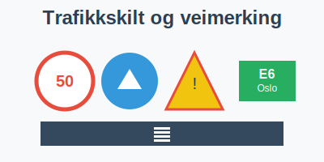
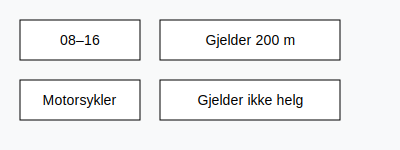
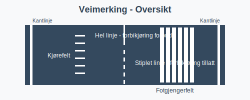
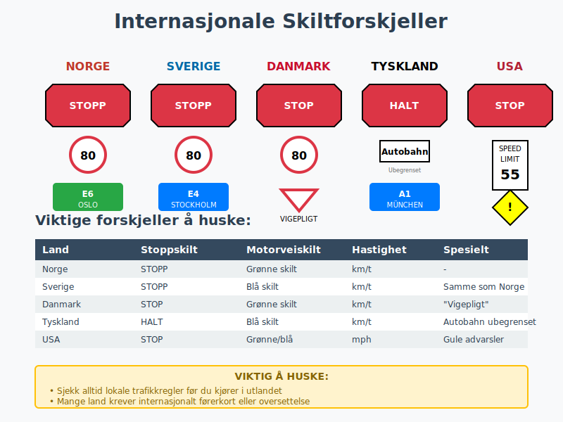
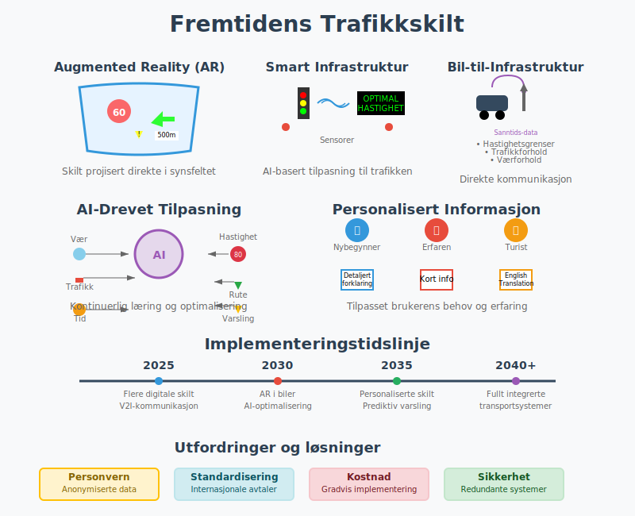

Skal du ta teoriprøven for **førerkort klasse B**? Da er det viktig at du kan **trafikkskilt og veimerking** godt. Dette er et av de mest sentrale temaene i teoriprøven, og du vil møte mange spørsmål om skilting og merking på eksamen.
*For en komplett oversikt over alle grunnleggende trafikksituasjoner, se [Introduksjon til teori for førerkort](/blogs/teori/introduksjon-til-teori-for-forerkort "Introduksjon til teori for førerkort - alt du trenger å vite").*
*For regler og teknikk for kjøring på motorvei, se [Motorveikjøring](/blogs/teori/motorveikjoring "Motorveikjøring - Guide til kjøring på norsk motorvei").*
*For en innføring i trafikksystemets infrastruktur og veioppmerking, se [Trafikksystemet](/blogs/teori/trafikksystemet "Trafikksystemet - Innføring i det norske trafikksystemet").*
*For en oversikt over alle trafikkskiltgrupper, se [Trafikksystemet (skilt)](/blogs/teori/trafikksystemet-skilt "Trafikksystemet (skilt) - Skiltgrupper og kategorier").*
*For en full oversikt over alle skiltgrupper og skiltene i Norge, se [Skiltoversikt: Alle skiltgrupper og oversikt over alle skiltene](/blogs/teori/skiltoversikt-alle-skiltgrupper-og-oversikt "Skiltoversikt: Alle skiltgrupper og oversikt over alle skiltene").*
*For informasjon om forskjellen mellom **trafikksignaler** og **trafikkskilt**, se [Signal vs tegn i trafikken](/blogs/teori/signal-vs-tegn-i-trafikken "Signal vs tegn i trafikken - Når brukes hva?").*
*For en detaljert guide til **fartsgrenser** og skilting av hastighet, se [Fartsgrenser](/blogs/teori/fartsgrenser "Fartsgrenser – Generelle regler, skilter og soneskilt").*

I denne artikkelen får du en omfattende og detaljert gjennomgang av alle de viktigste **trafikkskiltene** og **veimarkeringene** du trenger å kunne for å bestå teoriprøven. Vi dekker alt fra grunnleggende skilttyper til avanserte situasjoner og spesielle regelverk som du kan møte både på eksamen og i praksis.
## Innholdsfortegnelse
1. [Hva er trafikkskilt?](#hva-er-trafikkskilt)
2. [De fire hovedkategoriene av trafikkskilt](#de-fire-hovedkategoriene-av-trafikkskilt)
3. [Skiltenes former og betydning](#skiltenes-former-og-betydning)
4. [Fargenes betydning](#fargenes-betydning)
5. [Tilleggstavler](#tilleggstavler)
6. [Veimerking og oppmerking](#veimerking-og-oppmerking)
7. [Viktige regler for trafikkskilt](#viktige-regler-for-trafikkskilt)
8. [Spesielle situasjoner](#spesielle-situasjoner)
9. [Digitale trafikkskilt og variabel skilting](#digitale-trafikkskilt-og-variabel-skilting)
10. [Internasjonale forskjeller](#internasjonale-forskjeller)
11. [Vedlikehold og ansvar](#vedlikehold-og-ansvar)
12. [Psykologi og oppmerksomhet](#psykologi-og-oppmerksomhet)
13. [Tips for teoriprøven](#tips-for-teoriprøven)
14. [Avanserte temaer](#avanserte-temaer)
## Hva er trafikkskilt?
**Trafikkskilt** er visuelle instruksjoner som gir informasjon til [trafikantene](/blogs/teori/trafikantene "Trafikantene – Oversikt over trafikanttyper og fri vei") om regler, forbud, påbud og viktig informasjon på veien. Alle trafikkskilt i Norge følger internasjonale standarder og har spesifikke **former, farger og symboler** som gjør dem lett gjenkjennelige.
## De fire hovedkategoriene av trafikkskilt
Trafikkskilt er delt inn i fire hovedkategorier basert på deres funksjon:
### 1. Forbudsskilt
**Forbudsskilt** viser hva som er forbudt på et bestemt sted eller strekning. De er vanligvis **runde med hvit bakgrunn** og har en **rød ring** rundt kanten.

**Viktige forbudsskilt å kunne:**
* **Innkjøring forbudt** - rundt skilt med hvit bakgrunn og rød ring
* **Parkering forbudt** - P-symbol med rød diagonal strek
* **Stopp forbudt** - H-symbol med rød diagonal strek
* **Forbikjøring forbudt** - to biler der den ene kjører forbi, med rød diagonal strek (se [Forbikjøring og feltskifte](/blogs/teori/forbikjoring-og-feltskifte "Forbikjøring og feltskifte - Komplett guide til sikker forbikjøring og feltskifte")).
* **Høyeste tillatte hastighet** - tall i rød ring (f.eks. 50, 80). Les mer om [fart og avstand](/blogs/teori/fart-og-avstand "Fart og avstand - Komplett guide til hastighet og bremseavstand") for å forstå hastighetsregler og sikkerhet.
*For en grundig gjennomgang av regler for **stans**, se [Trafikkregler om stans](/blogs/teori/trafikkregler-om-stans "Trafikkregler om stans – regler, unntak og skilter").
### 2. Påbudsskilt
**Påbudsskilt** viser hva du **må gjøre** eller hvilken retning du må kjøre. De er vanligvis **runde med blå bakgrunn** og hvite symboler.

**Viktige påbudsskilt:**
* **Påbudt kjøreretning** - hvit pil på blå bakgrunn
* **Påbudt rundkjøring** - hvite piler som viser rundkjøring
* **Påbudt gangvei** - hvit fotgjenger på blå bakgrunn
* **Påbudt sykkelvei** - hvit sykkel på blå bakgrunn
* **Påbudt gående og syklende** - kombinert symbol
### 3. Advarselsskilt
**Advarselsskilt** advarer mot farer eller spesielle forhold på veien. De er **trekantede med gul bakgrunn** og **rød kant**.

**Viktige advarselsskilt:**
* **Farlig sving** - buet pil som viser svingretning
* **Barn** - symbol av barn som løper (se også [Barn i bilen](/blogs/teori/barn-i-bilen "Barn i bilen - Guide til sikkerhet og regler for barn i bil"))
* **Fotgjengerkrysning** - fotgjenger som krysser veien
* **Lyskryss** - trafikklys-symbol
* **Jernbanekrysning** - togsymbol
### 4. Opplysningsskilt
**Opplysningsskilt** gir nyttig informasjon til [trafikantene](/blogs/teori/trafikantene "Trafikantene – Oversikt over trafikanttyper og fri vei"). De har ulike former og farger avhengig av type informasjon.

**Viktige opplysningsskilt:**
* **Riksvei/europavei** - hvitt tall på grønn bakgrunn
* **Fylkesvei** - svart tall på hvit bakgrunn
* **Vikeplikt** - hvit trekant med rød kant (les mer om [Vikeplikt og rundkjøringer](/blogs/teori/vikeplikt-og-rundkjoringer "Vikeplikt og rundkjøringer - Komplett guide til høyreregelen og rundkjøringer") og [Vikepliktsregler i detalj](/blogs/teori/vikepliktsregler-i-detalj "Vikepliktsregler i detalj - Detaljert guide til vikeplikt i trafikken"))
* **Stopp** - rød åttekant med hvit "STOPP"-tekst
* **Envegskjøring** - blå rektangel med hvit pil
## Skiltenes former og betydning
Formen på et trafikkskilt forteller deg mye om hva slags type skilt det er:
| Form | Betydning | Eksempel |
|------|-----------|----------|
| **Rundt** | Forbud eller påbud | Forbudsskilt (rød kant), påbudsskilt (blå) |
| **Trekant** | Advarsel eller vikeplikt | Advarselsskilt (gul), vikepliktsskilt (hvit) |
| **Rektangel/kvadrat** | Informasjon | Opplysningsskilt, veinavnskilt |
| **Åttekant** | Stopp | Alltid stoppskilt |
| **Rombe** | Forkjørsvei | Gul rombe med hvit kant |
## Fargenes betydning
**Fargene** på trafikkskilt har også spesifikke betydninger:
* **Rød**: Forbud, stopp, fare
* **Blå**: Påbud, informasjon
* **Gul**: Advarsel, midlertidig skilting
* **Grønn**: Retningsangivelse, riksvei/europavei
* **Hvit**: Bakgrunnsfarge, tekst og symboler
* **Oransje**: Arbeidsområder, midlertidig trafikk
## Tilleggstavler
**Tilleggstavler** er små tavler som henger under hovedskilt og gir *tilleggsinformasjon* om skiltets gyldighet. Vanlige tilleggstavler gir informasjon om:
* Gyldighetsperiode (ukedager, klokkeslett)
* Strekning (meter eller kilometer)
* Kjøretøygruppe (motorsykler, lastebiler)
* Unntak (gjelder ikke helg, gjelder kun arbeidsdager)
| Eksempel                                          | Betydning                        |
|---------------------------------------------------|----------------------------------|
| *08–16*                                           | Gjelder kl. 08–16                |
| Gjelder 200 m                                     | Gjelder de neste 200 meter       |
| Motorsykler                                       | Gjelder kun for motorsykler      |
| Gjelder ikke helg                                 | Gjelder kun på hverdager         |

## Veimerking og oppmerking
*For en mer detaljert gjennomgang av **veioppmerking**, se [Veioppmerking](/blogs/teori/veioppmerking "Veioppmerking - kjørefeltlinje, varsellinje og mer").*
**Veimerking** er like viktig som trafikkskilt. Dette er merkingen du ser direkte på veibanen som hjelper deg med å navigere trygt.

### Senterlinje
**Senterlinjen** deler veien i to og viser hvor du skal kjøre:
* **Hel hvit linje**: Forbikjøring forbudt
* **Stiplet hvit linje**: Forbikjøring tillatt når det er trygt
* **Dobbel linje**: Forbikjøring strengt forbudt
### Kantlinje
**Kantlinjen** markerer kantene av kjørebanen:
* **Hvit kantlinje**: Høyre kant av veien
* **Gul kantlinje**: Midlertidig eller spesiell situasjon
### Spesielle markeringer
* **Fotgjengerfelt**: Hvite striper på tvers av veien
* **Sykkelfelt**: Ofte markert med sykkelsymbol og blå farge
* **Bussfelt**: Markert med "BUSS" og ofte egen farge
* **Parkeringsmerking**: Hvite linjer som viser parkeringsplasser
* **Rygging og parkering**: Se vår guide til [Rygging og parkering](/blogs/teori/rygging-og-parkering "Rygging og parkering - Teknikk og regelverk")
## Viktige regler for trafikkskilt
### Når gjelder skiltene?
* **Trafikkskilt gjelder fra skiltet** og til neste kryss eller til det blir opphevet
* **Lokale skilt** gjelder kun for det området de er satt opp
* **Midlertidige skilt** (ofte gule) går foran permanente skilt
### Rangering av skilt
Hvis det er **konflikt mellom skilt**, gjelder rangeringen fastsatt i [Lover og forskrifter](/blogs/teori/lover-og-forskrifter "Lover og forskrifter - Juridisk hierarki for trafikkstyring"):
1. **Politiets tegn** (høyest prioritet)
2. **Midlertidige skilt** (gult)
3. **Trafikklys**
4. **Permanente trafikkskilt**
5. **Veimerking** (lavest prioritet)
### Skiltstørrelse og [Plassering og kjøremåte](/blogs/teori/plassering-og-kjoremmate "Plassering og kjøremåte - Komplett guide til plassering og kjøremåte")
* **Større skilt** har samme betydning som mindre skilt
* **Skilt på høyre side** gjelder for alle som skal den retningen
* **Portaler og skilt over veien** gjelder for alle kjørefelt under
## Spesielle situasjoner
### Arbeidsområder
I **arbeidsområder** møter du ofte midlertidige skilt og annen merking:
* **Gule skilt** går foran hvite/permanente skilt
* **Redusert hastighet** er vanlig
* **Smalere kjørefelt** eller **omkjøring**
* **Følg omleiingseskilt** nøye
### Tunneler
I **tunneler** gjelder spesielle regler:
* **Forbud mot forbikjøring** er vanlig (se [Forbikjøring og feltskifte](/blogs/teori/forbikjoring-og-feltskifte "Forbikjøring og feltskifte - Komplett guide til sikker forbikjøring og feltskifte")).
* **Minimum avstand** til forankjørende
* **Spesielle nødutganger** merket med grønne skilt
### Bomstasjoner
Ved **bomstasjoner** må du forholde deg til:
* **Hastighetsbegrensning** (ofte 20 km/t)
* **Kjørefeltinndeling** med piler
* **Høydebegrensning** for høye kjøretøy
## Tips for teoriprøven
For å mestre **trafikkskilt og veimerking** på teoriprøven:
### Lær systematisk
* **Gå gjennom hver kategori** av skilt grundig
* **Øv på å gjenkjenne** skilt raskt ut fra form og farge
* **Forstå logikken** bak skiltenes utforming
### Øv på kombinasjoner
* **Kombinerte skilt** som viser flere forbud eller påbud
* **Tilleggstavler** under hovedskilt som presiserer når de gjelder
* **Trafikkbilder** med flere skilt samtidig
### Husk spesialtilfeller
* **Midlertidige skilt** og deres prioritet
* **Lokale variasjoner** og spesialskilt
* **Sammenheng mellom skilt og veimerking**
## Forberedelse til eksamen
Når du skal forberede deg til eksamen om trafikkskilt:
1. **Lag deg et system** for å huske de forskjellige kategoriene
2. **Øv på å tegne** de viktigste skiltene fra hukommelsen
3. **Test deg selv** regelmessig med flashcards eller apper
4. **Kjør mye** og observer skilt i virkelige trafikksituasjoner
For å få best mulig forståelse av trafikkregler generelt, bør du også lese om [introduksjon til teori for førerkort](/blogs/teori/introduksjon-til-teori-for-forerkort "Introduksjon til teori for førerkort - alt du trenger å vite") og [vikeplikt og rundkjøringer](/blogs/teori/vikeplikt-og-rundkjoringer "Komplett guide til vikeplikt og rundkjøringer").
## Digitale trafikkskilt og variabel skilting
Moderne teknologi har introdusert **digitale trafikkskilt** og **variabel skilting** som kan endre innhold basert på trafikk, værforhold eller andre faktorer.

### Variable hastighetsgrenser
**Variable hastighetsgrenser** brukes stadig mer på norske veier:
* **Elektroniske skilt** som endrer hastighetsgrense basert på trafikk og værforhold
* **Lavere hastighet** ved dårlig vær eller kø
* **Høyere hastighet** ved optimale forhold
* **Samme juridiske kraft** som tradisjonelle skilt
### Tunnelsystemer
I **tunneler** brukes ofte avanserte digitale systemer:
* **Røde/grønne lys** over kjørefeltene
* **Elektroniske meldinger** om tunnelstatus
* **Variabel hastighetsregulering** for sikkerhet
* **Automatisk stengning** ved hendelser
### Trafikkledelse
**Intelligente transportsystemer (ITS)** bruker digital skilting for:
* **Realtids trafikkregulering**
* **Omkjøringsanbefalinger**
* **Værvarslinger**
* **Køvarslinger**
## Internasjonale forskjeller
Selv om Norge følger **internasjonale standarder**, finnes det viktige forskjeller når du kjører i utlandet:

### Europeiske variasjoner
| Land | Viktige forskjeller |
|------|-------------------|
| **Sverige** | Blå motorvei-skilt i stedet for grønne |
| **Danmark** | "Vigepligt" i stedet for "Vikeplikt" |
| **Tyskland** | Ubegrenset hastighet på deler av Autobahn |
| **Frankrike** | Tollavgifter og spesielle bompenger |
### Amerikanske skilt
I **USA** er skiltene fundamentalt annerledes:
* **Oktagonale stoppskilt** med engelsk tekst
* **Gule advarselsskilt** i stedet for hvite
* **Milebaserte avstander** i stedet for kilometer
* **Høyrekjøring** som i Norge, men andre prioritetsregler
## Vedlikehold og ansvar
**Hvem har ansvar** for trafikkskilt og når de skal vedlikeholdes er viktig å forstå:
### Ansvarsfordeling
* **Statens vegvesen**: Riksveier og europaveier
* **Fylkeskommunen**: Fylkesveier  
* **Kommunen**: Kommunale veier
* **Private**: Private veier og parkeringsplasser
### Vedlikeholdskrav
**Krav til vedlikehold** inkluderer:
* **Synlighet**: Skilt må være godt synlige
* **Lesbarhet**: Tekst og symboler må være tydelige
* **Korrekt plassering**: Riktig høyde og avstand fra veien
* **Oppdatert informasjon**: Feil informasjon må rettes raskt
### Rapportering av feil
Hvis du oppdager **feil ved skilt**:
1. **Kontakt veimyndigheter** (Statens vegvesen eller kommune)
2. **Oppgi nøyaktig posisjon** 
3. **Beskriv problemet** tydelig
4. **Ta bilde** hvis mulig for dokumentasjon
## Psykologi og oppmerksomhet
**Hvordan vi oppfatter** og reagerer på trafikkskilt er avgjørende for trafikksikkerhet:

### Oppmerksomhetstrekking
**Trafikkskilt er designet** for å trekke oppmerksomhet:
* **Rødt** signaliserer umiddelbar fare eller forbud
* **Gul** gir varsel om å være ekstra oppmerksom  
* **Blå** kommuniserer påbud og informasjon
* **Store skilt** prioriteres av hjernen over små skilt
### Automatisering og vaner
Med **kjøreerfaring** utvikler vi:
* **Automatiske responser** på velkjente skilt
* **Selektiv oppmerksomhet** - vi "filtrer" ut det vi ikke trenger
* **Forventningsbasert kjøring** - vi forventer visse skilt på kjente strekninger
* **Risiko for oversiktet** - vi kan overse endringer eller nye skilt
### Overbelastning av informasjon
**For mange skilt** på samme sted kan:
* **Redusere effektiviteten** til hvert enkelt skilt
* **Skape forvirring** hos [trafikantene](/blogs/teori/trafikantene "Trafikantene – Oversikt over trafikanttyper og fri vei")
* **Føre til at viktig informasjon** overses
* **Kreve mer kognitiv kapasitet** å prosessere
## Avanserte temaer
### Trafikkskilt i spesielle værforhold
**Værforholdene** påvirker både skiltenes synlighet og deres relevans:
#### Vinter og snø
* **Dekket av snø**: Skilt kan bli helt eller delvis skjult
* **Redusert sikt**: Kortere reaksjonsavstand til skilt
* **Glatte veier**: Strengere tolkning av hastighetsgrenser
* **Tåke og rim**: Skilt blir vanskeligere å se
#### Regn og dårlig sikt
* **Blendende lys**: Skilt kan være vanskelige å se i motlys
* **Vannsprut**: Midlertidig blokkert sikt til skilt
* **Aquaplaning-risiko**: Hastighetsgrenser blir mer kritiske
#### Mørke og kunstig belysning
* **Reflekterende materialer**: Skilt lyser opp i billys
* **Belysning av skilt**: Noen skilt har egen belysning
* **Kontrastproblemer**: Dårligere skille mellom tekst og bakgrunn
### Trafikkskilt og automatiserte kjøretøy
Med **selvkjørende biler** endres skiltenes rolle:
#### Digital kommunikasjon
* **Bil-til-infrastruktur kommunikasjon**: Skilt "snakker" direkte til bilen
* **GPS-basert informasjon**: Biler kan få skiltinformasjon digitalt
* **Sanntidsoppdateringer**: Endringer i skiltregime kommuniseres øyeblikkelig
#### Overgangsperiode
* **Menneskelige og automatiserte system må fungere samtidig**
* **Tradisjonelle skilt vil eksistere lenge til**
* **Hybride løsninger** med både fysiske og digitale skilt
### Miljøaspekter ved trafikkskilt
**Bærekraft** og miljøhensyn blir stadig viktigere:
#### Materialer og produksjon
* **Resirkulerte materialer** i skiltproduksjon
* **Lengre levetid** reduserer behovet for utskifting
* **Miljøvennlige farger og coating**
* **Lokal produksjon** reduserer transport
#### Energiforbruk
* **LED-belysning** i belysede skilt bruker mindre strøm
* **Solcelledrevne skilt** for avsidesliggende områder
* **Energieffektive digitale skilt**
### Økonomiske aspekter
**Kostnadene** ved trafikkskilt er betydelige:
#### Investering og drift
| Aktivitet | Typisk kostnad |
|-----------|---------------|
| **Nytt standardskilt** | 2,000-5,000 kr |
| **Digitalt skilt** | 50,000-200,000 kr |
| **Årlig vedlikehold per skilt** | 200-500 kr |
| **Utskifting etter skade** | 3,000-8,000 kr |
#### Samfunnsøkonomiske gevinster
* **Reduserte ulykker** gir store besparelser
* **Bedre trafikkflyt** reduserer drivstofforbruk
* **Færre reparasjoner** av kjøretøy
* **Mindre behov for politipatruljering**
## Fremtidens trafikkskilt
**Teknologiske fremskritt** vil endre hvordan vi bruker trafikkskilt:

### Augmented Reality (AR)
* **AR-briller eller vindusvisning** kan projisere skilt direkte i synsfeltet
* **Tilpasset informasjon** basert på sjåførens erfaring og behov
* **Flerspråklig visning** for turister
* **Sanntidsoppdatering** av all informasjon
### Kunstig intelligens
* **Adaptiv skilting** som lærer av trafikkønstre
* **Personaliserte hastighetsbegrensninger** basert på kjøretøy og forhold
* **Prediktiv varsling** før fare oppstår
* **Automatisk rapportering** av skiltskader
### Integrerte systemer
* **Helheltlig kommunikasjon** mellom alle trafikkskilt i et område
* **Koordinert trafikkledelse** over store geografiske områder
* **Miljøbasert tilpasning** til værforhold i sanntid
## Konklusjon
**Trafikkskilt og veimerking** er grunnleggende kunnskap for alle bilførere, men som vi har sett, er det et komplekst og utviklende fagområde. Ved å forstå **systemet bak skiltene** - deres former, farger og kategorier - blir det mye lettere å huske dem alle.
Moderne teknologi og fremtidige innovasjoner vil endre hvordan vi interagerer med trafikkskilt, men grunnleggende prinsipper om **sikkerhet, tydelig kommunikasjon og enhetlige standarder** vil forbli viktige.
For deg som skal ta teoriprøven, er det viktig å:
* **Mestre de grunnleggende kategoriene** og skjønne logikken bak dem
* **Forstå sammenhengen** mellom skilt og veimerking
* **Kunne tolke komplekse situasjoner** med flere skilt samtidig
* **Være oppmerksom på spesielle regler** for tunneler, bomstasjoner og arbeidsområder
Husk at **sikkerhet** alltid kommer først. Selv om du kanskje består teoriprøven, er det viktig at du fortsetter å være oppmerksom på skilt og merking hele tiden du kjører. Dette handler ikke bare om å følge reglene, men om å **beskytte deg selv og andre** i trafikken.
Med den raske teknologiske utviklingen bør alle sjåfører være åpne for å lære om **nye former for kommunikasjon** mellom infrastruktur og kjøretøy. Fremtidens trafikk vil kreve både teknisk kompetanse og tradisjonell trafikkforståelse.
Lykke til med teoriprøven!
## Relaterte artikler
* [Introduksjon til teori for førerkort](/blogs/teori/introduksjon-til-teori-for-forerkort "Introduksjon til teori for førerkort - alt du trenger å vite")
* [Vikeplikt og rundkjøringer](/blogs/teori/vikeplikt-og-rundkjoringer "Vikeplikt og rundkjøringer - komplett guide til vikeplikt")
* [Plassering og kjøremåte](/blogs/teori/plassering-og-kjoremmate "Plassering og kjøremåte - trygge og regelrette kjøreposisjoner")
* [Fart og avstand](/blogs/teori/fart-og-avstand "Fart og avstand - komplett guide til hastighet og bremseavstand")
* [Rygging og parkering](/blogs/teori/rygging-og-parkering "Rygging og parkering - teknikk og regelverk")
* [Kjøring i mørket](/blogs/teori/kjoring-i-morket "Kjøring i mørket - viktig om lys og sikt")