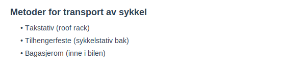

**Transport av sykkel** med bil er en vanlig utfordring for både fritids- og pendlingssyklister. Ulike metoder har sine fordeler og begrensninger. I denne artikkelen går vi gjennom de mest brukte alternativene for **sikring og transport av sykkel** på bil i Norge, relevante **regler og forskrifter**, samt **praktiske tips** for en trygg og lovlig transport.
For en grundigere gjennomgang av **generell lastsikring på bil**, se [Sikring av gods (klasse B)](/blogs/teori/sikring-av-gods-klasse-b "Sikring av gods (klasse B) - Guide til sikring av gods på bil").
## Metoder for transport av sykkel
| Metode                              | Fordeler                                  | Ulemper                                     | Kommentar                                |
|-------------------------------------|-------------------------------------------|---------------------------------------------|------------------------------------------|
| **Takstativ (roof rack)**           | Stabil, enkel tilgang til sykkel          | Økt luftmotstand, høyere drivstofforbruk    | Krever permanent eller avtakbart stativ   |
| **Tilhengerfeste (sykkelstativ bak)** | Enkel montering, ingen vertikal høydeøkning | Skjuler lys og skilt, økt bredde            | Krever kompatibelt feste og godkjent stativ |
| **Bagasjerom (inne i bilen)**       | Beskyttelse mot vær, ingen endring på bilen | Plasskrevende, kun for mindre sykler       | Passer på biler med nok innvendig plass   |

## Regelverk og merking
Ifølge [Vegtrafikkloven § 23](/blogs/teori/lover-og-forskrifter "Lover og forskrifter - Oversikt over norske trafikklover og forskrifter") er føreren ansvarlig for at last ikke stikker ut mer enn tillatt og at riktig merking benyttes.
| Retning          | Maks. stikk   | Merking                        |
|------------------|--------------:|--------------------------------|
| Bakover          | 1 meter       | Rød-hvit duk eller refleks     |
| Sider            | 0,5 meter     | Rød-hvit duk eller refleks     |
| Over bilens bredde | Ikke tillatt | Sykkel må plasseres innendørs eller på godkjent stativ |
## Slik går du frem
1. **Velg egnet utstyr:** Takstativ, tilhengerfeste eller bagasjerom etter behov og bilmodell
2. **Kontroller vekt og lastbegrensninger:** Sjekk bilprodusentens spesifikasjoner og stativets maksbelastning
3. **Fest sykkelen forsvarlig:** Bruk stropp eller sperrebånd, unngå bevegelige deler
4. **Merk stikkende last:** Hvis sykkel eller deler stikker ut, merk med duk/flagge og refleks i mørket
5. **Kontroller underveis:** Etter 5–10 km, sjekk at sykkelen sitter trygt
## Praktiske tips
* **Bruk markerte sykkelstativ:** Velg stativ som holder sykkelen stødig uten å skade rammen
* **Beskyt lakken:** Legg skum- eller gummiputer mellom stativ og sykkel
* **Fjern løs utrustning:** Ta av lommelykter, flasker og poser for å redusere vindfang
* **Sjekk lav takhøyde:** Vær oppmerksom ved garasjeganger og bommer
* **Vurder låsing:** Bruk sykkellås for å sikre mot tyveri under pauser
*For mer om generell sikring av gods, se [Sikring av gods (klasse B)](/blogs/teori/sikring-av-gods-klasse-b "Sikring av gods (klasse B) - Guide til sikring av gods på bil").*