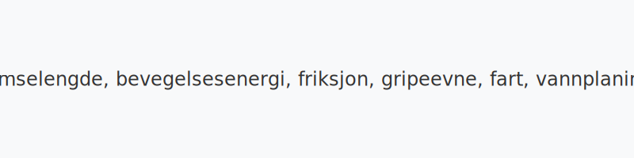

**Veigrep: bremselengde, bevegelsesenergi, friksjon, gripeevne, fart, vannplaning og styring** er avgjørende for sikker kjøring under alle forhold. I denne artikkelen går vi detaljert gjennom hvordan disse faktorene påvirker hverandre og hva du kan gjøre for å optimalisere veigrepet.

*For mer om hvordan **reaksjonstid** og **bremselengde** påvirker stoppeavstanden, se [Reaksjonstid og bremselengde](/blogs/teori/reaksjonstid-og-bremselengde "Reaksjonstid og bremselengde - Dypdykk i reaksjonstid og bremseavstand").*
*For mer om **fart og avstand**, se [Fart og avstand](/blogs/teori/fart-og-avstand "Fart og avstand - Komplett guide til hastighet og bremseavstand").*
*For tips om kjøring under krevende forhold, se [Kjøring under vanskelige forhold](/blogs/teori/kjoring-under-vanskelige-forhold "Kjøring under vanskelige-forhold - Tips for trygg kjøring i krevende vær og vegforhold").*
## Bevegelsesenergi og bremselengde
**Bevegelsesenergi** (E) beregnes med formelen: *E = ½·m·v²*. Dette betyr at dobbelt så høy fart gir fire ganger så mye energi som må tas opp av bremsene.
## Friksjon og gripeevne
**Friksjon** mellom dekk og vei bestemmer hvor mye energi som kan overføres for å redusere farten. Friksjonskoeffisienten varierer med veiforhold:
| Veiforhold    | Friksjonskoeffisient | Effekt på bremseavstand            |
|---------------|----------------------|------------------------------------|
| **Tørr asfalt** | 0,7–0,9              | Kort bremseavstand                 |
| **Våt asfalt**  | 0,4–0,7              | 30–50?% lengre bremseavstand       |
| **Snø**         | 0,2–0,4              | 2–3 ganger lengre bremseavstand    |
| **Is**          | 0,1–0,2              | 5–8 ganger lengre bremseavstand    |
## Vannplaning
Vannplaning oppstår når dekkene ikke lenger klarer å presse vannet bort fra kontaktflaten. Kritisk fart for vannplaning avhenger av dybde på vannlaget og dekktrykk:
| Vannlag (mm) | Kritisk fart (km/t) |
|--------------|---------------------|
| 1            | 80                  |
| 2            | 60                  |
| 3            | 50                  |
## Veigrep og styring
Godt veigrep er også nødvendig for sikker styring og stabilitet. Når friksjonen blir for lav, reduseres muligheten til å holde kursen. Følgende tips kan hjelpe:
* Velg dekk med riktig mønsterdybde og gummiblanding for årstiden.
* Oppretthold korrekt dekktrykk for anbefalt belastning.
* Tilpass hastigheten etter veiforhold.
* Unngå brå styrebevegelser ved høye hastigheter.
## Oppsummering
* **Veigrep** er nøkkelen til sikker bremsing, akselerasjon og styring.
* **Bevegelsesenergi** øker kvadratisk med hastighet – jo høyere fart, jo mer energi.
* **Friksjon** varierer med veiforhold og påvirker bremseavstand dramatisk.
* **Vannplaning** kan unngås ved å redusere hastighet ved vått føre.
* Godt **vedlikehold av dekk** og riktig kjøreteknikk er avgjørende.