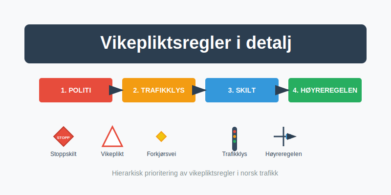
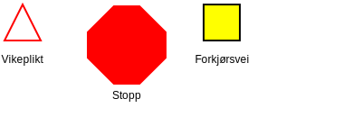
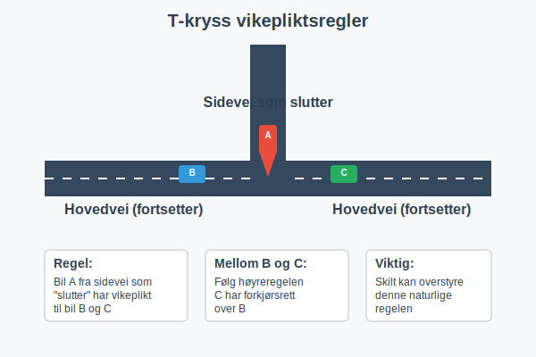
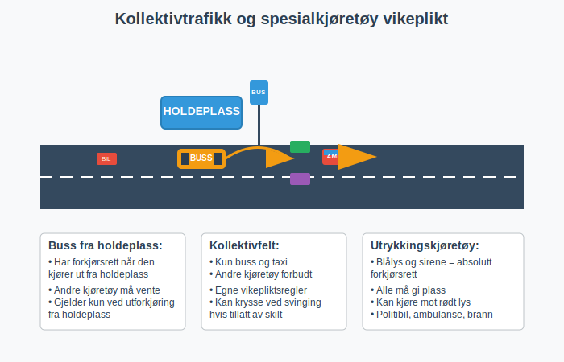
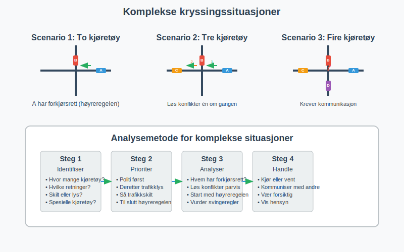
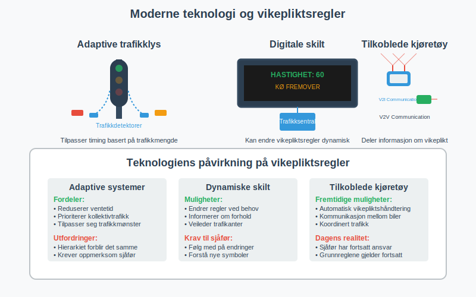
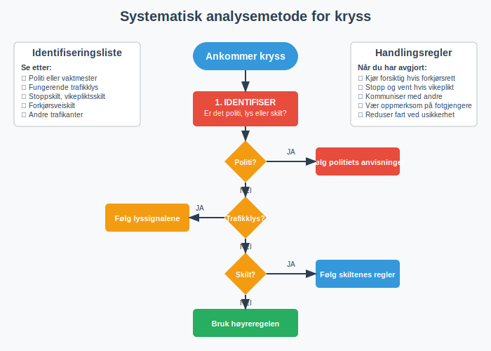
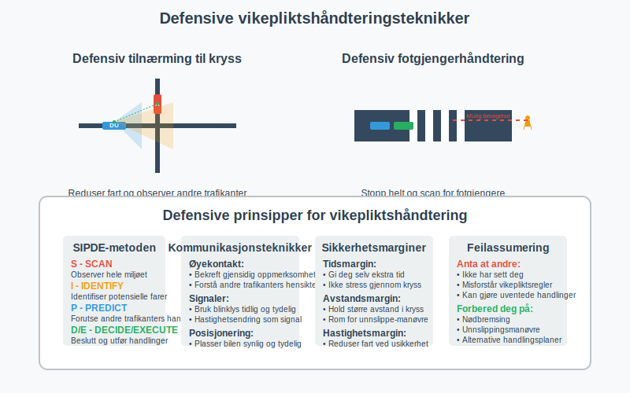

**Vikepliktsreglene** i Norge er grunnleggende for trygg og effektiv trafikk. Denne omfattende guiden gir deg detaljert kunnskap om **prioriteringsrekkefølge**, **skilttyper**, og praktiske anvendelser som er essensielle for teoriprøven og sikker kjøring.
For grunnleggende forståelse av vikeplikt, les [Vikeplikt og rundkjøringer](/blogs/teori/vikeplikt-og-rundkjoringer "Vikeplikt og rundkjøringer - Komplett guide til høyreregelen og rundkjøringer"). For oversikt over alle trafikkskilt, se [Trafikkskilt og veimerking](/blogs/teori/trafikkskilt-og-veimerking "Trafikkskilt og veimerking - Komplett guide for teoriprøven").

## Hierarkiet av vikepliktsregler
**Prioriteringsrekkefølgen** er avgjørende når flere regler kan gjelde samtidig. Dette hierarkiet må følges strengt:

### 1. Politi og vaktmestre (høyeste prioritet)
Når **politipersonell** eller **vaktmestre** dirigerer trafikk, overstyrer deres signaler alle andre regler. For mer om trafikkkontroll og trafikkflyt, se [Trafikkontroll og trafikkflyt](/blogs/teori/trafikkkontroll-og-trafikkflyt "Trafikkkontroll og trafikkflyt - Politi, tollvesen og Statens vegvesen").
* Håndsignaler fra politi gjelder fremfor trafikklys
* Stopp-tegn fra vaktmester ved veiarbeid må følges
* Politiets anvisninger kan midlertidig endre vanlige vikepliktsregler
### 2. Trafikklys i funksjon
**Trafikklys** som fungerer normalt overstyrer alle skilt og høyreregelen:
* Rødt lys = absolutt stopp
* Gult lys = forbered deg på stopp (ikke akseler)
* Grønt lys = kjør, men vis forsiktighet
* Blinkende gult = følg vikepliktsregler som om lyskrysset ikke var der
### 3. Trafikkskilt
Permanente **trafikkskilt** regulerer vikeplikt når ingen politi eller fungerende trafikklys er til stede:
* Stoppskilt (rød åttekant)
* Vikepliktsskilt (hvit trekant med rød kant)
* Forkjørsveiskilt (gul rombe)
* Slutt på forkjørsvei (gul rombe med skråstrek)
### 4. Høyreregelen (laveste prioritet)
**Høyreregelen** gjelder kun når ingen av de overnevnte reglene regulerer situasjonen. Den som kommer fra høyre har forkjørsrett.
For en grundigere gjennomgang av høyreregelen i veikryss, se [Kjøring: Høyre i veikryss](/blogs/teori/kjoring-hoyre-i-veikryss "Kjøring: Høyre i veikryss - Dypdykk i høyreregel i veikryss").
## Detaljert oversikt over vikepliktsskilt

| Skilt | Utseende | Betydning | Plassering | Handlingsregel |
|-------|----------|-----------|------------|----------------|
| **Stoppskilt** | Rød åttekant med "STOPP" | Må stoppe helt | Foran farlige kryss | Stopp 3 sekunder, sjekk trafikk |
| **Vikepliktsskilt** | Hvit trekant, rød kant | Gi vikeplikt | Før sidevei møter hovedvei | Reduser fart, vent på fri passage |
| **Forkjørsveiskilt** | Gul rombe | Forkjørsrett | På hovedveier | Kjør normalt, men vær oppmerksom |
| **Slutt på forkjørsvei** | Gul rombe med skråstrek | Forkjørsrett opphører | Der hovedvei ender | Følg høyreregelen fremover |
## Spesielle vikepliktssituasjoner
### T-kryss og veislutning
I **T-formede kryss** gjelder spesielle regler:

* Kjøretøy som kommer fra veien som "slutter" har vikeplikt
* Hvis ingen vei tydelig slutter, gjelder høyreregelen
* Skilt kan overstyre disse naturlige reglene
### Rundkjøringer
**Rundkjøringer** har egne vikepliktsregler:
* Trafikk **i** rundkjøringen har alltid forkjørsrett
* Du må gi vikeplikt når du skal inn i rundkjøringen
* For mer detaljer, se [Vikeplikt og rundkjøringer](/blogs/teori/vikeplikt-og-rundkjoringer "Vikeplikt og rundkjøringer - Komplett guide til høyreregelen og rundkjøringer")
### Parkeringsplass og holdeplass
Ved utforkjøring fra **parkeringsplass** eller **holdeplass** må du vike for trafikk på kjørebanen.
For mer om parkeringsplassmanøvrer, se [Rygging og parkering](/blogs/teori/rygging-og-parkering "Rygging og parkering - Grunnleggende manøvrer ved parkeringsplass").

### Feltskifte og sideveis forflytting
Når du bytter felt eller utfører **sideveis forflytting**, for eksempel ved filskifte eller kjøring i parkeringsfelt,
må du alltid sikre fri vei for både gjenværende kjørefelt og sårbare trafikanter.
Se også [Forbikjøring og feltskifte](/blogs/teori/forbikjoring-og-feltskifte "Forbikjøring og feltskifte - Detaljert guide til forbikjøring og vikeplikt ved filskift").

### Militærkolonner, begravelsesfølge og gående grupper
Kjøretøy i **militærkolonner**, **begravelsesfølge** eller **gående grupper** regnes som en enhet og har forkjørsrett.
For mer om ulike trafikantgrupper og hensyn, se [Trafikantgrupper og hensyn](/blogs/teori/trafikantgrupper-og-hensyn "Trafikantgrupper og hensyn - Forståelse for alle trafikanter").

### Veimerking ved vikeplikt
| Veimerking               | Beskrivelse                                                       | Betydning                                             |
|---------------------------|-------------------------------------------------------------------|-------------------------------------------------------|
| **Stopplinje**            | Heltrukken linje før kryss                                        | Angir hvor du må stoppe ved stopp-skilt eller lys     |
| **Vikelinje**             | Trekantformede pigger langs veikant                              | Viser at du må gi vikeplikt før kryss                 |
| **Forkjørskryss**         | Gul rombe malt i veibanen                                         | Viser at du krysser en forkjørsvei                     |
| **Forløp av forkjørsvei**  | Piler eller linjer som forsterker forkjørsvei-symbolet i veibanen | Viser videreføring av forkjørsvei                     |
| **Møtende trafikk**       | Dobbel, sammenhengende midtstripe                                 | Merker at forbikjøring er forbudt grunnet møtende trafikk |

### Kollektivfelt og spesialkjøretøy

**Kollektivtrafikk** har spesielle rettigheter:
* Busser som kjører ut fra holdeplass har forkjørsrett
* I kollektivfelt gjelder egne vikepliktsregler
* Utrykkingskjøretøy med blålys og sirene har alltid forkjørsrett
## Komplekse trafikkscenarioer
### Flere kjøretøy i samme kryss
Når **flere kjøretøy** ankommer kryss samtidig:

1. **To kjøretøy møtes**: Høyreregelen gjelder
2. **Tre kjøretøy**: Løs én konflikt av gangen, start med høyreregelen
3. **Fire kjøretøy**: Kommunikasjon og forsiktighet er nødvendig
### Svinging og vikeplikt
**Svingeregler** i kryss:
| Situasjon | Vikepliktsregel | Praktisk handling |
|-----------|-----------------|-------------------|
| Høyresving | Gi vikeplikt til fotgjengere | Stopp for fotgjengere i krysset |
| Venstresving | Vikeplikt til møtende trafikk | Vent til fri passage |
| [U-sving og vendingsforbud](/blogs/teori/vending-og-vendingsforbud "Vending og vendingsforbud - Når er U-sving tillatt og forbudt?") | Vikeplikt til all annen trafikk | Kun der tillatt, vent på klart felt |
## Fotgjengere og syklister
**Sårbare trafikanter** har spesielle rettigheter:

### Fotgjengere
* **Fotgjengerfelt**: Fotgjengere har alltid forkjørsrett
* **Gangfelt uten skilt**: Bil må gi vikeplikt
* **Uregulerte kryss**: Fotgjengere på høyre side har forkjørsrett
### Syklister
* I **sykkelfelt**: Samme regler som for biler
* Ved **høyresving**: Bil må gi vikeplikt til syklister på høyre side
* For mer om sykling, se [Trafikantgrupper og hensyn](/blogs/teori/trafikantgrupper-og-hensyn "Trafikantgrupper og hensyn - Forståelse for alle trafikanter")
## Vanlige feil og misforståelser
### Myte 1: "Høyreregelen gjelder alltid"
**Sannhet**: Høyreregelen er den **laveste** prioriteten i hierarkiet.
**Korrekt forståelse**:
* Politi overstyrer høyreregelen
* Trafikklys overstyrer høyreregelen  
* Trafikkskilt overstyrer høyreregelen
### Myte 2: "Stor vei har alltid forkjørsrett"
**Sannhet**: Veibredde gir ikke automatisk forkjørsrett.
**Korrekt forståelse**:
* Kun **forkjørsveiskilt** gir forkjørsrett
* Uten skilt gjelder høyreregelen uavhengig av veibredde
### Myte 3: "Jeg kan kjøre når det er grønt lys"
**Sannhet**: Grønt lys gir **anledning** til å kjøre, men ikke **rett** til å kjøre hensynsløst.
**Korrekt forståelse**:
* Sjekk at krysset er fritt før du kjører
* Gi vikeplikt til trafikk som fortsatt er i krysset
* For mer om lyssignaler, se [Bruk av lys og signaler](/blogs/teori/bruk-av-lys-og-signaler "Bruk av lys og signaler - Komplett guide for teoriprøven")
## Teknologi og moderne vikepliktsregler
### Intelligente trafikksystemer
**Moderne teknologi** påvirker vikepliktsregler:

**Adaptive trafikklys**:
* Tilpasser timing basert på trafikkmengde
* Kan gi lengre grønnfaser for kollektivtrafikk
* Hierarkiet forblir det samme
**Digitale skilt**:
* Kan endre vikepliktsregler dynamisk
* Følger fortsatt samme prioriteringsrekkefølge
* Viktig å være oppmerksom på endringer
## Internasjonale forskjeller
**Norske regler** vs. andre land:
| Land | Høyreregel | Rundkjøring | Særmerknader |
|------|------------|-------------|---------------|
| **Norge** | Standard | Trafikk inne har forkjørsrett | Stoppskilt sjeldne |
| **Sverige** | Standard | Som Norge | Meget likt Norge |
| **Tyskland** | Standard | Som Norge | Mange stoppskilt |
| **Frankrike** | **Ikke standard** | Annen praksis | Priorité à droite varierer |
## Praktiske øvelser for teoriprøven
### Analysemetode for kryssingssituasjoner

**Steg-for-steg analyse**:
1. **Identifiser** - Er det politi, lys eller skilt?
2. **Prioriter** - Hvilket nivå i hierarkiet gjelder?
3. **Vurder** - Hvilke kjøretøy har forkjørsrett?
4. **Handle** - Kjør eller vent basert på analysen
### Typiske teoriprøve-scenarier
**Scenario 1**: Lyskryss med defekt trafikklys
* **Svar**: Behandle som vanlig kryss med høyreregel
* **Begrunnelse**: Defekte lys gir ikke regulering
**Scenario 2**: Forkjørsvei møter sidevei med vikepliktsskilt
* **Svar**: Forkjørsvei har forkjørsrett
* **Begrunnelse**: Skilt overstyrer høyreregelen
**Scenario 3**: Politimann dirigerer trafikk i lyskryss
* **Svar**: Følg politiets anvisninger
* **Begrunnelse**: Politi har høyeste prioritet
## Juridiske konsekvenser
**Brudd på vikepliktsregler** kan få alvorlige konsekvenser:
### Straffereaksjoner
| Overtredelse | Bot | Førerkorttap | Fengsel |
|-------------|-----|--------------|---------|
| **Enkelt vikepliktbrudd** | 1 750 kr | Mulig | Nei |
| **Grovt vikepliktbrudd** | 8 050 kr | Sannsynlig | Mulig |
| **Vikepliktbrudd med skade** | Domstol | Sannsynlig | Mulig |
### Forsikringsmessige konsekvenser
* **Egenandel** kan øke ved vikepliktbrudd
* **Bonus** kan reduseres betydelig
* **Erstatningsansvar** ved skade på andre
For mer om juridiske aspekter, se [Lover og forskrifter](/blogs/teori/lover-og-forskrifter "Lover og forskrifter - Juridisk rammeverk for bilkjøring").
## Defensive kjøreteknikker
**Defensiv kjøring** og vikeplikt:

### Aktiv sikkerhetstankegang
* **Anta** at andre kan gjøre feil
* **Kommuniser** dine intensjoner tydelig  
* **Observer** andre trafikanters oppførsel
* **Vær forberedt** på å handle defensivt
### Praktiske tips
**I kryss**:
* Reduser fart selv om du har forkjørsrett
* Gjør øyekontakt med andre sjåfører
* Vær ekstra forsiktig ved dårlig sikt
**Ved fotgjengerfelt**:
* Stopp alltid helt for fotgjengere
* Se etter barn som kan løpe ut
* Vær oppmerksom på eldre som trenger mer tid
For mer om defensiv kjøring, se [Defensiv kjøring](/blogs/teori/defensiv-kjoring "Defensiv kjøring - Teknikker for trygg bilkjøring").
## Sammendrag og viktige poeng
**Vikepliktsreglene** er hierarkiske og må følges i riktig rekkefølge:
### Nøkkelpunkter å huske
1. **Politi** kommer først i alle situasjoner
2. **Trafikklys** overstyrer skilt og høyreregelen  
3. **Trafikkskilt** regulerer der ingen lys fungerer
4. **Høyreregelen** gjelder kun når ingen andre regler regulerer
### For teoriprøven
* **Øv** på situasjonsbilder systematisk
* **Forstå** hierarkiet, ikke bare lær det utenat
* **Analyser** hvert scenario metodisk
* **Diskuter** vanskelige eksempler med instruktør
### I praksis
* **Vær oppmerksom** og reduser fart i uoversiktlige kryss
* **Kommuniser** tydelig med andre trafikanter
* **Vis hensyn** til sårbare trafikanter
* **Følg reglene** selv når andre ikke gjør det
For mer om praktisk kjøring, se [Oppmerksomhet og samhandling](/blogs/teori/oppmerksomhet-og-samhandling "Oppmerksomhet og samhandling - Hvordan være en trygg trafikant").
Vikepliktsreglene er fundamentet for trygg trafikk. Ved å mestre disse reglene og anvende dem med **forsiktighet** og **hensyn**, bidrar du til en sikrere trafikkopplevelse for alle.